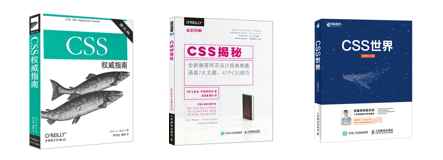
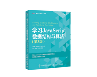
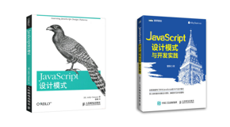

# dev-zuo 笔记

学习笔记

- [JS/ES6](#jses6)
- [HTML/HTML5](#htmlhtml5)
- [CSS/CSS3](#csscss3)
- [Vue.js](#vuejs)
- [JS数据结构与算法](#js数据结构与算法)
- [JS设计模式](#js设计模式)
- [Node.js](#nodejs)
- [HTTP](#http)
- [web安全](#web安全)
- [Git](#git)
- 微信小程序开发
- 微信公众号开发
- 持续化集成(CI、docker)
- 数据库(mysql、mongodb)

## JS/ES6

- [JavaScript DOM编程艺术(第二版本) 笔记](./src/js_es6/js_dom编程艺术/js_dom编程艺术.md)
- [JavaScript高级程序设计(第三版) 笔记](./src/js_es6/js高程3/)
- [ES6标准入门(第三版) 笔记](./src/js_es6/阮一峰es6入门/)

## HTML/HTML5

- 极客时间：重学前端
- html 模板 pug

## CSS/CSS3

- CSS预处理器(sass、less)

## Vue.js

## JS数据结构与算法

- 极客时间: 数据结构与算法
- leetcode 刷题

## JS设计模式

## Node.js

- 饿了么开源 node.js教程
- express、koa、egg.js

## HTTP

## web安全

## Git

- [廖雪峰git教程 笔记](src/git_svn/廖雪峰Git教程/廖雪峰Git教程.md)

