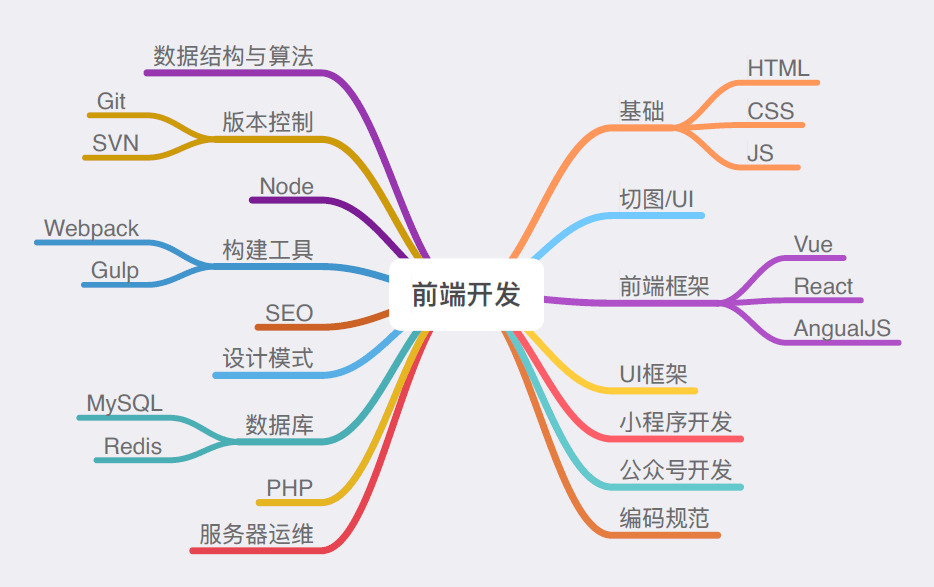
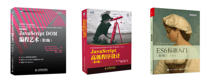

# fe
前端知识梳理总结

- [JS/ES6](./##JS/ES6)
- HTML/HTML5
- CSS/CSS3
- Vue.js
- JS数据结构与算法
- JS设计模式
- Node.js
- HTTP
- web安全
- Git
- 微信小程序开发
- 微信公众号开发

## JS/ES6

- [es6 - 1.let与const](./src/js_es6/es6_let与const.md)
- [es6 - 2.声明变量的六种方法,顶层对象](./src/js_es6/es6_声明变量的六种方法_顶层对象.md)
- [es6 - 3.解构赋值](./src/js_es6/es6_解构赋值.md)
- [es6 - 4.字符串扩展及新增方法](./src/js_es6/es6_字符串扩展及新增方法.md)
- [es6 - 5.数值/函数的扩展](./src/js_es6/es6_数值_函数的扩展.md)
- [es6 - 6.尾调用、尾递归及对应的优化](./src/js_es6/es6_尾调用_尾递归及对应的优化.md)
- [es6 - 7.数组的扩展](./src/js_es6/es6_数组的扩展.md)
- [es6 - 8.对象的扩展与新增方法](./src/js_es6/es6_对象的扩展与新增方法.md)
- [es6 - 9.遍历对象属性的5种方法](./src/js_es6/es6_遍历对象属性的5种方法.md)
- [es6 - 10.Set、Map数据结构](./src/js_es6/es6_Set_Map数据结构.md)
- [es6 - 11.Symbol、Proxy、Reflect](./src/js_es6/es6_Symbol_Proxy_Reflect.md)
- [es6 - 12.Promise](./src/js_es6/es6_Promise.md)
- [es6 - 13.Iterator 和 for...of循环](./src/js_es6/es6_Iterator和for_of循环.md)
- [es6 - 14.Generator](./src/js_es6/es6_Generator.md)
- [es6 - 15.async](./src/js_es6/es6_async.md)
- [es6 - 16.Class](./src/js_es6/es6_Class.md)
- [es6 - 17.Module 模块](./src/js_es6/es6_Module模块.md)
- [es6 - 18.编程风格](./src/js_es6/es6_编程风格.md)

