# 初探CSS
CSS（层叠样式表）用来规定HTML文档的呈现形式(外观和格式编排)

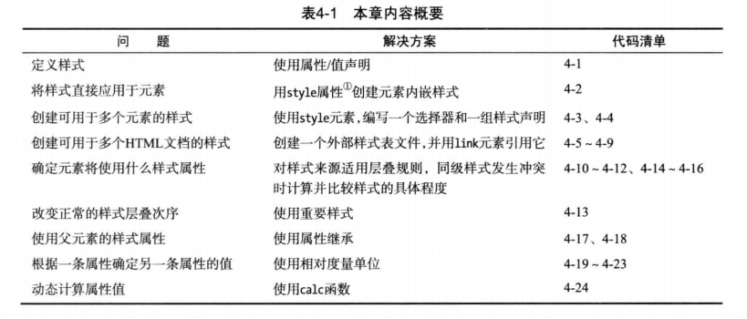

## 定义和应用样式
### css样式
css样式由一条或多条以分号隔开的样式声明组成。
```css
/* 每条声明都包含属性和值。 */
background: grey;
color: white;
```
### 使用元素内嵌样式(Inline)
使用元素的全局属性style, 将样式直接应用到元素
```html
<a href="http://zuo11.com" style="background:grey;color:white;">访问博客</a>
```
### 使用文档内嵌样式(Internal)
直接对元素应用简单方便，但对于可能大量需要各种样式的复杂文档来说缺乏效率。需要一个元素一个元素加，且耦合性高，不利于维护。可以使用style元素定义文档内嵌样式，通过css选择器指示浏览器应用样式。
```html
<head>
  <title>文档内嵌样式</title>
  <style type="text/css">

    /* 这里的a css为选择器, 为每一个a元素应用样式  */
    a {
      background: grey;
      color: white;
    }
    span {
      border: thin black solid;
      padding: 10px;
    }
  </style>
</head>
<body>
  <a href="http://zuo11.com">访问博客</a>
  <p>I like <span>apples</span> and oranges.</p>
  <a href="http://baidu.com">访问百度</a>
</body>
```
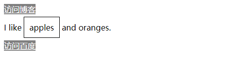

### 使用外部样式表(External)
如果有一套样式要用于多个文档，那么逾期在每一个文档中重复定义相同的样式，不如另外创建一个独立的样式表文件。这种文件按惯例已.css为文件扩展名。
```css
/* 文件style.css内容 */
a {
  background: grey;
  color: white;
}
span {
  border: thin black solid;
  padding: 10px;
}
```
导入外部样式表
```html
<!DOCTYPE html>
<html>
  <head>
    <meta charset="utf-8" />
    <title>文档内嵌样式</title>
    <link rel="stylesheet" type="text/css" href="style.css"></link>
  </head>
  <body>
    <a href="http://zuo11.com">访问博客</a>
    <p>I like <span>apples</span> and oranges.</p>
    <a href="http://baidu.com">访问百度</a>
  </body>
</html>
```
#### @import 从样式表中导入样式
下面的例子中从style.css中导入样式到common.css
```css
/* 注意句子结束一定要加分号；*/
@import "style.css";
span {
  border: medium black dashed;
  color: red;
}
```
示例
```html
<link rel="stylesheet" type="text/css" href="common.css"></link>
```
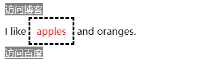

#### 指定样式表字符编码
如果样式表中未声明字符编码，默认为编码为"utf-8"，如果有指定，就会用指定的编码。
```css
@charset "UTF-8";
@import "style.css";
span {
  border: medium black dashed;
}
```
## 样式的层叠和继承
前面讲过了三种定义样式的方式（元素内嵌，文档内嵌，外部样式），还有两种是浏览器样式和用户样式。如果用各种方式声明了同样的样式属性，但值不同，浏览器怎么确定具体以哪个样式值来渲染元素呢？这就需要弄清楚样式层叠、继承的规则。
### 浏览器样式

- 浏览器样式(用户代理样式)是元素尚未设置样式时浏览器默认的样式。不同的浏览器可能会有差异，以button为例，Firefox和Chrome默认的button样式就不一样。一般a的浏览器的默认样式为：
```css
a {
  color: blue;
  text-decoration: underline;
}
```
- 用户样式(书中记载的自定义样式文件没找到，暂时忽略)

### 样式如何层叠
浏览器显示元素时，获取CSS样式属性值的次序如下：
1. 元素内嵌样式(用元素的全局属性style定义的样式)
2. 文档内嵌样式(定义在style元素中的样式)
3. 外部样式(用link导入的样式)
4. 浏览器样式(浏览器默认样式)

英文参考：https://www.w3schools.com/html/html_css.asp

- Inline - by using the style attribute in HTML elements
- Internal - by using a \<style\> element in the \<head\> section
- External - by using an external CSS file

会根据顺序一层一层找，如果在1找到了对应的属性值，那么2,3,4设置的相同的属性值会失效。

### !important调整层叠次序
如果把样式属性标记为重要(!important)，可以改变正常的层叠次序
```html
<style>
  a { color: red !important; } /* 最终会以该样式为准 */
</style>
<a href="http://zuo11.com" style="color: blue;">访问链接</a>
```

### 根据特殊性和定义次序解决同级样式冲突
如果两条定义于同一层次的样式都能应用于同一个元素。且都包含同样的属性值，就需要根据来决特殊性定到底使用哪种。

- a. 样式的选择器中id值得数目(#)
- b. 选择器中其他属性和伪类的数目(.class等属性)
- c. 选择器中元素名和伪元素数目（元素名等）

a的特殊性最高，b其次，c最低。按a-b-c来表示。比如如果a值相等，才会去比较b。1-0-0的特殊性比0-5-5高。在 **\<\<CSS权特威指南\>\>** 中，有4位，最高位为内嵌(Inline)样式设置的样式。关于特殊性，建议看CSS权威指南，个人认为比这里要好理解一点。如果层级一样，谁后定义的，优先级就越高。
```html
<body>
  <style>
    a { color: red; } /* 0-0-1*/

    a.myclass {  /* 0-1-0 */
      color: blue ;
    }
  </style>
  <a href="http://zuo11.com">访问链接</a>
  <a class="myclass" href="http://baidu.com">访问百度</a>
</body>
```
### 继承（inherit）
如果浏览器在直接相关的样式中找不到某个属性的值，就会求助于继承机制，使用父元素这个样式的属性值。
```html
<body>
  <style>
    p {
      color: white;
      background: grey;
      border: medium solid black;
    }
    span {
      border: inherit; /* 继承父元素的boder属性 */
    }
  </style>
  <p>
    I like <span>apples</span> and oranges.
  </p>
</body>
```

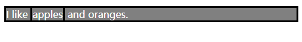

## CSS中的颜色
css中有三种常用的设置颜色方法
- 直接使用颜色名称
- 设置十六进制RGB值，#000000 (等价于0, 0, 0)  #ffffff (等价于255,255,255)
- 使用rgb和rgba函数已10进制来表示颜色 rgb(0,0,0), rgb(255,255,255), rgba(0,0,0,0.3) ，rgba最后一位表示透明度，1为不透明。
- hsl和hsla 使用色相、饱和度、明度表示颜色（用的比较少）hsl(120,100%,22%)

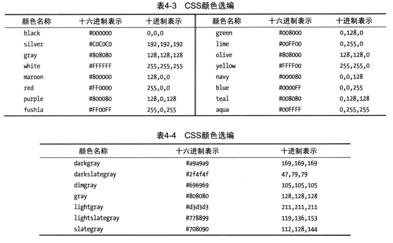

CSS颜色函数

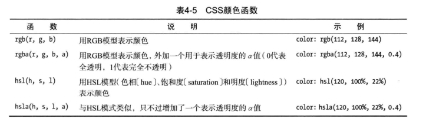

## CSS中的长度
许多css属性要求设置长度值，比如width，font-size。

### 绝对长度
pt、cm、mm

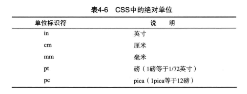
```html
<body>
  <style>
    .myclass1 {
      font-size: 20pt;
    }
    .myclass2 {
      font-size: 2cm; /* 20mm */
      color: red;
    }
  </style>
  <p>
    1.I like <span>apples</span> and oranges.
  </p>
  <p class="myclass1">
    2.I like <span>apples</span> and oranges.(font-size:20pt)
  </p>
  <p class="myclass2">
    3.I like <span>apples</span> and oranges.(font-size:2cm或20mm)
  </p>
</body>
```

示例

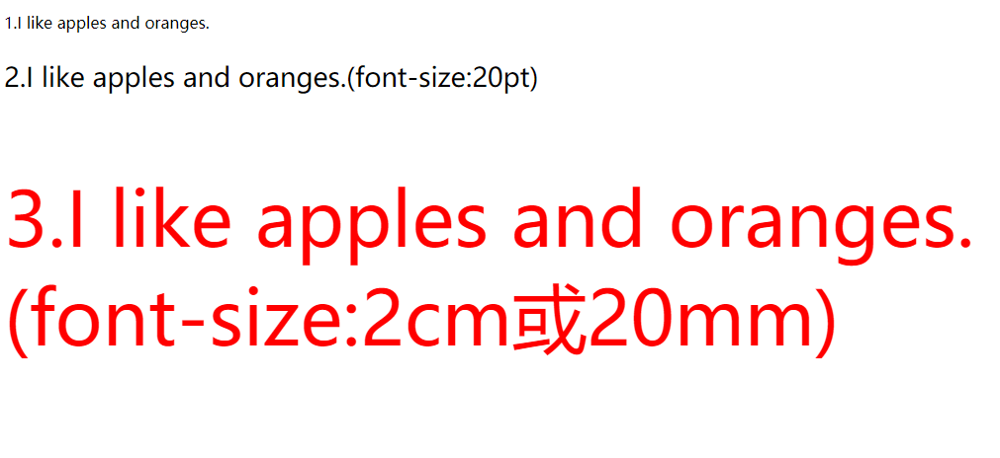

### 相对长度
em, rem, px, %，

- em表示相对当前元素字体的倍数，rem表示相对根元素(html)字体的倍数。
- %百分比如果是font-size挂钩的是父元素的font-size的百分比，如果是width，挂钩的是元素包含块的宽度
- vh viewport视口高度，一般height可以设置为 html {min-height:100vh}
- vw 视口宽度(1vw = 1%)。不过一般默认宽度就是100%，宽度用百分比多。高度是由于默认高度不是100%，如果需要表示全屏，使用100vh会比较方便。

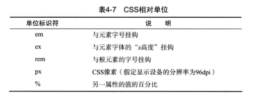

示例:
```html
<body>
  <style>
    html {
      font-size: 20px;
    }
    .myclass1 {
      font-size:10px;
      height: 2em;
      color: white;
      background: blue;
    }
    .myclass2 {
      font-size:10px;
      height: 2rem;
      color:white;
      background: red;
      
    }
  </style>
  <p>
    html font-size: 20px;
  </p>
  <p>
    1.I like <span>apples</span> and oranges.
  </p>
  <p class="myclass1">
    2.I like <span>apples</span> and oranges.(font-size:10px;height:2em;)
  </p>
  <p class="myclass2">
    3.I like <span>apples</span> and oranges.(font-size:10px;heigth:2rem;)
  </p>
</body>
```
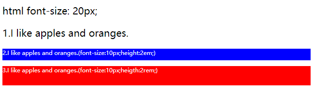

### calc计算长度
calc可以使用百分比减去固定的px长度
```html
<head>
  <style>
      div {
        width: 100%;
        height: 100px;
        margin-top: 20px;
        border: thin solid #ccc;
      }
      .cc {
        color: red;
        width: calc(100% - 100px); /* 注意没空格会无效 calc(100%-100px); */
      }
    </style>
</head>
<body>
  <div class="cc">c1</div>
  <div>c2</div>
</body>
```
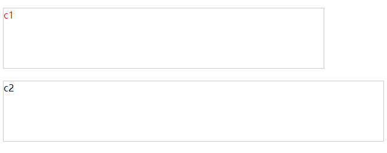

## 其他CSS单位
### css角度
一般在transform旋转(rotate)一个元素时，会用到旋转多少度，deg就表示度数。0-360deg
```css
p {
  transform: rotate(7deg); 
}
```
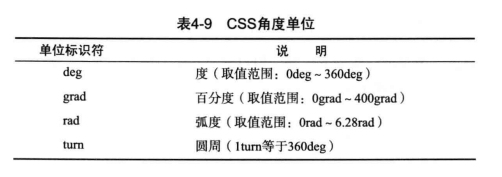

### css时间
一般动画时持续时间，可以用秒s或毫秒ms，表示事件间隔

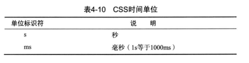

## 有用的CSS工具
### F12浏览器调试
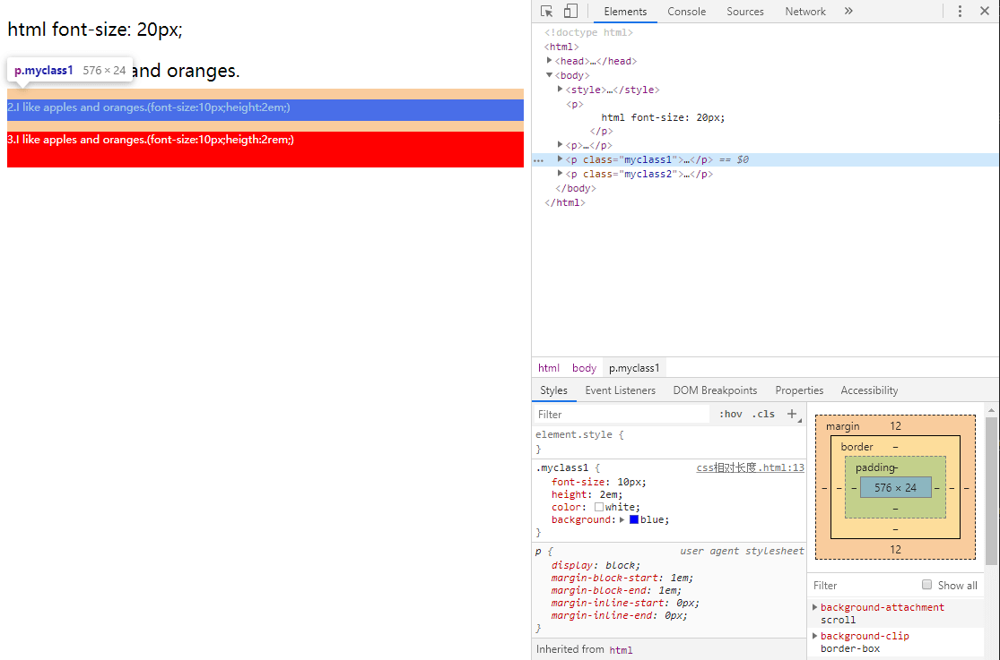
### 使用css预处理器
原生的css暂时无法定义变量，可复用性低，用预处理器还支持嵌套写法。更简洁，更利于维护。
- sass
- less
- stylus

参考：

[css的预处理器、后处理器以及选择器](https://blog.csdn.net/yangyixue123/article/details/79133748)

[没你想象的那么难！深度剖析三款最实用的css预处理器](https://cloud.tencent.com/developer/news/342721)