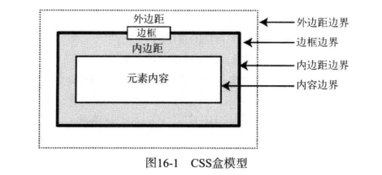
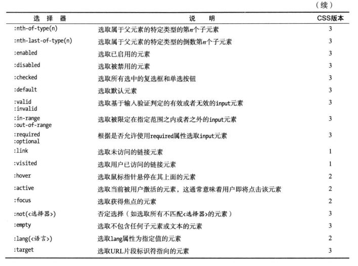
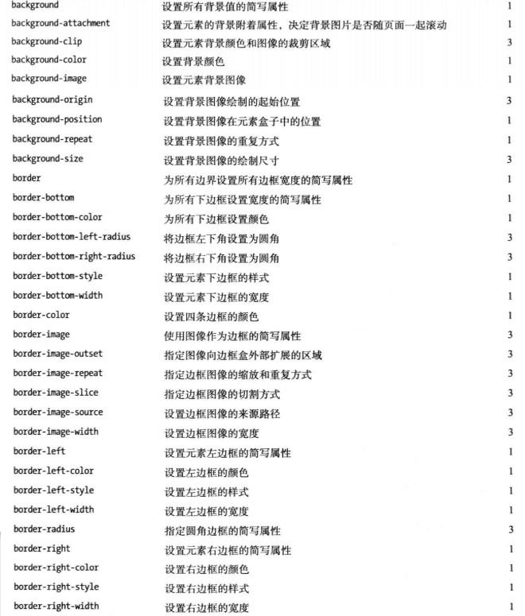
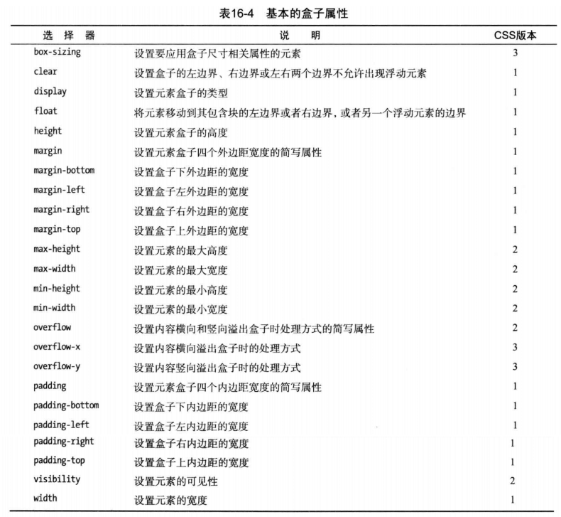
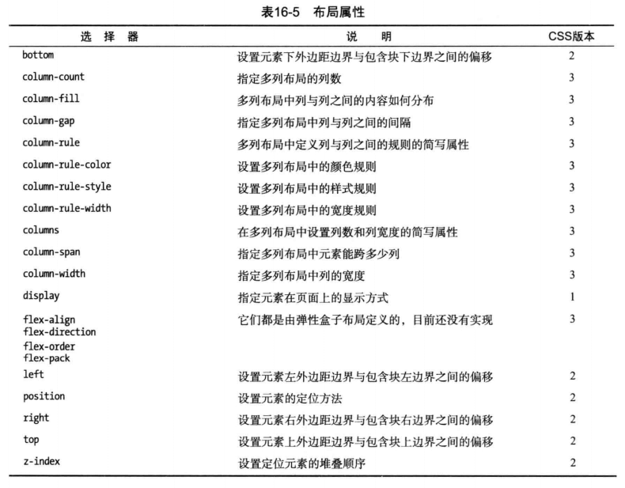
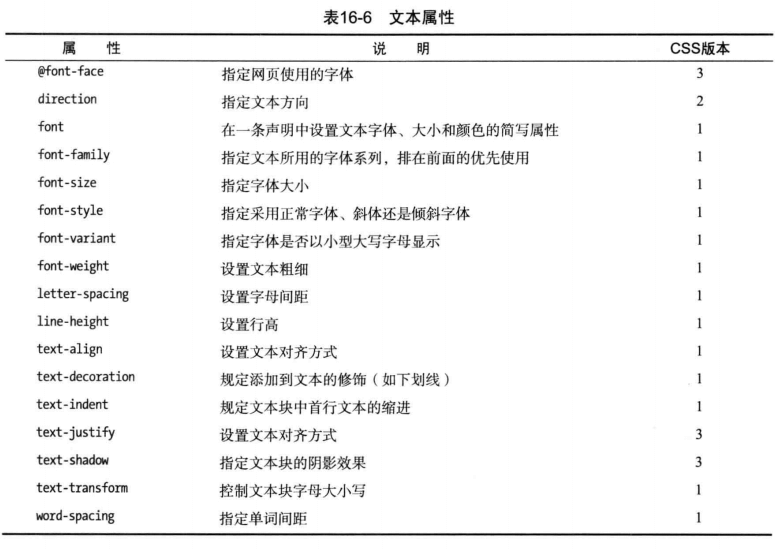
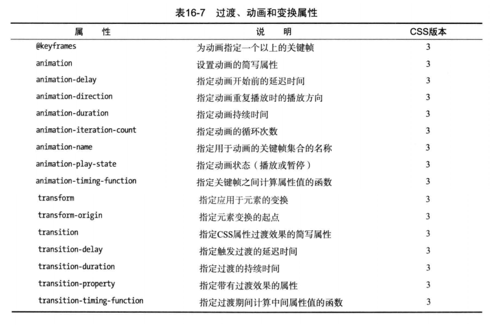
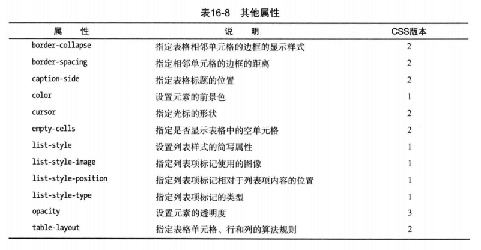

# 理解CSS

CSS(Cascading Style Sheet，层叠样式表)

## CSS标准化
W3C并不想创建一个单一的标准，而是将CSS3分隔为多个模块(module)。并允许每个模块根据自身需要，进行更新。对于模块定义还不太稳定的阶段，浏览器会采用厂商前缀实现某个特性。

## 盒模型
CSS中一个基本概念是盒模型(box model), 用户可见的元素会在页面中占据一个矩形区域，该区域就是元素的盒子(box)，由4部分组成，如下图, 

元素盒子有两个部分可见：内容 和 边框。元素还可以包含其他元素，这种情况下，父元素的内容盒子称为子元素的块容器(container block), 通常称为容器。

## 选择器简明参考
"<>"括起来的表示是一个变量，可替换的值。type表示一个元素类型，比如a，div等。attr表示元素的属性。

## CSS属性简明参考
### 边框和背景属性
属性名称 - 属性说明 - CSS版本

### 盒模型属性

### 布局属性

### 文本属性

### 过渡、动画和变换属性

### 其他属性

