# 边框和背景

本章主要介绍元素应用边框和背景样式所用到的属性。在CSS3中进一步得到了增强，比如创建圆角边框，使用图像边框，为元素创建阴影。

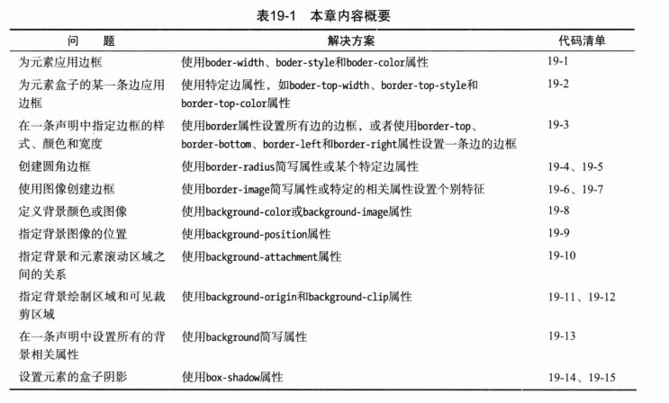

## border(边框样式)
基本边框属性：
- border-width 设置边框的宽度
- border-style 设置绘制边框使用的样式
- border-color 设置边框的颜色

### border-width 边框宽度
边框宽度属性取值有三种：

1. 常规的CSS长度值 (em, px, cm)
2. 百分数 % （边框绘制区域宽度的百分比）
3. thin，medium，thick(/θɪk/) (三个宽度依次增大的固定值) 

### border-style 边框样式
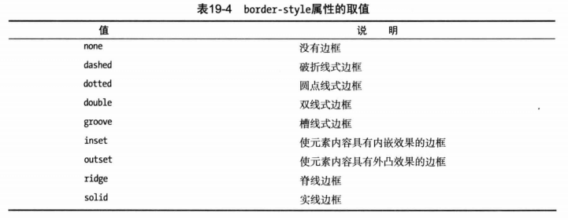

groove, inset, outset, ridge 这4个样式，如果为黑色，看不出效果，设置为grey方便看效果
```html
  <head>
    <meta charset="utf-8">
    <title>边框和背景</title>
    <style type='text/css'>
      body {
        display: flex; flex-wrap: wrap;
      }
      div {
        width: 100px; height: 50px; margin: 10px;
      }
      #dashed { border: thick dashed black; }
      #dotted { border: thick dotted black; }
      #double { border: thick double black; }
      #groove { border: thick groove gray; }
      #inset { border: thick inset gray; }
      #outset { border: thick outset gray; }
      #ridge { border: thick ridge gray; }
      #solid { border: thick solid gray; }
    </style>
  </head>
  <body>
    <div id="dashed">dashed 虚线边框</div>
    <div id="dotted">dotted 圆点线式边框</div>
    <div id="double">double 双线边框</div>
    <div id="groove">groove 槽线式边框</div>
    <div id="inset">inset 元素内容内嵌效果</div>
    <div id="outset">outset 元素内容外凸效果</div>
    <div id="ridge">ridge 脊线边框</div>
    <div id="solid">solid 实线边框</div>
  </body>
```
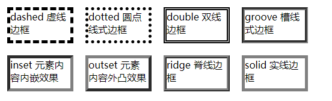

### 为一条边应用边框样式
- 顶部边框：border-top-width, border-top-style, border-top-color;
- 底部边框：border-bottom-width, border-bottom-style, border-bottom-color;
- 左边框：border-left-width, border-left-style, border-left-color;
- 右边框：border-right-width, border-right-style, border-right-color;

### border简写属性
- border 设置所有边框 (<宽度> <样式> <颜色>)
- border-top, border-bottom, border-left, border-right 设置一条边 (<宽度> <样式> <颜色>)

### border-radius 圆角边框
- border-top-left-radius, border-top-right-radius, border-bottom-left-radius, border-bottom-right-radius 设置一个圆角，**一对长度值或百分比。百分比跟边框盒子的宽度和高度有关**
- border-radius 一次设置4个角的简写属性, **一对或4对长度值或百分比，由/分隔**

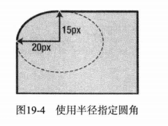

```css
div {
  border-top-left-radius: 20px 15px; 
}
```
示例：
```html
  <head>
    <meta charset="utf-8">
    <title>边框和背景</title>
    <style>
      section { margin-right: 100px; }
      div {
        width: 200px; height: 200px;
        border: 1px solid #000;
      }
      #div1 {
        border-top-left-radius: 100px 50px;
      }
      #div2 {
        border-radius: 100px / 50px;
      }
      #div3 {
        border-radius: 50% 50px 25% 100px / 25% 25px 40px 55%;
      }
    </style>
  </head>
  <body>
    <section style="display: flex;">
      <section>
        <p>border-top-left-radius: 100px 50px;</p>
        <div id="div1"></div>
      </section>
      <section>
        <p>border-radius: 100px / 50px;</p>
        <div id="div2"></div>
      </section>
    </section>
    <p>左上、右上、右下、左下 border-radius: 50% 50px 25% 100px / 25% 25px 40px 55%;</p>
    <div id="div3"></div>
  </body>
```
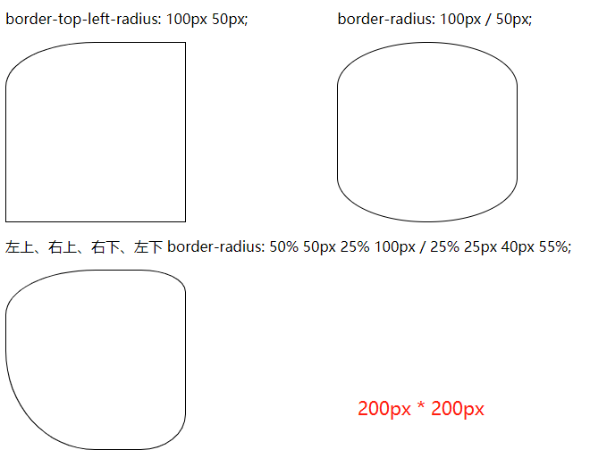

### border-image将图像作边框
p388, CSS3, 参考:

[border-image | CSS-Tricks](https://css-tricks.com/almanac/properties/b/border-image/)

[CSS3 border-image 属性](https://www.runoob.com/try/try.php?filename=trycss3-border-image)

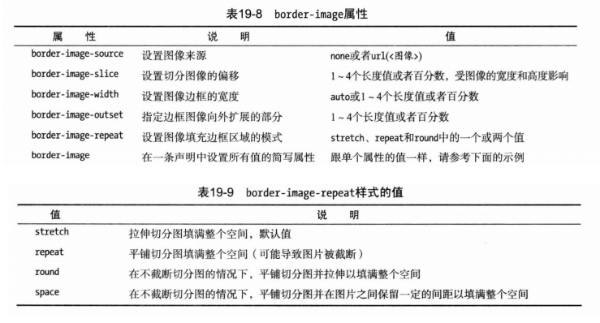

#### 切分图像
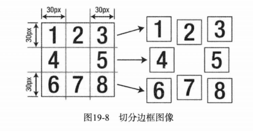
```css
p {
  border-image: url(bordergrid.png) 30 / 50px;
}
```
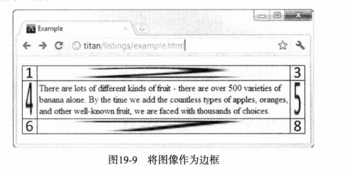

#### 控制切分图重复的方式
```css
p {
  border-image: url(bordergrid.png) 30 / 50px round repeat;
}
```
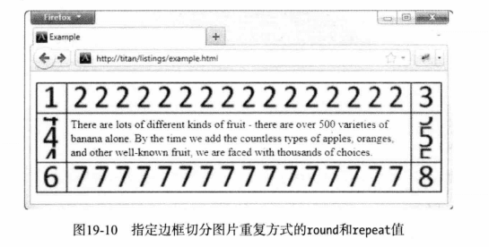

## background(设置元素的背景)
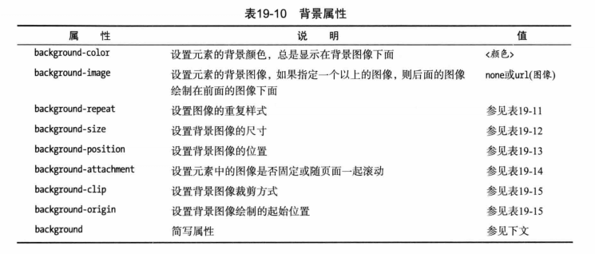
```html
  <head>
    <meta charset="utf-8">
    <title>边框和背景</title>
    <style>
      p {
        border: medium solid black;
        background-color: lightgray;
        background-image: url(bg.png);
        background-size: 40px 40px;
        background-repeat: repeat-x;
      }
    </style>
  </head>
  <body>
    <p>
      There are lots of different kinds of fruit - there are over 500 varieties
      of banana alone. By the time we add the countless type of apples, oranges
      and other well-known fruit, we are faced with thousands of choices.
    </p>
  </body>
```
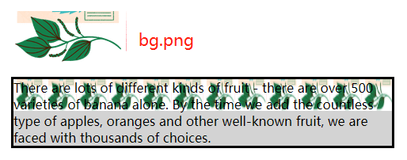

### background-repeat
- repeat-x, 水平方向平铺图像，图像可能被截断。
- repeat-y, 垂直方向平铺图像，图像可能被截断
- repeat 水平和垂直方向同时平铺图像，图像可能被截断
- space 水平和垂直方向同时平铺图像，在图像与图像之见设置固定间距，确保图像不被截断
- round 水平和垂直方向同时平铺图像，调整图像大小，确保图像不被截断
- no-repeat 禁止平铺图像

### backgroud-size背景图片尺寸
- auto 默认值，图像已本身尺寸完全显示
- contain 等比例缩放图像，使其宽度、高度中较大者与容器横向或纵向重合，背景图像始终在容器内
- cover 等比例缩放图像，使图像至少覆盖容器。可能超出容器

### background-position 背景图像位置
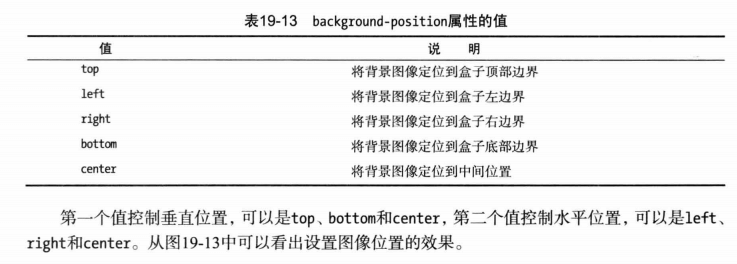
```css
p {
  background-position: 100px 30px;
}
```

### background-attachment 元素背景附着方式
- fixed 背景固定到视窗上，内容滚动时背景不动
- local  背景附着在内容上，背景随内容一起滚动
- scroll  背景固定到元素上，不会随着内容一起滚动

### background-origin和background-clip
设置背景图像的开始位置和裁剪方式, p397

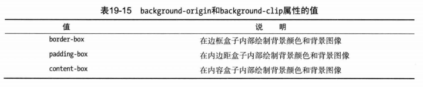

### 使用background简写属性
可省略其中的值，用默认值代替
```js
// background: <background-color> <background-position> <background-size> <background-repeat> <background-origin> <background-clip> <background-attachment> <background-image>
```

## box-shadow(创建盒子阴影)
CSS3为元素的盒子添加阴影效果 box-shadow: hoffset voffset blur spread color inset;

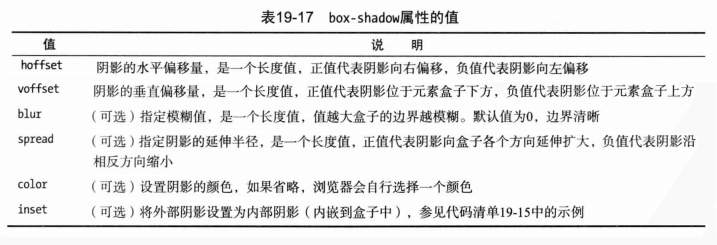

```html
  <head>
    <meta charset="utf-8">
    <title>边框和背景</title>
    <style>
      body { display: flex; }
      div {
        width:100px; height: 100px;
        border: 1px solid #ccc;
        margin: 30px;
      }
      #div1 {
        box-shadow: 5px 4px 10px 2px gray;
      }
      #div2 {
        box-shadow: 0 0 10px 2px #ccc;
      }
      #div3 {
        box-shadow: 0 0 10px 2px #ccc, 0 0 10px 2px gray inset;
      }
    </style>
  </head>
  <body>
    <div id="div1"></div>
    <div id="div2"></div>
    <div id="div3"></div>
  </body>
```
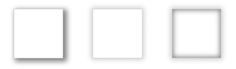

## outline(应用轮廓)
轮廓对于边框来说是可选的。轮廓最有用的地方在于短时间抓住用户对某个元素的注意力。轮廓和边框的最大区别是：轮廓不属于页面，轮廓不需要调整页面布局

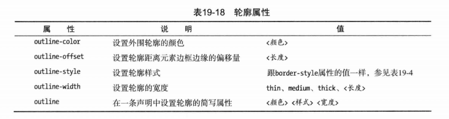

```html
  <head>
    <meta charset="utf-8">
    <title>边框和背景</title>
    <style>
      p {
        border:1px solid #ccc;
        margin: 20px;
      }
      p:first-child {
        outline: thick dashed red;
      }
    </style>
  </head>
  <body>
    <p>p1</p>
    <p>p2</p>
    <p>p3</p>
  </body>
```

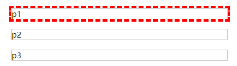