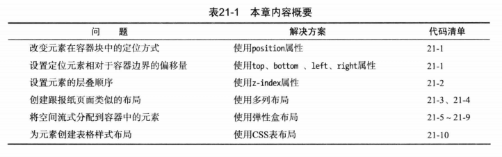
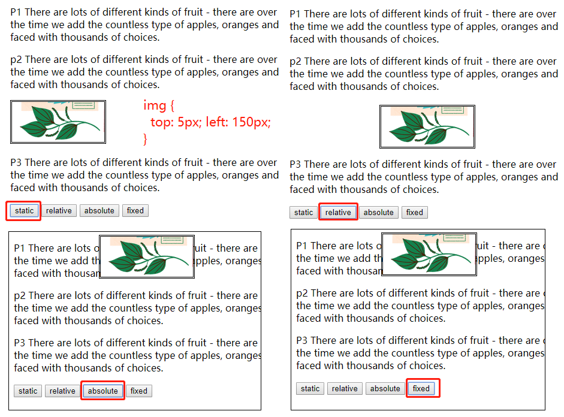
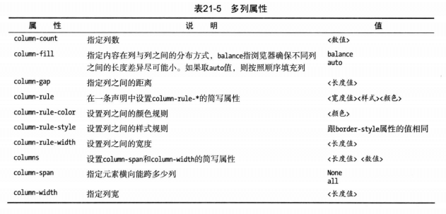
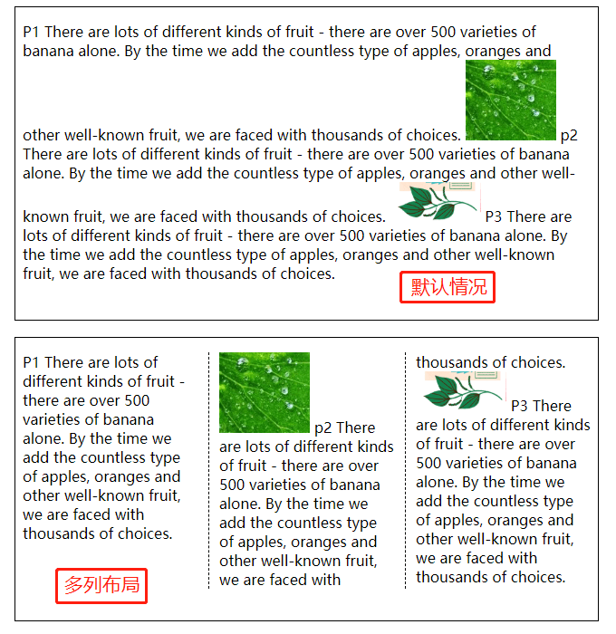
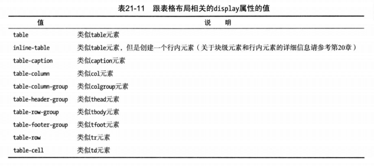
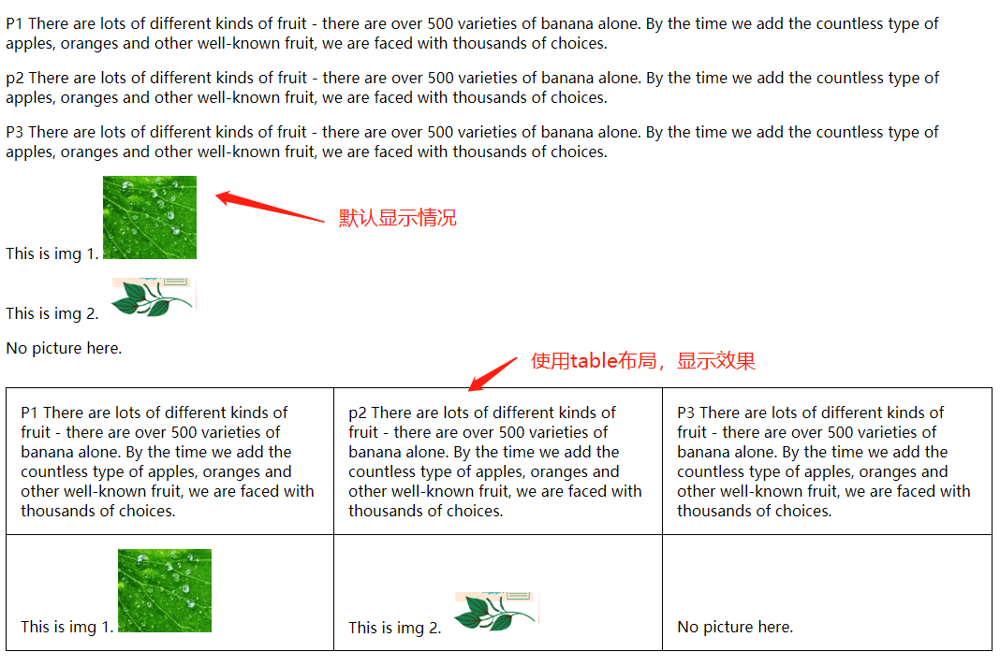

# 创建布局



## position定位内容
控制内容最简单的方式就是定位，定位的属性包括:

- position 设置定位方法
  - static 元素普通布局，**默认值**
  - relative 元素位置相对于普通位置定位
  - absolute 元素相对于position值不为static的第一位祖先元素来定位
  - fixed 元素相对于浏览器窗口来定位
- left, right, top, bottom 为定位元素设置偏移量，长度或百分比
- z-index 设置定位元素的层叠顺序

### 设置定位类型
- 默认情况下(position:static) left、right、bottom、top属性设置会无效
- fixed 和absolute有相似的地方，看起来一样，但由于fixed是相对浏览器窗口的，所以会有两种情况不同：
  - 1.页面滚动的情况下，fixed不会随着内容而滚动。absolute则会。
  - 2.如果absolute元素的父元素或非顶层的祖先元素定位不是static，就可能和fixed表现有差异

```html
<head>
  <meta charset="utf-8">
  <title>边框和背景</title>
  <style>
    img {
      top: 5px;
      left: 150px;
      border: medium double black;
    }
  </style>
</head>
<body>
  <p id="p1">
    P1 There are lots of different kinds of fruit - there are over 500 varieties
    of banana alone. <span>By the time we add the countless</span> type of apples, oranges
    and other well-known fruit, we are faced with thousands of choices.
  </p>
  <p id="p2">
    p2 There are lots of different kinds of fruit - there are over 500 varieties
    of banana alone. <span>By the time we add the countless</span> type of apples, oranges
    and other well-known fruit, we are faced with thousands of choices.
  </p>
  
  <p id="p3">
    P3 There are lots of different kinds of fruit - there are over 500 varieties
    of banana alone. <span>By the time we add the countless</span> type of apples, oranges
    and other well-known fruit, we are faced with thousands of choices.
  </p>
  <section>
    <button>static</button>
    <button>relative</button>
    <button>absolute</button>
    <button>fixed</button>
  </section>
  <script>
    var btns = document.getElementsByTagName('button'),
        img = document.getElementById('img'),
        len = btns.length,
        i;
    
    for (i = 0; i < len; i++) {
      btns[i].onclick = function(e) {
        img.style.position = e.target.innerHTML;
      }
    }
  </script>
</body>
```


### z-index 元素的层叠次序
z-index属性指定元素显示的层叠顺序。其值为数值，且允许取负值。值越小，层叠顺序越靠后。这个属性只有在元素重叠的时候才会派上用场。

```html
<head>
  <meta charset="utf-8">
  <title>边框和背景</title>
  <style>
    img {
      position: fixed;
    }
    #img1 {
      top: 5px;
      left: 150px;
      border: medium double black;
      z-index: 2;
    }
    #img2 {
      left: 100px;
      top: 50px;
      z-index: 1;
    }
  </style>
</head>
<body>
  
  
</body>
```


## column-count 多列布局
多列特性允许在多个垂直列中布局内容，跟报纸的排版方式类似。



示例
```html
<head>
  <meta charset="utf-8">
  <title>边框和背景</title>
  <style>
    img {
      width: 100px;
    }
    p {
      column-count: 3;
      column-fill: balance; /* 默认，每列的内容长度差异尽可能小 */
      column-rule: thin dashed black;
      column-gap: 1.5em;
    }
  </style>
</head>
<body>
  <p id="p1">
    P1 There are lots of different kinds of fruit - there are over 500 varieties
    of banana alone. <span>By the time we add the countless</span> type of apples, oranges
    and other well-known fruit, we are faced with thousands of choices.
  
    

    p2 There are lots of different kinds of fruit - there are over 500 varieties
    of banana alone. <span>By the time we add the countless</span> type of apples, oranges
    and other well-known fruit, we are faced with thousands of choices.

    

    P3 There are lots of different kinds of fruit - there are over 500 varieties
    of banana alone. <span>By the time we add the countless</span> type of apples, oranges
    and other well-known fruit, we are faced with thousands of choices.
  </p>
</body>
```



## 弹性盒布局(flex)
书中的内容是比较早的内容，新的内容参见 [flex和grid布局笔记](../flex与grid布局/flex与grid布局.md)

## 创建表格布局


示例：
```html
<head>
  <meta charset="utf-8">
  <title>边框和背景</title>
  <style>
    img {
      width: 100px;
    }
    .table {
      display: table;
      border-collapse: collapse;
    }
    .table > .row {
      display: table-row;
    }
    .row > p{
      display: table-cell;
      border: thin solid black;
      padding: 15px;
    }
  </style>
</head>
<body>
  <section class="table">
    <section class="row">
      <p id="p1">
        P1 There are lots of different kinds of fruit - there are over 500 varieties
        of banana alone. <span>By the time we add the countless</span> type of apples, oranges
        and other well-known fruit, we are faced with thousands of choices.
      </p>
      <p>
        p2 There are lots of different kinds of fruit - there are over 500 varieties
        of banana alone. <span>By the time we add the countless</span> type of apples, oranges
        and other well-known fruit, we are faced with thousands of choices.
      </p>
      <p>
        P3 There are lots of different kinds of fruit - there are over 500 varieties
        of banana alone. <span>By the time we add the countless</span> type of apples, oranges
        and other well-known fruit, we are faced with thousands of choices.
      </p>
    </section>
    <section class="row">
      <p>
        This is img 1. 
      </p>
      <p>
        This is img 2. 
      </p>
      <p>
        No picture here.
      </p>
    </section>
  </section>
</body>
```

