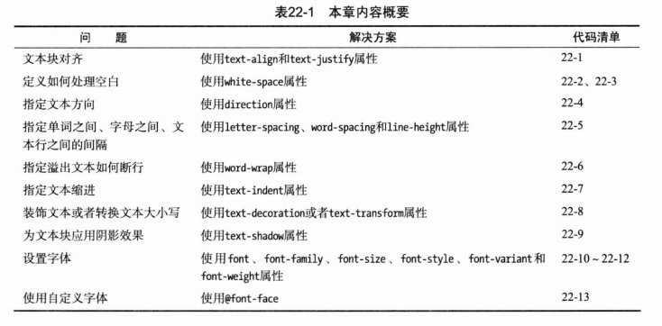

# 设置文本样式

## 基本的文本样式

### text-align和text-justify 文本对齐

### white-space 处理空白

### direction 文本方向

### 指定字母、单词、行之间的间距
#### letter-spacing 字母之间间距
#### word-spacing 单词之间间距
#### line-height 行高

### word-wrap 溢出文本断行

### text-indent 首行缩进

## 文本装饰与大小写转换
### text-decoration 文本装饰

### text-transform 大小写转换

## text-shadow 文本阴影

## 使用字体
### font-family 选择字体
### font-size 字体大小
### font-weight 设置字体粗细
### font-style 字体样式

## @font-face 使用web字体
