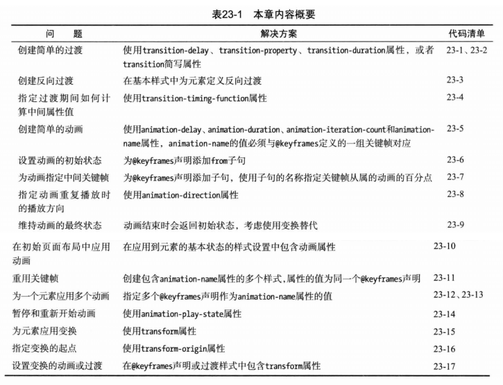
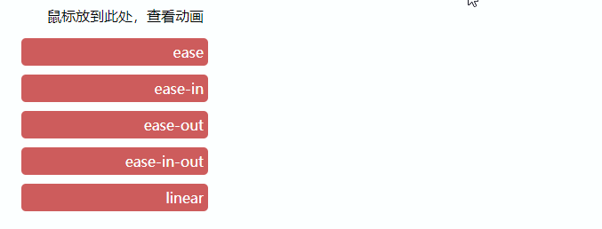
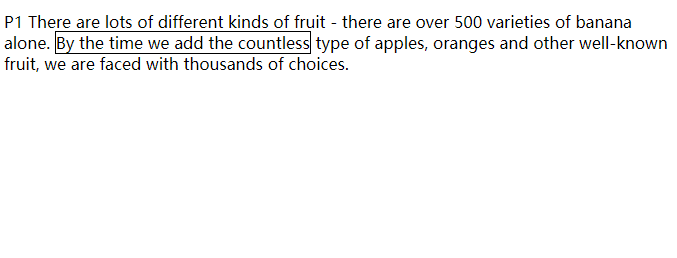
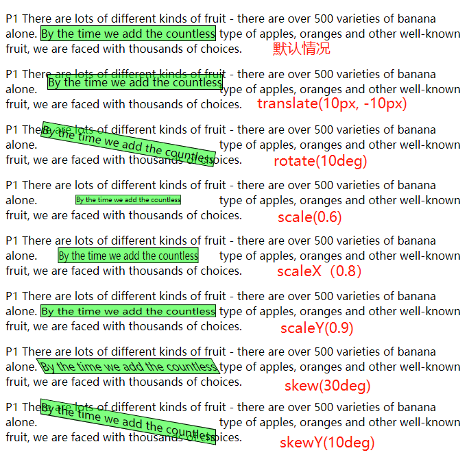
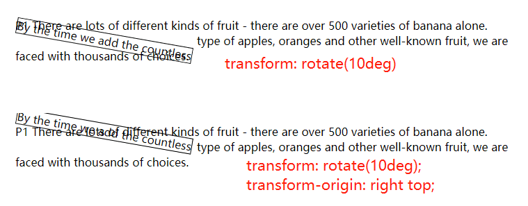

# 过渡、动画、变换



## transition 过渡
过渡特效是当元素的宽高、颜色等发生变化时，变化发生的过程动画。

- transition-property 过渡的属性，如width、height、background等
- transition-duration 过渡持续时间 ms 或 s
- transition-timing-function 指定过渡期间计算中间值的方式，由4个点控制的贝塞尔曲线
  - ease (默认)
  - linear 线性
  - ease-in
  - ease-out
  - ease-in-out
- transition-delay 过渡开始前的延迟时间

### 创建反向过渡
```html
  <head>
    <meta charset="utf-8">
    <title>过渡</title>
    <style>
      span {
        border: thin solid black;

        /* 反向过渡 */
        transition-delay: 1s;
        transition-duration: 1000ms;
      }
      span:hover {
        font-size: x-large;
        background-color:green;

        transition-property: font-size, background-color;
        transition-duration: 1000ms;
        transition-delay: 1s; /* hover 1s后开始执行动画 */
      }
    </style>
  </head>
  <body>
    <p>
      P1 There are lots of different kinds of fruit - there are over 500 varieties
      of banana alone. <span>By the time we add the countless</span> type of apples, oranges
      and other well-known fruit, we are faced with thousands of choices.
    </p>
  </body>
```


### 动画过渡的方式




```html
  <head>
    <meta charset="utf-8">
    <title>过渡</title>
    <style>
      section {
        width: 200px;
        margin: 10px 20px;
        padding: 5px;
        text-align: right;
        border-radius: 5px;
      }
      [id*=sec] {
        background-color:indianred;
        color: white;
      }
      #mark:hover ~ [id*=sec] {
        width: 400px;
      }
      #sec1 { transition: width 2s ease; }
      #sec2 { transition: width 2s ease-in; }
      #sec3 { transition: width 2s ease-out; }
      #sec4 { transition: width 2s ease-in-out; }
      #sec5 { transition: width 2s linear; }
    </style>
  </head>
  <body>
    <section id="mark">鼠标放到此处，查看动画</section>
    <section id="sec1">ease</section>
    <section id="sec2">ease-in</section>
    <section id="sec3">ease-out</section>
    <section id="sec4">ease-in-out</section>
    <section id="sec5">linear</section>
  </body>
```

## animation 动画
CSS动画本质上是增强的过渡。animation相关属性：
- animation-name 动画名称, none或字符串
- animation-duration 动画持续时间, ms或s
- animation-timing-function 动画方式
  - ease 默认
  - ease-in
  - ease-out
  - ease-in-out
  - linear 
  - cubic-bezier 贝塞尔曲线
- animation-delay 设置动画开始前的延迟 ms或s
- animation-iteration-count 设置动画播放的次数， infinite或数值
- animation-play-state 允许动画暂停和重复播放 running或paused
- animation-direation 设置动画循环播放时是否反向播放 normal, alternate
- animation 简写 

### 使用关键帧
animation分两个部分
- @key-frames 定义一个动画的名称，并设置动画的相关属性
- 在元素的样式声明中使用该动画。动画的名称如果用双引号或单引号括起来会无效。直接用对对应的名称即可。
```html
  <head>
    <meta charset="utf-8">
    <title>过渡</title>
    <style>
      span {
        border: thin solid black;
      }
      span:hover {
        animation-duration: 1s;
        animation-iteration-count: infinite;
        animation-name: MyAnimation; /* 注意这里不要使用'' */
      }
      @keyframes MyAnimation {
        to {
          font-size: x-large;
          background-color:green;
        }
      }
    </style>
  </head>
  <body>
    <p>
      P1 There are lots of different kinds of fruit - there are over 500 varieties
      of banana alone. <span>By the time we add the countless</span> type of apples, oranges
      and other well-known fruit, we are faced with thousands of choices.
    </p>
  </body>
```


指定中间关键帧，修改上面的动画，加入中间的关键帧from(0%), 50%, 75%, to(1000%), 动画持续时间设置为2s
```css
@keyframes MyAnimation {
  from {
    font-size: samller;
      background: red;
  }
  50% {
    background-color: purple;
  }
  75% {
      background: orange;
  }
  to {
    font-size: x-large;
    background-color:green;
  }
}
```


### animation-direction反向播放动画
animation-direction: alternate，如果不指定，动画执行一次后，会立刻恢复最开始的状态，再次执行动画。如果设置了该属性，动画执行完成后，会反向播放动画回到最开始的状态。有很好的过渡效果。
```css
span:hover {
  animation-duration: 2s;
  animation-iteration-count: infinite;
  animation-name: MyAnimation;
  animation-direction: alternate;
}
```


### 理解结束状态
动画结束后，并不会将100%关键帧里设置的属性应用到元素上。**animation只是动画，不会修改元素的属性。如果需要保留动画后的效果，需要使用transition**

### 重用关键帧
@keyframes 设置的动画可以应用于多个元素
```css
span:hover,section {
  animation-duration: 2s;
  animation-iteration-count: infinite;
  animation-name: MyAnimation;
  animation-direction: alternate;
}
```


### 多个元素应用多个动画
animation-name里设置多个动画，以逗号分隔。
```css
span:hover,section {
  animation-duration: 2s;
  animation-iteration-count: infinite;
  animation-name: MyAnimation, Animation2;
  animation-direction: alternate;
}
@keyframes Animation2 {
  to {
    color: white;
  }
}
```


### 动画的停止和启动
通过JS动态改变animation-play-state的值，就可以控制动画的关和停。paused和running分别代表动画的停止和启动。
```html
<!DOCTYPE html>
<html>
  <head>
    <meta charset="utf-8">
    <title>过渡</title>
    <style>
      span {
        border: thin solid black;
        animation-duration: 1s;
        animation-iteration-count: infinite;
        animation-name: MyAnimation;
      }
      @keyframes MyAnimation {
        to {
          color: red;
          background-color: rgba(0, 255, 0, 0.6);
        }
      }
    </style>
  </head>
  <body>
    <p>
      P1 There are lots of different kinds of fruit - there are over 500 varieties
      of banana alone. <span id="span1">By the time we add the countless</span> type of apples, oranges
      and other well-known fruit, we are faced with thousands of choices.
    </p>
    <p>
      <button>running</button>
      <button>paused</button>
    </p>
    <script>
      var btns = document.getElementsByTagName('button'),
          len = btns.length,
          span = document.getElementById('span1'),
          i;

      for (i = 0; i < len; i++) {
        btns[i].onclick = function(e) {
          span.style.animationPlayState = e.target.innerHTML;
        }
      }
    </script>
  </body>
</html>
```


## transform 变换
可以使用transform来旋转、缩放、倾斜、平移某个元素, 元素需要是块级元素或行类块级元素，不能是行内元素，否则会无效。更多内容参考：[CSS3 3D 转换](https://www.w3school.com.cn/css3/css3_3dtransform.asp)
- transform 指定应用变换功能
  - 平移 (值为长度值、或百分比)
    - translate(x, y) 在水平方向、垂直方向平移元素
    - translateX(x) 在水平方向平移元素
    - translateY(y) 在垂直方向平移元素
  - 缩放 (值为数值)
    - scale(x, y) 在水平方向、垂直方向缩放元素
    - scaleX(x) 在水平方向缩放元素 
    - scaleY(y) 在垂直方向缩放元素
  - 旋转 (值为deg角度)
    - rotate(角度) 旋转元素
  - 倾斜 (值为deg角度)
    - skew(角度) 在水平、垂直方向使元素倾斜一定的角度
    - skewX(角度) 
    - skewY(角度)

```html
<!DOCTYPE html>
<html>
  <head>
    <meta charset="utf-8">
    <title>过渡</title>
    <style>
      span {
        display: inline-block;
        border: thin solid black;
        background-color: rgba(0 , 255, 0, 0.5);
      }
      #span2 { transform: translate(10px, -10px); }
      #span3 { transform: rotate(10deg); }
      #span4 { transform: scale(0.6); }
      #span5 { transform: scaleX(0.8); }
      #span6 { transform: scaleY(0.8); }
      #span7 { transform: skew(30deg); }
      #span8 { transform: skewY(10deg); }
    </style>
  </head>
  <body>
    <p>
      P1 There are lots of different kinds of fruit - there are over 500 varieties
      of banana alone. <span>By the time we add the countless</span> type of apples, oranges
      and other well-known fruit, we are faced with thousands of choices.
    </p>
    <p>
      P1 There are lots of different kinds of fruit - there are over 500 varieties
      of banana alone. <span id="span2">By the time we add the countless</span> type of apples, oranges
      and other well-known fruit, we are faced with thousands of choices.
    </p>
    <p> .... </p>
  </body>
</html>
  ```
  

  ### 指定元素的变换起点
  默认情况下，变换都是使用元素的中心作为起点。transform-origin属性可以指定变换的起点：
  
  transform-origin: x-axis y-axis z-axis;
  - x-axis 定义视图被置于 X 轴的何处。可能的值：left、center、right、length、%
  - y-axis 定义视图被置于 Y 轴的何处。可能的值：top、center、bottom、length、%
  - z-axis 定义视图被置于 Z 轴的何处。可能的值：length

```html
  <head>
    <meta charset="utf-8">
    <title>过渡</title>
    <style>
      span {
        display: inline-block;
        border: thin solid black;
        transform: rotate(10deg);
        /* transform-origin: right top; */
      }
    </style>
  </head>
  <body>
    <p>
      P1 There are lots of different kinds of fruit - there are over 500 varieties
      of banana alone. <span>By the time we add the countless</span> type of apples, oranges
      and other well-known fruit, we are faced with thousands of choices.
    </p>
  </body>
```



### 将变换作为动画和过渡
```html
  <head>
    <meta charset="utf-8">
    <title>过渡</title>
    <style>
      span {
        display: inline-block;
        border: thin solid black;
        background-color: red;
      }
      span:hover {
        transition-duration: 2s;
        transform: rotateX(360deg);
      }
    </style>
  </head>
  <body>
    <p>
      P1 There are lots of different kinds of fruit - there are over 500 varieties
      of banana alone. <span>By the time we add the countless</span> type of apples, oranges
      and other well-known fruit, we are faced with thousands of choices.
    </p>
  </body>
```


