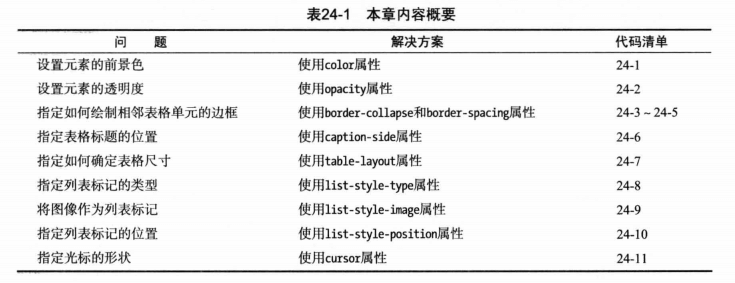
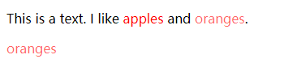
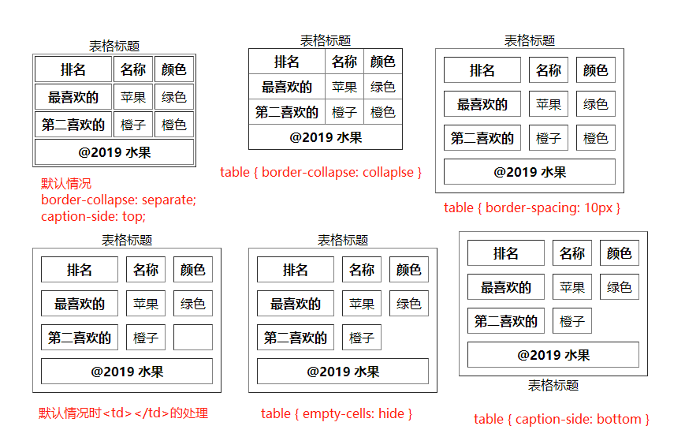
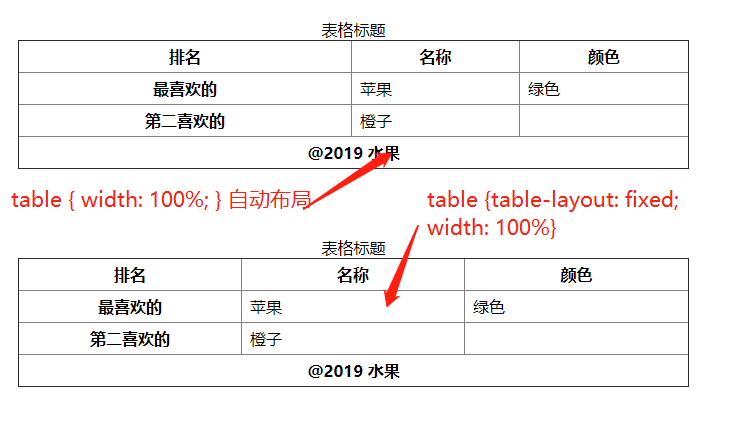
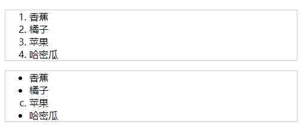
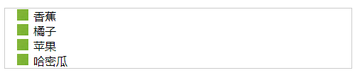
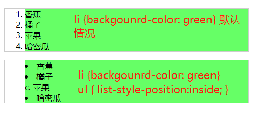

# 其他css属性和特性



## color和opacity(颜色和透明度)
```html
  <head>
    <meta charset="utf-8">
    <title>其他css属性和特性</title>
    <style>
      span {
        color: red;
      }
      span:last-child {
        opacity: 0.6;
      }
      p:last-child {
        color: rgba(255, 0, 0, 0.6);
        /* 等价于 color: red; opacity: 0.6; */
      }
    </style>
  </head>
  <body>
      <p>
        This is a text. I like <span>apples</span> and <span>oranges</span>.
      </p>
      <p>oranges</p>
  </body>
```


## 设置表格样式
### border-collapse 合并表格边框
border-collapse默认值为separate, /ˈseprət/ 每个格子都设置边框。如果指设置为collapse就可以合并边框。默认值时（separate），可以根据border-spacing 设置相邻元素边框的间距。
```html
<!DOCTYPE html>
<html>
  <head>
    <meta charset="utf-8">
    <title>其他css属性和特性</title>
    <style>
      table {
        border-collapse: collapse;
        /* border-collapse: separate;  /ˈseprət/ 单独的格子
        border-spacing: 10px;
        empty-cells: hide;
        caption-side: bottom; */
      }
      th, td {
        padding: 5px 8px;
      }
    </style>
  </head>
  <body>
    <table border="1">
      <caption>表格标题</caption>
      <thead>
        <tr>
            <th>排名</th>
            <th>名称</th>
            <th>颜色</th>
        </tr>
      </thead>
      <tbody>
        <tr>
          <th>最喜欢的</th>
          <td>苹果</td>
          <td>绿色</td>
        </tr>
        <tr>
          <th>第二喜欢的</th>
          <td>橙子</td>
          <td>橙色</td>
        </tr>
      </tbody>
      <tfoot>
        <tr>
          <th colspan="3">@2019 水果</th>
        </tr>
      </tfoot>
    </table>
  </body>
</html>
```

### empty-cells 处理空格边框
默认情况，对于内容为空的td也会增加边框，可以用empty-cells设置为hide，来控制处理空内容单元格时，直接隐藏。
```html
<tr>
  <th>第二喜欢的</th>
  <td>橙子</td>
  <td></td>
</tr>
```
### caption-side 指定表格标题位置
默认值为top，放到表格上面，如果设置为bottom，则放到表格下面



### table-layout 指定表格布局
表格默认情况是自动布局，table-layout为auto，可以设置为fiexed禁用自动布局，单元格的大小需要自己设置width指定。自己指定大小，非auto的情况，会等分列宽，不管列里面的文字是否能一行显示。



## 设置 li 列表样式
### list-style-type 列表标记类型
ol,ul默认padding-left:40px，margin: 1em 0。ol默认列表样式为1. 2. 3., ul默认样式为disc
``` html
<!DOCTYPE html>
<html>
  <head>
    <meta charset="utf-8">
    <title>其他css属性和特性</title>
    <style>
      ol, ul {
        border: 1px solid #ccc;
        /* list-style-type: none; 去掉列表标记 */
        /* list-style-type: circle; 黑色的小圆圈，空心 */
        /* list-style-type: disc; 黑色的小圆块，实心 */
        /* list-style-type: square; 黑色的小方块 */
        /* list-style-type: lower-alpha;  a. b. c. */
        /* list-style-type: upper-alpha;  A. B. C.*/
      }
    </style>
  </head>
  <body>
    <ol>
      <li>香蕉</li>
      <li>橘子</li>
      <li>苹果</li>
      <li>哈密瓜</li>
    </ol>
    <ul>
      <li>香蕉</li>
      <li>橘子</li>
      <li style="list-style-type:lower-alpha;">苹果</li>
      <li>哈密瓜</li>
    </ul>
  </body>
</html>
```


### list-style-image 将图像作为列表标记
```css
ol, ul {
  border: 1px solid #ccc;
  list-style-image: url('bg.png');
}
```


### list-style-position 指定列表标记位置
默认情况下列表标记位置在li的content-box外部，也就是list-style-position为outside，如果将值设置为inside，列表标记将放到li的content-box内部



## cursor 设置光标样式
cursor属性用来改变光标的外观。
```html
  <head>
    <meta charset="utf-8">
    <title>其他css属性和特性</title>
    <style>
      section {
        width: 100px;
        height: 100px;
        border: 1px solid #000;
      }
      section:hover {
        cursor: auto;
        /* cursor: crosshair; + 字形 */
        /* cursor: default; */
        /* cursor: help; 箭头+？号 */
        /* cursor: move; 上下左右箭头 */
        /* cursor: pointer; 手指 */
        /* cursor: progress; 箭头+蓝色渐变loading圈 */
        /* cursor: text; I 字形 */
        /* cursor: wait; 蓝色渐变loading圈 */
        /* cursor: n-resize; 上下箭头 ↕ */
        /* cursor: s-resize; 上下箭头 ↕ */
        /* cursor: e-resize; 左右箭头 ↔ */
        /* cursor: w-resize; 左右箭头 ↔ */
        /* cursor: ne-resize; 右上左下箭头 */
        /* cursor: nw-resize; 左上右下箭头 */
        /* cursor: se-resize; 左上右下箭头 */
        /* cursor: sw-resize; 右上左下箭头 */
      }
    </style>
  </head>
  <body>
    <section></section>
  </body>
```

