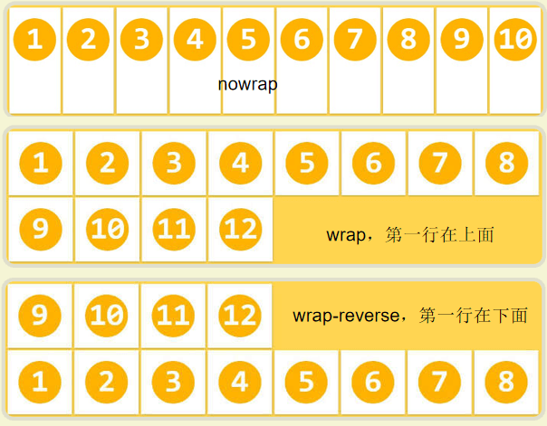
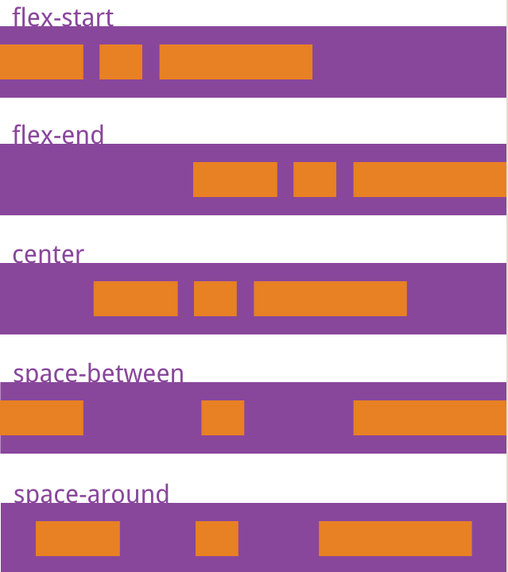
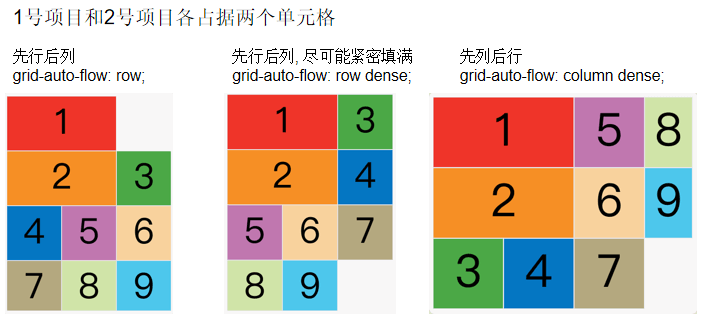
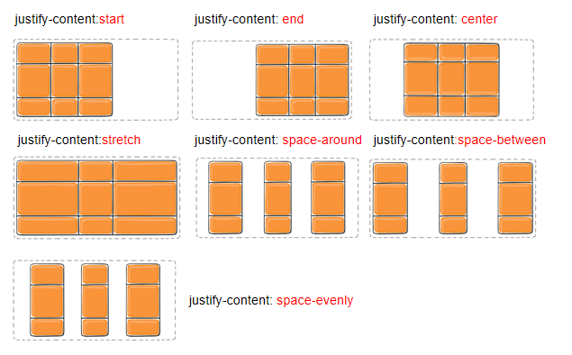
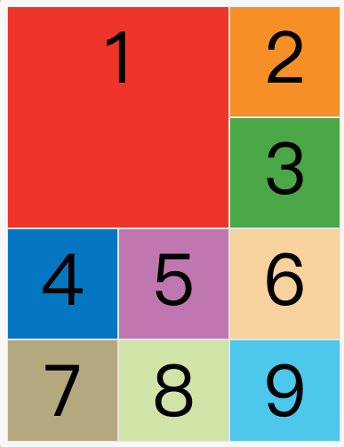

# Flex与Grid布局

## Flex弹性布局
> 布局的传统解决方案，基于盒状模型，依赖 display 属性 + position属性 + float属性。它对于那些特殊布局非常不方便，比如，垂直居中就不容易实现。

2009年，W3C 提出了一种新的方案----Flex 布局，可以简便、完整、响应式地实现各种页面布局。IE10+支持

参考：
flex语法：http://www.ruanyifeng.com/blog/2015/07/flex-grammar.html
flex教程实例：http://www.ruanyifeng.com/blog/2015/07/flex-examples.html

### Flex布局是什么？
Flex 是 Flexible Box 的缩写，意为"弹性布局"，用来为盒状模型提供最大的灵活性。

任何一个容器都可以指定为 Flex 布局。**设为 Flex 布局以后，子元素的float、clear和vertical-align属性将失效。**
```css
.box {
  display: flex;
}

/* 行内元素也可以使用 Flex 布局。 */
.box{
  display: inline-flex;
}
```

### Flex容器与Flex item
- 采用 Flex 布局的元素，称为 **Flex 容器**（flex container），简称"容器"。
- 它的所有子元素自动成为容器成员，称为 **Flex 项目**（flex item），简称"项目"。

### 容器的属性
#### flex-direction(方向)
布局方向：
- row 水平方向布局子元素 **(默认)**
- row-reverse 水平方向，逆序
- column 垂直方向布局子元素
- column-reverse 垂直方向，逆序
```css
.box {
  display: flex;
  flex-direction: row | row-reverse | column | column-reverse;
}
```
#### flex-wrap(换行)
换行规则：
- nowrap 不换行，子元素等分 **(默认)**
- wrap 自动换行
- wrap-reverse 换行，逆序
```css
.box {
  display: flex;
  flex-wrap: nowrap | wrap |  | wrap-reverse;
}
```


#### flex-flow(direction加wrap)
flex-flow属性是flex-direction属性和flex-wrap属性的简写形式，默认值为row nowrap。
```css
.box {
  flex-flow: <flex-direction> || <flex-wrap>;
}
```

#### justify-content(主轴对齐)
justify-content 水平对齐方式
- flex-start **（默认值）**：左对齐
- flex-end：右对齐
- center： 居中
- space-between：两端对齐，项目之间的间隔都相等。
- space-around：每个项目两侧的间隔相等。所以，项目之间的间隔比项目与边框的间隔大一倍。
```css
.box {
  display: flex;
  justify-content: flex-start | flex-end | center | space-between | space-around;
}
```


#### align-items(交叉轴对齐)
align-items属性定义项目在垂直方向的对齐方式
- flex-start：交叉轴的起点对齐。
- flex-end：交叉轴的终点对齐。
- center：交叉轴的中点对齐。
- baseline: 项目的第一行文字的基线对齐。
- stretch **（默认值）**：如果项目未设置高度或设为auto，将占满整个容器的高度。
```css
.box {
  display: flex;
  align-items: flex-start | flex-end | center | baseline | stretch;
}
```


#### align-content(多轴对齐)
align-content属性定义了多根轴线的对齐方式。如果项目只有一根轴线，该属性不起作用。
- flex-start：与交叉轴的起点对齐。
- flex-end：与交叉轴的终点对齐。
- center：与交叉轴的中点对齐。
- space-between：与交叉轴两端对齐，轴线之间的间隔平均分布。
- space-around：每根轴线两侧的间隔都相等。所以，轴线之间的间隔比轴线与边框的间隔大一倍。
- stretch **（默认值）**：轴线占满整个交叉轴。
```css
.box {
  display: flex;
  align-content: flex-start | flex-end | center | space-between | space-around | stretch;
}
```


### 项目(Flex item)的属性
#### order(顺序)
order属性定义项目的排列顺序。数值越小，排列越靠前，**默认为0**。
```css
.item {
  order: <integer>;
}
```
#### flex-grow(放大0)
flex-grow属性定义项目的放大比例，**默认为0，即如果存在剩余空间，也不放大**。
```css
.item {
  flex-grow: <number>; /* default 0 */
}
/* 如果所有项目的flex-grow属性都为1，则它们将等分剩余空间（如果有的话）。如果一个项目的flex-grow属性为2，其他项目都为1，则前者占据的剩余空间将比其他项多一倍。 */
```

#### flex-shrink（缩小1）
flex-shrink属性定义了项目的缩小比例，**默认为1，即如果空间不足，该项目将缩小**。

如果所有项目的flex-shrink属性都为1，当空间不足时，都将等比例缩小。如果一个项目的flex-shrink属性为0，其他项目都为1，则空间不足时，前者不缩小。**负值对该属性无效。**
```css
.item {
  flex-shrink: <number>; /* default 1 */
}
```
#### flex-basis(基本宽度)
flex-basis属性定义了在分配多余空间之前，项目占据的主轴空间（main size）。浏览器根据这个属性，计算主轴是否有多余空间。它的默认值为auto，即项目的本来大小。
```css
.item {
  flex-basis: <length> | auto; /* default auto */
}
/* 它可以设为跟width或height属性一样的值（比如350px），则项目将占据固定空间。 */
```
#### flex (grow加shrink加basis)
flex属性是flex-grow, flex-shrink 和 flex-basis的简写，**默认值为0 1 auto。后两个属性可选**。
```css
.item {
  flex: none | [ <'flex-grow'> <'flex-shrink'>? || <'flex-basis'> ]
}
/*该属性有两个快捷值：auto (1 1 auto) 和 none (0 0 auto)。

建议优先使用这个属性，而不是单独写三个分离的属性，因为浏览器会推算相关值。*/
```
#### align-self（item独立对齐方式）
align-self属性允许单个项目有与其他项目不一样的对齐方式，可覆盖align-items属性。默认值为auto，表示继承父元素的align-items属性，如果没有父元素，则等同于stretch。
```css
.item {
  align-self: auto | flex-start | flex-end | center | baseline | stretch;
}
```


## Grid网格布局
> 网格布局（Grid）是最强大的 CSS 布局方案。IE10+支持, 它将网页划分成一个个网格，可以任意组合不同的网格，做出各种各样的布局。以前，只能通过复杂的 CSS 框架达到的效果，现在浏览器内置了。

Flex 布局是轴线布局，只能指定"项目"针对轴线的位置，可以看作是一维布局。

Grid 布局则是将容器划分成"行"和"列"，产生单元格，然后指定"项目所在"的单元格，可以看作是二维布局。Grid 布局远比 Flex 布局强大。

参考：
[CSS Grid 网格布局教程](http://www.ruanyifeng.com/blog/2019/03/grid-layout-tutorial.html)
[二维 grid 布局](https://segmentfault.com/a/1190000007139070)

指定一个容器采用网格布局。**注意，设为网格布局以后，容器子元素（项目）的float、display: inline-block、display: table-cell、vertical-align和column-*等设置都将失效。**
```css
div {
  display: grid;
}
div {
  display: inline-grid; 
  /* 默认情况下，容器元素都是块级元素，但也可以设成行内元素。 */
}

```
### 基本概念
- 容器和项目：采用网格布局的区域，称为"容器"（container）。容器内部采用网格定位的子元素，称为"项目"（item）。
- 行和列：容器里面的水平区域称为"行"（row），垂直区域称为"列"（column）。
- 单元格：行和列的交叉区域，称为"单元格"（cell）。
- 网格线：划分网格的线，称为"网格线"（grid line）。水平网格线划分出行，垂直网格线划分出列。

### 容器属性
容器指定了网格布局以后，接着就要划分行和列。

#### grid-template-columns (列宽)
grid-template-columns属性定义每一列的列宽

#### grid-template-rows (行高)
grid-template-rows属性定义每一行的行高。
```css
/* 指定一个三行三列的网格，列宽和行高都是100px */
.container {
  display: grid;
  grid-template-columns: 100px 100px 100px;
  grid-template-rows: 100px 100px 100px;
}

/* 也可以使用百分百单位*/
.container {
  display: grid;
  grid-template-columns: 33.33% 33.33% 33.33%;
  grid-template-rows: 33.33% 33.33% 33.33%;
}

/* 1.repeat(count, content)  重复
 * 第一个参数是重复的次数（上例是3），第二个参数是所要重复的值
 */
grid-template-columns: repeat(2, 100px 20px 80px);
/* 等价于 grid-template-columns: 100px 20px 80px 100px 20px 80px */
grid-template-rows: repeat(3, 33.33%);
/* 等价于 grid-template-rows: 33.33% 33.33% 33.33%; */

/**
 * 2.auto-fill 关键字  自动填充
 * 单元格的大小是固定的，但是容器的大小不确定。
 * 如果希望每一行（或列）容纳尽可能多的单元格，可以使用auto-fill关键字表示自动填充。
 */
 .container {
  display: grid;
  grid-template-columns: repeat(auto-fill, 100px);
  /* 每列宽度100px，然后自动填充，直到容器不能放置更多的列。 */
}

/**
 * 3.fr 关键字，（fraction 的缩写，意为"片段"） 表示比例
 * 1fr和2fr，就表示后者是前者的两倍。
 */
.container {
  display: grid;
  grid-template-columns: 1fr 1fr; /* 两列相同宽度 */
  grid-template-columns: 150px 1fr 2fr;
  /* 第一列的宽度为150像素，第二列的宽度是第三列的一半。 */
}

/**
 * 4.minmax() 范围
 * minmax(min, max)函数产生一个长度范围，表示长度就在这个范围之中。
 */
.container {
  display: grid;
  grid-template-columns: 1fr 1fr minmax(100px, 1fr);
  /* minmax(100px, 1fr)表示列宽不小于100px，不大于1fr。 */
}

 /**
  * 5.auto关键字
  * 表示由浏览器自己决定长度。
  */
.container {
  display: grid;
  grid-template-columns: 100px auto 100px;
}

/**
 * 6.网格线名称
 * 可以使用方括号，指定每一根网格线的名字，方便以后的引用。
 */
.container {
  display: grid;
  grid-template-columns: [c1] 100px [c2] 100px [c3] auto [c4];
  grid-template-rows: [r1] 100px [r2] 100px [r3] auto [r4];
  /* 指定网格布局为3行3列，有4根垂直网格线和4根水平网格线。方括号里面依次是这八根线的名字。 */
}

/* 例子1：
 * grid-template-columns属性对于网页布局非常有用。两栏式布局只需要一行代码。
 */
.wrapper {
  display: grid;
  grid-template-columns: 70% 30%;
}

/* 例子2：
 * 传统的十二网格布局，写起来也很容易。
 */
 .wrapper {
  display: grid;
  grid-template-columns: repeat(12, 1fr);
 }
```

#### grid-row-gap (行间距)
grid-row-gap属性设置行与行的间隔（行间距）

#### grid-column-gap (列间距)
grid-column-gap属性设置列与列的间隔（列间距）。

#### grid-gap (行间距加列间距)
```css
.container {
  display: grid;
  grid-row-gap: 20px; /* 等价于 row-gap: 20px */
  grid-column-gap: 20px; /* 等价于 column-gap: 20px */
}

/* grid-gap: <grid-row-gap> <grid-column-gap>; */
.container {
  display: grid;
  grid-gap: 20px 20px; /*等价于 gap: 20px 20px */
}

/* 如果grid-gap省略了第二个值，浏览器认为第二个值等于第一个值。 */

```

#### grid-template-areas (标记单元格)
```css
.container {
  display: grid;
  grid-template-columns: 100px 100px 100px;
  grid-template-rows: 100px 100px 100px;
  /* 划分出9个单元格，将其命名为a到i的九个区域，分别对应这九个单元格。 */
  grid-template-areas: 'a b c'
                       'd e f'
                       'g h i';

  /* 多个单元格合并成一个区域的写法 */
  grid-template-areas: 'a a a'
                       'b b b'
                       'c c c';

  /* 布局实例 */
  grid-template-areas: "header header header"
                       "main main sidebar"
                       "footer footer footer";

  /* 如果某些元素不需要利用，以.来代替 */
  grid-template-areas: 'a . c'
                       'd . f'
                       'g . i';

  /* 区域的命名会影响到网格线。
  每个区域的起始网格线，会自动命名为区域名-start，终止网格线自动命名为区域名-end */
}
```
示例
```html
<!DOCTYPE html>
<html>
  <head>
    <meta charset="utf-8">
    <title>grid</title>
    <style>
      .container {
        min-height: 100vh;
        display: grid;
        grid-template-rows: 100px auto 100px;
        grid-template-columns: repeat(3, 1fr);
        grid-template-areas: "header header header"
                             "main main sidebar"
                             "footer footer footer";
      }
      .header {
        grid-area: header;
        background: gray;
      }
      .main {
        grid-area: main;
        background: green;
      }
      .sidebar {
        grid-area: sidebar;
        background: blue;
      }
      .footer {
        grid-area: footer;
        background: yellow;
      }
    </style>
  </head>
  <body style="padding:0;margin:0">
    <div class="container">
        <div class="header">header</div>
        <div class="main">main</div>
        <div class="sidebar">sidebar</div>
        <div class="footer">footer</div>
    </div>
  </body>
</html>
```
#### grid-auto-flow(平铺网格顺序)
划分网格以后，容器的子元素会按照顺序，自动放置在每一个网格。
```css
grid-auto-flow: column;  /* 默认为row */
/*
  grid-auto-flow: row  "先行后列"
  1 2 3
  4 5 6
  7 6 9
  grid-auto-flow: column  "先列后行"
  1 4 7
  2 5 8
  3 6 9
*/
```


#### justify-items(单元格水平对齐)
justify-items属性设置单元格内容的水平位置（左中右）。

#### align-items(单元格垂直对齐)
align-items属性设置单元格内容的垂直位置（上中下）。
- start：对齐单元格的起始边缘。
- end：对齐单元格的结束边缘。
- center：单元格内部居中。
- stretch：拉伸，占满单元格的整个宽度（默认值）。
```css
.container {
  justify-items: start | end | center | stretch;
  align-items: start | end | center | stretch;
}
```
#### place-items(单元格水平/垂直对齐)
place-items属性是align-items属性和justify-items属性的合并简写形式。
```css
place-items: <align-items> <justify-items>
```
#### justify-content(整体内容水平对齐)
justify-content属性是**整个内容区域**在容器里面的水平位置（左中右）。
#### align-content(整体内容垂直对齐)
align-content属性是**整个内容区域**的垂直位置（上中下）。
#### place-content(整体内容水平/垂直对齐)
- start - 对齐容器的起始边框。
- end - 对齐容器的结束边框。
- center - 容器内部居中。
- stretch - 项目大小没有指定时，拉伸占据整个网格容器。
- space-around - 每个项目两侧的间隔相等。所以，项目之间的间隔比项目与容器边框的间隔大一倍。
- space-between - 项目与项目的间隔相等，项目与容器边框之间没有间隔。
- space-evenly - 项目与项目的间隔相等，项目与容器边框之间也是同样长度的间隔。
```css
.container {
  justify-content: start | end | center | stretch | space-around | space-between | space-evenly;
  align-content: start | end | center | stretch | space-around | space-between | space-evenly;  
  place-content: <align-content> <justify-content>
}
```


#### grid-auto-columns(多余网格列宽)
#### grid-auto-rows(多余网格行高)
有时候，一些项目的指定位置，在现有网格的外部。比如网格只有3列，但是某一个项目指定在第5行。这时，浏览器会自动生成多余的网格，以便放置项目。

grid-auto-columns属性和grid-auto-rows属性用来设置，浏览器自动创建的多余网格的列宽和行高。它们的写法与grid-template-columns和grid-template-rows完全相同。如果不指定这两个属性，浏览器完全根据单元格内容的大小，决定新增网格的列宽和行高。
```css
.container {
  display: grid;
  grid-template-columns: 100px 100px 100px;
  grid-template-rows: 100px 100px 100px;
  grid-auto-rows: 50px; 
}
```


#### grid-template(3个属性合并写法)
grid-template属性是grid-template-columns、grid-template-rows和grid-template-areas这三个属性的合并简写形式。

#### grid(6个属性合并写法)
grid属性是grid-template-rows、grid-template-columns、grid-template-areas、 grid-auto-rows、grid-auto-columns、grid-auto-flow这六个属性的合并简写形式。

### 项目属性
#### grid-column-start（左边框所在的垂直网格线）
#### grid-column-end（右边框所在的垂直网格线）
#### grid-row-start（上边框所在的水平网格线）
#### grid-row-end（上边框所在的水平网格线）
项目的位置是可以指定的，具体方法就是指定项目的四个边框，分别定位在哪根网格线。
```css
.item-1 {
  /* 1号项目的左边框是第二根垂直网格线，右边框是第四根垂直网格线。 */
  grid-column-start: 2;
  grid-column-end: 4;
}
```


#### grid-column（start加end属性）
grid-column属性是grid-column-start和grid-column-end的合并简写形式。
#### grid-row (start加end属性)
grid-row属性是grid-row-start属性和grid-row-end的合并简写形式。
```css
.item-1 {
  grid-column: 1 / 3;
  grid-row: 1 / 2;
}
/* 等同于 */
.item-1 {
  grid-column-start: 1;
  grid-column-end: 3;
  grid-row-start: 1;
  grid-row-end: 2;
}
```
实例
```css
.item-1 {
  background: #b03532;
  grid-column: 1 / 3;
  grid-row: 1 / 3;
}
/* 等同于 */
.item-1 {
  background: #b03532;
  grid-column: 1 / span 2;
  grid-row: 1 / span 2;
}
```


#### grid-area(指定项目区域)
grid-area属性指定项目放在哪一个区域。
```css
/* 1号项目位于e区 */
.item-1 {
  grid-area: e;
}

.item {
  grid-area: <row-start> / <column-start> / <row-end> / <column-end>;
}
.item-1 {
  grid-area: 1 / 1 / 3 / 3;
}
```

#### justify-self(单个项目水平对齐)
#### align-self(单个项目垂直对齐)
#### place-self(单个项目水平/垂直对齐)
- justify-self属性设置单元格内容的水平位置（左中右），跟justify-items属性的用法完全一致，但只作用于单个项目。
- align-self属性设置单元格内容的垂直位置（上中下），跟align-items属性的用法完全一致，也是只作用于单个项目。
- place-self属性是align-self属性和justify-self属性的合并简写形式。
```css
.item {
  justify-self: start | end | center | stretch;
  align-self: start | end | center | stretch;
}
/* place-self: <align-self> <justify-self>; */
place-self: center center;
```