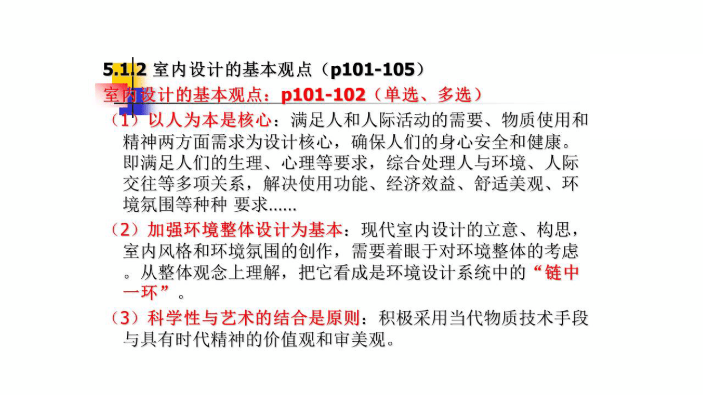
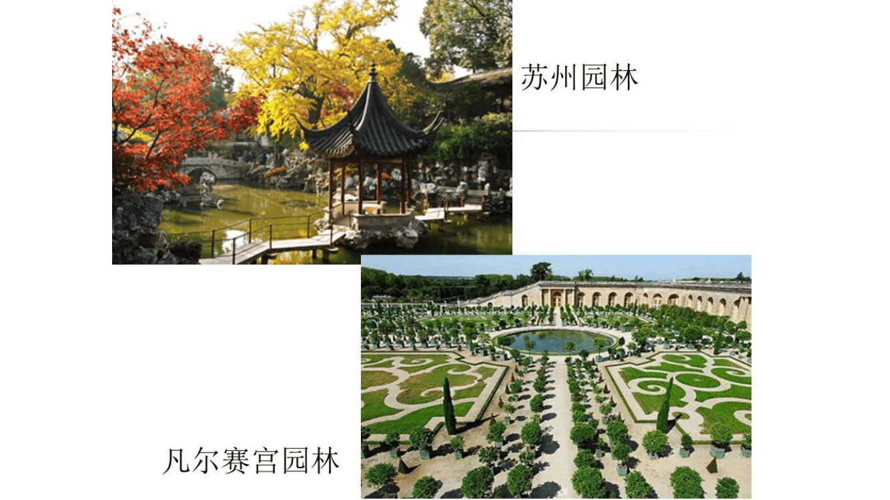

## 第一章  绪论 

### 1.1 设计艺术鉴赏的特点 (多选)

艺术鉴赏的概念 

""鉴赏"，鉴者，照也，明也，即 ”识” 。 赏者，即赏心，称扬，玩娱之意。

- 鉴赏就是：**感受、鉴识、理解和评判 **的过程。

- 鉴赏一般都从 **具体设计作品** 的感受出发。（单选）

- 设计艺术鉴赏涉及 **设计艺术史**、**设计艺术批评**、**美学 **等艺术学科知识。 

人们在鉴赏中的 **思维活动** 和 **感情活动**，从具体设计作品的感受出发。由 **感性阶段** 和 **理性阶段**认识的飞跃。鉴赏课程，用大量的设计艺术作品给鉴赏者以强烈的感性冲击。从案例中生成美的感觉，美的情趣，美的意识。 

- 1969年，美国学者 **亚历山大·西蒙**  首次  提出 **设计科学**这一学科门类概念

- 20世纪初，"design" 开始引入中国。中国开始注重装饰与设计

- 俞剑华 <<最新图案法>> "图案design一语" 

- 1920 蔡元培 <<美术的起源>>  美术，狭义上：建筑造像。广义上：图画与工艺美术” 等 

- ~~柳  林 <<提倡工艺美术与提倡国货>> 我国制造家、实业家忽视工艺美术之得要，不以工艺美术为产品竟争这必要工具的结果。~~

#### 1.1.1 设计、艺术、技术三者的关系（单选）

 设计:  艺术与科学的结合体，也是一种文化现象，具有高附加值的 文化 与 艺术 含量。

设计艺术作品满足消费者三方面需求  **基本功能、享受功能 、鉴赏功能**，构成了文化与艺术上不断提高的需求

技术与艺术

- 相同点:  技术是一种方式，过程，手段。   艺术是一种方式，过程，手段，又可以是艺术品，艺术现象。

- 不同点: 两者属性、目的和存在方式 都不同。   

- 联系点: 1. 艺术的属性: 技术,   是技术存在的最高形态。 2. 技术成为艺术存在的基础，艺术在技术中成长出来。

技术和艺术是不同的概念，但其联系又密不可分。

**整体设计的产生是 "科学技术" 与 "艺术" 进步整合的产物。 **

**技术化与艺术化的高度整合和统一，使设计日趋艺术化， 艺术化生活是人类的理想。**

- 苏珊-朗格:  <<艺术符号美学>> 

- 席勒  <<美育书简>> 

- 马克-第亚尼 <<非物质社会---后工业世界的设计.文化与技术>>

#### 1.1.2 艺术欣赏与设计艺术鉴赏

**艺术欣赏的特点**（p4-5）多选或简答

- 形象性：艺术形象是个性与共性的统一。
- 整体性
- 审美性

**设计艺术鉴赏的特点**（p5-6）简答或论述

1. 设计艺术是与人们物质生活和精神生活具有广泛与密切联系的一种艺术形式
2. 设计艺术与社会生产力有直接联系
3. 艺术设计作品融合了实用性与观赏性于一体，具有物质与精神双重属性
4. 设计艺术重在 "沟通"，传递产品信息功能
5. 设计艺术在很大程度上是 "时尚的代言人"

**艺术欣赏和设计艺术鉴赏** 在 **个性特点与社会时尚** 方面的比较 p(5-6) 填空、简答

- 艺术欣赏活动有显著的 **个性特点**
- 设计艺术鉴赏也有个性特点，更尊重普遍性的 **社会时尚**。

| 艺术欣赏                                                     | 设计艺术鉴赏                                           |
| ------------------------------------------------------------ | ------------------------------------------------------ |
| 1. 个人风格和个性化的图式表达为主，个人风格是艺术家成熟的标志 | 1.传递产品信息功能，形式要符合群体的接受习惯，沟通为主 |
| 2. 不以符合时尚为标准                                        | 2. 时尚代言人                                          |
| 3. 经典的艺术作品是永恒的                                    | 3. 使用功能与审美功能兼具                              |

### 1.2 设计艺术美 与 鉴赏

设计艺术的 **性质** 决定了设计艺术美的性质。

#### 1.2.1 **设计艺术美**的分析（多选、名词解释）

(1) **功能美**

**功能美** 是物的**结构、材料、技术**所表现的 **符合目的性** 和 **符合规律性** 的功能的统一。

- 在设计品功能美形成的过程中，包含着：**积淀、选择、抽象、概括、同化、调节和建构**

- 20世纪上半叶现代主义设计流行时期，**功能** 是产品设计师考虑的最多的因数。(填空)
- 功能美所产生的多层次的审美感受，满足了人对功利与使用的双重需求。

(2) **形式美** (名词解释、多选)

**形式美** 是功能美的抽象形态，是指构成物外形的物质材料的自然属性（声、形、色等）以及它们的组合规律（比如整齐、比例、均衡、反复、统一等）所呈现出来的审美特性 （名词解释）

- **物质材料的自然属性 **构成了形式美的基本属性，形式美是形式因素本身所具有的美，是对美的形式的知觉抽象。

- 点、线、面都具有各自的审美属性。**点的基本特征是聚集**，**线是视觉导向**，**面是线的集合体**。
- **方形点** 的外轮廓由直线构成，形成 **坚实、方正、规整**，给人 **静止和庄重之感**。
- **正方形** 四边相等，四角相等，因而有 **平稳、单纯、安定、整洁、规整之感** ，而且**它的审美属性与其空间位置无关**。（多选）

**形式美规律**: p9

- 无论形状、色彩还是其他的自然属性，都要经过一定的组合规律才能够形成更加强烈的形式美感。

- 这种组合规律是形式因素自身构成美的结构原理，在美学中称为形式美的法则。

- 按 **照 质、量、度** 的关系去研究形式美规律，可分为三类：一类是设计 **量的形式规律**，主要是整齐一律，平衡对称；一类是涉及 **质的关系的形式规律**，主要是比列、对比、调和；一类是涉及 **度的关系的形式规律**，主要是节奏、和谐。

(3) **文化美** p10（多选、填空）

- **物质文化**，也称为器物文化，是人类生产劳动所创造的物质成果。
- **智能文化**，是人类在认识自然和改造自然的过程中所积累的科学技术知识。
- **制度文化**，是调整和控制社会环境所取得的成果，表现为社会的组织、制度、法律、习俗、道德和语言等规范。
- **观念文化**，是表现在人的意识形态中的价值观、世界观、审美观以及文学艺术等精神成果。

设计艺术文化美的两种表现形式：**和谐美、境界美**

从根本上设计艺术要处理 **人、机、环境** 的和谐。和谐美表现的两个基本原则：**宜人原则、生态原则**。设计美的境界从本质而言是 **文化的境界**。

#### 1.2.2 中西方设计艺术鉴赏的差异

中国："天人合一"，艺术是传神的，重写意；

西方："主客二分"，艺术是科学的，重写实。

### 1.3 培养和提高设计技术鉴赏能力

提高设计艺术的鉴赏能力，也是培养出 "能感受形式美的眼睛"。（多选、填空）

#### 1.3.1 加强理论学习，全面提高艺术修养

**"重技轻道"** 是当下设计专业教与学中存在的问题。

1. 学习和掌握一些必要的文艺理论知识
2. 艺术鉴赏能力的培养与提高，离不开熟悉与掌握艺术的基本知识和规律
3. 艺术鉴赏能力的培养与提高，离不开历史、文化知识
4. 大胆联想与放纵自己的审美知觉，结合自己的、社会的、历史的经验，调动自己的感觉器官，尽情体验美的空间。

#### 1.3.2 增加鉴赏的实践，不断提高鉴赏能力

1. 掌握设计艺术语言各种类的最基本的 "语言" 特征。
2. 多看绘画就能训练和发展眼睛的形式感悟，多观摩设计艺术作品就能熟悉设计艺术的特点和熟悉。正所谓 **"观千剑而后识器，操千曲而后晓声"**
3. 有心、自觉地接触设计艺术作品
4. 设计艺术鉴赏能力的培养与提高，离不开相应的生活经验与生活阅历。

## 第二章  设计艺术的发展、分类及特点

### 2.1 设计艺术的发展历程

#### 2.1.1 设计艺术的概念（多选、填空）

我国古代的 "设计" 包含：**计谋、法式、方法、形式、意匠等**。

西方 Design 来自 **拉丁文 Designave**，是徽章、记号，即事物或任务得以被认知的依据和媒介。

- 18世纪，Design 属于艺术的范畴；
- 工业时代，Design 之义突破纯艺术领域而趋于宽泛。

《牛津大辞典》将 Design 分为动词和名词两部分。

- 动词：一是指示；二是建立计划、进行构思、规划；三是指画草图、制作效果图等；
- 名词：一是心理计划，思维中形成意图并准备实现乃至设计；二是意味着艺术中的计划，尤其指绘画制作准备中的草图之类。

有关学者整理、概括什么是设计

- 李斯威克《工程设计中心简介》1965 ，"设计是一种创造性活动----创造前所未有的，新颖的东西。"
- 阿切尔《设计者运用的系统方法》1965，设计是""一种针对目标的问题求解活动"
- 佩齐 《给人用的建筑》1966， "从现存事实转向未来可能的一种想象跃进"
- 玛切特 《创造性工作的思维控制》1968，"在特定情形下，向真正的总体需要提供最佳解答" 
- 杨砾，徐立 《人类理性与设计科学》1987, ....

#### 2.1.2 现代设计艺术的来由

大体经历三个阶段（多选）

- 一是 **手工业时代**，设计和制造业结合在一起

- 二是产业革命以来的 **早期工业化时代**，设计与制造逐渐分离，产品造型质量的下降

- 三是包括 **成熟期工业社会** 和 **后工业时代**，与工业化生产体质相适应的社会结构及其社会关系逐渐形成。

（1）从拉斯金到新艺术运动

**拉斯金**：19世纪英国著名的作家和艺术评论家，**首先提出了工业产品的艺术质量问题.**（单选题）

**莫里斯**：成立了设计事务所，这是**近代史上第一所将建筑、室内装修、家具、书籍装帧等进行总体设计的事务所**。他领导了 "工艺美术运动"，是典型的社会主义者，被誉为 "现代设计之父"。**（单选）**

**新艺术运动（Art Nouveau）: 1985 - 1905** 年在欧洲大陆风行的装饰风格，**目的是要解决** 建筑、室内装饰和工艺产品的 **艺术风格问题，以符合工业时代精神。** 范围包括建筑、室内装饰、家具、照明器具、服装、广告招贴、绘画等，肯定机械生产，迎接新挑战。此后开始流行 Art Deco。**（名词解释）**

（2）现代主义设计运动

**现代主义设计运动** 是指一批建筑师、设计师和理论家开始探求 20 世纪新的审美观。现代主义相信未来城市的一切都可能由机械时代的新发明和新产品构成。另一关键："形式服从功能" 是此运动理性的、有秩序的现代设计方式。**（名词解释）**

**德意志制造联盟**：1907年成立，联盟汇集了一批建筑师、工艺美术家、工业设计师，如穆特修斯、费尔德、贝伦斯等。提倡 **"优质产品"**、机械生产、标准化、规格化。推动社会性和产业性设计发展。**（名词解释）**

**包豪斯**: 1919年成立，是当时最著名的设计学校。第一任校长 **格罗培斯的设计思想** 三要点：

1. 艺术与技术新统一
2. 设计的目的是为了人，不是产品
3. 设计要遵循自然和客观的法则规律

**（多选或简答）**

**包豪斯的教学理论：**

1. 机器生产在 20 世纪有重要作用，任何产品需先行设计
2. 设计师要为多数人设计、制造实用、美观的物品

包豪斯开创了现代设计的道路，它创造了能生长发育的理论设计风格，音响了建筑、产品设计和视觉传达。

**（简答）**

"新包豪斯"学校：1937 年，莫霍伊·纳吉在 **芝加哥** 创立。（**单选）**

### 2.2 设计艺术的分类和性质

**设计艺术的分类方法：**

1. 按设计目的：视觉传达设计、产品设计、环境设计
2. 按对象存在的空间形式：二维设计、三维设计
3. 按应用领域的归属：工业设计、环境设计、传播设计
4. 国际工业设计协会（ICSID）综合美（SID）、日（JIDA）的界定后分两类：以机械批量生产的产品设计 和 包括包装、广告、展示、室内以及开拓市场有关的传播设计等。

#### 2.2.1 平面设计艺术（多选）

- **平面设计 是艺术设计中历史最长，又最具有活力、应用范围最广的设计艺术形态**，也是 "视觉传达设计" 的主要课程组。它包括：**字体设计、标志设计、广告设计、包装设计、书籍装帧设计、CI 设计（企业形象设计）**等。

- **图形、文字、色彩、构成** 是平面设计的基本元素。

- **通过印刷而广泛传播、交流 **是平面设计的 **本质特征**

- 从 **技术、媒介、心理、功能**，综合考虑视觉信息传递的设计方法，从而产生了视觉传达设计的概念。

（1）广告设计 **（多选）**

**广告设计**，是使某一广告创意外化为某种形式语言的艺术创作活动。就是将广告主的广告信息设计成易于接受者感知和理解的视觉符号（或结合其他符号），如文字、标志、插图、动作（或声音）等。通过各种媒体传递给接受者，达到影响其态度和行为的广告目的。

**广告五要素**：广告主、广告信息、信息接受者、广告媒体和广告目标

**广告分类**：

- 按性质：商业广告、文化广告、旅游广告、体育广告。
- 按功利与否：盈利性广告、非盈利性广告（即商业性和社会服务性广告）
- 按传播媒介和表达方式：报刊广告设计、影视广告设计、户外广告设计等等。有多少种广告就有多少种广告设计。

（2）包装设计 **（名词解释）**

**包装设计** 是指对制成品的容器以及其他包装的结构和外观进行设计。

分类：工业包装、商业包装

基础：以市场调查为基础，从商品的生产者、商品和销售对象三个方面进行定位。

（3）企业形象设计

CI 企业形象设计

VI 企业视觉识别设计

MI 企业概念识别设计

BI 企业行为识别设计

CI = VI + MI + BI

#### 2.2.2 现代设计艺术（多选）

**影视设计（名词解释）**：是指对影视图像和声音及其在一定时间维度里的发展变化进行设计、使之借助影视传播技术，将特定的信息更加生动鲜明、快速准确地传递给信息接收者。影视设计属于多媒体设计，它综合了视觉和听觉符号进行 **四维化** 的信息传递。影视设计还包括电影设计和电视设计。

**网页设计** ：继印刷媒介（报纸、书刊、杂志）、广播、电视、电话之后的 **第五媒体的互联网 **网页设计使人浏览起来主次分明。

**个人形象设计**：是借助现代化妆用品和化妆手段，结合其他设计方式和设计手段（例如服饰设计、行为设计、语言设计），以个人为对象的综合形象设计，**它以塑造某一审美的个人形象为目标，以适宜为原则。**

#### 2.2.3 环境艺术设计（多选）

环境艺术设计：人是环境设计的主体和服务目标，人类对环境需求决定了环境设计的方向。

**狭义上**主要指区域环境设计，如住宅群设计、住宅小区设计、旅游风景区设计、纪念性区域设计、商业设计等。

**广义上包括建筑设计以及室内外设计**

- **室内设计：包含空间设计、装修设计、陈设设计和物理环境设计。**
- 室外设计：又称景观设计，包括园林、庭院、街道、桥梁、绿地等室外空间和独立性室外空间。
- 展示设计：**又称为陈列设计，包括 "物"、"场地"、"人" 和 "时间" 四个要素**。

#### 2.2.4 工业设计

工业设计的概念：是对所有工业产品设计的总称。核心就是产品设计，即对产品功能、材料、构造、工艺、形态、色彩、表面处理、装饰等诸因素从社会的经济的方面进行综合设计。实质是工业意匠，是为了满足人们对舒适方便、经济实惠、优质美观生活、生产、文化用品的需求。

工业设计分类

1. 交通工具设计：汽车、火车、航天器以及其他运输工具。
2. 工业产品设计：日用品、家具、电子产品、机电产品等。

### 2.3 设计艺术的特点 (简答，已考题)

1. 实用经济性
2. 创造性
3. 艺术造型性：如 "广告设计的作品首先不是艺术品，但是它最终应该是艺术品，或者说一个高质量的广告设计、必须是一件艺术品"。 
4. 程序性
5. 科技性
6. 信息传播性

### 2.4 设计艺术的构成元素

设计艺术的构成元素有**（多项选择题）**：

1. **功能与人的因素**
2. **美学因素**
3. **材质因素**
4. **经济因素**
5. **市场因素**

五大构成要素

**功能与人的因素**：**在设计艺术中，功能非常重要，功能因产品的不同而不同**。人体工程学的出现，为我们带来更高一级的功能效用----科学与舒适，例如汽车设计等。

**美学因素**：设计美，是客观审美的首要条件。而这种美，必须以艺术的形式表达出来，形式美对设计艺术来说，是有决定意义的。设计艺术要求外形美，要求形式与内容的统一、要求直觉审美与意蕴审美一直。设计艺术在视觉美学方面的因素有：1.线条美 2.形状美 3. 比例美 4.结构美 5.色彩美 6.单纯和谐美 7.节奏韵律美 8.肌理美

**材料因素** ：高分子材料有天然形成的高分子材料：无机非金属材料、金属材料

**经济因素** ：根据经济核算、稳定性原则，一般情况下，设计师力求以最小的成本获得最适用、优质、美观的设计。

**市场因素**：市场是设计者、生产者、销售者和消费者的总和。设计艺术的市场因素主要由以下几个方面组成：

1. 产品的市场情况
2. 产品销售地区和消费对象
3. 竞争情况
4. 有关国家和地区对本类产品的法律和规定

## 第三章 平面设计艺术鉴赏

### 3.1 平面设计的构成要素（多选、论述）

平面设计的构成要素：图形、文字、色彩和构图

图形：作为信息传播的载体，是平面设计中 **重要** 构成要素，占有很大的比重。在广告设计中，具象的图形能直接将信息传达给受众，具有亲和力；抽象图形给人视觉上的冲击力，具有很强的形式感和注意度。如可采系列化妆品包装设计的图形传达起到了重要作用。

文字：是平面设计中信息传达 **最直接、最可靠** 的构成要素。文字与图形相辅相成、互为补充。文字在广告设计中称为 **文案**。广告设计中的文字包含标题、正文、广告语、随文。标题是表现招贴主题的短句。正文是标题的延伸与发挥。广告语是精炼的特定的宣传语句，是广告在较长时期内反复使用的口号。**在书籍设计中，文字是运用最多的元素**，书籍的名称、标题、内文都离不开文字。书籍设计非常注重文字的阅读性和编排美，而文字的阅读性取决于字体的选择。如 "洛阳牡丹" 书装

色彩：（单选、简答），**在平面设计中，最具煽情性**的要素，包装中的色彩设计不仅要反映商品属性与文化内涵，还要迎合消费者的审美习惯。标志色彩在形式上两种倾向，一种是力求色彩简洁、准确，强调色彩的识别性与记忆度，有利于标志的传播与推广；另一种追求色彩的丰富、细腻、写实，有强烈的表现感，强调色彩的形式美感。标志的色彩在内容上，主要取决于企业的文化理念和行业特征。如 **荣华饼屋的标志 **，色彩细腻、丰富，造型优美、传统，有很强的文化韵味与传统老店吻合。 

构成：构成设计是 **图形、标志、文字、色彩** 在平面媒介上的经营布局，也可称为构图。人们在接受平面设计新型传达时，通常会有一个先后、主次过程和明确的方向性，构成设计就是将这些要素以各种形式进行井然有序、主次分明、生动活泼的编排，达到视觉美的效果。常见的构图有：**标准型构图、倾斜式构图、中轴型构图、全图型构图、指向式构图**等。如 勒埭强 "我的香港" 招贴、全国九运会招贴等。

### 3.2 广告招贴设计鉴赏

### 3.3 标志设计的鉴赏

### 3.4 包装设计鉴赏

### 3.5 书籍设计鉴赏

### 3.6 企业形象CI设计鉴赏

## 第四章 现代设计艺术鉴赏

### 4.1 影视动画设计鉴赏

### 4.2 网页设计鉴赏

### 4.3 绿色设计鉴赏

### 4.4 非物质的设计鉴赏

### 4.5 时尚创造与个性设计鉴赏

### 4.6 高新技术与设计革新

## 第五章 环境设计艺术鉴赏

### 5.1 室内设计鉴赏

### 5.2 景观与环境鉴赏

### 5.3 展示设计鉴赏

## 第六章 工业产品设计鉴赏

### 6.1 人机工程学的运用

### 6.2 产品的造型与审美

### 6.3 材料与工艺的推陈出新

### 6.4 科学与艺术的融合

## 第七章 传统与民间工艺鉴赏

### 7.1 中国传统文化对民间工艺设计的影响

### 7.2 传统与民间设计艺术的鉴赏

### 7.3 传统与民间工艺设计对现代设计艺术的影响

