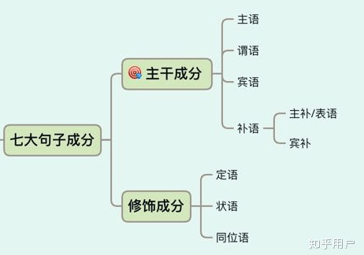

# 英语语法
> 参考：[如何较为轻松地搞定英语语法？ - 知乎](https://www.zhihu.com/question/20981568)

## 学习语法目的
学习语法主要目的是:
- 输入：看懂、听懂
- 输出：会说、会写

总结一个字，就是：**用**，首先明确目的，就是会使用，而不是成为语法学家。学习语法，从 **句子的主干** 开始

## 句子 = 树干 + 枝叶
**英语句子呈树状排列**，如果主谓宾补是 `树干`，主谓就是 `树干中的树干`，点缀在树干上的 `枝叶`就是起修饰作用的三类修饰语：定语、状语、同位语

一棵树一定要有枝叶吗？冬天树木为了保命，脱掉枝叶，照样可以存活；不过有了枝叶，却可以让树变得生机勃勃。初学语法时，可以把旁支杂叶统统去掉。如果给你任何一个句子，你都能找到主干，你就能看懂80%的文章了。

举个例子：2017年4级真题

> In the last year alone, despite an increase in the UK population and a subsequent rise in the number of households, sales of toilet paper fell by 2%, with the average household reducing their toilet roll spending from 43 pounds in 2014 to 41 pounds in 2015. 

主干只有两个单词：Sales fell

**一个句子 = 主干 + 修饰成分**。怎么从一堆单词、从句中找到句子的主干呢？需要先掌握以下内容：
- 词法 (9大词类 + 非谓语动词)
- 句法
  - 7大句子成分
  - 5大基础句型
  - 3种句子层次
  - 6大从句

## 词类
考研作文里的一个例子：
> We can achieve our goals being confidence. 我们能够实现我们的目标通过信息

confidence是名词, 错误，confident形容词、be confident，be动词+形容词表示出于某种状态

I'm confident 我很自信。而不是 I'm confidence. 我是自信。

### content words(实词)
1. 能够单独充当句法成分；
2. 有实在的词汇意义何语法意义。

实词 | 英文名词 | 例子 | 英文
--- | --- | --- | --- 
**名词** | Noun | 大象 | elephant  
**代词** | Pronoun | 你 | you
数词 | Numeral | 七 | Seven
**动词** | Verb | 学习 | study
**形容词** | Adjective | 好玩的 | interesting
**副词** | Adverb | 高效的 | efficiently

### function words(虚词)
1. 不能单独充当句法成分
2. 没有完整的词汇意义
3. 有语法意义

词类 | 英文名称 | 例子
--- | --- | ---
**冠词** | Article | a/an 一个，the 这个
**介词** | Preposition | on 在...上面 from 等
**连词** | Conjunction | if 如果 although 虽然
**助动词** | Auxiliary Verbs | Can 可能 may must 
感叹词 | Interjection | ah 啊
... | ... | ...

**其中有9类最为重要，表格中的粗体部分**

## 句法
### 七大句子成分
- 句子成分跟拆主干密切相关
- 掌握句子成分，才能真正理解从句

#### 主干成分（4种）
秉承 **先抓主要矛盾** 的思想，先掌握主干成分：**主谓宾补**，五大基础句型只包括：主谓宾补
- 主语 Subject: 谁？
  主语是一个句子的灵魂或脑袋，**你正在看书**，主语就是你

- 谓语 Predicate: 干啥？
  光有脑袋不行，还得有躯干，也就是谓语，一般是动词担当，不然怎么知道脑袋想干嘛？来看看主语+谓语的例子：

  > Liz is crying.

  is crying 就是这句话的谓语

- 宾语 Object: 补充说明谓语
  如果谓语的这个动作没说完，就需要加宾语。因为有时候，光有谓语没法把事情说完整。来看看主语+谓语+宾语的例子：

  > I am wrrting an article.

  比如，我在写作，写的究竟是什么？加个宾语：在写一篇文章 an article。有时候一个宾语不行还得再加一个宾语，来看一个主语+谓语+宾语+宾语的例子：

  > You gave me an upvote. 你给了我一个赞同

  give sb. sth. 这里的 sb. 和 sth. 都是give的宾语，俗称：**双宾结构**

- 补语 Complement：补充说明主语或宾语
  补语稍微要难一点，补语分为:
  - 主语补语(主语/表语)
    > You are my sunshine. 你是我的阳光。主语 + 谓语 + 主补/表语

    are是系动词，sunshine是跟在系动词后面，如果没有sunshine，只有you are

  - 宾语补语(宾补)
    > Your comment makes me ______. 主语 + 谓语 + 宾语 + 宾补

    看上去主谓宾都全了，有时候光有宾语，不能把一句话说完整，这里补一个 laugh 就完整了，宾补的作用就是补充说明宾语。

#### 修饰成分（3种）
根据属性，修饰成分可分为三大类：词、词组、从句
- 词
- 词组
- 从句
  - 定语从句
  - 状语从句
  - 同位语从句

定语、状语、同位语都是修饰语，都是可以去掉的，不像主谓宾补那么不可替代。

**定语 Attribute** 简单来说就是可以当 形容词 使用的成分
> sweet chestnuts 甜甜的栗子。甜甜的，就是形容词作定语

**状语 Adverbial** 状语被称为副词性结构
> You laugh happily. 副词 happily 就是状语.

**同位语 Appositive** 
> You, my sunshine, laugh happily. my sunshine指的就是you，它就是you的同位语

### 五大基础句型
五大基础句型中，都少不了 主语 + 谓语，所有的句子都基础这五款句型。

- 主谓: S+V Liz is crying.
- 主谓宾: S+V+O Liz is writing an artivle.
- 主谓宾宾: S+V+O+O You give me an upvote.
- 主谓补: S+V+C You are my sunshine.
- 主谓宾补: S+V+O+C Your comment makes me cheerful.

6级真题例子：
> The increasing differences in child rearing between rich and poor families reflect growing social inequality. 

主谓宾结构，主语：the differences; 谓语：reflect; 宾语：inequality

句子主干：The differences reflect inequality.

### 句子成分 vs 从句
句子成分不仅仅跟拆主干有关，还跟从句密切相关

从句中只有定语从句、状语从句、同位语从句属于修饰成分。其他从句(主句从句、宾语从句、表语从句)不能省略。

### 英语句子的三种主要劈叉方式
从句是什么？这里来梳理一下。句子的三种主要劈叉方式
- 简单句，上面提到的五大基础句型就是简单句。
- 并列句，两个句子通过but连接，称之为 **并列句**，并不是转则句。but和and都是连接并列句的连词。
  > I like chestnuts, but you like me.

- 复杂句，复杂句 = 主句 + 从句。
  > You tell me that you like me. 你跟我说，你喜欢我。

  宾语从句例子，me后面跟了that引导的宾语从句，you like me 就是基础句型的 S+V+O 主谓宾结构。

  也就是说，从句是个完整的句子，至少存在主语 + 谓语。反过来说，如果一个结构没有主语或者谓语，它就不是从句。

- 从句句法法则
  这本身不是一个法则，从句是句子的法则，记住这点很重要，很多同学写作时会把从句的主语或者谓语丢掉。

## 宇宙无敌超能唯一规律
英语语法中有个宇宙无敌超能规律，那就是：**一般情况下，一个句子有且只有一个谓语**

## 五大句型 + 宇宙唯一规律 + 从句句法 => 拆主干
> In the last year alone, despite an increase in the UK population and a subsequent rise in the number of households, sales of toilet paper fell by 2%, with the average household reducing their toilet roll spending from 43 pounds in 2014 to 41 pounds in 2015. 

分析：
> in the last year alone 是典型的介词短语作状语，没谓语吧？ 
> despite an increase in the UK population and a subsequent rise in the number of households，这里的 increase 和 rise 都是名词，也没谓语吧？ 
> sale of toilet paper fell by 2%, 注意！谓语出现啦，就是 fell。
> 前面是它的主语，sales of toilet paper「厕纸的销量」，of toilet paper 修饰 sale，是定语，核心主语只有 sales。 
> 后面还有谓语不？with the average household reducing their toilet roll spending from 43 pounds in 2014 to 41 pounds in 2015 报告，扫描完毕，没有发现谓语，只有现在分词 reducing 一个。Over！ 

所以句子主干是Sales fell，主语：Sales，谓语：fell

## 括号剑法
括号 + 划线 + 箭头，三个重要的工具
- (修饰语)
- 主干(此处划线)
- 只看划线部分，主干一目了然

例子：

(Towards the end of Overdressed), <u>Cline introduced her ideal</u>, (a Brooklyn woman named Sarah Kate Beaumont, who since 2008 has made all of her own clothes – and beautifully).  

句子主干：Cline introduced her ideal