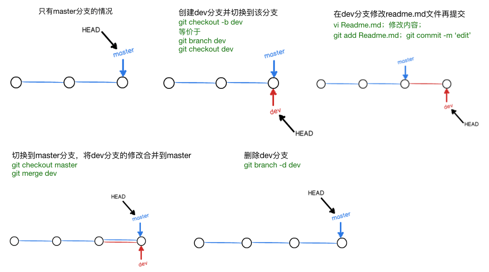
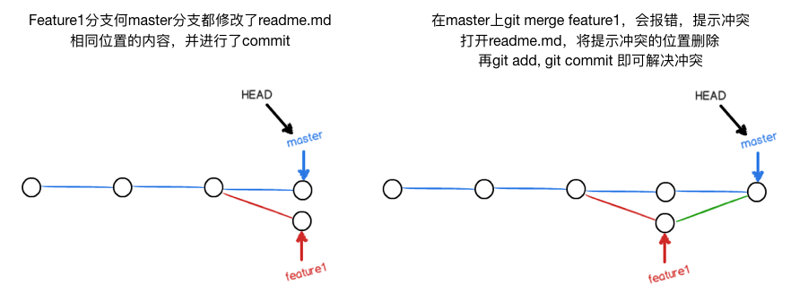
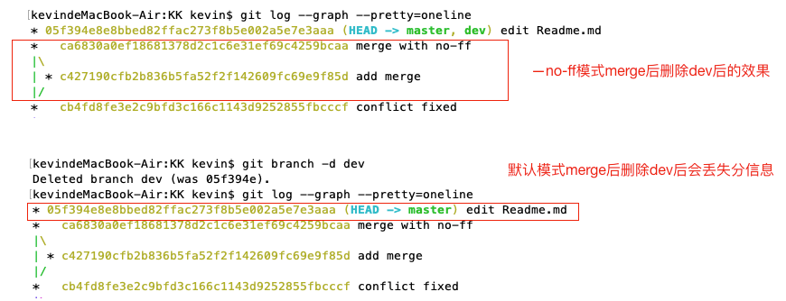
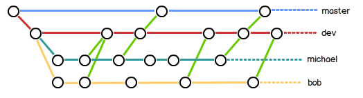
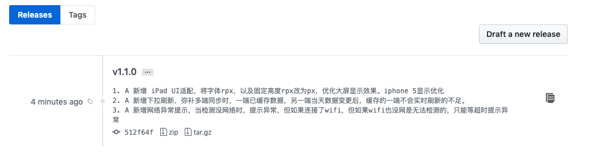

# Git笔记
> 参考：[Git教程 - 廖雪峰的官方网站](https://www.liaoxuefeng.com/wiki/896043488029600)

## 基本命令
- 初始化一个Git仓库，使用 **git init** 命令。
- 添加文件到Git仓库，分两步：
  - 使用命令 **git add \<file\>**，注意，可反复多次使用，添加多个文件；每次修改，如果不用git add到暂存区，那就不会加入到commit中。
  - 使用命令 **git commit -m \<message\>**，完成。

## git当前状态、修改
- 要随时掌握工作区的状态，使用 **git status** 命令。
- 如果git status告诉你有文件被修改过，用 **git diff** 可以查看修改内容。

## 版本回退
HEAD指向的版本就是当前版本，因此，Git允许我们在版本的历史之间穿梭，使用命令 **git reset --hard commit_id**。
- 穿梭前，用 **git log** 可以查看提交历史，以便确定要回退到哪个版本。
- 要重返未来，用 **git reflog** 查看命令历史，以便确定要回到未来的哪个版本。
- 查看简略信息 **git log --graph --pretty=oneline --abbrev-commit** , 简略信息、commit Id缩写

## 工作区和暂存区
clone下来的目录或当前工作所在的目录就是工作区，目录下.git里面存了暂存区、HEAD、修改记录等信息
- **git checkout -- file** 可以丢弃工作区的修改，恢复到上一次git add 或git commit的状态
- **git reset HEAD \<file\>** 将暂存区git add里面的内容撤销掉  HEAD 表示当前版本

场景1：当你改乱了工作区某个文件的内容，想直接丢弃工作区的修改时，用命令git checkout -- file。可以丢弃工作区的修改，恢复到上一次git add 或git commit的状态
场景2：当你不但改乱了工作区某个文件的内容，还添加到了暂存区时，想丢弃修改，分两步，第一步用命令git reset HEAD <file>，就回到了场景1，第二步按场景1操作。
场景3：已经提交了不合适的修改到版本库时，想要撤销本次提交，参考版本回退，不过前提是没有推送到远程库。

## 删除一个文件
- 撤销删除可以使用 **git checkout -- file** , 彻底删除文件除了 **rm file**  或者 rm -rf外还需要使用 **git rm** 或 git rm -rf 类似于git add的功能

命令git rm用于删除一个文件。如果一个文件已经被提交到版本库，那么你永远不用担心误删，但是要小心，你只能恢复文件到最新版本，你会丢失最近一次提交后你修改的内容。

## 远程仓库
本地git仓库和github仓库之间的传输是通过SSH加密的，所以，需要一点设置：
- 第1步：创建SSH Key。在用户主目录下，看看有没有.ssh目录，如果有，再看看这个目录下有没有id_rsa和id_rsa.pub这两个文件，如果已经有了，可直接跳到下一步。如果没有，打开Shell（Windows下打开Git Bash），创建SSH Key：
```js
ssh-keygen -t rsa -C "youremail@example.com"
/*
 你需要把邮件地址换成你自己的邮件地址，然后一路回车，使用默认值即可，由于这个Key也不是用于军事目的，所以也无需设置密码。如果一切顺利的话，可以在用户主目录里找到.ssh目录，里面有id_rsa和id_rsa.pub两个文件，这两个就是SSH Key的秘钥对，id_rsa是私钥，不能泄露出去，id_rsa.pub是公钥，可以放心地告诉任何人。
 */
```
- 第2步：登陆GitHub，打开“Account settings”，“SSH Keys”页面。然后，点“Add SSH Key”，填上任意Title，在Key文本框里粘贴id_rsa.pub文件的内容，点“Add Key”，你就应该看到已经添加的Key

## 本地仓库关联远程仓库
- 要关联一个远程库，使用命令 **git remote add origin git@server-name:path/repo-name.git**；
- 关联后，使用命令 **git push -u origin master** 第一次推送master分支的所有内容；

此后，每次本地提交后，只要有必要，就可以使用命令git push origin master推送最新修改；
分布式版本系统的最大好处之一是在本地工作完全不需要考虑远程库的存在，也就是有没有联网都可以正常工作，而SVN在没有联网的时候是拒绝干活的！当有网络的时候，再把本地提交推送一下就完成了同步，真是太方便了！

## 从远程库克隆
要克隆一个仓库，首先必须知道仓库的地址，然后使用 **git clone** 命令克隆。Git支持多种协议，包括https，但通过ssh支持的原生git协议速度最快。

## 创建并合并分支

Git鼓励大量使用分支：
- 查看分支：**git branch**
- 创建分支：**git branch \<name\>**
- 切换分支：**git checkout \<name\>**
- 创建+切换分支：**git checkout -b \<name\>**
- 合并某分支到当前分支：**git merge \<name\>**
- 删除分支：**git branch -d \<name\>**

## 解决冲突

- 当Git无法自动合并分支时，就必须首先解决冲突。解决冲突后，再提交，合并完成。
- 解决冲突就是把Git合并失败的文件手动编辑为我们希望的内容，再提交。
- 用git log --graph命令可以看到分支合并图。如果terminal显示空间不够，按回车会继续显示，要退出类似于vim的退出（q）
- **git log --graph --pretty=oneline --abbrev-commit** 查看

## 分支管理策略
合并分支时，加上 **--no-ff** 参数就可以用普通模式合并，合并后的历史有分支，能看出来曾经做过合并，而fast forward合并就看不出来曾经做过合并。
```js
git merge --no-ff -m "merge with no-ff" dev
```


在实际开发中，我们应该按照几个基本原则进行分支管理：
- 首先，master分支应该是非常稳定的，也就是仅用来发布新版本，平时不能在上面干活；
- 那在哪干活呢？干活都在dev分支上，也就是说，dev分支是不稳定的，到某个时候，比如1.0版本发布时，再把dev分支合并到master上，在master分支发布1.0版本；
- 你和你的小伙伴们每个人都在dev分支上干活，每个人都有自己的分支，时不时地往dev分支上合并就可以了。

所以，团队合作的分支看起来就像这样：




## bug分支
修复bug时，我们会通过创建新的bug分支进行修复，然后合并，最后删除；
- 当手头工作没有完成时，先把工作现场 **git stash** 一下，然后去修复bug，修复后，再 **git stash pop** ，回到工作现场；
- 在master分支上修复的bug，想要合并到当前dev分支，可以用**git cherry-pick \<commit\>**命令，把bug提交的修改“复制”到当前分支，避免重复劳动。

## featrue分支
开发一个新feature，最好新建一个分支；
如果要丢弃一个没有被合并过的分支，可以通过**git branch -D \<name\>**强行删除。

## 多人协作
多人协作的工作模式通常是这样：
- 1.首先，可以试图用 **git push origin \<branch-name\>** 推送自己的修改；
- 2.如果推送失败，则因为远程分支比你的本地更新，需要先用 **git pull** 试图合并；
- 3.如果合并有冲突，则解决冲突，并在本地提交；
- 4.没有冲突或者解决掉冲突后，再用**git push origin \<branch-name\>**推送就能成功！

如果git pull提示no tracking information，则说明本地分支和远程分支的链接关系没有创建，用命令
```js
git branch --set-upstream-to <branch-name> origin/<branch-name>
```
这就是多人协作的工作模式，一旦熟悉了，就非常简单。

多人协作相关:
* 查看远程库信息，使用 **git remote -v**；
* 本地新建的分支如果不推送到远程，对其他人就是不可见的；
* 从本地推送分支，使用**git push origin branch-name**，如果推送失败，先用**git pull**抓取远程的新提交；
* 在本地创建和远程分支对应的分支，使用**git checkout -b branch-name origin/branch-name**，本地和远程分支的名称最好一致；
* 建立本地分支和远程分支的关联，使用**git branch --set-upstream branch-name origin/branch-name**；
* 从远程抓取分支，使用git pull，如果有冲突，要先处理冲突。

## rebase 变基
- rebase操作可以把本地未push的分叉提交历史整理成直线；
- rebase的目的是使得我们在查看历史提交的变化时更容易，因为分叉的提交需要三方对比。


## 创建标签 tag
* 命令 **git tag \<tagname\>** 用于新建一个标签，默认为HEAD，也可以指定一个commit id；
* 命令 **git tag -a \<tagname\> -m "blablabla...0"** 可以指定标签信息；
* 命令 **git tag** 可以查看所有标签。
```js
/*
$ git tag v1.0 // 当前commit位置 打一个tag 名字为v1.0
$ git tag // 查看所有标签
$ git show v1.0 可以查看具体的信息
$ git log --pretty=oneline --abbrev-commit  // 查看历史git信息，缩略的commitid  
*/
```  

## 操作标签 tag
* 命令**git push origin \<tagname\>**可以推送一个本地标签；
* 命令**git push origin --tags**可以推送全部未推送过的本地标签；
* 命令**git tag -d \<tagname\>**可以删除一个本地标签；
* 命令**git push origin :refs/tags/\<tagname\>**可以删除一个远程标签。
* 默认tag注释为提交的注释，-a -m 可以自定义注释，-m 单引号，逐行输入，可以有多行效果，如下
```js
/*
kevindeMacBook-Air:foodDiary kevin$ git tag -a v1.1.0 -m '
> 1. A 新增 iPad UI适配，将字体rpx，以及固定高度rpx改为px，优化大屏显示效果。iphone 5显示优化
> 2. A 新增下拉刷新，弥补多端同步时，一端已缓存数据，另一端当天数据变更后，缓存的一端不会实时刷新的不足。
> 3. A 新增网络异常提示，当检测没网络时，提示异常，但如果连接了wifi，但如果wifi也没网是无法检测的，只能等超时提示异常
> '
kevindeMacBook-Air:foodDiary kevin$ git show v1.1.0
tag v1.1.0
Tagger: guoqzuo <guoqzuo@gmail.com>
Date:   Wed Aug 21 15:17:08 2019 +0800

1. A 新增 iPad UI适配，将字体rpx，以及固定高度rpx改为px，优化大屏显示效果。iphone 5显示优化
2. A 新增下拉刷新，弥补多端同步时，一端已缓存数据，另一端当天数据变更后，缓存的一端不会实时刷新的不足。
3. A 新增网络异常提示，当检测没网络时，提示异常，但如果连接了wifi，但如果wifi也没网是无法检测的，只能等超时提示异常

commit 512f64fb07f626dd48362bd6e22fb3c9bf188d1d (HEAD -> master, tag: v1.1.0, origin/master, origin/HEAD)
Author: guoqzuo <guoqzuo@gmail.com>
Date:   Mon Aug 19 20:50:39 2019 +0800
*/
```



## 忽略特殊文件
* 忽略某些文件时，需要编写**.gitignore**；
* .gitignore文件本身要放到版本库里，并且可以对.gitignore做版本管理！

```js
/*
kevindeMacBook-Air:KK kevin$ cat .gitignore

dist
  
# myconfig
db.ini
kevindeMacBook-Air:KK kevin$ mkdir dist
kevindeMacBook-Air:KK kevin$ git add dist
The following paths are ignored by one of your .gitignore files:
dist
Use -f if you really want to add them.
*/
```


## 配置别名
如果敲git st就表示git status那就简单多了，当然这种偷懒的办法我们是极力赞成的。
我们只需要敲一行命令，告诉Git，以后st就表示status：会将修改保存到~/.gitconfig里

```js
/*
$ git config --global alias.st status
$ git config --global alias.co checkout
$ git config --global alias.ci commit
$ git config --global alias.br branch
*/
```