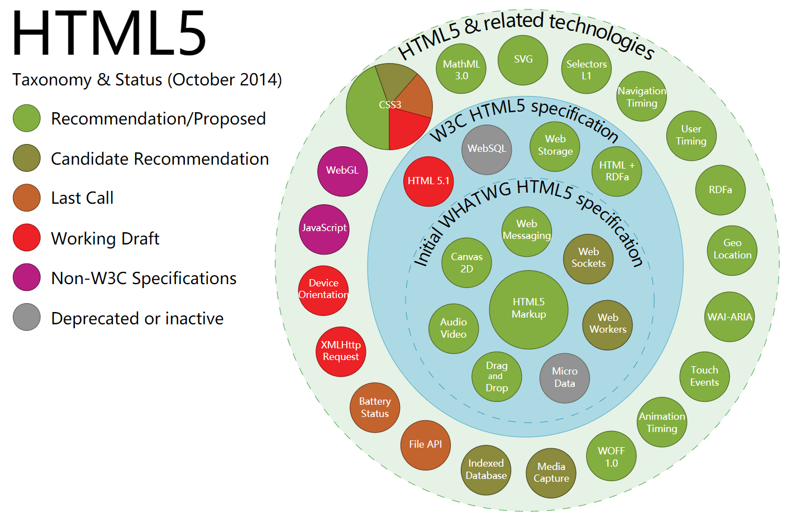
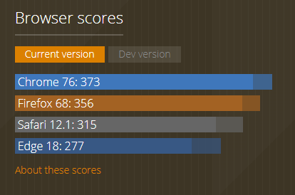

# HTML5背景知识
> HTML（Hypertext Markup Language）超文本标记语言

## 1.HTML简介
HTML是一门标记语言，而非编程语言。用于标记网页（文档）内容。比如用img元素标记图片，用p表示段落等，它描述了一个网站的结构。Web浏览器可以读取HTML文件，并将其渲染成可视化网页。

- HTML诞生于20世纪90年代初，HTML的首个公开描述出现于一个名为“HTML标签”的文件中，由蒂姆·伯纳斯-李(Tim Berners-Lee)于1991年底提及。
- 1993年中期**互联网工程任务组**（IETF）发布首个HTML规范的提案：“**超文本标记语言（HTML）**”互联网草案，由伯纳斯-李与丹·康纳利撰写。
- 1995年，IETF创建一个HTML工作组，并在年完成"**HTML 2.0**"，这是第一个旨在成为对其后续实现标准的依据的HTML规范。
- 在IETF的主持下，HTML标准的进一步发展因竞争利益而遭受停滞，IETF于1996年9月12日关闭它的HTML工作组。
- 自1996年起，HTML规范一直由**万维网联盟**（W3C: World Wide Web Consortium）维护，并由商业软件厂商出资。
- HTML 3.2作为W3C推荐标准发布。这是首个完全由W3C开发并标准化的版本。
- 1997年12月18日 HTML 4.0作为W3C推荐标准发布。它提供三种变化：严格，过时的元素被禁止。过渡，过时的元素被允许。框架集，大多只与框架相关的元素被允许
- 2004年，**网页超文本应用技术工作小组**（WHATWG）开始开发HTML5，并在2008年与W3C共同交付，2014年10月28日完成标准化。
- 2008年1月HTML5由W3C作为工作草案（链接）发布。
- 2014年10月28日，HTML 5作为W3C推荐标准发布。

相关文档：
- 更多历史细节信息，参见 [维基百科 HTML](https://zh.wikipedia.org/wiki/HTML)
- [W3C vs. WhatWG HTML5 标准 - 差异记录](https://segmentfault.com/a/1190000007107946)
- [W3C.org](https://www.w3.org/), [w3c github](World Wide Web Consortium)
- [whatwg.org](https://whatwg.org/), [whatwg github](https://github.com/whatwg)

HTML一般不会单独使用
- 它可以嵌入JavaScript的脚本语言，来影响HTML网页的行为(点击事件，表单提交事件等)。
- 也可以引用层叠样式表（CSS）来定义文本和其它元素的外观与布局。维护HTML和CSS标准的组织万维网联盟（W3C）鼓励人们使用CSS替代一些用于表现的HTML元素（如font、bold等）

## 2.HTML5简介
> HTML5是HTML最新的修订版本，广义论及HTML5时，实际指的是包括HTML、CSS和JavaScript在内的一套技术组合。

- HTML5提供了一些新的元素和属性，如\<nav\>（网站导航块）和\<footer\>。这种标签将有利于搜索引擎的索引整理、小屏幕设备和视障人士使用。
- 同时为其他浏览要素提供了新的功能，通过一个标准接口，如\<audio\>和\<video\>标记。
- 一些过时的HTML 4.01标记将取消，其中包括纯粹用作显示效果的标记，如\<font\>和\<center\>，因为它们已经被CSS取代。还有一些透过DOM的网络行为。

除了原先的DOM接口，HTML5增加了更多样化的应用程序接口（API）：
- Canvas
- 定时媒体播放
- 离线
- 可编辑内容
- 拖放
- 历史
- MIME和协议进程时表头登记
- 微数据
- 网络消息
- 网络存储
以上技术尽管是WHATWG HTML说明文档的内容，但并没有全部包括在W3C HTML5的说明文档里。一些相关的技术，像下面所列的，并没有包括在这2份文档中的任何一份中。W3C给这些技术单独出版了说明文档。
- 地理位置
- 网页SQL数据库 - 本地SQL数据库（不再维护）
- IndexedDB
- 文件 - 处理文件上传和操纵文件
- 目录和文件系统 - 这个API是为了满足客户端在没有好的数据库支持情况下存储要求
- 文件写入 - 从网络应用程序向文件里写内容
- 网络音频
- ClassList
- 网络加密
- WebRTC

## 3.兼容性问题
IE9+支持HTML5元素标签。具体兼容性可查看：https://www.caniuse.com/

The caniuse browser scores are tallies of all features tracked on caniuse (excluding those marked as "unofficial"). The fully opaque part represents supported features, the semi-transparent part represents partial support.

Note that while caniuse tracks a wide variety of features, it only covers a subset of all web technologies so the scores are not 100% representative of any browser's capabilities.
