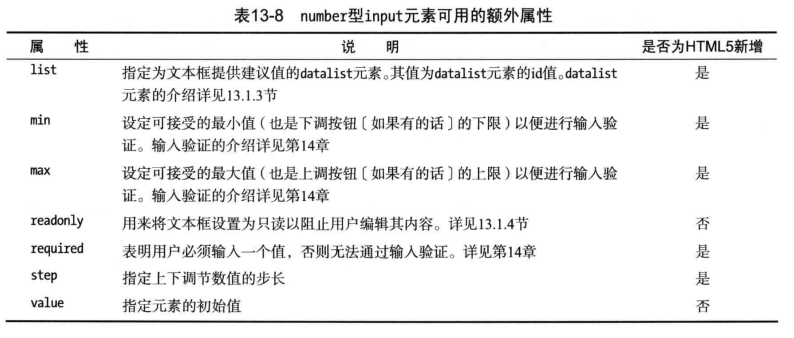

# 定制input元素


## size和maxlength属性
- input的size属性，可以设置输入框的宽度。默认为20，也可以通过css的width属性，设置input宽度。
- maxlength可以设置输入的字符长度限制。比如maxlength=6, 可以输入6的汉字，超过6个就不会显示。
```html
<form>
  <p>
    <label for="ex1">
      Ex1（默认情况）: <input id="ex1" name="ex1" />
    </label>
  </p>
  <p>
    <label for="ex2">
      Ex2（maxlength=6）: <input id="ex2" name="ex2" maxlength="6" />
    </label>
  </p>
  <p>
    <label for="ex3">
      Name（size=80,maxlength=6）: <input id="ex3" name="ex3" size="50" maxlength="6" />
    </label>
  </p>
  <button type="submit">提交</button>
</form>
```


## value和placeholder属性
- value 设置输入框的默认值，focus该输入框，会在默认值的后面输入
- placeholder 设置输入提示，focus该输入框，输入内容依然是空的，输入内容不为空，就会看到对应的提示。
```html
<form>
  <p>
    <label for="ex1">
      Ex1（placeholder）: <input id="ex1" name="ex1" placeholder="ex1"/>
    </label>
  </p>
  <p>
    <label for="ex2">
      Ex2（value）: <input id="ex2" name="ex2" value="ex2" />
    </label>
  </p>
  <button type="submit">提交</button>
</form>
```


## list属性及datalist元素(HTML5新增)
可以将input元素的list属性设置为一个datalist元素的id属性值，类似于select的样式，输入内容后，可以过滤list内容。各个浏览器显示的效果不一，搜索的内容与value和label的值都有关，但建议搜索内容以value的内容为主。
```html
<body>
  <form>
    <p>
      <label for="ex1">
        Ex1: <input id="ex1" name="ex1" list="fruitlist"/>
      </label>
    </p>
    <button type="submit">提交</button>
  </form>
  <datalist id="fruitlist">
    <option value="Apple_value" label="苹果_label"></option>
    <option value="Oranges_value">橘子_option中间值</option>
    <option value="草莓_仅value" />
  </datalist>
</body>
```


## readonly和disabled属性
- readonly 设置input为只读，不能编辑内容，submit会携带对应的数据
- disabled 设置input为disabled，不能编辑内容，内容不会submit。
```html
<form>
  <p>
    <label for="ex1">
      Ex1（readonly）: <input id="ex1" name="ex1" readonly value="readonly"/>
    </label>
  </p>
  <p>
    <label for="ex2">
      Ex2（disabled）: <input id="ex2" name="ex2" disabled value="disabled"/>
    </label>
  </p>
  <button type="submit">提交</button>
</form>
```


## dirname属性
dirname属性设置后，表单submit时会额外增加一个键值对，key为dirname属性设置的值，value为当前input的dir属性值，默认为ltr
```html
<form>
  <p>
    <label for="ex1">
      Ex1（默认情况）: <input id="ex1" name="ex1" dirname="ex1_ctl" dir="rtl"/>
    </label>
  </p>
  <button type="submit">提交</button>
</form>
```


## passrod(隐藏输入字符)
input type为password可以隐藏输入的值，但提交时还是明文，建议使用post方式提交敏感数据，并使用https
```html
密码：<input type="password" name="pw">
```

## 用input生成button
input元素的type设置为submit, reset, button会生成button，可以用来提交表单、reset表单，生成普通button
```html
<form>
  <p>
    <label for="ex1">
      Ex1（默认情况）: <input id="ex1" name="ex1" placeholder="ex1_placeholer"/>
    </label>
  </p>
  <input type="submit" value="input_submit_button"/>
  <input type="reset" value="input_reset_button"/>
  <input type="button" value="普通input_button"/>
</form>
```


## input元素为输入数据把关
大部分是HTML5新增，用于输入受限制数据的input元素的type属性值：


### number(限制内容为数值)
type为number时，只能输入数值，额外会多出一些属性：


- min、max一方面可以在submit时做验证，另一方面可以控制step选择时限制值。
- step属性可以设置每次点击向上或向下调整的数值, 默认为1
- step、min、max、value都可以设置为小数，注意step为精度，如果step为1，那值就不能为小数。精确到一位step为0.1，精确到小数点两位，可以设置为0.01
```html
 Ex1(默认): <input id="ex1" name="ex1" type="number" min="2" max="80" step="0.1"/>
```
### range(限制内容为一个数字范围)
value默认值为(max - min) / 2, 和number一样，可以为小数
```html
 Ex2(默认): <input id="ex1" name="range" type="range" min="20" max="50" step="5" />
```
### checkbox(限制只能选择是或否)
- 默认为不选中，但可以通过checked属性将checkbox设置为已选中。
- value默认值为on，如果设置了就用设置的value属性的值。
- **注意如果checkbox没选中，submit时是不会将数据提交到后台的**，可以使用required属性，要求必须输入
```html
<input id="ex1" name="isTure" type="checkbox" value="false"/>
```

### radio(限制用户只能选一个)
name属性要一致，才能单选。另外如果不设置额外的label用来显示对应的选项，是无法分辩内容的。
```html
 <fieldset>
  <legend>喜欢的水果</legend>
  <label>
    <input name="food" type="radio" value="苹果"/>苹果
  </label>
  <label>
    <input name="food" type="radio" value="橘子"/>橘子
  </label>
  <label>
    <input name="food" type="radio" value="香蕉"/>香蕉
  </label>
</fieldset>
```

### email、tel、url
样式和普通的输入框没什么区别，但如果submit时，会校验对应的数据格式。chrome里，tel不会校验，url会校验，必须以http://或https开头

```html
<p>
  <input type="email" name="email" placeholder="输入mail">
</p>
<p>
  <input type="tel" name="tel" placeholder="输入tel">
</p>
<p>
  <input type="url" name="url" placeholder="输入url">
</p>
<button type="submit">提交</button>
```

### datetime、date、month、time、week、datetime-local
注意：chrome里datetime和普通input没区别。


```html
<p>
  datetime:
  <input type="datetime" name="datetime" />
</p>
<p>
  datetime-local:
  <input type="datetime-local" name="datetime-local" /> <!-- "2019-09-12T01:00" -->
</p>
<p>
  date:
  <input type="date" name="date" /> <!-- "2019-09-12" -->
</p>
<p>
  month:
  <input type="month" name="month" /> <!-- "2019-09" -->
</p>
<p>
  time:
  <input type="time" name="time" /> <!-- "21:59" -->
</p>
<p>
  week:
  <input type="week" name="week" /> <!-- "2019-W44" -->
</p>
<button type="submit">提交</button>
```


### color(颜色)
获取颜色，默认值为"#000000"
```html
<p>
  color:
  <input type="color" name="color" /> <!-- "#0000a0" -->
</p>
```

### search
search在不输入内容时，样式和普通的文本输入框一致。输入内容后，会多出一个x，点击后可以删掉输入框内容
```
<p>
  search:
  <input type="search" name="search" /> <!-- "#0000a0" -->
</p>
```

### hidden
type为hidden时和input的disabled属性特性正好相反。input用户会不可见，但submit到表单时会提交hidden ipput的数据。
```html
<p>
  hidden:
  <input type="hidden" name="hidden" value="hidden的值"/> 
</p>
```

### image
生成一个图片，点击图片会触发表单的submit。(如果图片加载不成功，alt默认为提交)
```
<p>
  <input type="image" name="submit" src="avatar.png">
</p>
```

### file


[常见 MIME 类型列表](https://developer.mozilla.org/zh-CN/docs/Web/HTTP/Basics_of_HTTP/MIME_types/Complete_list_of_MIME_types)

注意：这里form表单默认提交会访问新的action url，服务器返回的数据会覆盖原先的页面，这就是为什么需要ajax的原因。可以在不刷新页面的情况下，直接发起请求，返回的数据也不会默认覆盖原先的页面。
```html
<form enctype="multipart/form-data">

  <input type="file" name="file"/>

  <!-- 可以选择多个文件 -->
  <input type="file" name="files" multiple/>

  <!-- 限制只允许选择png图片 -->
  <input type="file" name="file_img" accept="image/png" />

  <input type="submit" value="submit">
</form>
```
