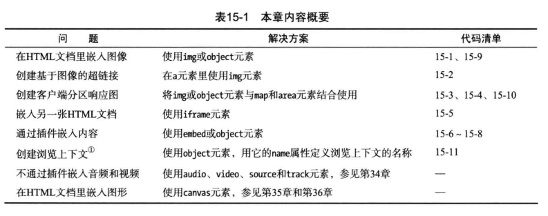
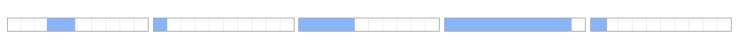
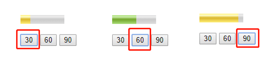

# 嵌入内容



## img (嵌入图像)
img元素可以用来嵌入图像
- 局部属性：src，alt，height，width，usemap，ismap
- 虚元素形式
- alt属性用来指定图像加载失败时，显示的文字内容。
- 如果不指定width和height，默认为图片本身大小，如果只设置了一个width或height，会按比例缩放。如果指定了width和height，而图片过小默认会拉伸。

```html

```
### 在超链接里嵌入图像
点击图片进入一个链接
```html
<a href="http://zuo11.com" target="_blank">
  
</a>
```
#### 使用img的ismap属性
```html
<!-- 如果加了ismap属性，进入的链接会携带img的点击位置， http://zuo11.com/?29,15 -->
<a href="http://zuo11.com" target="_blank">
  
</a>

<script>
// window.location.href.split('?')[1].split(',')
// ["29", "15"]  x, y 坐标
</script>
```
### usemap属性与map，area元素
点击图片的不同区域进入不同的页面
- map元素
  - 局部属性：name
  - 如果使用了id属性，他的值必须与name属性相同
  - 子元素为一个或多个area元素
- area元素（代表了图片上可被点击的一个区域）
  - 局部属性：alt()，href(点击该区域进入的链接)，target()，rel，media，hreflang，type，shape，coords
  - 习惯样式 area { display:none; }
  - shape可以是矩形rect, 圆形circle, poly多边型。
  - coords坐标，如果是rect矩形，coords="start_x, start_y，end_x, end_y"
```html


<map name="mymap">
  <area href="http://baidu.com" shape="rect" coords="0,0,150,500" />
  <area href="http://map.baidu.com" shape="rect" coords="150,0,300,500" />
  <area href="http://zuo11.com" shape="default" />
</map>
```
## iframe (嵌入另一张HTML文档)
局部属性：src，srcdoc，name(a的target可以指向该iframe)，width, height, sandbox, seamless

- sandbox会禁用脚本，表单等。详情见p314

```html
<body>
  <p>
    <a href="http://baidu.com" target="myframe">切换iframe1的链接为baidu.com</a>
  </p>
  <iframe name="myframe" src="img.html" height="500" width="800"></iframe>
</body> 
```
## 通过插件嵌入内容
### 使用embed元素
embed可以用来嵌入flash
### 使用object和param元素
object和param也可以用来替代embed嵌入flash视频

## object元素其他用途
- 嵌入图像
```html
<object data="avatar.png" type="image/png"></object>
```
- 创建分区响应图，结合usemap(Chrome暂未支持)

## 嵌入数字表现形式
### process元素(显示进度)
- 局部属性：value，max，form
- value为当前进度值，位于0到max之前，如果不指定max，max默认为1
```html
<p>
  <progress></progress>
  <progress value="0.1"></progress> 
  <progress value="0.4"></progress>
  <progress value="0.9"></progress>   
  <progress value="12" max="100"></progress>    
</p>
```


### meter元素(显示范围里的值)
```html
  <body>
    <p>
      <meter></meter>
      <meter id="mymeter" value="90" min="10" max="100" low="40" high="80" optimum="60"></meter>
    </p>

    <p>
      <button type="button" value="30">30</button>
      <button type="button" value="30">60</button>
      <button type="button" value="30">90</button>
    </p>

    <script>

      var mymeter = document.getElementById('mymeter'),
          btns = document.getElementsByTagName('button'),
          i,
          len;
      
      console.log(btns)

      for ( i = 0, len = btns.length; i < len; i++ ) {
        btns[i].onclick = function (e) {
          console.log(e);
          mymeter.setAttribute('value', e.target.innerHTML);
        }
      }
      
    </script>
  </body> 
```


## 其他嵌入元素
### 嵌入音视频
audio、video

### canvas嵌入图形
canvas 参见js部分