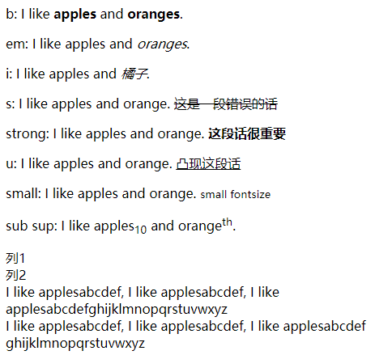
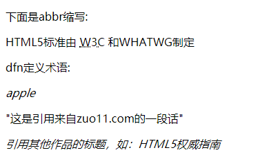
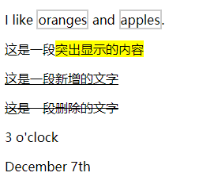

# 标记文字


## a(生成超链接)
- 局部属性: href, target, rel, media, type(资源类型MIME类型，如text/html)
- 默认样式：
```css
a {
  color: blue;
  text-decoration: underline;
}
```
相关示例
```html
<!DOCTYPE html>
<html>
  <head>
    <meta charset="utf-8">
    <title>a元素</title>
    <style>
      section { border: 1px solid #ccc; height:1200px}
      #sec1 { background: gray}
      #sec2 { background: green}
      section[name='sec3'] {background: greenyellow}
      .del {
        text-decoration: line-through;
      }
    </style>
  </head>
  <body>
    <a href="http://zuo11.com">指向外部的元素，注意要以协议开头，如http://zuo11.com</a>
    <p/>
    <a href="1.html">指向相对路径，跳转到1.html</a>
    <p/>
    <a href="#sec2">滚动到id为sec2的区域，<span class="del">如果没有该id，滚动到name属性为sec2的位置</span></a>
    <p/>
    <a href="#sec3">滚动到id为sec3的区域，浏览器貌似都不支持查找name属性。</a>
    <p/>
    <a href="2.html" target="_blank">打开一个新的窗口显示, target=_blank</a>
    <p/>

    <section id="sec1">
        <p>section1</p>
    </section>
    <section id="sec2">
        <p>section2</p>
    </section>
    <section name="sec3">
        <p>section3</p>
    </section>
  </body>
</html>
```
## 基本的文字元素
### b (表示关键词或产品名称)
### em (加以强调)
### i (外文词语或科技术语)
### s (表示不准确或矫正)
### strong （表示重要的文字）
### u (下划线让文字凸现)
### small (小号字体免责澄清声明)
### sub sup (上标和下标)
### br wbr (强制或建议换行)
```html
 <body>
    <!-- b  习惯样式{ font-weight:bolder }-->
    <p>b: I like <b>apples</b> and <b>oranges</b>.</p>

    <!-- em  习惯样式 { font-style:italic}-->
    <p>em: I like apples and <em>oranges</em>.</p>

    <!-- i 习惯样式 { font-style:italic}-->
    <p>i: I like apples and <i>橘子</i>.</p>

    <!-- s 习惯样式 { text-decoration: line-through } -->
    <p>s: I like apples and orange. <s>这是一段错误的话</s></p>

    <!-- strong 习惯样式 { font-weight:bolder } -->
    <p>strong: I like apples and orange. <strong>这段话很重要</strong></p>

    <!-- u 习惯样式 { text-decoration: underline } -->
    <p>u: I like apples and orange. <u>凸现这段话</u></p>

    <!-- small 习惯样式 { font-size: small} -->
    <p>small: I like apples and orange. <small>small fontsize </small></p>

    <!-- 
      sub: { vertical-align: sub; font-size: small }
      sup: { vertical-align: sup; font-size: small }
    -->
    <p>sub sup: I like apples<sub>10</sub> and orange<sup>th</sup>.</p>

    列1<br>
    列2<br>

    <!-- 缩小查看显示效果-->
    I like applesabcdef, I like applesabcdef,  I like applesabcdefghijklmnopqrstuvwxyz
    <br>
    I like applesabcdef, I like applesabcdef,  I like applesabcdef<wbr>ghijklmnopq<wbr>rstuvwxyz

  </body>
```


## 表示输入和输出
### code (计算机代码)
code { font-family: monospace; }
### var (表示变量)
var { font-style: italic }
### samp (表示程序输出)
samp { font-family: monospace; }
### kbd (表示用户输入)
kbd { font-family: monospace; }
```html
<body>
    <p>
      <code>
        var fruits = ["apples", "oranges", "mangoes", "cherries"];<br>
        document.writeln("I like " + fruits.length + " fruits");
      </code>
    </p>
    <p>The variable is <var>fruits</var></p>
    <p>The output is: <samp>I like 4 fruits</samp></p>
    <p>When prompted for my favorite fruit, I typed: <kbd>apples</kbd></p>
  </body>
```


## 标题引用、引文、定义、缩写
### abbr (表示缩写)
需要配合title属性
### dfn (定义术语)
需要配合title属性
### q （引入其他位置的内容）
需要配合cite属性，默认样式 
```css
q { display: inline;} 
q:before { content: open-quote; } 
q:after { content: close-quote; }
```
### cite (引用标题)
```html
<body>
    <p>下面是abbr缩写: </p>
    <p>HTML5标准由 <abbr title="World Wide Web Consortium">W3C</abbr> 和WHATWG制定</p>

    <p>dfn定义术语: </p>
    <p><dfn title="apple">apple</dfn></p>

    <q cite="http://zuo11.com">这是引用来自zuo11.com的一段话</q>

    <p><cite>引用其他作品的标题，如：HTML5权威指南</cite></p>
  </body>
```


## 使用语言元素
### ruby、rt和rp（汉字音标）
ruby character 注音符号 , ruby 默认样式 ruby {text-indent:0 }，需要配合rt、rp使用
### bdo (文字方向)
必须包含dir全局属性
### bdi（内容隔离）
```html
 <body>
    <p style="font-size:50px;">
      <ruby>魑<rp>(</rp><rt>chī</rt><rp>)</rp></ruby>
      <ruby>魅<rp>(</rp><rt>mèi</rt><rp>)</rp></ruby>
      <ruby>魍<rp>(</rp><rt>wǎng</rt><rp>)</rp></ruby>
      <ruby>魉<rp>(</rp><rt>liǎng</rt><rp>)</rp></ruby>
    </p>

    <p><bdo dir="ltr">I like oranges</bdo></p>
    <!-- 按字母完全逆序 -->
    <p><bdo dir="rtl">I like oranges</bdo></p>

    <!-- 显示顺序会有问题 -->
    <p>اللغة العربي
      2 apples</p>

    <!-- bdi按原意意修正显示顺序 -->
    <p><bdi>اللغة العربي</bdi>
      2 apples</p>
  </body>
```


## 其他文本元素
### span (一般内容)
通用内容，一般可以用class属性来表示一类文本元素
### mark (加背景突出显示文本)
HTML5新增，用来突出显示部分内容，默认样式 mark {background:yellow; color: black;}
### ins del (添加或删除内容)
### time (表示时间)
```html
<!DOCTYPE html>
<html>
  <head>
    <meta charset="utf-8">
    <title>其他文本元素</title>
    <style>
      .fruit { border: 2px solid #ccc;}
    </style>
  </head>
  <body>
    <p>I like <span class="fruit">oranges</span> and <span class="fruit">apples</span>.</p>

    <p>这是一段<mark>突出显示的内容</mark></p>

    <p><ins>这是一段新增的文字</ins></p>
    <p><del>这是一段删除的文字</del></p>

    <p><time datetime="15:00">3 o'clock</time></p>
    <p><time datetime="1984-12-7">December 7th</time></p>
  </body>
</html>
```
