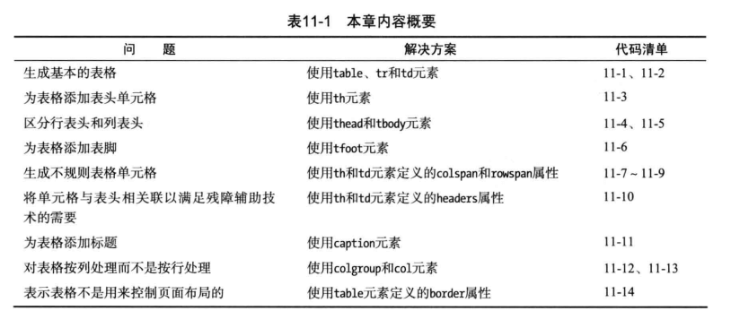
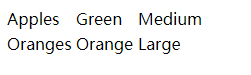
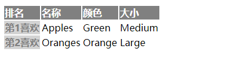
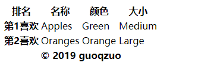
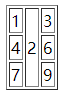
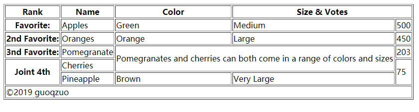
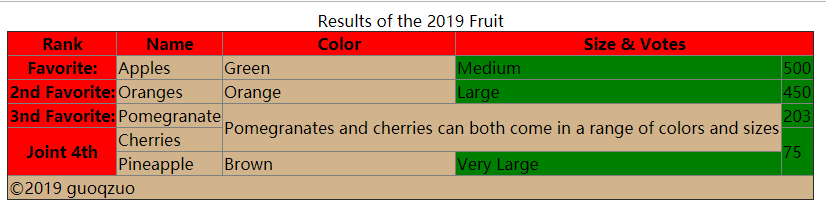
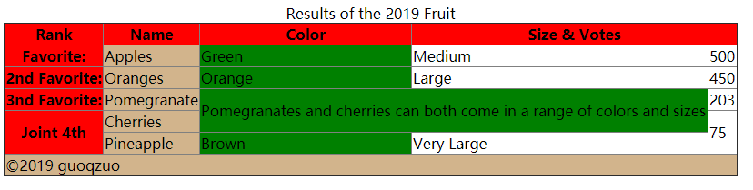
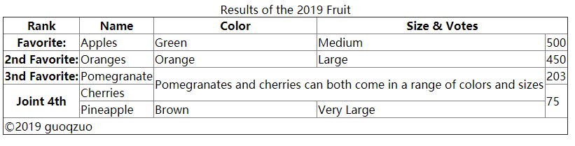

# 表格元素


## table tr td (基本表格)
每个表格都必须要有table，tr，td三个元素。
### table 表格
局部属性：border，习惯样式 
```css
table { 
  display: table;
  border-collapse: separate;
  border-spacing: 2px;
  border-color: gray;
}
```
### tr 行
默认样式
```css
tr {
  display: table-row;
  vertical-align: inherit;
  border-color: inherit;
}
```
### td 单元格
局部属性: colspan, rowspan, headers，默认样式
```css
td {
  display: table-cell;
  vertical-align: inherit;
}
```
实例
```html
<table>
  <tr>
    <td>Apples</td>
    <td>Green</td>
    <td>Medium</td>
  </tr>
  <tr>
    <td>Oranges</td>
    <td>Orange</td>
    <td>Large</td>
  </tr>
</table>
```


## th (表头单元格)
也是单元格，不过表示表头。用来区分数据和对数据说明
局部属性：colspan， rowspan， scope，headers
习惯样式：
```css
th {
  display: table-cell;
  vertical-align: inherit;
  font-weight: bold;
  text-align: center;
}
```
实例
```html
<head>
  <style>
    tr > th { text-align: left; background: gray; color: white; }
    /* :only-of-type 代表了任意一个元素，这个元素没有其他相同类型的兄弟元素。 */
    tr > th:only-of-type { text-align: right; background: lightgray; color: gray; }
  </style>
</head>
<body>
  <table>
    <tr>
      <th>排名</th>
      <th>名称</th>
      <th>颜色</th>
      <th>大小</th>
    </tr>
    <tr>
      <th>第1喜欢</th>
      <td>Apples</td>
      <td>Green</td>
      <td>Medium</td>
    </tr>
    <tr>
      <th>第2喜欢</th>
      <td>Oranges</td>
      <td>Orange</td>
      <td>Large</td>
    </tr>
  </table>
</body>
```


## thead tbody tfoot (表头主体底部)
toby表示表格主体的所有行，即使文档中没用到tbody默认也会自动插入tbody元素。
默认样式
```css
tbody, thead, tfoot {
  vertical-align: middle;
  border-color: inherit;
}
tbody { display: table-row-group; }
thead { display: table-header-group; }
tfoot { display: table-footer-group; }
```
实例
```html
<body>
  <table>
    <thead>
      <tr>
        <th>排名</th>
        <th>名称</th>
        <th>颜色</th>
        <th>大小</th>
      </tr>
    </thead>
    <tbody>
      <tr>
        <th>第1喜欢</th>
        <td>Apples</td>
        <td>Green</td>
        <td>Medium</td>
      </tr>
      <tr>
        <th>第2喜欢</th>
        <td>Oranges</td>
        <td>Orange</td>
        <td>Large</td>
      </tr>
    </tbody>
    <tfoot>
      <tr>
        <th colspan="4">&copy; 2019 guoqzuo</th>
      </tr>
    </tfoot>
  </table>
</body>
```


## colspan rowspan （合并单元格）
一般每个单元格占据网格中的一个位置。为了制作不规则的表格。有的单元格会跨越几行或几列。
th、td可以设置 colspan、rowspan属性，指定占多少行或列。值必须是整数。
```html
<!-- 注意按顺序一行一行渲染 -->
<table border="1">
  <tr>
    <td>1</td>
    <td rowspan="3">2</td>
    <td>3</td>
  </tr>
  <tr>
    <td>4</td>
    <td>6</td>
  </tr>
  <tr>
    <td>7</td>
    <td>9</td>
  </tr>
</table>
```

更复杂的例子：（注意是一行一行渲染的。一行一行写表格即可）
```html
<table border="1">
  <thead>
    <tr>
      <th>Rank</th>
      <th>Name</th>
      <th>Color</th>
      <th colspan="2">Size & Votes</th>
    </tr>
  </thead>
  <tbody>
    <tr>
      <th>Favorite:</th>
      <td>Apples</td>
      <td>Green</td>
      <td>Medium</td>
      <td>500</td>
    </tr>
    <tr>
      <th>2nd Favorite:</th>
      <td>Oranges</td>
      <td>Orange</td>
      <td>Large</td>
      <td>450</td>
    </tr>
    <tr>
      <th>3nd Favorite:</th>
      <td>Pomegranate</td>
      <td colspan="2" rowspan="2">Pomegranates and cherries can both come in a range of colors and sizes</td>
      <td>203</td>
    </tr>
    <tr>
      <th rowspan="2">Joint 4th</th>
      <td>Cherries</td>
      <td rowspan="2">75</td>
    </tr>
    <tr>
      <td>Pineapple</td>
      <td>Brown</td>
      <td>Very Large</td>
    </tr>
  </tbody>
  <tfoot>
    <tr>
      <td colspan="5">&copy;2019 guoqzuo</td>
    </tr>
  </tfoot>
</table>
```


## td和th的headers属性（无障碍访问）
待需要时再研究

## caption (表格标题)
在thead之前加入该标签，不会有边框。
```html
<caption>Results of the 2019 Fruit</caption>
```

## colgroup、col (处理列样式)
HTML中的表格是基于行的，对列应用样式有点不方便，对不规则的表格更是如此。这个问题的解决方法就是colgroup和col元素。colgroup代表一组列，包含0个或多个col元素。
```html
<style>
  table th { background: red; } /* 这里设置的th样式，不会被列样式覆盖 */
  #front3col { background: tan}  /* 前三列样式 */
  #behind2col { background:green} /* 后2列样式 */
</style>
<table>
  ...
  <colgroup id="front3col" span="3" />
  <colgroup id="behind2col" span="2" />
  ...
</table>
```


### col可以代替span属性
同样都是表示列
```html
<style>
  table th { background: red; } /* 这里设置的th样式，不会被列样式覆盖 */
  #col1And2 { background: tan}  /* 前三列样式 */
  #col3 { background:green} /* 后2列样式 */
</style>
<table>
  ...
 <colgroup>
    <col id="col1And2" span="2"/>
    <col id="col3"/>
  </colgroup>
  ...
</table>
```


## table的border属性 (表格边框)
table border属性设置为1，然后应用样式：table { border-collapse: collapse; }，边框就会合并。
