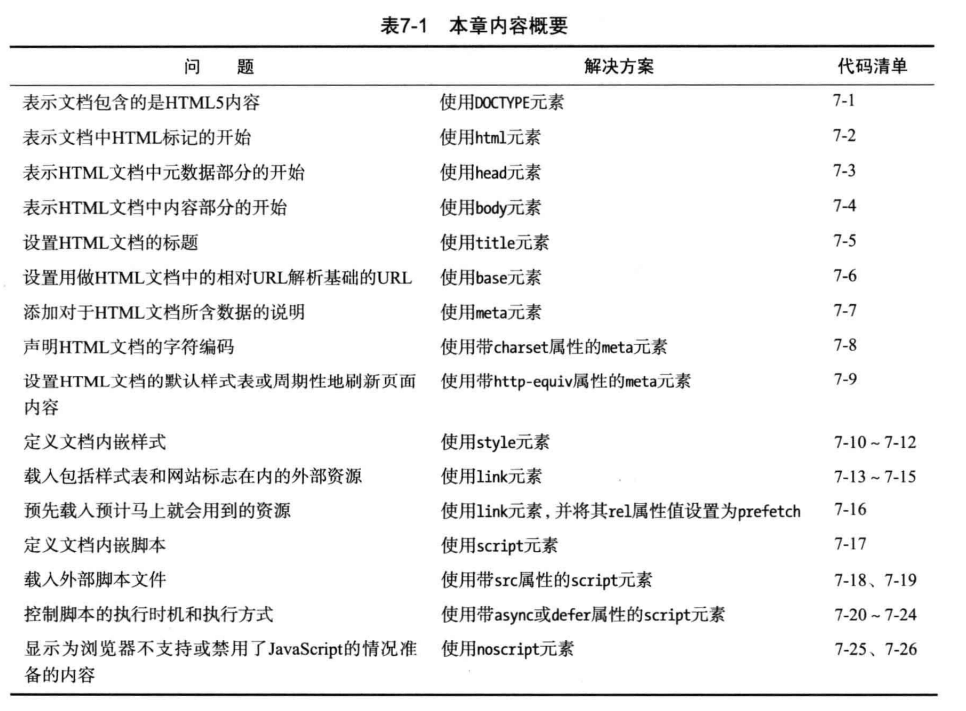
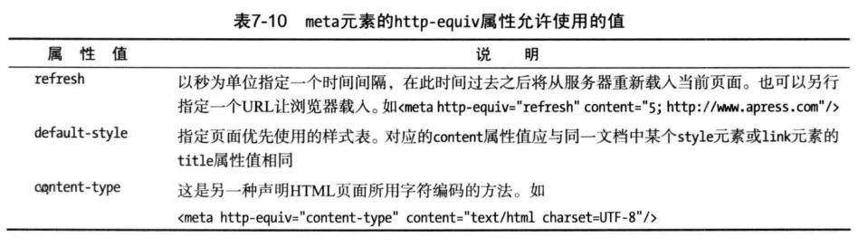

# 创建HTML文档


## body元素的默认样式
```css
body {
  margin: 8px;
}
```
## base元素(相对URL基址)
设置相对URL的解析基础地址
```html
<!DOCTYPE html>
<html>
  <head>
    <meta charset="utf-8">
    <title>base元素</title>
    <!-- 默认当前路径下，打开新窗口-->
    <!-- <base href="" target="_blank"> -->

    <!-- 基础url为 http://zuo11.com -->
    <base href="http://zuo11.com" target="_blank">
  </head>
  <body>
      <a href="1.html">访问1.html</a>
  </body>
</html>
```

## meta元素
用元数据说明文档
- 局部属性: name, content, charset, http-equiv
- 虚元素
- HTML5新增charset属性
### 指定名/值元数据对
### 声明字符编码
```html
<!DOCTYPE html>
<html>
  <head>
    <!-- 声明字符编码，防止汉字显示乱码 -->
    <meta charset="utf-8">
    <title>base元素</title>

    <!-- 文档内容说明-->
    <meta name="application name" content="meta.html">
    <meta name="author" content="guoqzuo">
    <meta name="description" content="测试 meta元素">
    <meta name="keywords" content="meta,如何使用keywords">

    <!-- 
      搜索引擎相关说明：
      noindex 表示不要索引本页；
      noarchive 表示不要将本页存档或缓存；
      nofollow 表示不要顺着本页中的链接继续搜索下去
    -->
    <meta name="robots" content="noindex">
  </head>
  <body>
      <a href="1.html">访问1.html</a>
  </body>
</html>
```

### http-equiv改写http标头字段

```html
<!-- 让浏览器每隔5s再次载入页面 -->
<meta http-equiv="refresh" content="5">

<!-- 5秒后，载入http://zuo11.com -->
<meta http-equiv="refresh" content="5;http://www.zuo11.com">
```

## style
- 父元素可以是head, div, aside, section, article等
- 局部属性: type, media, scoped
- scoped属性属于HTML5新增

### 指定样式类型type
浏览器支持的样式类型只有css一种，所以值总是text/css
```html
<style type="text/css">
</style>
```
### 指定样式范围scoped
如果没指定，HTML页面任何地方的文档，会作用于整个文档，如果有指定，那只作用于该元素的父元素和所有兄弟元素。
```html
<style type="text/css" scoped> 
</style>
```
### 指定样式适用的媒体media
media可选值如下
- all 将样式用于所有设备(默认)
- screen 显示器屏幕
- print 打印
- projection 投影仪
- tv 电视
```html
<!DOCTYPE html>
<html>
  <head>
    <meta charset="utf-8">
    <title>style media</title>
    <style media="screen">
      /* 显示样式 */
      a {
        color: red;
      }
    </style>
    <style media="print">
      /* 打印时的样式 */
      a {
        color: blue;
      }
    </style>
    <style media="screen AND (min-width:500px)">
        /* 屏幕宽度小于500时，应用该样式 */
        a {
          background: rgba(0,0,0,.1)
        }
    </style>
    <style media="screen AND (max-width:500px)">
        /* 屏幕宽度大于500时，应用该样式 */
        a {
          background: yellow;
        }
    </style>
  </head>
  <body>
      <a href="1.html">访问1.html</a>
  </body>
</html>
```

## link(指定外部资源)
- 允许的父元素：head，noscript
- 局部属性：href, rel, hreflang, media, type, sizes
- 需元素

```html
<!DOCTYPE html>
<html>
  <head>
    <meta charset="utf-8">
    <title>link相关</title>
    <!-- 1.载入样式表, 根据media属性，载入不同的样式 -->
    <link rel="stylesheet" href="test.css" media="screen AND (min-width:800px)">
    <link rel="stylesheet" href="test_mini.css" media="screen AND (max-width:800px)">

    <!-- 2.预先载入资源，在network里面可以看到, 可以要求浏览器预先获取很快就要用到的资源 -->
    <link rel="prefetch" href="http://zuo11.com">

    <!-- 3.设置tab栏的图标 type="image/x-icon"  -->
    <link rel="shortcut icon" href="favicon.ico">
  </head>
  <body>
    <p>测试link</p>
    <a href="http://zuo11.com">打开: zuo11.com</a>
  </body>
</html>
```

## script元素
载入外部样式时，可以异步加载延迟执行
- 局部属性：src，defer，async, type(如果载入js，这个属性可以省略)
- HTML5新增了async属性

普通情况、defer、async三种情况，加载区别：
- 普通情况：HTML解析，遇到script后会暂停html解析，等script下载、执行才会继续解析html
- defer：HTML解析和script下载同步执行，等html解析完后，才会执行script
- async: HTML解析和script下载同步执行，但script下载完后会立即执行，并暂时中断html解析
详情参见：[script位置与执行顺序](https://www.yuque.com/guoqzuo/js_es6/dviw4p#df2d8d6c)

## noscript时重定向页面
```html
<!DOCTYPE html>
<html>
  <head>
    <meta charset="utf-8">
    <title>link相关</title>
    <link rel="shortcut icon" href="favicon.ico">

    <!-- 如果页面禁止了js，立即跳转到1.html -->
    <noscript>
      <meta http-equiv="refresh" content="0;1.html">
    </noscript>

  </head>
  <body>
    <p>测试link</p>
    <a href="http://zuo11.com">打开: zuo11.com</a>
  </body>
</html>
```