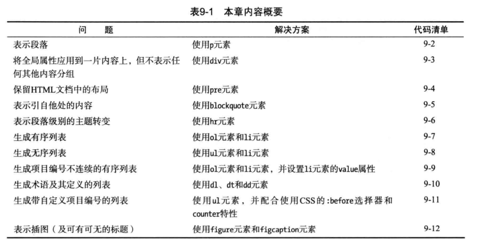
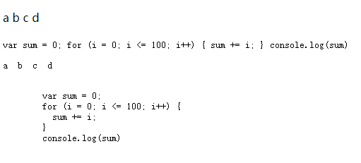
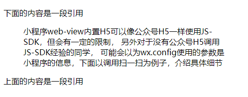
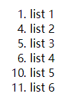
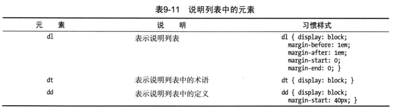
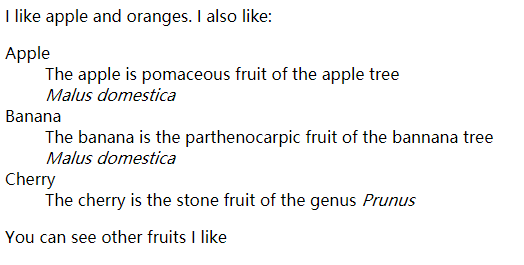
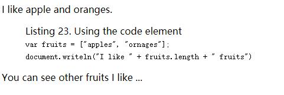

# 组织内容


## 为什么要对内容进行分组?
HTML要求浏览器将连在一起的几个空白符折算为一个空白符。如果不使用元素对内容进行分组，所有的内容都将显示在一行里。

## p (建立段落)
p 段落包含着一个或多个相关的句子。默认样式 p { display:block; margin: 1em 0;}

## div (无具体含义)
与span(默认样式：无) 类似，没有具体的含义。默认样式div { display: block}，使用原则：

- 当找不到其他恰当的元素可用时，可以考虑用这个元素。并用全局属性id或class给赋予其含义；
- 当要使用该元素时应该先考虑article, sectioin等元素；
- 不在万不得已的情况下，不要使用该元素，牢记语义问题。

## pre (保留原有格式)
如果用pre元素包裹内容，多个空格换行不会折算为一个空格，而是保留原有的格式。默认样式:
```css
pre {
  font-family: monospace;
  white-space: pre;
  margin: 1em 0;
}
```
实例
```html
<body>
  <p>a  b  c  d</p>
  <code>
    var sum = 0;
    for (i = 0; i <= 100; i++) {
      sum += i;
    }
    console.log(sum)
  </code>

  <pre><p>a  b  c  d</p></pre>
  
  <pre>
    <code>
      var sum = 0;
      for (i = 0; i <= 100; i++) {
        sum += i;
      }
      console.log(sum)
    </code>
  </pre>
</body>
```

## blockquote (引用他处内容)
局部属性: cite（来源的站点）, 默认样式
```css
blockquote {
  display: block;
  margin: 1em 40px;
}
```
实例
```html
<body>
  <p>下面的内容是一段引用</p>
  <blockquote cite="http://www.zuo11.com">
      小程序web-view内置H5可以像公众号H5一样使用JS-SDK，但会有一定的限制，
      另外对于没有公众号H5调用JS-SDK经验的同学，
      可能会以为wx.config使用的参数是小程序的信息，下面以调用扫一扫为例子，介绍具体细节
  </blockquote>
  <p>上面的内容是一段引用</p>
</body>
```


## hr (横线添加主题分隔)
主题分隔时，可以使用这个元素，虚元素、呈现就是画一条线，换行，默认样式：
```css
hr {
  display: block;
  margin: 0.53m auto;
  border-style: inset;
  border-width: 1px;
}
```
前面的一个例子改写，加入hr
```html
<body>
  <p>下面的内容是一段引用</p>
  <blockquote cite="http://www.zuo11.com">
      小程序web-view内置H5可以像公众号H5一样使用JS-SDK，但会有一定的限制，
      <hr>
      另外对于没有公众号H5调用JS-SDK经验的同学，
      <hr>
      可能会以为wx.config使用的参数是小程序的信息，下面以调用扫一扫为例子，介绍具体细节
  </blockquote>
  <p>上面的内容是一段引用</p>
</body>
```
## 列表
### ol (有序列表)
默认为1、2、3列表样式，子元素：0个或多个li，局部属性:
- type 列表开头的编号类型
  - 1 十进制 1. 2. 3. 4.
  - a 小写拉丁字母 a. b. c. d.
  - A 大写拉丁字母 A. B. C. D.
  - i 小写罗马数字 i. ii. iii. iv
  - I 大写罗马数字 I. II. III. IV
- start 列表首项的编号值
- reversed(HTML5新增) 列表编号采用降序

默认样式：
```css
ol {
  display:block;
  list-style-type: decimal;
  margin: 1em 0;
  padding-left: 40px;
}

```
实例：
``` html
<!DOCTYPE html>
<html>
  <head>
    <meta charset="utf-8">
    <title>ol</title>
    <style>
      button {padding:5px 20px;}
      section { margin: 1em 0;}
    </style>
  </head>
  <body>
    <ol id="ol">
      <li>list 1</li>
      <li>list 2</li>
      <li>list 3</li>
    </ol>

    <section id="typeBtn">
      <nav>type切换</nav>
      <button>1</button>
      <button>a</button>
      <button>A</button>
      <button>i</button>
      <button>I</button>
    </section>

    <section id="reversedBtn">
      <nav>reverse 切换</nav>
      <button>toggle reversed</button>
    </section>

    <section id="startBtn">
      <nav>start 切换</nav>
      <button>1</button>
      <button>2</button>
      <button>3</button>
      <button>4</button>
      <button>5</button>
    </section>

    <script>
      var typeBtn = document.getElementById('typeBtn');
      var ol = document.getElementById("ol");
      var reversedBtn = document.getElementById('reversedBtn');
      var startBtn = document.getElementById('startBtn')

      typeBtn.onclick = function(e) {
        ol.setAttribute('type', e.target.innerHTML)
      }

      startBtn.onclick = function(e) {
        ol.setAttribute('start', e.target.innerHTML)
      }

      reversedBtn.onclick = function(e) {
        if (ol.hasAttribute('reversed')) {
          ol.removeAttribute('reversed');
        } else {
          ol.setAttribute('reversed', '');
        }
      }
    </script>
  </body>
</html>
```
### ul (无序列表)
无序的列表，无局部属性，默认样式:
```css
ul {
  display:block;
  list-style-type: disc;
  margin: 1em 0;
  padding-left: 40px;
}
```
### li (列表项)
列表中的项目，允许的父元素：ul、ol、menu
- 局部属性：value(仅用于父元素为ol时)
- 默认样式 li { display: list-item; }
```html
<ol id="ol">
  <li>list 1</li>
  <li value="4">list 2</li>
  <li>list 3</li>
  <li>list 4</li>
  <li value="10">list 5</li>
  <li>list 6</li>
</ol>
```


### dl dt dd (说明列表)
说明列表包含着一系列术语/说明组合, 由dl、dt、tt元素表示。都没有局部属性

```html
 <body>
  I like apple and oranges.
  I also like:
  <dl>
    <dt>Apple</dt>
      <dd>The apple is pomaceous fruit of the apple tree</dd>
      <dd><i>Malus domestica</i></dd>
    <dt>Banana</dt>
      <dd>The banana is the parthenocarpic fruit of the bannana tree</dd>
      <dd><i>Malus domestica</i></dd>
    <dt>Cherry</dt>
      <dd>The cherry is the stone fruit of the genus <i>Prunus</i></dd>
  </dl>

  You can see other fruits I like <a href="http://zuo11.com">here</a>
</body>
```


### 利用css自定义列表项(略)
在css部分解释

## figure （插图）
一个独立的内容单元、可带标题。通常作为一个整体被文档的主体引用。把他从文档主体中删除也不会影响文档的意思。
figure无局部属性，可以包含一个figcation(默认样式display：block)做标题，默认样式
```css
figure {
  display:block;
  margin: 1em 40px;
}
```
实例
```
 <body>
    I like apple and oranges.

    <figure>
      <figcaption>Listing 23. Using the code element</figcaption>
      <code>
        var fruits = ["apples", "ornages"]; <br>
        document.writeln("I like " + fruits.length + " fruits")
      </code>
    </figure>

    You can see other fruits I like ...
  </body>
```
