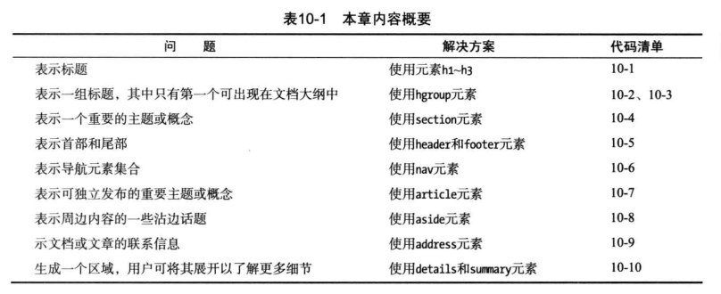
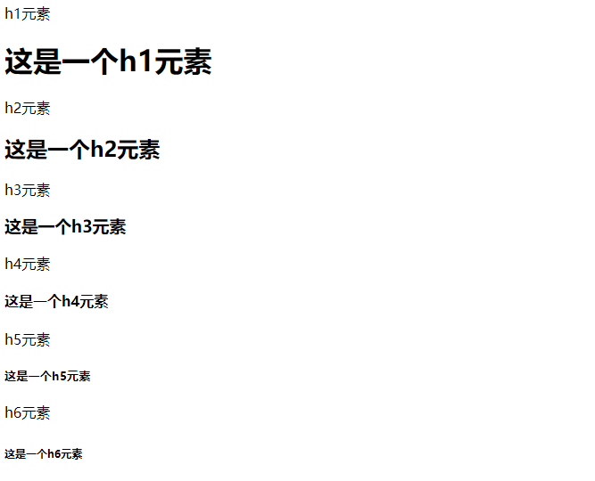
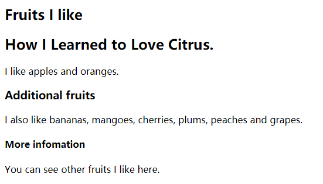
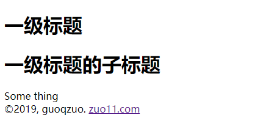
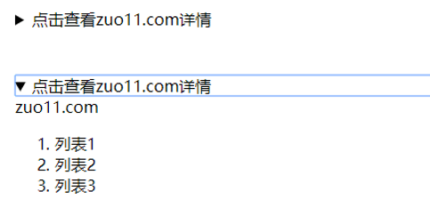

# 文档分节
- 用来表示内容不同的部分
- 说明如何划分内容以便将各个主体和概念分隔开来。



## h1~h6 (标题)
1级标题到6级标题，默认样式
```css
h1,h2,h3,h4,h5,h6 {
  display:block;
  font-weight: bold;
}
h1 { font-size: 2.00em; margin:0.67em 0; }
h2 { font-size: 1.50em; margin:0.83em 0; }
h3 { font-size: 1.17em; margin:1.00em 0; }
h4 { font-size: 1.00em; margin:1.33em 0; }
h5 { font-size: 0.83em; margin:1.67em 0; }
h6 { font-size: 0.67em; margin:2.33em 0; }
```
实例
```html
  <body>
    h1元素
    <h1>这是一个h1元素</h1>

    h2元素
    <h2>这是一个h2元素</h2>

    h3元素
    <h3>这是一个h3元素</h3>

    h4元素
    <h4>这是一个h4元素</h4>

    h5元素
    <h5>这是一个h5元素</h5>

    h6元素
    <h6>这是一个h6元素</h6>
  </body>
```


## hgroup (标题组)
hgroup元素可以用来将几个标题元素作为一个整体处理。以免搅乱HTML文档的大纲。默认样式 display: block; **主要用来解决子标题的问题**。
```html
<hgroup>
  <h1>一级标题</h1>
  <h2>一级标题子标题</h2>
</hgroup>
```
## section (章节、部分)
html5新增，用来包含应该列入文档大纲或目录中的内容。默认样式 sectioin {display: block;}
- section通常包含一个或多个段落以及一个标题（非必须）。
- section子元素如果是h1，IE9+ 会根据标题层级自动修改样式。
```html
 <body>
    <section>
      <hgroup>
        <h1>Fruits I like</h1>
        <h2>How I Learned to Love Citrus.</h2>
      </hgroup>
      I like apples and oranges.
      <section>
        <h1>Additional fruits</h1>
        I also like bananas, mangoes, cherries, plums, peaches and grapes.
        <section>
          <h1>More infomation</h1>
          You can see other fruits I like here.
        </section>
      </section>
    </section>
  </body>
```


## header和footer (头部和尾部)
header元素表示一节的首部，里面包含适合出现在首部的东西。footer元素表示一节的尾部，包含该节的总结信息。
- header通常包含一个标题元素或一个hgroup元素，还可以包含nav导航元素。
- header和footer元素默认样式为 display:block;
```html
  <body>
    <header>
      <hgroup>
        <h1>一级标题</h1>
        <h1>一级标题的子标题</h1>
      </hgroup>
    </header>
    <section>
      Some thing
    </section>
    <footer>
      &#169;2019, guoqzuo. <a href="http://zuo11.com">zuo11.com</a>
    </footer>
  </body>
```


## nav (导航元素)
nav主要的目的是规划出文档的主要导航区域，里面包含一些链接。默认样式 display:block;
头部的导航，和尾部的更多信息导航都可以用nav
```html
 <body>
    <header>
      <hgroup>
        <h1>一级标题</h1>
        <h1>一级标题的子标题</h1>
      </hgroup>
      <nav>
        <h1>contents</h1>
        <ul>
          <li><a href="#link1">link1</a></li>
          <li><a href="#link2">link2</a></li>
          <li><a href="#link3">link3</a></li>
        </ul>
      </nav>
    </header>
    <section>
      Some thing
    </section>
    <nav>
      More Information:
      <a href="#link1">link1</a>
      <a href="#link1">link1</a>
    </nav>
    <footer>
      &#169;2019, guoqzuo. <a href="http://zuo11.com">zuo11.com</a>
    </footer>
  </body>
```
## article (文章)
article元素代表HTML文档中一段独立成篇的内容。从理论上讲，可以独立用页面其余内容发布或使用。可以用来包含一篇文章或博文。
```html
<body>
  <header>
  </header>
  <article>
    <header></header>
    <section></section>
    <footer></footer>
  </article>
  <article>
    <header></header>
    <section></section>
    <footer></footer>
  </article>
  <footer>
  </footer>
</body>
```
## aside (侧边栏, 旁白)
表示跟周边内容稍微沾一点边的内容，类似于书籍或杂志中的侧边栏。它可能是一些背景信息或到相关文章的链接。默认样式： display：block；
```html
<aside>
  <h1></h1>
  <section>
    <ol>
      <li>内容1</li>
      <li>内容2</li>
      <li>内容3</li>
    </ol>
  </section>
<aside>
```
## address (联系游戏，邮箱)
用来表示文档或article元素的联系信息，不能表示客户或用户的地址。习惯样式：address { display:block; font-style: italic; }
```html
<body>
  <header>
    <hgroup>
    </hgroup>
    <address>
      如果任何问题，请 <a href="http://zuo11.com">Email me</a>
    </address>
  </header>
  <article>
    文章
  </article>
</body>
```
## details和summary(详情、详情标题)
details用来在文档中生成一个区域，用户可以展开它以了解关于某主题的更多详情。summary作用是为该详情区域生成一个说明标签或标题。
```html
<body>
  <details>
    <summary>点击查看zuo11.com详情</summary>
    zuo11.com
    <ol>
      <li>列表1</li>
      <li>列表2</li>
      <li>列表3</li>
    </ol>
  </details>
</body>
```
