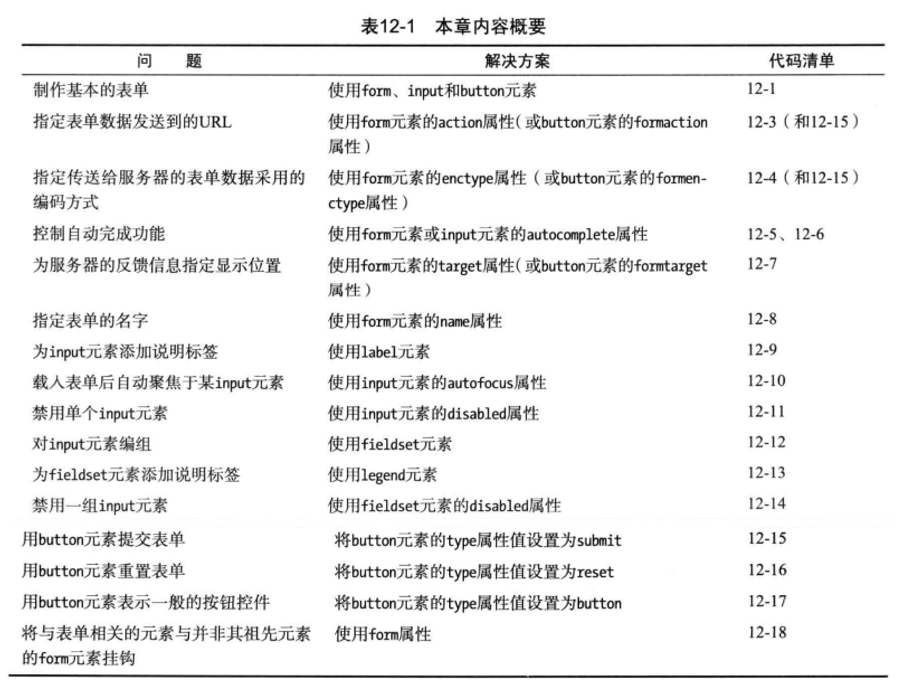
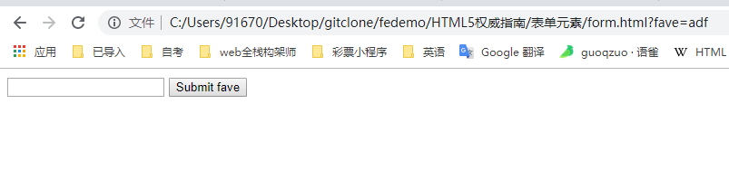
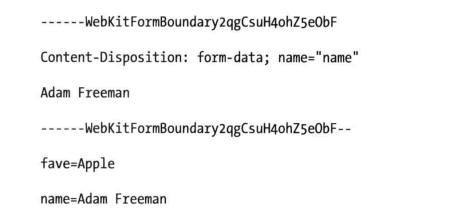
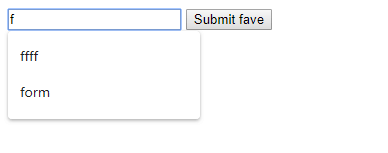
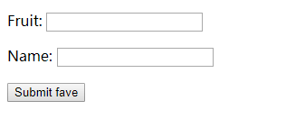
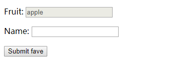
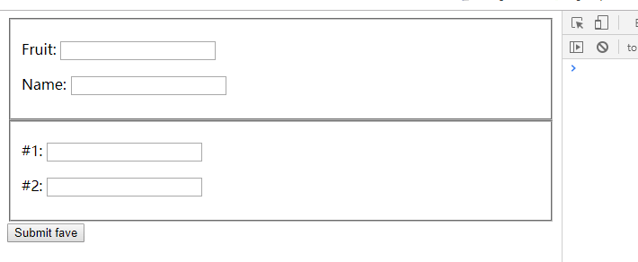
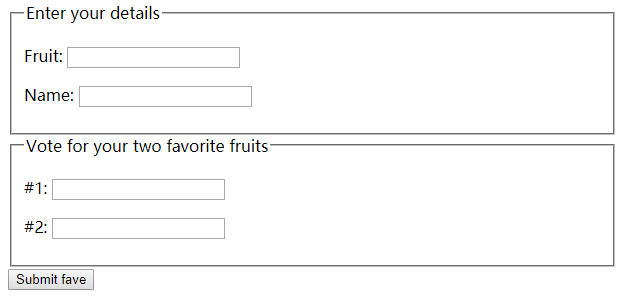
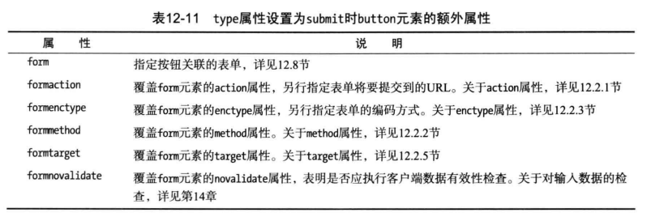

# 表单元素


## form 基本表单
表单是HTML中获取用户输入的手段。对于web应用系统极其重要。
### 局部属性
action, method, enctype, name, accept-charset, target, novalidate, audocomplete，其中novalidate和autocomplete属性是HTML5新增的。
```css
form {
  display: block; margin-top: 0;
}
```
### input
输入，局部属性：name，disabled， form， type；虚元素；HTML5新增了一个type。习惯样式取决于type属性。
### button
按钮，局部属性：name，disabled，form，type，value，autofocus等。
```html
<form method="get">
  <input name="fave" />
  <button>Submit fave</button>
</form>
```


## 配置表单(表单属性)
### action属性(表单提交地址)
action表示提交的地址，如果是相对URL，base元素设置的地址会影响提交的地址。
```html
<!-- 绝对地址 -->
<form method="post" action="http://zuo11.com:8080/form">
</form>
<!-- 相对地址 -->
<base href="http://zuo11.com:8080" />
<form method="post" action="/form">
</form>
```
### method属性(http请求方法)
http请求方法，get、post

### enctype属性(数据编码)
enctype属性指定了发送数据采用的编码方式，enctype属性允许的值：
- application/x-www-form-urlencoded  不能用来将文件上传到服务器，发送数据如下：
```js
fave=Apples&name=guoqzuo
```
- multipart/form-data 用于上传文件到服务器
```js
// 如果xhr提交数据为formdata，默认编码即为 multipart/form-data
var data = new FormData() 
data.append('file', files[0])
```


- text/plain，因浏览器而异，chrome会当做application/x-www-form-urlencoded处理。

### autocomplete (input自动填充)
浏览器可以记住用户输入表单的数据，再次遇到类似的数据，会自动填充。autocomplete有两个值，off 和 on。默认为on表示允许浏览器自动填充。
```html
<!-- off 禁止显示输入历史记录 -->
<input name="fave" aotocomplete="off"/>
```


### target (制定表单显示位置)
target如果为_blank，将浏览器返回的信息显示在新窗口, 默认为_self，在当前窗口

### name (表单名称)
name属性可以用来为表单设置一个独一无二的标识符，以便dom访问。
```js 
document.forms['formtest'] // 获取name属性为formtest的form
```

## label (表单说明)
局部属性：for，form，for指向一个id，点击时，会focus对应的input。form属性为HTML5新增。默认样式 label {cursor: default; }
```html
<body>
  <form method="get">
    <p><label for="fave">Fruit: <input id="fave" name="fave"/></label></p>
    <p><label for="name">Name: <input id="name" name="name"/></label></p>
    <button>Submit fave</button>
  </form>
</body>
```


## autofocus (自动聚焦input)
autofocus不必手动点击到输入框。就可以将焦点自动聚焦到input。autofocus为布尔属性。只能用于表单的一个input元素上。如果有几个元素设置了autofocus属性，会自动聚焦到其中的最后一个元素。

## disabled (禁用单个input)
```html
<p><label for="fave">Fruit: <input id="fave" name="fave" disabled value="apple"/></label></p>
```


## fieldset (表单元素编组)
局部属性：name，form，disabled，默认样式
```css
fieldset {
  display: block;
  margin: 0 2px;
  padding: 0.35em 0.75em 0.625em;
  border: 2px groove;
}
```
实例：
```html
<body>
  <form method="get">
    <fieldset>
      <p><label for="fave">Fruit: <input id="fave" name="fave" /></label></p>
      <p><label for="name">Name: <input id="name" name="name"/></label></p>
    </fieldset>
    <fieldset>
      <p><label for="fave1">#1: <input id="fave1" name="fave1" /></label></p>
      <p><label for="fave2">#2: <input id="fave2" name="fave2"/></label></p>
    </fieldset>
    <button>Submit fave</button>
  </form>
</body>
```

### disabled属性 (禁用整组表单)
```html
<!-- 禁用一组input -->
<fieldset disabled>
```
### legend (表单分组说明)
fieldset元素用来分组，lefend用来提供相关说明
```html
<form method="get">
  <fieldset>
    <legend>Enter your details</legend>
    <p><label for="fave">Fruit: <input id="fave" name="fave" /></label></p>
    <p><label for="name">Name: <input id="name" name="name"/></label></p>
  </fieldset>
  <fieldset>
    <legend>Vote for your two favorite fruits</legend>
    <p><label for="fave1">#1: <input id="fave1" name="fave1" /></label></p>
    <p><label for="fave2">#2: <input id="fave2" name="fave2"/></label></p>
  </fieldset>
  <button>Submit fave</button>
</form>
```


## button
type属性
- submit (提交表单)，当button为submit时，会新增一些额外属性



```html
<button type="submit">submit</button>
```
- reset (重置表单)
```html
<button type="reset">reset</button>
```
- button (一般button元素)
```html
<button type="button">press this button</button>
```

## 表单外的元素
使用input、button的form属性，将form外部的input或button，关联到form表单。
```js
<body>
  <form id="voteform" method="get" name="formtest">
    <p><label for="fave">Fruit: <input id="fave" name="fave" /></label></p>
    <p><label for="name">Name: <input id="name" name="name"/></label></p>
  </form>
  <p><label for="age">age: <input id="age" name="age" form="voteform"/></label></p>
  <button type="submit" form="voteform">Submit</button>
  <button type="reset" form="voteform">Reset</button>
</body>
```