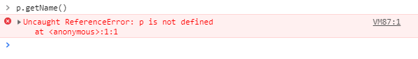
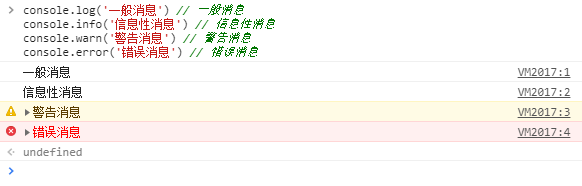

# 错误处理与调试
一般错误需要用try-catch来捕获，或throw来抛出错误。如果没有捕获错误。浏览器会提示，未捕获的错误.

## 1.错误处理try-catch、finally
```js
try {
  // 可能导致的错误代码
  console.log('1');
  var e;
  e.showMessage(); // 这里会出现一个错误，后面的代码不会执行，会执行catch里的代码
  console.log('2');
} catch(e) {
  // 在错误处理时怎么处理
  console.log(e.message) // 打印错误信息
} finally {
  console.log('finally')
}
// 1
// Cannot read property 'showMessage' of undefined
// finally

// 这个函数会返回0,不管正确还是错误，最终都会执行finally的内容
function testFinally() {
  try {
    return 2;
  } catch {
    return 1;
  } finally {
    return 0;
  }
}
```
## 2.7种错误类型 
- Error 基类型，其他错误类型都是继承自该类型
- EvalError 在使用eval()函数异常时会抛出该错误，书中给的触发例子，在chrome里无法触发
- RangeError 范围错误，数值超出范围时，会触发该错误
```js
var item = new Array(-20);
// Uncaught RangeError: Invalid array length
```
- ReferenceError 参考/引用错误，在找不到对象的情况下会抛出该错误
```js
var a = x // 这里的x未定义
// Uncaught ReferenceError: x is not defined
```
- SyntaxError 语法错误
```js
let k = 1;
let k = 1; // let重复定义了k，回报语法错误
// Uncaught SyntaxError: Identifier 'k' has already been declared

try() // 这里明显语法错误
// Uncaught SyntaxError: Unexpected token (
```
- TypeError 类型错误
```js
var k = 1 
k.getInfo() // 数字变量，调用了一个函数
// Uncaught TypeError: k.getInfo is not a function

var o = new 10 // 10不是一个构造函数
// Uncaught TypeError: 10 is not a constructor
```
- URIError 当encodeURL()或decodeURI()执行时，URI格式不正确，会导致该错误
```js
encodeURL('sfsdf')
// Uncaught ReferenceError: encodeURL is not defined
```
## 3.抛出自定义错误
```html
<!DOCTYPE html>
<html>
  <head>
    <meta charset="UTF-8">
    <title>error</title>
  </head>
  <body>
    <script type='text/javascript'>
      try {
        throw new Error('custom message', 't.js', 10) // 这里除了可以抛出Error类型错误外，还可以抛出其他6种错误
      } catch(e) {
        console.log('error message: ', e.message); // error message:  custom message
        console.log('error name: ', e.name); // error name:  Error   // 这里错误类型为Error
        console.log('error fileName: ', e.fileName); // error fileName:  undefined
        console.log('error lineNumber: ', e.lineNumber); // error lineNumber:  undefined
        console.log('error columnNumber: ', e.columnNumber); // error columnNumber:  undefined
        console.log('error stack: ', e.stack); // error stack:  Error: custom message at http://127.0.0.1/error.html:11:19
      }
    </script>
  </body>
</html>
```

## 4.window的error事件
try-catch捕获的错误，不会触发error事件，只有没捕获的错误，才会触发window.error事件，该事件有三个参数，错误信息，错误文件url、错误发生的行数
```html
<!DOCTYPE html>
<html>
  <head>
    <meta charset="UTF-8">
    <title>error</title>
  </head>
  <body>
    <script type='text/javascript'>
      // 如果错误有try-catch捕获，那程序会继续执行，如果没有捕获，会触发error事件，程序不会向下执行，注意：window.onerror要放在最前面
      window.onerror = function(message, url, line) {
        console.log('message: ' + message) // message: Uncaught TypeError: 类型错误
        console.log('url: ' + url) // url: http://127.0.0.1/error.html
        console.log('line:' + line) // line:25
      }
      try {
        throw new Error('custom message', 't.js', 10)
      } catch(e) {
        console.log('error message: ', e.message); // error message:  custom message
        console.log('error name: ', e.name); // error name:  Error
        console.log('error fileName: ', e.fileName); // error fileName:  undefined
        console.log('error lineNumber: ', e.lineNumber); // error lineNumber:  undefined
        console.log('error columnNumber: ', e.columnNumber); // error columnNumber:  undefined
        console.log('error stack: ', e.stack); // error stack:  Error: custom message at http://127.0.0.1/error.html:11:19
      }

      throw new TypeError('类型错误') // 这里触发的错误，onerror会触发
      cosnole.log('info') // 这里不会执行
    </script>
  </body>
</html>
```

## 4.处理错误的策略
常见的错误类型
- 类型转换错误, == 与 === 要注意区分
- 数据类型错误, 比如非数组，却执行了数组的方法
- 通信错误，ajax 一般先确定URL正确，需要用encodeURIComponent()转码，防止URL格式错误

### 区分致命错误和非致命错
非致命错误，根据以下一个或多个条件确定：
- 不影响用户的主要任务
- 只影响页面的一部分
- 可以恢复
- 重复相同操作可以消除错误

致命错误，可以通过一个或多个条件确定
- 应用程序根本无法继续运行
- 错误明显影响了用户的主要操作
- 会导致其他连带错误

### 把错误记录到服务器
日志记录，需要写一个接口来上报信息
```js
function logError(sev, msg) {
  // sev 严重程度
  // msg 错误信息
  var img = new Image();
  img.src = "log.php?sev=" + encodeURIComponent(sev) + "&msg=" + encodeURIComponent(msg)
  // 这里使用了Image对象来发送请求，有以下几个好处：1.所有浏览器都支持Image对象 2.可以避免跨域限制 3.记录错误的过程中出问题的概率比较低
}
// 开始使用
try {
  // 可能发生错误的情况
} catch(e) {
  logError('nonfatal', 'Moudle init failed: ' + e.message) // nonfatal 非致命
}
```

## 5.调试技术


- console对象打印信息

```js
console.log('一般消息') // 一般消息
console.info('信息性消息') // 信息性消息
console.warn('警告消息') // 警告消息
console.error('错误消息') // 错误消息
```
- 断点调试 chrome调试基础可参见 https://www.cnblogs.com/yuanchaoyong/p/6172034.html