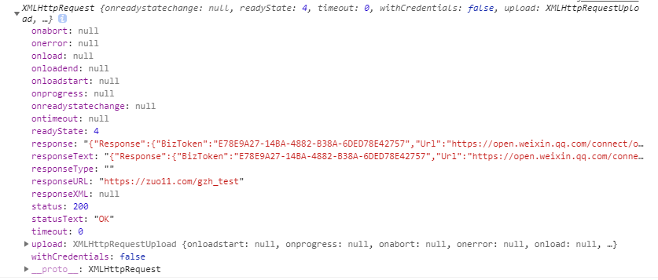

# Ajax与Comet
> Ajax(Asynchronous JS + XML) 异步的JS和XML，是一种技术，主要用于在不刷新页面的情况下，获取到服务器数据。现在可能觉得没什么，但以前获取数据都需要刷新页面
## 1.XMLHttpRequest对象
Ajax技术的核心是XMLHttpRequest对象(简称XHR), 使用方法如下：
```html
<!DOCTYPE html>
<html>
  <head>
    <meta charset="UTF-8">
    <title>json</title>
  </head>
  <body>
    <input id="send-req-btn" type="button" value="发送请求">
    <script>
      // https://zuo11.com/gzh_test
      var sendReqBtn = document.getElementById('send-req-btn');
      sendReqBtn.onclick = function(event) {
        // 1. 创建xhr对象
        var xhr = new XMLHttpRequest(); // 创建xhr对象，IE7+

        // 2. 启动一个请求以备发送 xhr.open(请求类型，请求的URL，是否发送异步请求) 请求类型("get", "post")，
        xhr.open("get", "https://zuo11.com/gzh_test", false) // 第三个参数false, 发送一个同步请求，发送请求后，不会向下执行，一直等请求完毕后才会执行后面的内容
        // 只能向同一个域中使用相同端口和协议的URL发送请求，否则会引起安全错误(跨域)。

        // 3. 发送请求, xhr.send(作为请求主体发送的数据)，如不需要通过请求主体发送数据，则必须传入null
        xhr.send(null)

        // 4. 接收到响应后, 会自动填充XHR对象的属性，相关属性如下:
        // - xhr.status 响应的HTTP状态，xhr.status大于等于200且小于300，或等于304为成功，其他状态码，表示请求异常。一般200为成功
        // - xhr.responseText 响应主体返回的文本
        // - xhr.responseXML 如果响应的内容类型是"text/xml"或"application/xml", 将保存响应数据的XML DOM文档
        // - xhr.statusText HTTP状态的说明
        if ((xhr.status >= 200 && xhr.status < 300) || xhr.status == 304) { // 请求成功
          // alert(xhr.responseText) // 显示响应数据
          console.log(xhr)
          console.log(xhr.responseText)
          console.log(typeof xhr.responseText) // string
          console.log(JSON.parse(xhr.responseText))
          // 和接口返回的一致：
          // {
          //   "Response": {
          //       "BizToken": "6EF19446-963B-43C5-AD11-40419DEE1600",
          //       "Url": "https://open.weixin.qq.com/connect/oauth2/authorize?appid=wx2cca36a86d5035ae&redirect_uri=http%3A%2F%2Fopen.faceid.qq.com%2Fv1%2Fapi%2FgetCode%3FbizRedirect%3Dhttps%253A%252F%252Ffaceid.qq.com%252Fapi%252Fauth%252FgetOpenidAndSaveToken%253Ftoken%253D6EF19446-963B-43C5-AD11-40419DEE1600&response_type=code&scope=snsapi_base&state=&component_appid=wx9802ee81e68d6dee#wechat_redirect",
          //       "RequestId": "594aa2de-915b-48ac-a9b5-ac3ff2fe40c4"
          //   }
          // }
        } else { // 请求异常
          alert("Request was unsuccessful: " + xhr.status)
        }
      }
    </script>
  </body>
</html>
```


关于异步请求:
```js
// 异步请求，主要是监听xhr的 readystatechange事件，当 readyState为4时，就表示请求完成
// xhr.readyState === 0 未初始化，尚未调用open()
// xhr.readyState === 1 启动，调用了open，但为调用send
// xhr.readyState === 2 发送，调用了send，但未接收到响应
// xhr.readyState === 3 接收，已经接收到部分响应数据
// xhr.readyState === 4 完成，已经接收到全部响应数据，请求已完成。

var xhr = new XMLHttpRequest();
xhr.onreadystatechange = function() {
  if (xhr.readyState === 4) { // 请求完成
    if ((xhr.status >= 200 && xhr.status < 300) || xhr.status == 304) { // 请求成功
      // alert(xhr.responseText) // 显示响应数据
      console.log(xhr)
    } else {
      alert("Request was unsuccessful: " + xhr.status)
    }
  }
};
xhr.open('get', "https://zuo11.com/getList", true); // 发送异步请求
xhr.send();
```
### xhr.setRequestHeader()
> xhr.setRequestHeader()

每个HTTP请求和响应都会带有相应的头部信息, 可以在open方法之后，send方法之前调用xhr.setRequestHeader()，设置对应的请求头
```js
// chrome调试面板里Request Headers(请求头)里，只有Origin，Referer，User-Agent 信息，在node接收处理请求时，能看到请求头的更多信息：
//{ 
//  host: 'localhost:8088', // 发出请求的页面所在的域
//  connection: 'keep-alive', //浏览器与服务器之间的连接类型
//  origin: 'http://127.0.0.1',
//  'user-agent': // 浏览器的用户代理字符串
//   'Mozilla/5.0 (Windows NT 10.0; Win64; x64) AppleWebKit/537.36 (KHTML, like Gecko) Chrome/75.0.3770.142 Safari/537.36',
//  accept: '*/*', // 浏览器能够处理的内容类型
//  referer: 'http://127.0.0.1/json.html', // 发出请求页面的URI
//  'accept-encoding': 'gzip, deflate, br', // 浏览器能够处理的压缩编码
//  'accept-language': 'zh-CN,zh;q=0.9', // 浏览器当前设置的语言
//  'if-none-match': 'W/"2-l9Fw4VUO7kr8CvBlt4zaMCqXZ0w"' 
//}

// 实际还有 Cookie 当前页面设置的cookie, 跨域请求时，需要设置 xhr.withCredentials = true; 服务器才会接收到Cookie请求头, 后台需要设置res.header('Access-Control-Allow-Credentials', 'true'); 
// Accept-charset 浏览器能显示的字符集
var xhr = new XMLHttpRequest();
xhr.onreadystatechange = function() {
  if (xhr.readyState === 4) { // 请求完成
    if ((xhr.status >= 200 && xhr.status < 300) || xhr.status == 304) { // 请求成功
      // alert(xhr.responseText) // 显示响应数据
      console.log(xhr);
      console.log(xhr.getAllResponseHeaders()); // 获取所有的响应头信息
      console.log(xhr.getResponseHeader("MyHeader")); // 获取某个响应头信息
    } else {
      alert("Request was unsuccessful: " + xhr.status)
    }
  }
};
xhr.open('get', "https://zuo11.com/getList", true); // 发送异步请求
xhr.setRequestHeader("myHeader", "Myvalue");
xhr.send();
```
### get请求
```js
function addURLParam(url, key, value) {
  url += url.includes('?') ? "&": "?";
  url += encodeURIComponent(key) + '=' + encodeURIComponent(value);
  return url;
}
var xhr = new XMLHttpRequest();
xhr.onreadystatechange = function() {
  if (xhr.readyState === 4) {
    if ((xhr.status >= 200 && xhr.status < 300) || xhr.status == 304) {
      alert(xhr.responseText);
    } else {
      alert('请求异常' + xhr.status + ',' + xhr.statusText);
    }
  }
};
var url = "http://127.0.0.1:8088";
url = addURLParam(url, 'num', 5);
url = addURLParam(url, 'start', 0);
xhr.open('get', url, true);
xhr.send(null);
```
### post请求
```js
var xhr = new XMLHttpRequest();
xhr.onreadystatechange = function() {
  if (xhr.readyState === 4) {
    if ((xhr.status >= 200 && xhr.status < 300) || xhr.status == 304) {
      alert(xhr.responseText);
    } else {
      alert('请求异常' + xhr.status + ',' + xhr.statusText);
    }
  }
};
var url = "http://127.0.0.1:8088/getList";
xhr.open('post', url, true);

xhr.setRequestHeader("Content-Type", "application/json"); // 发送json数据
xhr.send('{"a": 1,"b": 2}'); // 发送json格式数据，要先转为JSON格式字符串

// xhr.setRequestHeader("Content-Type", "application/x-www-form-urlencoded"); // 发送序列化数据
// // serialize(form) 序列化数据
// xhr.send("a=1&b=2"); 

// 以上两种方法，node express均可用 req.body获取对应的参数对象
```

## 2.XMLHttpRequest 2级
XMLHttpRequest 1级只是把已有的XHR对象实现细节描述了出来。而XMLHttpRequest 2级则进一步发展了XHR，内容包括FormData，超时设定等
### FormData
提交表单数据之前需要序列化表单数据，或者转成JSON格式数据。FormData 可以快速封装表单数据，方便提交。
```js
// formObj为表单对象
var data = new FormData(formObj);
data.append("a", "111111"); // 添加一个新元素
console.log(data);

var xhr = new XMLHttpRequest();
xhr.onreadystatechange = function() {
if (xhr.readyState === 4) {
  if ((xhr.status >= 200 && xhr.status < 300) || xhr.status == 304) {
  alert(xhr.responseText);
  } else {
  alert('请求异常' + xhr.status + ',' + xhr.statusText);
  }
}
};
var url = "http://127.0.0.1:8088/getList";
xhr.open('post', url, true);
xhr.send(data); // xhr对象能识别传入的数据类型是FormData的实例，并配置适当的头部信息
// 默认配置的是 Content-Type: multipart/form-data; 坑爹的是node bodyparse不能处理 multiparty 数据，需要再用插件
```
### 超时设定 IE8+
IE8为xhr添加了timeout属性，毫秒。表示请求在等待多少毫秒后就终止。如果超过该事件，会触发xhr的timeout事件
```js
var xhr = new XMLHttpRequest();
xhr.onreadystatechange = function() {
if (xhr.readyState === 4) {
  if ((xhr.status >= 200 && xhr.status < 300) || xhr.status == 304) {
  alert(xhr.responseText);
  } else {
  alert('请求异常' + xhr.status + ',' + xhr.statusText);
  }
}
};
var url = "http://127.0.0.1:8088/getList";
xhr.open('get', url, true);
xhr.timeout = 2000;
xhr.ontimeout = function(event) {
  alert('请求超时')
}
xhr.send(null);
```
## 3.进度事件 load、process等
xhr请求时可能会触发6个进度事件
- loadstart 在接收到服务器响应数据的第一个字节时触发
- progress 在接收到响应期间不断的触发
- error 在请求出错时触发
- abort 在因为调用abort()时触发
- load 在接收完整的数据响应时触发
- loadend 在通信完成或者触发error\abort或load事件后触发

每个请求都从触发loadstart事件开始，接下来是一个或多个progress事件，然后触发error、abort或load事件中的一个，最后触发loaded事件。
```js
// load 事件完全可以代替 xhr.onreadystatechange事件，改写后的请求
var xhr = new XMLHttpRequest();
xhr.onload = function() {
  if (xhr.status === 200) { // 请求成功
    alert(xhr.responseText)
  } else {
    alert('请求异常', xhr.status)
  }
}
xhr.open('get', 'http://127.0.0.1:8088/getList', true);
xhr.send(null)

// process 事件
var xhr = new XMLHttpRequest();
xhr.onload = function() {
  if (xhr.status === 200) { // 请求成功
    alert(xhr.responseText)
  } else {
    alert('请求异常', xhr.status)
  }
}
xhr.onprogress = function(event) {
  // event.lengthComputable 进度信息是否可用？
  // event.position 已接收的字节数  最新的是： loaded
  // event.totalSize 表示根据Content-Length响应头确定的预期字节数 最先的属性是total
  if (event.lengthComputable) {
    console.log("接收到: " + event.loaded + ", 总共: "+ event.total + 'bytes')
  }
}
xhr.open('get', 'http://127.0.0.1:8088/getList', true);
xhr.send(null)
```

## 4.跨域资源共享
> 通过XHR实现Ajax通信的一个主要限制，来源于跨域安全策略。默认情况下，XHR对象只能访问与包含它的页面位于同一域中的资源。对于某些合理的跨域请求，需要允许。CORS(Cross-Origin 跨域 Resource Sharing) 资源共享就是为了解决这个问题的。

CROS 定义了必须访问跨域资源时，浏览器与服务器应该如何沟通。基本思想是：使用自定义的HTTP头部让浏览器与服务器进行沟通，从而决定请求或响应是应该成功还是失败。IE9+
```js
// 一般请求头里会包含Origin字段，表示当前域。如果服务器认为这个请求可以接受，就在Access-Control-Allow-Origin头部中返回相同的信息，或者"*"，表示允许
// 请求头里的属性 Origin: http://127.0.0.1
// 响应头里的属性 Access-Control-Allow-Origin: http://127.0.0.1 或者 Access-Control-Allow-Origin: "*"   
// 如果响应头没有Access-Control-Allow-Origin属性，或者与请求头的Origin信息不匹配，浏览器就会驳回请求，如果相同，就会处理请求。注意跨域请求和响应都不包含cookie信息。
```
- IE对CORS的实现IE8引入了XDR(XDomainRequest)类型，类似于XHR用于支持跨域通信，IE9+支持XHR CROS, 故暂不考虑对XDR的研究
- 跨域请求会有一些限制，比如不能使用setRequestHeader()设置自定义头部
- 不能发送和接收cookie
- 调用getAllResponseHeaders() 获取的信息会不完整
```js
res.header("Access-Control-Allow-Origin", "*"); // 设置响应头允许的域名，如果是* 表示所有
res.header('Access-Control-Allow-Methods', 'PUT, GET, POST, DELETE, OPTIONS'); // 允许的请求类型
res.header("Access-Control-Max-Age", "1728000"); // 应该将这个Preflight请求缓存多久(单位为妙)
res.header('Access-Control-Allow-Headers', 'Content-Type'); // 允许的头部
```
- 带凭据的请求,默认情况下跨域请求不提供凭据(cookie, HTTP认证及客户端SSL证明等)。通过将 withCredentials属性设置为true，可以指定某个请求应该发送凭据。
```js
// xhr.withCredentials = true;

// 如果发送的是带凭据的请求，但服务器的响应中没有包含这个头部，那浏览器不会把响应交个js。
// Access-Control-Allow-Credentials: true
// res.header('Access-Control-Allow-Credentials', 'true'); 
```
## 5.其他跨域技术 (img和JSONP)
### 图片img
- 图片img标签，new Image(), img.src = "http://xxx.com/test?a=1&b=2" 发送get请求。只能发送get请求，无法访问服务器的响应文本，仅用于单向通信。
### JSONP
- JSONP，JSON with padding(填充式JSON, 或参数式JSON)， 客户端服务端都需要加上处理
```html
<!DOCTYPE html>
<html>
<head>
	<meta charset="utf-8">
<title>jsonp</title>
</head>
<body>
  <!-- 客户端代码 -->
  <input id="jsonpclick" type="button" value="jsonp test">
  <script>
    function handleRes(response) {
      console.log(response)
      // 这里可以接收到对应的数据
    }
    var jsonpclick = document.getElementById('jsonpclick');
    jsonpclick.onclick = function(){
      console.log('开始测试');
      var script = document.createElement('script');
      script.type="text/javascript" 
      script.src = "http://127.0.0.1:8088/gzh_test?callback=handleRes"
      document.body.insertBefore(script, document.body.firstChild)
    }

  </script>
</body>
</html>
```
jsonp node服务端代码
```js
function gzhM_test(app, data, req, res) {
    console.log('开始执行gzhm_test');
    console.log(req.query)
    if (req.query && req.query.callback) {
        //console.log(params.query.callback);
        var str =  req.query.callback + '(' + "a=2" + ')';//jsonp
        res.end(str);
    } else {
        res.end('b=2');//普通的json
    }
    return;
}
```
### 其它待研究
- Coment
- 服务器发送事件
- Web Sockets