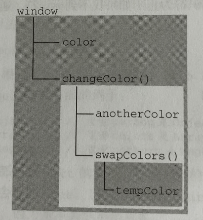

# 变量、作用域和内存问题
基本类型与引用类型的值，一个存的是真实的值，一个存的是地址，类似C指针。
## 1.基本数据类型与引用类型的区别
- 只有引用类型值可以动态的添加属性
- 复制变量值时，基本类型相互不影响，引用类型值复制时指向同一个堆内存区域，原先的值属性发生改变，新的值也会有对应的改变
- 做函数参数时，引用类型的变量有可能改变值本身，基本类型不会
``` js
function setName(obj) {    // 这里的obj是个局部变量，存的值指向堆内存对应的区域
  obj.name = "zuo";   // 修改的堆上的内容, 修改的值会影响到person
  obj = new Object(); // 改变了obj这个局部变量，指向另一个对象
  obj.name = "hello"; // 这里修改的值不会影响到person
}

var person = new Object();
setName(person);
alert(person.name);   // "zuo"
```
## 2.检测引用类型值的具体类型
基本类型用 **typeof** 就可以，引用类型用**typeof**都是**object**，还有一些引用类型是基于最基础的object的。如Array, Date或自定义对象。可以使用 **instanceof** 来判断这些类型的值是否属于某个引用类型
``` js
alert(person instanceof Object); // 变量person是Object吗, 如果是返回true
alert(colors instanceof Array); // 变量colors是Arrary吗
alert(pattern instanceof RegExp);

// JS里面所有引用类型的值都是Object的实例，任何引用类型 instanceof Object 都是true

```
## 3.执行环境和作用域
执行环境（execution context, 有时也称为环境）定义了变量或函数有权访问的数据，决定了它们各自的行为。每一个执行环境都有一个关联的**变量对象**（variable object），用来存储该环境中定义的所有变量和函数
- 全局执环境是最外围的一个执行环境。根据宿主环境不同，表示执行环境的对象也不一样，web里，全局执行环境为Window对象，所有的全局变量和函数都是作为window对象的属性和方法创建的。全局执行环境直到浏览器关闭才会被销毁。
- 非全局执行环境（函数）在执行结束后销毁，保存在其中的变量和函数定义也随之销毁
- 每个函数都有自己的执行环境。当进入一个函数执行时，函数的环境会被push到一个环境栈中，执行完成后再pop函数的环境，返回原来的执行环境。
- 代码在一个环境中执行时。会创建变量对象的**作用域链**（scope chain），保证对执行环境有权访问的所有变量和函数的有序访问。作用域链的前端始终是当前执行代码所在环境的变量对象。（如果这个环境是函数，最开始时变量对象只有一个arguments对象），作用域的下一个变量对象来自包含(外部)环境，一直延续到全局执行环境。全局执行环境的变量对象始终是作用域链的最后一个对象。

```js
var color = "blue";

function changeColor() {
  var anotherColor = "red";

  function swapColors() {
    var tempColor = anotherColor;
    anotherColor = color;
    color = tempColor;
    // swapColors()局部执行环境，可访问 tempColor、anotherColor、color
  }

  // changeColor() 局部执行环境，可以访问 antherColor、color
  swapColors();
}

// 全局执行环境，只能访问 color
changeColor()
```
上面的例子中，内部的环境可以通过作用域链访问所有的外部环境，外部环境不能访问内部环境的变量。
- 函数swapColors()的作用域链包含三个变量对象：他自己的变量对象(其中定义着arguments对象)，changeCOlor()的变量对象，全局执行环境的变量对象
- 函数changeColor()的作用域链包含两个变量对象：他自己的变量对象(其中定义着arguments对象)，全局执行环境的变量对象




### 延长作用域链
当执行环境下列任何一个语句时，作用域链就会得到加长
- try-catch语句的catch块 （会创建一个新的变量对象，包含错误对象的声明）
- with语句

```js
function buildUrl() {
  var qs = "?debug=true";

  with(location) {  // 会将指定的对象location添加到作用域链中，就可以直接访问location.href属性
    var url = href + qs
  }

  return url
}
```

### 没有块级作用域
除函数外，有{}封闭的代码块没有自己的作用域。
- 函数内容用var定义的，在函数执行完毕后，会直接销毁，如果函数内容使用了未定义的变量，会直接被添加到全局环境中。
- 函数中访问一个变量的值，会优先从当前作用域去找，然后会一级一级向全局作用域链查找，直到找到为止。找到了就会停止，直接使用该值。
```js
// 示例1：
if (true) {
  var color = "blue";
}
alert(color); // "blue"

// 示例2：
for(var i = 0; i < 10; i++) {
  doSomethind(i);
}
alert(i); // 10
```

## 3.垃圾收集
JS是一门具有自动垃圾收集机制的编程语言，开发人员不必关心内存分配和回收问题。
- JS中最常用的垃圾收集方式是**标记清除**(mark-and-sweep)，这种算法的思想是给当前不使用的值加上标记，然后再回收其内存。
- 当进入执行环境时，当前环境定义的变量函数都会标记为"进入环境"，当前的执行环境结束后，再标记为"离开环境"，离开作用域的值被标记为可以回收，因此将在垃圾收集期间被删除。
- 另一种不太常见的垃圾收集策略是**引用计数**(reference counting)，这种算法的思想是跟踪记录所有值被引用的次数。次数为0时，回收。**JS引擎目前都不再使用这种算法。**
- 当代码中存在循环引用的现象时，**引用计数**算法会导致问题
- 解除变量的引用，有助于消除循环引用、内存回收。为确保有效的回收内存，应及时解除不再使用的全局对象、全局对象属性等变量的引用


