# JS高程3学习笔记

## 一.关于JavaScript

### 1.为什么会有JS - JavaScript的诞生
JS诞生于1995年，由当时就职于Netscape公司的Brendan Eich开发，最初的目的是想通过JS在请求服务器之前做一些输入验证操作。在此之前空值判断等都在后端进行，之前的网速很慢，非常耗时。

### 2.为什么会有ECMAScript - JavaScript标准化
由于Netscape公司推出的javascript 1.0发布后获得了巨大的成功，微软在IE3中加入了对应的JavaScript实现。
自此，出现了3个不同的JS版本，但可怕的是当时并没有一个标准来统一其语法或特性。随着业界担心的日益加剧。
JS的标准化问题被提上日程。1997年JavaScript1.1作为一个草案提交给了欧洲计算机制造商协会(ECMA, European
Computer Manufacturers Association), 该协会指定39号技术委员会(TC39 Thechnical Committee #39)负责
"标准化一种通用、跨平台、供应商中立的脚本语言的语法和语义"。[TC39官网](http://www.ecma-international.org/memento/TC39.htm)
TC39由来自Netscape、Sun、微软、Borland等公司的程序员组成, 共同完成了ECMA-262(定义了名为ECMAScript的全新脚本语言的标准)。
之后ISO/IEC也采纳ECMAScript作为标准，从此，浏览器开发商开始致力于将ECMAScript作为各自javascript实现的基础。

### 3.JavaScript的实现
虽然JavaScript和ECMAScript通常被人们用来表达相同含义，但JavaScript的含义比ECMA-262中规定的要多的多，
一个完整的JavaScript实现应该有三个部分组成: 核心(ECMAScript)、文档对象模型(DOM)、浏览器对象模型(BOM)
- EMCAScript 描述了该语言的语法与基础对象
- DOM 描述了处理网页内容的方法和接口
- BOM 描述了与浏览器进行交互的方法和接口

#### ECMAScript
由ECMA-262定义的ECMAScript与web浏览器并没有依赖关系，web浏览器对于ECMAScript来说是一个宿主环境，但并不是唯一的。
(比如Node、Adobe Flash)，宿主环境不仅提供基本的ECMAScript实现，同时也会提供相关扩展与环境之间对接交互，比如DOM。关于JavaScript、NodeJS、ECMAScript之间的区别详情，参见 [ECMAScript、JavaScript与Nodejs的区别](https://blog.csdn.net/fabulous1111/article/details/78895364)

ECMA描述了以下内容: 语法、类型、语句、关键字、保留字、操作符、对象。每个浏览器都有它自己的ECMAScript接口的实现，然后这个实现
又被扩展，包含了DOM和BOM。

ECMAScript历史版本:
- 1997年06月 第一版 ES1 本质上与javascript 1.1相同,删除了所有针对浏览器的代码并作了一些较小的改动：要求支持Unicode标准等。
- 1998年06月 第二版 ES2 这一版的内容更新是为了与ISO/IEC-16262保持严格一致，没有作任何新增、修改或删节处理。
- 1999年12月 第三版 ES3 新增正则表达式、新控制语句、try-catch异常处理支持,修改了字符处理、错误定义和数值输出等内容。
- ECMAScript沉寂多年，直到Ajax流行起来后，标准工作才再次起步。
- 2008年07月 第四版 ES4 发布前被废弃，由于改动较大，各方有分歧，不怎么愉快，导致难产，详情参见 [ES4相关历史](https://www.zhihu.com/question/24715618)
- 2009年12月 第五版 ES5 澄清第三版中的歧义，新增原生JSON对象、继承的方法、高级属性的定义以及引入严格模式。
- 2015年06月 第六版 ES6 官方名称为ECMAScript2015，之后都会这样命名，新增了许多特性，如Maps、Sets、Promise、生成器（Generators）等。
- 2016年06月 第七版 ES2016 新增两个特性: Array.prototype.include和取幂运算符 [官方文档](http://www.ecma-international.org/ecma-262/7.0/#sec-overview)
- 2017年06月 第八版 ES2017 新增async/await等
- 2018年06月 第九版 ES2018 新增共享内存和原子性、异步循环等 [官方文档](https://www.ecma-international.org/publications/files/ECMA-ST/Ecma-262.pdf)

相关资料
- ES2016, 2017和2018到底有哪些新功能？https://mp.weixin.qq.com/s/A4Z8D3IlSsw1XnP3wFbJHg
- ES2016与ES2017相关 http://www.css88.com/archives/7753
- 阮一峰的 EMCAScript 6 入门(第三版) http://es6.ruanyifeng.com/#README
- ECMAScript各版本及特性 https://segmentfault.com/a/1190000003493604
- 关于ES5、ES6及之后版本的兼容性 http://kangax.github.io/compat-table/es6/

关于兼容性:
- IE11支持ES5，基本不支持ES6，低版本的IE8、9等使用ES6语法需要用Babel插件
- Chrome、Firfox、safari、Edge对ES6支持很好。

#### DOM
文档对象模型(DOM, Document Object Model), 是HTML和XML的API，DOM把整个页面映射为一个多层节点结构。通过创建树来表示文档，从而使
开发人员可以控制页面的内容和结构。借助DOM提供的API，开发人员可以轻松自如的删除、添加和修改任何节点。

为什么要使用DOM？

在IE4和 Netscape Navigator 4分别支持不同形式的动态HTML(DHTML)后，开发人员首次无需重新加载网页就可以修改其外观和内容了，但两家
公司互不兼容，web开发者只编写一个HTML页面就能在所有浏览器中访问的时代结束了。业界必须做点什么保持web跨平台的天性，因此负责web通信标准的团体
W3C(World Wide Web Consortium)就开始着手规划DOM.
##### DOM级别
###### DOM1级(DOM Level 1) 
DOM Level 1于W3C于1998年10月提出的。主要主要是映射文档的结构，由两个模块组成DOM核心(DOM Core)和DOM HTML
- DOM核心 规定了如何映射基于XML的文档结构，以便简化对文档中任意部分的访问操作
- DOM HTML 在DOM核心的基础上加以扩展，添加了针对HTML的对象和方法
###### DOM2级(DOM Level 2)
- 扩充了鼠标和用户界面事件、范围、遍历等细分模块，且增加了对CSS的支持，加入了对XML命名空间的支持
- 引入的新模块: DOM视图、DOM事件、DOM样式、DOM遍历和范围
###### DOM3级(DOM Level 3)
- 引入了统一的方式载入和保持文档的方法，以及验证文档的方法，开始支持XML 1.0所有特性

###### 其他DOM标准
除了DOM Core 和DOM HTML外，还有其他几种语言发布了只针对自己的DOM标准，这些语言都是基于XML的，每种语言的DOM
标准都添加了特定的方法和接口
- 可缩放矢量语言 SVG
- 数字标记语言 MathML
- 同步多媒体集成语言 SMIL

兼容性方面，基本都支持，各个浏览器或多或少会有兼容性方面的问题，使用前可在caniuse.com里查具体的兼容性

#### BOM
浏览器对象模型(BOM, Browser Object Model) 可以对浏览器窗口进行访问和操作,通常浏览器特定的JS扩展都被看做BOM的一部分，
这些扩展包括
- 弹出新的浏览器窗口
- 移动、关闭浏览器窗口以及调整窗口大小
- 提供浏览器详细信息的navigator对象
- 提供浏览器所加载页面详细信息的location对象
- 提供用户显示器分辨率详细信息的screen对象
- 对cookies的支持
- XMLHttpRequest和IE的ActiveXObject等自定义对象

## 二、JavaScript在HTML中的使用
向HTML中插入JavaScript代码的主要方法就是使用<script>元素
### 1.\<script>元素属性
\<script>属性里面默认的type 为"text/javascript", 需要注意的是async与defer属性

HTML4.1与HTML5里面 async与defer属性的值不一致(之前值为async,defer，H5为true,false)，现在这里以H5为主

### 2.<script>使用方式
在HTML里<script>元素的使用方法有两种:
- 嵌入脚本
  
``` html
<!-- 
  1. 嵌入脚本里面不能使用src属性，如果使用了src引入了外部js文件，内嵌的内容会失效 
  2. 嵌入脚本内部不要出现 </script> 结束标志。这样后面的代码不会继续执行，如果一定要加入请使用 <\/script>
-->
<script> 嵌入脚本内容 </script>
```

- 使用外部脚本
``` html
<!-- 引入外部脚本，如果是第三方的js文件，需要确保其安全可靠。-->
<script src="1.js"></script>
```

### 3.<script>位置与执行顺序
- 放到<head>元素内部，页面一加载就按顺序加载执行，这种情况当JS被加载执行完成，页面才会开始渲染，如果网速慢，载入文件大等会导致页面空白一段时间
- 或者放到<body>元素的最后面，顺序执行，等页面渲染完后再去加载执行。
- 使用async与defer属性会改变script的默认执行顺序
  - async为true时，后续的页面渲染和js加载执行会并行处理(异步)
  - defer为true时，后续的页面渲染和js加载会并行处理，但js的执行会等到页面完全渲染好后才开始。
  


详情请参见 [defer和async的区别](https://segmentfault.com/q/1010000000640869)

### 4.当浏览器禁用了JS或不支持JS
在<body>元素里面，最后加入<noscript></noscript>元素，当JS被禁用或不支持时，会显示noscript元素内部的内容

``` html
<body>
    <noscript>
        <p>本页面需要浏览器支持（启用）JavaScript!</p>
    </noscript>
</body>
```

## 三、ECMAScript基本概念
关于ES的语法、操作符、数据类型、内置功能等
### ES语法
- 区分大小写, typeof 和 typeOf是不同的
- 标识符（也就是变量名，函数名、属性名）
  - 只能以字母、下划线(_)或美元符号($)开头，其他字符可以是字母、下划线、美元符号或数字
  - 按照惯例，ECMAScript标识符采用驼峰大小写格式，如firstSecond、myCar
  - 不能把关键字、保留字、true、false、null等ES自身实现需要的用作标识符
- 关键字和保留字 是ES自身实现控制语句、执行某些特定操作等需要使用或未来需要使用的。不能作为标识符，否则会出错，如 var、if、else等。
- 注释 单行 //  多行  /* */
- ES中的语句以分号结尾，如果省略分号，则由解析器确定结尾，最好不要省略，有以下好处
  - 理论上可以增加性能，因为加了分号解析器就不必再花时间来推测在哪插入分号了
  - 可以删除多余的空格来压缩代码
- 代码块，依然是以 { } 的形式表示。 if (xx) { } else {}, 为了减少错误，方便以后迭代维护，最好不要省略{}
- 严格模式 (strict mode) ES5引入的概念，严格模式为JS定义了一种不同的解析与执行模型，ES3不确定的行为会得到处理，
而且对某些不安全的操作会抛出错误,关于兼容性问题，不用担忧，IE9及以下的版本，会忽略这个字符串，不开启严格模式。
``` js
// 使用方法1: 在顶部添加 "use strict"，使整个脚本文件都使用严格模式
"use strict";

// 使用方法2: 在函数内部添加，指定函数在严格模式下执行
function doSomething () {
    "use strict";
    // 函数体
}
```

### ES变量
- 声明一个变量需要使用var，ES6里面可以使用let，这里暂不深究
- 变量是弱类型的，无需明确的类型声明。每个变量仅仅是一个保存值的占位符而已
``` js
// 定义一个变量study，该变量可以用来保存任何值(数字、字符串、函数等)可以不用初始化，默认值为undefined
var study;

// 定义并初始化test变量
var test = "hello world";
test = 3; // 有效但不推荐，最好不要改变变量所保存值的数据类型
```
- 局部变量与全局变量, 全局变量是整个脚本都可以使用的变量，局部变量只在函数内部有效
  - 函数内部以var定义的变量就是局部变量，这个变量在函数退出后会被销毁，外部是不能使用的。
  - 在非严格模式下，函数内部可以不定义变量，直接给其赋值，这个变量会变成全局变量，外部可以使用。
- 可以使用一条语句定义多个变量, 以逗号分隔
``` js
// 代码的换行和缩进不是必须的，这样做可以提高可读性
var test = "hello",
    isTrue = false,
    age;
```

### 数据类型
ES有五种基本数据类型Undefined、Null、Boolean、Number 和 String，以及一种复杂数据类型 Object(本质上是由一组无序的键值对组成的)。
使用typeof操作符可以检测对应变量的数据类型
``` js
/**
 * typeof 变量名; 会返回对应的数据类型字符串
 * "undefined" - 如果这个值是未定义;
 * "boolean"   - 如果这个值是布尔值;
 * "string"    - 如果这个值是字符串;
 * "number"    - 如果这个值是数值;
 * "object"    - 如果这个值是对象或null;
 * "function"  - 如果这个值是函数
 */

var test = "hello";
alert(typeof test);  // "string"
alert(typeof(test)); // "string"
alert(typeof 95);    // "number"
```
- Undefined 类型，当变量未定义或者变量定以后未初始化，或者变量变赋值为 undefined
- Null类型 表示一个空对象指针，typeof null会返回object，null可以用来初始化一个空对象 undefined == null
- Boolean 布尔值 true or false 区分大小写，可以使用Boolean()函数对任何对象判断是否为true or false
``` js
var str = "hello world";
/**
 * 这里系统会自动对str执行一次Boolean(str)，将其转换为boolean类型值
 * 当str为以下值时，Boolean(str)为false:
 * String类型：空字符串 ""; Number类型：0 和 NaN; Object类型：null; undefined
 */
if (str) {
    alert("value is true");
}
```
#### Number类型
  - 整数(十进制、八进制(0开头)、十六进制(0x开头))
    - 严格模式不支持八进制 八进制后面如果有数值>=8，整个数会被当做10进制处理
    - 八进制、十六进制，数学运算后返回的值都是十进制
  - 浮点数/小数, 保存浮点数所需的内存空间为保存整形数值的两倍，ES会在某些情况将其转化为整数
    - 可以用科学计数法来表示过小或过大的值，用e表示
    - 浮点数值的最高精度是17位小数，但计算时精度会有误差，0.1 + 0.2不等于0.3，而是0.30000000000000004
    - 默认情况下，ES会将小数点后面带有6个0以上的自动转换为科学计数法(e)表示
``` js
// 基础浮点数
var floatNum1 = 1.1,
    floatNum2 = 0.1,
    floatNum3 = .1; // 有效但不推荐

// 科学计数法
var floatNum4 = 3.125e7, // 3.125 x 10的7次方 = 31250000
    floatNum5 = 3e-7; // 3 x 10的-7次方 = 0.0000007

// 浮点数值计算会产生误差，这个是基于IEEE754数值的浮点数计算的通病，ES并非独此一家
if (a + b == 0.3) { // 由于浮点计算可能会有误差，不要做类似于这样的操作
    alert("you got 0.3.")
}
```
  - 特殊的Number值
    - Number的数值范围，最大值Infinity（Number.MAX_VALUE），最小值-Infinity（Number.MIN_VALUE，
    可以用isFinity()函数来检测是否位于最大值和最小值之间
    - NaN 表示非数值(not a Number, Number.NaN)，当非空字符串/数字时，得到的值就是NaN，NaN与任何值都不相等，包括他自己
``` js
/**
 * 可以用isNaN()来判断是否是非数值
 * 这个函数先会像对象转换为数值，任何不能转换为数值的都会返回true
 */
alert(isNaN(NaN));    // true
alert(isNaN(10));     // false
alert(isNaN("10"));   // false可以转换为数值10
alert(isNaN("blue")); // 不能转换为数值
alert(isNaN(true));   // false 可以转换为数值1

```
  - 数值转换, 有三个函数可以将非数值转换为数值: Number(), parseInt(), parseFloat()，Number()转换可以用于任何数据类型，
    而另两个函数则专门用于把字符串转换成数值。如果是字符串都会默认去掉最前面的空格, 如"   12" => 12
    - Number(undefined) => NaN; Number(null) => 0; Number(true) => 1;
    - Number(字符串), 空字符串 => 0; "八进制整数"默认去掉前置0,如"011" => 11; "十六进制整数0x"转换为对应的十进制整数,其他字符串 => NaN
    - Number()在处理复杂的字符串时比较复杂不够合理，处理整数的时候，通常用parseInt(), parseInt()会从左至右寻找第一个非空字符，如果第一个非空字符不是数字字符或负号，就会返回NaN,如果是数字会继续向后解析，直到解析完或遇到非数字字符停止。
    - parseFloat() 与parseInt()类似, 它是以寻找浮点数 . 为目标向右寻找，之后遇到 . 或字符会终止
``` js
var n1 = parseInt("1234bl"); // 1234
var n2 = parseInt("");       // NaN
var n3 = parseInt(false);    // NaN
var n4 = parseInt(22.5);     // 22
var n5 = parseInt("0xA");    // 10

/**
 * ES3里面解析为 56， ES5之后解析为70
 * 为了避免歧义，关于进制的转换，可以使用parseInt()的第二个参数指定转换的类型, 不强制要求以0x或0开头
 * parseInt("070", 8) => 56;  parseInt("070", 10) => 70;  parseInt("070", 16) => 112;
 */
var n6 = parseInt("070");
var n7 = parseInt("AF", 16); // 175

var na = parseFloat("1234bl");  // 1234
var nb = parseFloat("0xA");     // 0
var nc = parseFloat("22.5");    // 22.5
var nd = parseFloat("22.34.5"); // 22.34
var ne = parseFloat("3.125e7"); // 31250000

```

#### String类型
字符串，一般以双引号或单引号表示, "字符串"、'字符串'。
  - 特殊字符串，转义字符,有一些特殊的转义字符需要在前面加 '\'，比如表示单引号使用'\\', 单引号用"\'"等。十六进制转义字符'\xnn' '\x41' => 65, Unicode字符 '\unnnn', '\u03a3'表示希腊字符 Σ
  - 字符串的长度可以使用length属性取得，转义字符只算一个字符长度
  - 非字符串可以通过toString()方法转为字符串, 数字转字符串时可指定对应的进制(2, 8, 16)
  - 对于不能使用toString()方法的null, undefined可以使用String(str)函数来转
``` js
var num = 10;
var num2 = true;
var num3 = null;
var num4;

alert(num.toString());   // "10"
alert(num.toString(2));  // "1010"
alert(num.toString(8));  // "12"
alert(num.toString(10)); // "10"
alert(num.toString(16)); // "a"
alert(num2.toString());  // "true"

alert(String(num2));     // "true"
alert(String(num3));     // "null"
alert(String(num4));     // "undefined"
```

#### Object类型
对象可以通过执行new操作符后跟要创建的对象类型的名称来创建。可以为其添加属性或方法。之后会具体再讨论
``` js
// 创建一个对象实例
var o = new Object();

// Object的每个实例都具有以下属性和方法
alert(o.constructor); // 保存着该对象的构造函数Object()
alert(o.hasOwnProperty("name")); // 检查该对象实例是否拥有某个属性或方法
alert(o.toString()); // 对象的字符串表示
```

### 操作符 （共8种：5种基础，3种特殊）
- 一元操作符(++、--、-、+)
- 位操作符(&、|、~、^、<<、>>、>>>)
- 逻辑运算符(&&、||、!)
- 算术运算符(+、-、*、/、%)
- 关系运算符(<、>、<=、>=、==、!==、===、!===)
- 条件操作符(isTrue?a:b)
- 赋值运算符(=、+=、*=、/=、%=、<<=、>>=、>>>=)
- 逗号运算符(,)
#### 一元操作符
自增++, 自减--, 负号-，正号+
- 自增与自减，目标会+1或-1，如果在表达式里做运算时，注意前后差异
- 对不能转换为数字的字符串使用，结果会是NaN

#### 位操作符(二进制运算)
按位与&、按位或|、按位非~、按位异或^、左移<<、有符号右移>>、无符号右移>>>

一般是以32位二进制来计算的，高位补0, 负数存储的形式是二进制补码。0正 1负
``` js
// 18的二进制表示 10010
0000 0000 0000 0000 0000 0000 0001 0010

/**
 * 负数的二进制存储形式为 其绝对值的源码取反再加1，-18的二进制表示
 * -18绝对值的原码 0000 0000 0000 0000 0000 0000 0001 0010 =>
 * 取反 1111 1111 1111 1111 1111 1111 1110 1101 =>
 * 加一 1111 1111 1111 1111 1111 1111 1110 1110
 */
1111 1111 1111 1111 1111 1111 1110 1110

/**
 * 根二进制码计算原值，默认为32位，没有32位前面就全部朴0
 * 10010   =>  18
 * 1111 1111 1111 1111 1111 1111 1110 1110
 * 32位 1开头的为负数，逆向解析
 * -1 => 取反 => 加-号
 * 1111 1111 1111 1111 1111 1111 1110 1101 =>
 * 0000 0000 0000 0000 0000 0000 0001 0010 =>  18
 * -18
 */


// 按位非 ~   全部取反
var num1 = 25;    // 0000 0000 0000 0000 0000 0000 0001 1001
var num2 = ~num1; // 1111 1111 1111 1111 1111 1111 1110 0110 => -1、取反 => 11010 => 加-号 => -26

// 按位与 &   两个数转换为二进制（符号位也算），全1为1，其他为0
// 按位或 |   ...，全0为0，其他为1
// 按位异或 ^  ...，相同为0 不同为1
```
- 左移动 << 不会影响符号位 2 << 5  0010 => 0100 0000 64, -2 << 5 => -64
- 有符号的右移 >> 同<<一样，符号位不影响 -64 >> 5 => -2   64 >> 5 => 2
- 无符号的右移 >>> 正数右移值无影响，负数又移高位补0，成了很大的正数


#### 逻辑运算符
逻辑与&&、逻辑或||、逻辑非!
- 逻辑与两者都为true，结果才为true，逻辑或，有任意一个操作数为true结果就是true，逻辑非就是true=>false, false=>true
- 如果第一个操作数是对象, &&会返回第二个操作数，||会返回第一个操作数
- && 如果第二个操作数是对象，第一个操作数结果为true才会返回第二个操作数，否则返回false
- && 如果有一个操作数是NaN返回NaN，类似的有null、undefined
- &&、|| 短路问题，&&前一个操作数为true后面的不会执行，||前一个为true后面的不会执行
- || 第一个操作数为false，返回第二个操作数
- || 两个操作数都为NaN才返回NaN,类似的有null、undefined
- ! 如果是对象或非空字符串或非0数值 均返回 false
- ！如果是空字符串，数字0，null、NaN、undefined，均返回true

#### 算术运算符
加+、减-、乘*、除/、求模(取余)%
一般对于非Number类型的会用Number()转换再进行计算，对于特殊情况NaN、undefined值为NAN,Infinity及+0、-0的问题不做深究
- 字符串加时会从左至右执行计算，字符串+数字结果会是字符串 "2"+1 => "21"

#### 关系运算符
大于>、小于<、大于等于>=、小于等于<=、相等不相等==/!==、全等不全等===/!===
- 如果两个操作符都是数值，则进行数值比较,
- 有一个数值，另一个不是的，需通过Number转换后再比较，"a" => NaN, NaN与任何数比较结果都是false
- 如果都是字符串，转换成对应的ASCII码再逐个比较 "abc" > "Bac"; "234" < "3", 数字是从48("0")开始，大小字母65("A")、小写字母97("a")
- 如果是对象比较会调用其valueOf()方法，没有则toString方法再比较
- === 全等，不转换，直接比较是否相等，值一致，类型一致。 "3" === 3 => false
- == 经过转换后再比较，类型可以不一致，转换或的值一致也可以。 "3" == 3 > true

#### 条件操作符(isTrue?a:b)
也叫三目运算符, 判断是否为真?为真时执行:不为真时执行，注意加括号，防止复杂运算时优先级的问题导致逻辑异常

#### 赋值运算符 =
算术运算符与赋值运算符结合使用，可以简化赋值操作，但不会带来任何性能提升

#### 逗号操作符
用于在一条语句中执行多条操作
``` js
// 条件运算符 当 a > 3 时打印a>3，a小于3时打印a<3
(a>3)?console.log('a>3'):console.log('a<3');

// 赋值简化操作
a += 2; // a = a + 2;
a %= 2; // a = a % 2;

// 逗号运算符
var num = 1, num2 = 2, num3 = 3;
var num = (1, 2, 3, 4, 5); // 赋值时，取最后一个值

```

### 语句（流控制语句）
和其他语言一样，控制语句有if else, do-while, for, while，break，continue，switch等，这里只介绍需要注意的地方
- for-in语句, ES5之前，对null和undefined使用for-in会报错，ES5之后改为不执行, 为保证兼容性，建议在遍历前,先判断对应的值是否为null或undefined
- for-in遍历对象的属性是无序的，各浏览器的顺序可以不一样。
``` js
// for-in语句用来遍历一个对象
var k = new Object();
k.a = "2";
k.b = "hello";
for (var propName in k) { // propName可以是其他可用的关键字
    console.log(propName); // 逐个打印对象的属性，a、b
    console.log(k[propName]); // 打印属性对应的值
}
```
- with语句，严格模式下禁止使用，大量使用with语句会导致性能下降，不建议使用with语句
- switch语句 比较的变量可以是任何数据类型, 比较时使用的是全等(===)比较, 不会出现类型比较
- 函数 函数与其他语言大致一致，传参方面，arguments变量记录了传入参数数组。严格模式下无法修改对应的值，传入的参数可多可少，不受函数定义时参数个数限制
- 不存在函数签名特性，ES函数无法重载，定义两个同名的函数，后面的会覆盖前面的


## 四.变量作用域和内存问题
基本类型与引用类型的值，一个存的是真实的值，一个存的是地址，类似C指针。
### 基本数据类型与引用类型的区别
- 只有引用类型值可以动态的添加属性
- 复制变量值时，基本类型相互不影响，引用类型值复制时指向同一个堆内存区域，原先的值属性发生改变，新的值也会有对应的改变
- 做函数参数时，引用类型的变量有可能改变值本身，基本类型不会
``` js
function setName(obj) {    // 这里的obj是个局部变量，存的值指向堆内存对应的区域
    obj.name = "zuo";   // 修改的堆上的内容, 修改的值会影响到person
    obj = new Object(); // 改变了obj这个局部变量，指向另一个对象
    obj.name = "hello"; // 这里修改的值不会影响到person
   
}

var person = new Object();
setName(person);
alert(person.name);   // "zuo"
```
### 检测引用类型值的具体类型
基本类型用typeof就可以，引用类型用typeof都是object，还有一些引用类型是基于最基础的object的。如Array, Date或自定义对象。
可以使用 instanceof 来判断这些类型的值是否属于某个引用类型
``` js
alert(person instanceof Object); // 变量person是Object吗, 如果是返回true
alert(colors instanceof Array); // 变量colors是Arrary吗
alert(pattern instanceof RegExp);

// JS里面所有引用类型的值都是Object的实例，任何引用类型 instanceof Object 都是true

```
### 执行环境和作用域
执行环境定义了变量或函数有权访问的数据，每一个执行环境都有一个关联的变量对象，用来存储该环境中定义的所有变量和函数
- 全局执环境是最外围的一个执行环境。根据宿主环境不同，表示执行环境的对象也不一样，web里，全局执行环境为Window对象，
所有的全局变量和函数都是作为window对象的属性和方法创建的。
- 非全局执行环境（函数）在执行结束后销毁，保存在其中的变量和函数定义也随之销毁
全局执行环境直到应用程序退出（关闭网页后浏览器）是才销毁。
- 函数执行时会切换到其对应的执行环境中，执行完成后再返回原来的执行环境。
代码在一个环境中执行时。会创建变量对象的作用域链，保证执行环境有权访问的所有变量和函数有序访问。
如果环境是函数，作用域链最开始的变量是arguments对象，下一个变量来自包含它的外部环境，以此内推一直延续到全局执行环境
- js自带垃圾回收机制，使用的一般是标记清除的方法，浏览器实现js事都有各自的垃圾收集机制。当进入执行环境时当前环境定义的变量函数都会标记为
"进入环境"，当前的执行环境结束后，在标记为"离开环境"，
- 解除变量的引用，有助于消除循环引用、内存回收。为确保有效的回收内存，应及时解除不再使用的全局对象、全局对象属性等变量的引用
- 没有块级作用域, if {} 括起来的定义的变量，之后还可以使用。

### 引用类型
在ECMAScript中，引用数据类型是一种数据结构，用于将数据和功能组织在一起， 类似于类。
#### Object 类型
``` js
var person = new Object(); // 等价于 var person = {} 推荐对象的字面量语法只在考虑程序的可读性时使用
peson.name = "zuo";
person.age = 29;

// 简写
var person = {
    name : "zuo",
    age: 20
}

// 访问对象属性 person.name 或 person["name"]  []可以是变量。可以含空格
```
#### Array 类型
EMCAScript中的数组Array是有序列表，但它的每一项都可以保存任何数据类型
``` js
// 创建一个数组
var colors = new Array(); // 也可以 var colors = Array(20); 创建长度为20的元素的数组

// 构造函数中可以赋值
var colors = new Array("red", "green", "yellow");

// 省略new的写法
var colors = Array(3); // 等价于 new Array(3);
var names = Array("zuo");

//字面量写法
var colors = ["red", "green", "yellow"];
var names = [];
var values = [1,2,]; //类似最后加,的写法不要有，IE8及之前的版本会创建3个元素，1,2,undefined，而其他浏览器创建两个
var values = [,,,,,]; // 同上

var colors = ["red", "green", "yellow"];
colors[99] = "black";  
alert(colors.lenght); // 数组长度会增长到100，中间填充undefined

// 手动修改colors.length = 104, 长度也会改变，中间填充undefined
```
##### 检测是否为数组
```js
// 判断是否为数组，在进行后续操作
if (value instanceof Array) {
    // 对数组执行某些操作
}
// ES5之后可以用 Array.isArray(value) 来替代，解决多个框架不同版本的Array构造函数问题

```
##### Array转换方法
所有对象都有toLocalString()、toString()、valueOf()方法。
```js
var colors = ["red", "blue", "green"];
alert(colors.toString()); // red,blue,green
alert(colors.valueOf()); // red,blue,green  valueOf()返回的函数数组
alert(colors); // red,blue,green

// join()
alert(colors.join(",")); // red,blue,green
alert(colors.join("||")); // red||blue||green
```
##### Array栈方法
pop() 与 push(), 后进先出
```js
var colors = [];
var count = colors.push("red","green"); // colors.push("a") 再末尾添加元素，返回数组长度

var item = colors.pop(); // 取出最后一项, 返回其值
alert(item); // "green"
alert(colors.length); // 1
```
##### Array队列方法
shift() 和 push()，先进先出, shift()与pop()类似，但每次移除的是数组的首个元素。unshift()可以在数组前端添加任意个元素。
##### Array排序方法
将数组反转可以使用 reverse()，排序使用sort().
```js
var values = [1,2,3,4,5];
values.reverse(); 
alert(values); // 5,4,3,2,1

// sort() 在不传参数的情况下，会将数组的每一项转换为字符串在按从小到大的情况排序
var vals = [0, 1, 5, 10, 15];
vals.sort();
alert(vals); // 0,1,10,15,5    //转换为字符串时 "5" > "10"

// 鉴于上面的bug，数组的排序sort可以自定义排序方式。需要传入对应的规则函数参数就
// value1 < value2   return -1 [value1, value2]  如果return 1; [value2,value1]
function compare(value1, value2) {
    if (value1 < value2) {
        return -1;
    } else if (value1 > value2) {
        return 1;
    } else {
        return 0;
    }
    // 可以简写问 return value1 - value2
}
vals.sort(compare); // 0,1,5,10,15

// 如果逆序，将 compare里-1和1互换 或 return value2 - value1
```

##### Array操作方法（3个）
concat() 合并多个数组,字符串生成新数组,不会影响原数组
```js
var colors = ["red", "green"];
var colors2 = colors.concat(); // 直接创建了一个副本。
// 如果单纯的复制数组 colors2 = colors 那如果colors值变化，colors2也会变。

var colors3 = colors.concat("blue", ["yellow", "black"]);
alert(colors3); // red,green,blue,yellow,black
```
slice() 取数组的某个一部分,生成新数组，不影响原数组
```js
var colors= ["red", "green", "blue", "yellow", "purple"];
var colors2 = colors.slice(); // 创建副本，同colors.concat();

var colors3 = colors.slice(1);
var colors4 = colors.slice(1,4);

alert(colors3); // green,blue,yellow,purple
alert(colors4); // green,blue,yellow

// slice里面的数如果是负数，等价与加上其数据长度的值 包含5个元素的数组 slice(-2,-1) => 等价于 slice(3,4);
```
splice() 删除、插入、替换数组元素，根据参数个数及值来执行对应的操作
```js
var colors = ["red", "green", "blue"];

// 删除数组元素
var removed = colors.splice(0,1); // 从第0个元素开始移除1个元素
alert(removed); // red
alert(colors); // green,blue

// 插入数组元素
removed = colors.splice(1, 0, "yellow", "orange"); // 从位置1开始插入两项，删除0项
alert(colors); // green,yellow,orange,blue
alert(removed); //  空

// 替换数组元素
removed = colors.splice(1, 1, "red", "purple"); // 从位置1开始删除一项，再插入两项
alert(colors); // green,red,purple,orange,blue
alert(removed); //  yellow
``` 

##### Array位置方法
ES5的方法indexOf(),lastIndexOf()，判断元素在数组中的位置, IE8也支持
```js
var numbers = [1,2,3,4,5,4,3,2,1];
alert(numbers.indexOf(2)); // 判断元素2在数组中的位置   1
alert(numbers.indexOf("2")); // 对于不存在的返回-1
```
##### Array迭代方法
ES5定义了5个迭代方法，每个方法都接收两个参数，运行函数及作用域对象(this)
- every() 对数组的每一项运行给定函数，函数对每一项都返回true，则返回true
- filter() ..., 返回该函数会返回true的项组成的数组
- forEach() ..., 不返回任何值，只做函数操作 类似于 for () { do something }
- map() ..., 返回每次函数调用结果组成的数组
- some() ..., 如果函数对数组的任一项返回的true，return true
```js
var numbers = [1,2,3,4,5];

var isGreaterThan2 = function (item, index, array) {
    return (item > 2)
};

var everyResult = numbers.every(isGreaterThan2);
var someResult = numbers.some(isGreaterThan2);
var filterResult = numbers.filter(isGreaterThan2);

alert(everyResult); // false   是否所有值都大于2
alert(someResult); // true 是否有一个值大于2
alert(filterResult); // [3,4,5]  返回所有大于2的项

var mapResult = numbers.map(function (item, index, array) {
    return (item * 2);
});
alert(mapResult); // [2,3,6,8,10] 返回每个元素执行完*2后的数组
```
##### Array缩小方法
ES5新增了两个缩小数组的方法reduce()和reduceRight(), 迭代所有项，返回一个最终值
```js
var values = [1,2,3,4,5];
var sum = values.reduce(function(prev, cur, index, array) {
    return prev + cur;
});
alert(sum); // 15
```

#### Date 类型
ECMAScript中的Date类型，使用的是UTC(Coordinated Universal，国际协调时间), 从1970年1月1日午夜0时开始经过的毫秒数来保存日期。
低于1970年的chrome/safari/Firefox解析的毫秒数为负数
```js
// 获取当前时间
var time = new Date();
var time2 = new Date(Date.UTC(2012,3)); // 年月日，没填的补0
var time3 = new Date(2012,3); // 等价于上面的。年月日，没填的补0

// ES5获取当前时间戳, 毫秒
var start = Date.now(); // 1519748501146
var startDate = new Date(start); // 转换为 Wed Feb 28 2018 00:24:38 GMT+0800 (CST)

// console 下执行
t = new Date();
t                // Tue Feb 27 2018 23:45:26 GMT+0800 (CST)
t.toDateString() // "Tue Feb 27 2018"
t.toGMTString()  // "Tue, 27 Feb 2018 15:45:26 GMT" 存在目的是为了向下兼容
t.toUTCString()  // "Tue, 27 Feb 2018 15:45:26 GMT", 与上面等价，推荐使用这个
t.toISOString()  // "2018-02-27T15:45:26.639Z"

t.toLocaleDateString() // "2018/2/27"
t.toLocaleTimeString() // "下午11:45:26"
t.toLocaleString()     // "2018/2/27 下午11:45:26"

t.getFullYear() // 2018 年
t.getMonth()    // 1 月份是0-11，要+1  2月
t.getDate()     // 27 日
t.getDay()      // 2 星期2
t.getHours()    // 23 时
t.getMinutes()  // 45 分
t.getSeconds()  // 26 秒

// 获取毫秒数
t.getTime() // 1519746326639
+t          // 1519746326639
```

#### RegExp类型
正则表达式，正则表达式可视化工具: https://regexper.com/ 参考: [看完你就会正则表达式了 - segmentfault](https://segmentfault.com/a/1190000009226796)
建议从解决实际问题的角度来理解，比如表单校验这一块，怎么去校验用户名、身份证号、手机号等？
##### 语法
```js
// 字面量
var expression = /pattern/flags;
// 构造函数
var expresssion = new RegExp("pattern", "flags"); // 这里的pattern
// pattern 正则表达式的匹配模式
// flags 可选，正则表达式的标识，也可选多个。g全局匹配，i忽略大小写，m匹配多行，不填就是只匹配第一个,区分大小写
// g (glabal全局模式)、i (case-insensitive不区分大小写模式)、m (multiline多行模式)

// 字面量和构造函数是有区别的，for循环时，ES3里字面量定义的实例，总是一个，不向new那样每次创新新的实例。
// ES5中规定字面量和构造函数总是一样，每次都new一个新的实例
```
##### 常用特殊字符

```js
字符集合
[]  [xyz] 匹配xyz中任意一个字符，等价于[x-z]
[^] [^xyz] 匹配任意不在xyz中的一个字符，等价于[^x-z] （注意与^x区分，后者表示匹配以x开头的字符）
[-]	[1-3]	匹配123中的任意一个字符，等价于[123]。注意：连字符只有出现在方括号中才表示连续的字符序列。

预定义模式 - 某些常用模式的简写
.	除\r和\n之外的任意字符，等价于[^\r\n]
\d	数字0-9，等价于[0-9]     
\D	非数字字符，等价于[^0-9]     
\w	// 字母数字下划线，等价于[A-Za-z0-9_]      /\w/.test('字符串')  看字符串里是否包含数字或字母或下划线
\W	// 非字母数字下划线，等价于[^A-Za-z0-9_]
\s	空白符
\S	非空白符
\n	换行符

需要转义的字符
* + ? $ ^ . | \ ( ) { } [ ]
需要特别注意的是，如果使用RegExp方法生成正则对象，转义需要使用两个斜杠，因为字符串内部会先转义一次。

边界
^	^a	以a开头（注意与[^]区分，后者表示匹配不在[^]中的元素）
$	a$	以a结尾
\b	// \bsmart，smart\b	单词边界，即[A-Za-z0-9_]之外的字符  --- ???
\B	// \Bsmart	非单词边界 --- ???

数量词
?	匹配前面的模式 0或1次 {0,1}
*	匹配前面的模式 0或多次 {0,}
+	匹配前面的模式 1或多次 {1,}
{n}	匹配前面的模式 n次
{n,}	匹配前面的模式 至少n次
{n,m) 匹配前面的模式 至少n次，至多m次
{0,m} 匹配前面的模式 至多m次
x(?=y) 
只有x后面紧跟着y时，才匹配x，但是y不是匹配结果的一部分。
例如/smart(?=girl)/只有后面有girl时，才匹配smart，但是girl不是匹配结果的一部分。
x(?!y)	
只有x后面不紧跟着y时，才匹配x。
例如/\d+(?!\.)/只有一个数字后面没有紧跟着小数点时才会匹配该数字，/\d+(?!\.)/.exec("3.141")匹配结果是141。

| 将两个或多个可选的项目分隔开，任何一个满足条件就能形成匹配 

// 贪婪与懒惰(非贪婪)
// 默认是贪婪模式匹配，即匹配尽可能多的字符。
var regExp1 = /\d{3,6}/;
"1234567890".replace(regExp1, "X");
//"X7890"

// 若想手动开启懒惰模式，需要在模式后加 ?
var regExp1 = /\d{3,6}?/;
"1234567890".replace(regExp1, "X");
//"X4567890"

// 分组与反向引用
//无分组
var regExp1 = /abc{2}/; //这样量词{2}只能匹配到c一个字符

//分组
var regExp2 = /(abc){2}/; //这样量词{2}就可以匹配到abc三个字符啦 
//同时 abc 也有了一个组号 $1
```
##### RegExp实例属性和方法
- 实例属性
global:布尔值，是否设置了g标志；ignoreCase: 是否设置了i标志；multiline: 是否设置了m标志;
lastIndex(开始搜索的位置,整数,从0开始)、source(匹配模式，返回字面量字符串)等
- 实例方法
主要是 exec(), RegExpObject.exec(string). 如果exec()找到了匹配的文本，则返回一个结果数组。否则，返回 null。
此数组的第 0 个元素是与正则表达式相匹配的文本，第 1 个元素是与 RegExpObject 的第 1 个子表达式相匹配的文本（如果有的话），
第 2 个元素是与 RegExpObject 的第 2 个子表达式相匹配的文本（如果有的话），以此类推。
除了数组元素和 length 属性之外，exec() 方法还返回两个属性。index 属性声明的是匹配文本的第一个字符的位置。input 属性则存放的是被检索的字符串 string。
多次使用exec()，如果不设置g标志，每次都是从最开始找起，设置g后，会接着上一次的地方开始找
```js
// exec()
var exepress = /a/; // 如果匹配模式中没有捕获组，返回的数组只有一项
var matches = exepress.exec("abcabc");
alert(matches[0]); // "a"
alert(matches.index); // 0
alert(matches.input); // "a"

// exec() 匹配模式多个捕获组
var express2 = /a (and b (and c)?)?/g;
var matches2 = pattern.exec("a and b and c");
alert(matches2.index); // 0
alert(matches2.input); // "a and b and c"
alert(matches2[0]);    // "a and b and c"
alert(matches2[1]);    // "and b and c"
alert(matches2[2]);    // "and c"

// test() 测试字符串是否匹配改实例 
var text = "000-00-0000";
var pattern = /\d{3}-\d{2}-\d{4}/;
alert(pattern.test(text)); // true

// toStinrg() 会返回对应的字面量字符串
```
##### 字符串对象方法
str.replace(); // 根据正则，返回替换后的值
```js
var reg = "\d{2}";
var str = "1sss23sss456";
alert(str.replace(reg, "?")); // "1sss?sss456" 

// 消除收尾多余的空格
var str2 = "   abc def ggg   ";
var reg2 = /\s/g;
var reg3 = /^\s+|\s+$/g; // 匹配多个以空格开头/多个以空格结尾的字符
str2.replace(reg2, ""); // abcdefggg  清除所有空格
str2.replace(reg3, ""); // "abc def ggg"

```
str.match(); 返回匹配的子字符串数组
```js
var reg = /\d{2}/g;
var str = "1sss23sss456";
str.match(reg); // ["23","45"];
```
str.search(); 查找匹配的首字符的位置, 没有返回-1
```js
var reg = /\d{2}/;
var str = "1sss23sss456";
str.search(reg); //4
```
str.split();  返回分割后的数组
```js
var reg = /\d{2}/;
var str = "1sss23sss456";
str.split(reg); //["1sss","sss","6"]
```
##### 练习
写一个匹配手机号的正则（第一位是1，第二位是[3,4,5,7,8]中的一个，后面还有9位数字）
写一个匹配 2017-01-01 或 2017/01/01 这两种格式日期的正则表达式
答案：
```js
/^1[34578]\d{9}$/
/^\d{4}[-/]\d{2}[-/]\d{2}$/
```
表单输入校验等
```js
// 正则表达式校验
// 1.校验用户名是否输入正确，只能是数字、字母、下划线、且以字母开头
var a1 = /^[a-z][A-Z][0-9]_/;   // 以小写字母开头，接下来的字符为大写字母，接下来为数字，接下来为_,后面的字符都ok
a1.test('aB0_');a1.test('aB0_444');   // true

var a2 = /^[a-zA-Z][0-9a-zA-Z_]{5,9}$/; // 以字母开头，只能是数字、字母下划线，长度6-10位， $标记结束用来校验长度
// 等价于 /^[a-zA-Z]\w{5,9}$/

// 2.校验邮箱格式是否正确  xxx@domail.com
var b1 = /^[a-zA-Z1-9]\w*@/;  // 校验开头的部分，必须以字母或
var b2 = /^[a-zA-Z1-9]\w*@[a-z1-9]([a-zA-Z0-9\.])+\.[a-z]{2,3}$/;
// 先判断以字母或数字开头，不能是0，再匹配数字、字母下划线0-n次，再匹配一个@符号，再匹配一个字符串和数字，再匹配数字、字母、. 一次或多次，
// 再匹配一个.，再匹配小写字符串2到3个

// 3.校验手机号格式是否正确
// 手机号的前三位需要用到或 |
var c1 = /(13[0-9]|14[5-9]|15[012356789]|16[6]|17[0135678]|18[0-9]|19[8-9])\d{8}$/; // c1.test('1113500000000') true
// 前三位匹配 130-139或者145-149或...，后面再匹配8个数字
// 正解, 需要以130等开头    ex: var cn = /2[0-5]?/; cn.test('12'); // true  注意只要有匹配的就true
var c2 = /^(13[0-9]|14[5-9]|15[012356789]|16[6]|17[0135678]|18[0-9]|19[8-9])\d{8}$/;

// 4.简单校验身份证号格式是否正确  18位，第一位不为0，最后一位可以是X  [暂时不校验地区、日期、最后一位计算值]
var c4 = /^[1-9]\d{16}[0-9X]$/;

// 5.校验ip地址是否正确
var d1 = /^((1\d{0,2})|(2[0-5]?[0-5]?)|(2\d))$/;
// 1,10-19或100-199 | 2，20-25，200-255  |  20-29   还差3-9，30-99
var d2 = /^((1\d{0,2})|(2[0-5]?[0-5]?)|(2\d)|([3-9][0-9]?))$/; // 1-255
// 0-255
var d3 = /^(0|(1\d{0,2})|(2[0-5]?[0-5]?)|(2\d)|([3-9][0-9]?))$/;
// IP地址  第一位1-255，后面三个  .(0-255)
var d4 = /^((1\d{0,2})|(2[0-5]?[0-5]?)|(2\d)|([3-9][0-9]?))(.(0|(1\d{0,2})|(2[0-5]?[0-5]?)|(2\d)|([3-9][0-9]?))){3}$/;

// 6.校验密码是否满足要求  不低于6位必须同时包含数字字母及符号
// 英文字符 [`~!@#\$%\^&\*\(\)-_=\+\[\]\{\}\|\\;:'",<\.>/?]  // 有些要转义的字符签名加了\
var e1 = /[`~!@#\$%\^&\*\(\)-_=\+\[\]\{\}\|\\;:'",<\.>/?]/;
var e2 = /\d/;
var e3 = /a-zA-Z/;
var estr = "xxx";
if((estr.length >= 6) && e1.test(estr) && e2.test(estr) && e3.test(estr)) {
    // true   
}

// 7.校验姓名格式是否正确     \u4E00-\u9FA5   2-4个中文字符
var f1 = /^[\u4E00-\u9FA5]{2,4}$/;

// 8.校验地址是否正确    中文、数字、字母,不低于10位
var g1 = /^([\u4E00-\u9FA5]|\w){10,50}$/;


// 正则表达式替换、过滤
// 1.过滤掉字符串里面的 特殊字符，如果只允许输入中文、数字、或英文字母
var istr = "xxx";
var i1 = /[^(\u4E00-\u9FA5)0-9a-zA-Z]/g;
str.replace(i1,'');

// 2.将数据库text字段内容里面的 zuo11.com 全部替换为 jstomp.com
var i2str = "xxx";
var i2 = /zuo11.com/g;
i2str.replace(i2,'jstomp.com');
```
##### 应用
使用正则改变数据结构
```js
var re = /(\w+)\s(\w+)/;
var str = "John Smith";
var newstr = str.replace(re, "$2, $1");
console.log(newstr); //Smith, John
```
在多行中使用正则
```js
var s = "Please yes\nmake my day!";
s.match(/yes.*day/); // null
s.match(/yes[^]*day/); //'yes\nmake my day'
```

#### Function 类型
函数的声明可以写在后面，但如果函数的声明位于初始化语句中，需要先初始化再使用
函数的内部属性 arguents 和 this，arguments.callee指向拥有arguments对象的函数
(ES5严格模式下不支持arguments.callee)
```js
// 利用构造函数来创建一个function, 最后一个参数被当做函数体，前面的为参数
// 函数是对象，函数名是指针。不推荐使用，会影响性能
var sum = new Function("num1", "num2", "return num1+num2");
sum(1,2); // 3

// 计算阶层
function factorial(num) {
    if (num <= 1) {
        return 1;
    } else {
        return num * factorial(num -1); 
        // 等价于 return num * arguments.callee(num -1);
    }
}
alert(factorial(5)); // 120
```
关于this，谁调用函数，谁就是函数中的this
```js
window.color = "red";
var o = { color: "blue"};

function showColor() {
    alert(this.color);
}

showColor(); // red，这里是全局对象window调用的函数，this指向window

o.showColor = showColor;
o.showColor(); // blue, this是 o对象

// arguments.caller、arguments.callee.caller、函数名.caller 严格模式都不支持   
```
##### 函数的属性和方法
每个函数都包含两个属性 length和prototype, length等于函数参数的个数
每个函数都包含两个非继承而来的方法 apply()和call(), 都可以指定函数执行的this.扩充函数作用域
```js
// apply(对应的作用域this,参数数组)
function sum (n1, n2) {
    return n1 + n2;  
}
function callSum1(n1, n2) {
    return sum.apply(this, arguments);
}
function callSum2(n1, n2) {
    return sum.apply(this, [n1,n2])
}
alert(callSum1(10,10)); // 20
alert(callSum2(10,10)); // 20

// 严格模式下 this指针指向undefined，除非使用 call()和apply()
// call() 和 apply() 类似，就是把第二个参数的数组用,一个个传入 
// apply(this,[a,b]) 等价于 call(this,a,b) 

// call 扩充函数的作用域
window.color = "red";
var o = {color: "blue"};

function sayColor() {
    alert(this.color);
}

sayColor(); // red
sayColor.call(this); // red
sayColor.call(window); // red
sayColor.call(o);  // blue
```
ECMAScript 5还定义了一个bind方法,会创建一个函数实例，可以指定作用域
```js
window.color = "red";
var o = {color: "blue"};

function sayColor() {
    alert(this.color);
}

var objSayColor = sayColor.bind(o);
objSayColor(); // blue
```

#### 基本包装类型
##### Boolean类型
true，false是基本的数据类型，而Boolean创建的实例是引用类型
```js
var falseObj = new Boolean(false); // false对象
var falseValue = false; // false 值

// 对象永远都是true，尽管其值为false
if (falseObj) {  // 建议永远不要使用new Boolean()，会造成歧义
    // 这里为真
}

alert(typeof falseObj); // object
alert(typeof falseValue); // bollean

alert(falseValue instanceof Boolean); // false
alert(falseObj instanceof Boolean); // true
```
##### Number类型
基础的number类型，toFixed()方法可以四舍五入小数 
```js
var numObj = new Number(10); // 可以用构造函数赋值, 与非对象的区别类似于Boolean
var num = 10.005;
alert(num.toFixed(2)); // 保留两位小数 10.01

alert(num.toExponential()); // 转换为指数 1.005e+1

// 表达某个数值最合适的方式
// toPrecision() 会根据具体要处理的数值决定用toFied()还是toExponential()
var num = 99;
alert(num.toPrecision(1)); // 1e+2
alert(num.toPrecision(2)); // "99"
alert(num.toPrecision(3)); // "99.0"

```
##### String类型
```js
var strObj = new String("hello world");
var strValue = "hello world";

// - 字符串属性 length
alert(strValue.length); // 11

// - 字符方法  charAt()
strValue.charAt(1); // 字符串位置1处的字符 "e"，等价于 strValue[1]
// IE7 及以下不支持 strValue[]语法，这个是ES5的，IE8及其他都支持

var str = "hello ";
str.concat("world","!"); // hello world!, 不改变str的值，生成新的字符串

// - 截取部分字符串 slice() substring() substr()
str.slice(3);     // "lo world"
str.substring(3); // "lo world"
str.substr(3);    // "lo world"

str.slice(3,7);     // "lo w
str.substring(3,7); // "lo w" // 不包括7
str.substr(3,7);    // "lo wor" // 第二个参数为从后面取7个

// 上面三个函数当传值时负数时，等价于字符串长度+负数
// IE8在处理substr负数时会有问题，返回原始字符串，IE9修护了这个问题

// - 位置方法 indexOf() lastIndexOf()(从字符串末尾开始搜索)
str.indeOf("o");      // 4
str.lastIndexOf("o"); // 7

str.indexOf("o", 6);     // 7  从第6个位置开始，搜索
str.lastIndexOf("o", 6); // 4  从第6个位置开始，反向搜索

// - ES5删除前后置空格 trim(), IE8不支持，IE9支持
var str2 = "  hello world   "; 
alert(str2);        // "  hello world   "
alert(str2.trim()); // "hello world";

// - 比较字符串 localeCompare() 
var str3 = "423"; 
str3.localCompare("345");  // "345" < "423"   1
str3.localCompare("445");  // "445" > "423"  -1, 相等则为0

// - 构造函数方法 将一个或多个字符编码转成字符串 fromCharCode()
String.fromCharCode(48,65,97,98); // "0Aab"
"0Aab".charCodeAt(2); // 97

// -HTML 方法 link(url)、anchor()尽量不要使用，创建的标记通常无法表达语义
var str4 = "hello world";
str4.anchor("myAnchor");  // <a name="myAnchor">hello world</a>
str4.bold(); // <b>hello world</b>"
var url = "zuo11.com"; 
str4.link(url); // <a href="zuo11.com">hello world</a>
```

#### 单体内置对象
内置对象不依赖宿主环境对象，这些对象在ECMAScript程序执行之前就已经存在了。如Object、Array、String
ECMA-262还定义了两个单体内置对象: Global、Math
##### Global对象
```js   
// 1. URI编码方法 encodeURL() 和 encodeURLComponent  
// URI (Uniform Resource Identifiers，统一资源标识符) 在某个规则下把资源独一无二的标识出来
// URL (Uniform Resource Locator，同一资源定位符) URL是用定位的方式实现的URI。
// 区别详情参见: https://www.zhihu.com/question/21950864/answer/154309494

// 由于有效的URI不能包含某些字符，如空格。这两个函数可以对URI进行编码，以便发送给浏览器
var uri = "http://www.zuo11.com/test value.html#start";
encodeURI(url); // "http://www.zuo11.com/test%20value.html#start"  只转义空格
encodeURIComponent(url); // "http%3A%2F%2Fwww.zuo11.com%2Ftest%20value.html%23start" 
// encodeURI只转义空格, encodeURIComponent()会转义所有的非字母数字字符

// 解码"http://www.zuo11.com/test value.html#start"
// 只解码空格
decodeURI("http://www.zuo11.com/test%20value.html#start");
// 解码非数字字母字符
decodeURIComponent("http%3A%2F%2Fwww.zuo11.com%2Ftest%20value.html%23start");

// 2.eval() 方法，像是一个完整的ES解析器，只接收一个参数，即要执行的JS字符串
eval("alert('123')") // alert("123");
eval("var msg = 'hello'");
alert(msg); // hello

// 3.Global对象的属性
// undefined、NaN、Infinity等，ES5 禁止给 undefined\NaN\Infinity赋值

// 4.window对象
// JS中window对象除了扮演ES规定的Global对象角色外，还承担了很多别的任务如BOM
```
##### Math对象
ES为保存数学公式和信息提供了Math对象。与js直接编写的计算功能相比，Math对象提供的功能执行会快得多
```js
// 1. Math对象的属性 PI,E,SQRT2等
Math.PI // π 的值， 3.141592653589793

// 2. min()和max() // 最大值，最小值
var max = Math.max(3, 54, 32, 16); // max 54
var min = Math.min(3, 54, 32, 16); // min 3
var numArr = [3, 54, 32, 16];
Math.min.apply(Math, numArr); // 3 

// 3. 舍入方法 ceil()、round()、floor()
// 向上取整
Math.ceil(25.9); // 26
Math.ceil(25.5); // 26
Math.ceil(25.1); // 26
// 标准四舍五入
Math.round(25.9); // 26
Math.round(25.5); // 26
Math.round(25.1); // 25
// 向下取整
Math.floor(25.9); // 25
Math.floor(25.5); // 25
Math.floor(25.1); // 25

// 4. random() // 随机方法
// Math.random() 会返回0~1之间的随机数，不包括0，1
Math.round(Math.random()*5); // 取0-5之间的随机数
Math.round(Math.random()*8 + 2); // 取 0-8之间的随机数+2 就是2-10之间

// 5. 其他方法 Math.abs() 取绝对值等
```

## 五.面向对象程序设计
ECMA-262把对象定义为"无序属性的集合，属性可以包含基本的值、对象或函数"
```js
// 创建一个Person对象
var person = new Object();
person.name = "zuo";
person.age = 29;
person.sayName = function () {
    alert(this.name);
};

// 早期开发人员经常使用上面的模式创建新对象
// 几年后对象字面量成为创建这种对象的首选模式，如下:
var person2 = {
    name: "zuo",
    age: 29,
    sayName: function () {
        alert(this.name);
    }
};
```
### 对象属性
对象的属性分为两种，数据属性和访问器属性；
#### 数据属性
一般的属性都是数据属性，都对应一个值（可以是对象或函数），每个数据属性有四个特征，除了属性的Value（值）之外，属性还有3个特征。
- Value 数据值，默认值为undefined
- configurable（属性是否可以用delete删除，是否可配置, 上面的例子中直接在对象上定义属性，默认为true
- enumerable 是否可枚举，能否用for-in来遍历该属性，上面的例子中直接在对象上定义属性，默认为true
- writable  能否修改属性的值, 上面的例子中直接在对象上定义属性，默认为true
```js
var person = {
    name: "zuo"
};
// 这里person的name属性，其特征Value = "zuo"，其他三个特征为true

// ES5里面Object.defineProperty(对象，新增的属性名，特征配置对象)
// IE11及以上才支持
// 特征配置对象4个特征可以是0个到4个，value默认为undefined，其他特征均为false
// 新增一个age属性
Object.defineProperty(person, "age", { 
    configurable: false,
    enumerable: false,
    writable: false,
    value: 27
});
delete person.age; // 执行后 person {name: "zuo", age: 27}
// 由于configurable:false, 删除属性是无效的, 严格模式下会报错
// 且无法再使用Object.defineProperty修改对应的值

for (var p in person) {
    console.log(p); 
}
// 由于enumerable:false 不可枚举，只会打印name属性
// JSON.stringify(person); 这里age是显示不出来的。不能枚举

person.age = 30; // writable：false 写值后值不会变，严格模式会报错

```
#### 访问器属性
与一般的数据属性不同，访问器属性枚举时不会显示，一般是只限内部使用，_year，提供一个供外部访问的接口
- configurable（属性是否可以用delete删除，是否可配置, 上面的例子中直接在对象上定义属性，默认为true
- enumerable 是否可枚举，能否用for-in来遍历该属性，上面的例子中直接在对象上定义属性，默认为true
- set 赋值时调用的函数
- get 方法属性时调用的方法
```js
var book = {
    _year: 2004,
    edition: 1
};
Object.defineProperty(book, "year", {
    get: function () {
        return this._year;
    },
    set: function (newValue) {
        if (newValue > 2004) {
            this._year = newValue;
            this.edition += newValue - 2004;
        }
    }
});
alert(book.year); // 2004
console.log(book); // {_year:2004, edition:1}
for (var p in book) { // _year, edition
    console.log(p);
}
book.year = 2005; 
// {_year:2005, edition: 2} // 可以不指定set，但这样值就不能写，严格模式下会报错，get不写同理
alert(book.year);

// ES5出现这个方法之前，创建访问器，有两个非标准的方法, firefox、chrome、safari都支持
// IE11及以上才支持
book.__defineSetter__("year", function (){
    return this._year;
});
book.__defineGetter__("year", function (newValue){
    if (newValue > 2004) {
        this._year = newValue;
        this.edition += newValue - 2004;
    }
});
```
#### 定义多个属性 Object.defineProperties()
```js
var book = {};

Object.defineProperties(book, {
   _year: {
       value: 2004
   },
   edition: {
       value: 1
   },
   year: {
       get: function () {
           return this._year;
       },
       set: function () {
           this._year = 2004;
           this.edition = 2;
       }
   }
});
console.log(book); // {_year:2004,edition:1}
alert(JSON.stringify(book)); // 不可枚举为空 {}

// 获取属性的特征 Object.getOwnPropertyDescriptor()
Object.getOwnPropertyDescriptor(book, "_year"); 
// {"value":2004,"writable":false,"enumerable":false,"configurable":false}

Object.getOwnPropertyDescriptor(book, "year");
// {"enumerable":false,"configurable":false, get:function(){}, set:function(){}}


```

### 创建对象 
虽然Object构造函数和字面量对象都可以创建单个对象，但使用同一个接口创建多个对象，会产生大量的重复代码。
后来就出现了用工厂模式来创建对象。
#### 工厂模式
由于JS没有类的概念，需要使用函数来封装
```js
function createPerson(name, age, job) {
    var o = new Object();
    o.name = name;
    o.age = age;
    o.job = job;
    o.sayName = function () {
        alert(this.name);
    };
    return o;
}
var person1 = createPerson("zuo",27,"web-fe");
var person2 = createPerson("lin",45,"Doctor");
```
工厂模式解决了创建多个像是对象的问题，但却无法识别这个对象的类型，于是又出现了构造函数模式
#### 构造函数模式
ES中的构造函数可用来创建特定类型的对象，原生的构造函数有Object, Array,我们也可以自定义
```js
function Person(name, age, job) {
    this.name = name;
    this.age = age;
    this.job = job;
    this.sayName = function () {
        alert(this.name);
    }  
}
var person1 = new Person("zuo",27,"web-fe");
var person2 = new Person("lin",45,"Doctor");

alert(person1.constructor); // Person
alert(person2 instanceof Person);  // true

```
用构造函数创建对象，必须使用new操作符(如果没有new相当于执行了一个函数，为全局对象window添加了几个属性)，函数开头的字母要大写，与普通函数区别，每次用new创建对象，实际上经历了
4 个步骤：
- 创建一个新对象
- 将构造函数的作用域赋值给新对象（this就指向了新对象）
- 执行构造函数中的代码（为这个对象添加属性）
- 返回新对象
##### 将构造函数当做函数
构造函数可以作为普通函数调用，或者在一个对象的作用域中调用
```js
// 作为普通函数调用
Person("zuo",27,"web-fe"); // 添加到window对象
window.sayName(); // "zuo"

// 在另一个对象的作用域中调用
var o = new Object;
Person.call(o, "zuo", 25, "web-fe");
o.sayName(); // "zuo"
```
##### 构造函数的问题
当属性里面有函数时，每创建一个对象都会new一个函数实例。这些函数都是相同的。
```js
this.sayName = function () {
    alert(this.name);
};
// 等价于:
// this.sayName() = new Function("alert(this.name)");

// 解决这个问题可以在函数外包定义函数
function sayName() {
    alert(this.name);
}
this.sayName = sayName;

// 但如果有多个函数，会创建好几个全局函数，会破坏定义的引用类型的封装性
// 可以使用原型模式来解决
```

#### 原型模式
前面提到过，每一个函数除了length之外还有一个prototype(原型)属性，这个属性是一个指针，
指向函数的原型对象, 实例共用原型的属性，方法。
##### 理解原型
```js
function Person() {
    
}
Person.prototype.name = "Nicholas";
Person.prototype.age = 29;
Person.prototype.job = "Software Engineer";
Person.prototype.sayName = function () {
    alert(this.name);
};

var person1 = new Person(); 
var person2 = new Person(); 
JSON.stringify(person1); // {}, 这里是空，但 for (var prop in person1) 可以遍历出三个属性

person2.name = "editTest";  
person2.sayName(); // "editTest" 
person1.sayName(); // "Nicholas"
alert(person1.sayName == person2.sayName); // true
// person1 与 person2 内部都指向了原型对象，但不能直接访问 prototype
// Person.prototype指向了原型对象，Person.prototype.constructor又指回了Person
```
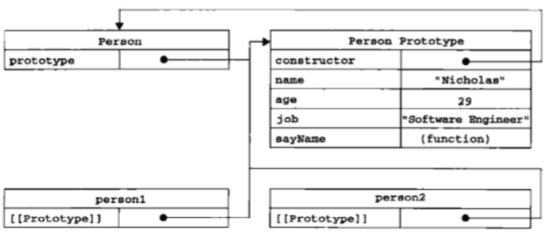

上面说原型对象的属性是实例共用的，但为什么修改person2.name值后，person1的name值没有变？
如果实例重新设置的原型对象属性的值，会创建一个对应的实例属性，通过实例访问该属性时，
优先查找实例属性，再找原型对象属性。delete实例的这个属性后，访问的就是原型属性了。
```js
person1.hasOwnProperty("name"); // false 虽然通过原型可以访问，但不是实例的属性
person2.hasOwnProperty("name"); // true 创建了一个实例属性
delete person2.name; // 
person2.name; // "Nicholas" 访问原型
person2.hasOwnProperty("name"); // false

// ES5获取实例对象的原型 Object.getPrototypeOf()
alert(Object.getPrototypeOf(person1) == Person.prototype); // true

alert("name" in person1); // true 
// 只要可以通过person1访问到name属性就是true，不管是原型属性还是实例属性


alert(hasPrototypeProperty(person1, "name")); // true  是原型属性
alert(hasPrototypeProperty(person2, "name")); // false 
// 设置了person2.name的值后，就非原型属性了

// 关于枚举
// ES5 提供了 Object.keys(),返回对象可以枚举的字符串数组
// 无论是否可枚举都列出属性 Object.getOwnPropertyNames()
var keys = Object.getOwnPropertyNames(Person.prototype); 
// ["constructor", "name", "age", "sayName"]

var keys2 = Object.keys(Person.prototype); // 与for-in结果类似
// ["name", "age", "sayName"]

```
##### 更简单的原型语法
```js
function Person() {
}
Person.prototype = {
    name: "zuo",
    age: 29,
    sayName: function () {
        alert(this.name);
    }
};

var name1 = new Person(); // name1.constructor == Object
alert(name1 instanceof Person); // true
alert(name1 instanceof Object); // true
// name1.constructor  =   {}     Person.prototype == name1.__proto__
alert(name1.constructor == Person); // false  这里如果需要让prototype里的constructor返回Person，需要手动设置值
alert(name1.constructor == Object); // true   

// 在Person.prototype手动加入constructor: Person, 可以解决问题，但会让这个属性可枚举
// 可以使用这种方式来解决上面的问题，但只支持ES5及以上
Object.defineProperty(Person.prototype, "constructor", {
    enumerable: false,
    value: Person
})
```
##### 原型的动态性
可以先创建实例，再修改原型
```js
var friend = new Person();

Person.prototype.sayHi = function () {
    alert("Hi");
};
firend.sayHi(); // "Hi"
```
虽然是动态的，但不能在创建实例后，重写整个原型对象,否则之前的实例无法访问新的原型对象
```js
function Person() {    
}

var friend = new Person();

Person.prototype = { 
    constructor: Person,  // 重写原型对象，constructor 会消失，需手动补上
    name: "Nicholas",
    age: 29,
    sayName: function () {
        alert(this.name);
    }
};
// 如果重写整个对象之后再定义friend，可以调用
friend.sayName(); // error, sayName is not function
```
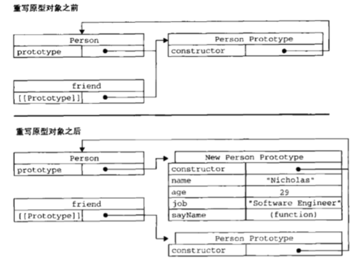

##### 原生对象的原型
Array.prototype.sort, String.prototype.substring都是原生对象的原型，我们可以使用原型，给原生对象定义方法
```js
// 为string添加一个startWith方法
String.prototype.startWith = function (text) {
    return this.indexOf(text) == 0;
};

var msg = "Hello world!";
msg.startWith("Hello"); // true

// 不推荐使用，可能会意外的重写原生方法
```

##### 原型对象的问题
原型模式共享了方法和属性，函数倒没什么，属性相互影响就不合理了，比如有一个属性是数组，使用原型模式创建两个实例，它们
会共享这个数组属性，实例1push一个新元素进去，实例2的该属性也会被影响

#### 组合使用构造函数和原型模式
创建自定义类型的最常见方式，就是组合使用构造函数与原型模式,构造函数定义实例属性，原型模式定义方法和共享的属性
```js
function Person(name, age, job) {
    this.name = name;
    this.age = age;
    this.job = job;
    this.friends = ["Shelby", "Court"];
}

Person.prototype = {
    custructor: Person,
    sayName: function () {
        alert(this.name);
    }
};    

var person1 = new Person("Nicholas", 29, "Software Engineer");
var person2 = new Person("Greg", 27, "Doctor");

person1.friends.push("Van");
alert(person1.friends); // Shelby,Court,Van
alert(person2.friends); // Shelby,Court
alert(person1.friends === person2.friends); // false
alert(person1.sayName === person2.sayName); // true

```

#### 动态原型模式
上面组合的方式，构造函数和原型是独立的，动态原型的模式可以将所有信息都封装到构造函数中
```js
function Person(name, age, job) {
    // 属性
    this.name = name;
    this.age = age;
    this.job = job;
    
    // 方法  只会在初次调用构造函数时执行
    if (typeof this.sayName != "function") {
        Person.prototype.sayName = function () {
            alert(this.name);
        }
    }
}

var friend = new Person("Nicholas", 29, "Software Engineer");
friend.sayName();
```

#### 寄生构造函数模式
除了使用new操作符并把使用的包装函数叫做构造函数之外，这个模式与工厂模式其实是一模一样的。
当上面的模式都不可用时，再使用这个，主要用在特殊情况下为对象创建构造函数，比如创建为数组新增一个方法，而不直接修改Array()构造函数
```js
function Person(name, age, job) {
    var o = new Object();
    
    o.name = name;
    o.age = age;
    o.job = job;
    o.sayName = function () {
        alert(this.name);
    };
    
    return o;
}

var friend = new Person("Nicholas", 29, "Software Engineer");
friend.sayName(); // "Nicholas"

// 特殊数组
function SpecialArray() {
    var values = new Array();
    
    // 添加值
    values.push.apply(values, arguments);
    // 添加方法
    values.toSomeString = function () {
        return this.join('|');
    };
    
    return values;
}

var colors = new SpecailArray("red","blue","green");
colors.toSomeString(); // "red|blue|green"
```

#### 稳妥的构造函数模式
没有公共属性，且方法不引用this对象
```js
function Person(name, age, job) {
    // 创建要返回的对象
    var o = new Object();
    
    // 可以在这里定义私有变量或函数
    
    // 添加方法
    o.sayName = function() {
        alert(name);  
    };
    
    return o;
}
// 在这个模式创建的对象中，除了使用sayName()方法外，没有其他方法访问name的值
var friend = Person("zuo", 29, "sw");
friend.sayName(); // "zuo"

```

### 继承
ECMAScript实现继承主要是依赖原型链来实现
#### 原型链
子对象的原型指向父对象创建的实例，那子对象创建的实例就拥有了父对象实例的所有属性和方法。
理解可参考 [震惊！原来你是这样的原型继承。。](https://www.jianshu.com/p/e858f729bf4c)，[原型继承补充（prototype和__proto__详解）](https://www.jianshu.com/p/7f70b3d3a2a9)
##### 使用原型链实现继承
```js
function Person() {
    this.personName = "Li";
}
Person.prototype.getPersonName = function() {
    return this.personName;
};

function Man() {
    this.manName = "Zuo";
}
// 继承Person
Man.prototype = new Person(); // 这里重写了原型，Man.consturction 是 Person
Man.prototype.getManName = function() {
    return this.manName;
};

// // 重写Person里面的方法
// Man.prototype.getPersonName = function() {
//    return "Test";
// };

var aboy = new Man();
alert(aboy.getPersonName()); // Li
// 查找getPersonName时，先搜索实例aboy，再搜索Man.prototype，再搜索Person.prototype

alert(aboy instanceof Object); // true
alert(aboy instanceof Person); // true
alert(aboy instanceof Man); // true

alert(Object.prototype.isPrototypeOf(aboy)); // true
alert(Person.prototype.isPrototypeOf(aboy)); // true
alert(Man.prototype.isPrototypeOf(aboy)); // true
```
如下图所示:

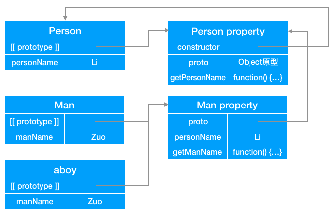
##### 原型链需要注意的问题
- 使用字面量添加原型方法，会重写原型。如果之前设置了继承，会失效
- 包含引用类型值的原型。由于原型是实例共享的，引用类型改变某个值，其他的都会变
- 创建子类型的实例时，无法向父类型的构造函数中传递参数
由于以上的问题，实际中很少会单独使用原型链
```js
function SuperType() {
    this.colors = ["red", "blue", "green"];
}
function SubType() {
}

// 继承SuperType
SubType.prototype = new SuperType();

var instance1 = new SubType();
instance1.colors.push("black");
alert(instance1.colors); // red,blue,green,black

var instance2 = new SubType();
alert(instance2.colors); // red,blue,green,black
```

#### 借用构造函数（constructor stealing）
在子类型构造函数中，调用父类型构造函数。可以解决原型中包含引用类型值所带来的问题。也称伪造对象、经典继承
```js
function SuperType() {
    this.colors = ["red", "blue", "green"];
}
function SubType() {
    // 继承了 SuperType  还可以传递参数  SuperType.call(this，"参数");
    SuperType.call(this);
    
    // 实例属性
    this.age = 27;
}

var instance1 = new SubType();
instance1.colors.push("black");
alert(instance1.colors); // red,blue,green,black

var instance2 = new SubType();
alert(instance2.colors); // red,blue,green
```
仅仅只用借用构造函数，也存在一些问题。
- 无法避免构造函数模式存在的问题-函数每次都会new，不能共用函数。
- 父类型对象的原型中定义的方法，对子类型不可见

#### 组合继承（combination inheritance）
JS里面最常见的继承模式，也叫伪经典继承，将原型链和借用构造函数结合起来使用。使用原型链实现对原型属性和方法的继承，
通过借用构造函数来实现对实例属性的继承。这样通过原型定义方法实现了函数复用，且每个实例也有他自己的属性。
```js
function SuperType(name) {
    this.name = name;
    this.colors = ["red", "blue", "green"];
}
SuperType.prototype.sayName = function () {
    alert(this.name);
};

function SubType(name, age) {
    // 继承属性
    SuperType.call(this, name);
    
    this.age = age;
}
// 继承方法
SubType.prototype = new SuperType();
SubType.prototype.sayAge = function () {
    alert(this.age);
};

var instance1 = new SubType("Li", 29);
instance1.colors.push("black");
alert(instance1.colors); // red,blue,green,black
instance1.sayName(); // Li
instance1.sayAge(); // 29

var instance2 = new SubType("Zuo", 27);
alert(instance2.colors); // red,blue,green
instance2.sayName(); // Zuo
instance2.sayAge(); // 27
```
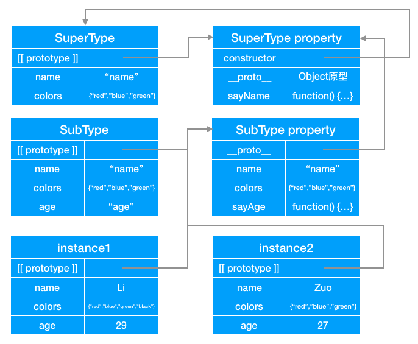
#### 原型式继承
与原型链类似，但并没有使用严格意义上的构造函数
```js
function object(o) {
    function F(){}
    F.prototype = o;
    return new F();
}
// 根据一个对象，copy出对象，中间借用了一个临时性的空构造函数
var person = {
    name: "zuo",
    friends: ["Li", "Zhang", "Wang"]
};
var person2 = object(person);
person2.name = "You"; // 如果赋值创建一个实例实现，会共享person的原型属性
person2.friends.push("Rob");

var person3 = object(person);
person3.name = "Shang";
person3.friends.push("Barble");

alert(person.friends); // Li,Zhang,Wang,Rob,Barble

```
ES5新增 Object.create() 方法规范化了原型式继承，该方法接收两个参数，一个用作新对象原型的对象和一个为新对象定义额外属性的对象（可选）
```js
var person = {
    name: "zuo",
    friends: ["Li", "Zhang", "Wang"]
};

// var person2 = Object.create(person);
// person2.name = "You"; // 如果赋值创建一个实例实现，会共享person的原型属性
// person2.friends.push("Rob"); // 这里仅push，没有重写。会改变原型属性的值
// 如果传入第二个参数
var person2 = Object.create(person, {
    name: { // 这个也是实例属性
        value: "You"
    },
    friends: { // 如果设置了该属性，就为实例属性了，这个对象不会共享原来原型属性。
        value: ["Rob"]
    }
});

var person3 = Object.create(person);
person3.name = "Shang";
person3.friends.push("Barble");

alert(person.friends); // Li,Zhang,Wang,Barble
```
#### 寄生式继承
与原型继承紧密相关，多了一点扩展。不能函数复用
```js
function createAnother(original) {
    var clone = object(original);
    clone.sayHi = function (){
        alert("Hi");
    };
    return clone;
}

var person = {
    name: "zuo",
    friends: ["Li", "Zhang", "Wang"]
};

var p1 = createAnother(person);
p1.sayHi(); // Hi
```
#### 寄生组合式继承
组合继承是用的最多的，但是他需要调用两次子类型构造函数 SuperType(), 寄生组合式继承通过借用构造函数
来继承属性，通过原型链的混成形式来继承方法
```js
function SuperType(name) {
    this.name = name;
    this.colors = ["red", "blue", "green"];
}
SuperType.prototype.sayName = function () {
    alert(this.name);
};

function SubType(name, age) {
    // 继承属性
    SuperType.call(this, name);
    
    this.age = age;
}
// 继承方法，这个是组合继承的实现
// SubType.prototype = new SuperType();

// 这里是寄生组合式继承的实现方式    组合继承会可能会为SubType添加一些实例属性。这种方法不会
function inheritPrototype(subType,superType) {
    var prototype = object(superType.prototype);
    prototype.constructor = subType;
    subType.prototype = prototype;
}
inheritPrototype(SubType, SuperType);


SubType.prototype.sayAge = function () {
    alert(this.age);
};

var instance1 = new SubType("Li", 29);
instance1.colors.push("black");
alert(instance1.colors); // red,blue,green,black
instance1.sayName(); // Li
instance1.sayAge(); // 29

var instance2 = new SubType("Zuo", 27);
alert(instance2.colors); // red,blue,green
instance2.sayName(); // Zuo
instance2.sayAge(); // 27

```

## 六.函数表达式
定义函数的方式有两种，一种是函数声明，另一种就是函数表达式
```js
/**
* 函数声明
* 函数声明具有函数声明提升的特性，函数声明的函数，在执行代码前，会先读取函数声明，可以把函数声明放到调用它语句的后面
*/
func();  
function func(arg0, arg1) {
    
}

// 函数表达式，创建一个匿名函数，赋值给func
var func = function (arg0, grg1) {
    
};

// ECMAScript 无效语法 错误的语法
if (condition) {
    function sayHi() {
        alert('Hi');
    }
} else {
    function sayHi() {
        alert('hehe');
    }
}

// 应该改为
var sayHi;

if (condition) {
    sayHi = function () {
        alert('Hi');
    }
} else {
    sayHi = function () {
        alert('hehe');
    }
}
```
### 递归
函数自己调用自己
```js
function factoriala(num) {
    if (num <= 1) {
        return 1;
    }
    return num * factoriala(num - 1);
}
var fun2 = factoriala;
factoriala = null;
fun2(4); // 这里会出错

// 如果用 arguments.callee 来代替函数名即可，但严格模式不支持
function factorialb(num) {
    if (num <= 1) {
        return 1;
    }
    return num * arguments.callee(num - 1);
}

// 解决方法   使用命名函数表达式
var factorialc = (function f(num) {
    if (num <= 1) {
        return 1;
    }
    return num * f(num - 1);
})
```
### 闭包
```js
function createFun() {
    var result = new Array();

    for (var i = 0; i < 10; i++) {
        result[i] = function() {
            return i;
        }
    }
    return result;
}

function createFun2() {
    var result = new Array();

    for (var i = 0; i < 10; i++) {
        result[i] = function(num) {
            return function() {
                return num;
            }
        }(i);
    }
    return result;
}
```

## 七.BOM
在web中使用javascript，离不开BOM(Browser Object Model)，BOM提供了很多对象，用于访问浏览器的功能
### window对象
BOM的核心对象是window，所有全局作用域中声明的变量、函数都会变成window对象的属性和方法
```js
var age = 29;
function sayAge(){
    alert(this.age);
}

alert(window.age); // 29
sayAge(); // 29
window.sayAge(); //29

// window.设置的变量可以通过 delete删除，而 var age，通过window.age是无法删除的。
// 使用var添加的window属性，有一个名为[[Configurable]]的特性，被设置为false，所以无法删
window.test = 2;
delete window.test  // true
delete window.age // false 
```
#### 窗口位置、大小
```html
<!DOCTYPE html>
<html lang="en">
<head>
    <meta charset="UTF-8">
    <title>Title</title>
</head>
<body>
    <input type="button" value="打开 '我的窗口'" onclick="openWin()">

    <script>
        /***
         *  window.screenLeft 窗口相对于屏幕左边的距离 、window.screenX
         *  window.screenTop  窗口相对于屏幕顶部的距离 、window.screenY
         */
        var myWindow;
        function openWin(){
            myWindow = window.open("", "testWindow","height=400,width=400,top=200,left=400,location=no");
            myWindow.document.write('test');
        }

        setTimeout(function() {
            /**
             * moveTo 移动窗口位置 如果 window.open('http://baidu.com') 这个moveTo会报如下错误
             * SecurityError: Permission denied to access property "moveTo" on cross-origin object
             */
            myWindow.moveTo(100,100); // window.moveTo(x,y) 相对于屏幕左边距，相对于屏幕上边距
            myWindow.resizeTo(600,300); // resizeTo(width,height) 调整窗口大小 单位为像素

            console.log(myWindow.opener === window); // 如果窗口是打开的，这个为 true

            // 关闭弹窗
            setTimeout(function() {
                myWindow.close();
            },2000);
        },3000);

    </script>
</body>
</html>
```
#### setTimeout与setInterval
```js
// 根据值切换对应的demo
var test = 5;

if (test === 1) {
    // 1 2 3  基本同同时打印，大顺序
    setTimeout(function () {
        console.log('1');
    }, 2000);
    setTimeout(function () {
        console.log('2');
    }, 2000);
    setTimeout(function () {
        console.log('3');
    }, 2000);
}

if (test === 2) {
    //  1   3  2  打印1后后面间隔500ms
    setTimeout(function () {
        console.log('1');
    }, 2000);
    setTimeout(function () {
        console.log('2');
    }, 3000);
    setTimeout(function () {
        console.log('3');
    }, 2500);
}

if (test === 3) {
    //  2 1 3  打印1后后面间隔500ms
    setTimeout(function () {
        console.log('1');
    }, 2000);
    setTimeout(function () {
        console.log('2');
    }, 1000);
    setTimeout(function () {
        console.log('3');
    }, 2500);
}

if (test === 4) {
    // 2 3 5 4 1
    // 为什么这里后被执行，因为setTimeout是异步的（是注册事件），他会先把函数注册到事件队列当中，等待主程序走完，然后再被调用。
    setTimeout(function() {
        console.log(1);
    }, 0);
    new Promise(function executor(resolve) {
        console.log(2);
        for( var i=0 ; i<10000 ; i++ ) {
            i === 9999 && resolve();
        }
        console.log(3);
    }).then(function() {
        console.log(4);
    });
    console.log(5);
}

if (test === 5) {
    // 5 1 2 4 3
    setTimeout(function() {
        console.log(1);
    }, 0);

    setTimeout(function() {
        console.log(2);
        // for循环里面如果没有阻塞代码，还是会顺序执行
        for( var i=0 ; i<1000000000 ; i++ ) {
            if (i === 999999999)  {
                console.log(4);
            }
        }
        console.log(3);
    }, 0);

    console.log(5);
}

// 清除setTimeout
console.log('testStart');
var t = setTimeout(function() {
    console.log('exec');
},5000);
clearTimeout(t);

// 每隔一段时间执行
console.log('testStart2');
var t2 = setInterval(function() {
    console.log('exec...');
},1000);
// 3s 后清除
setTimeout(function() {
    clearInterval(t2);
},3000);

```

#### 系统对话框
浏览器可以通过alert()、confirm()、prompt()方法可以调用系统对话框向用户显示消息，系统对话框不包含html，外观有浏览器决定，不是由css决定。
这几个方法打开的对话框都是同步和模态的，显示对话框会阻塞程序向下执行，关掉对话框后程序会继续执行
```js
// alert显示信息 "123"，点击确认关闭
alert('123');
```
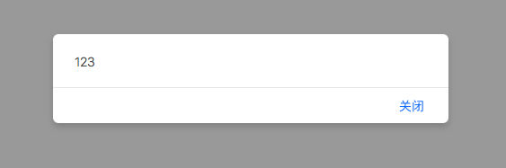

```js
// confirm显示询问框，可点击确认或取消关闭, 分别返回true、false
if (confirm("are you ok?")) {
    alert('您点击了确定');
} else {
    alert('您点击了取消');
}
```
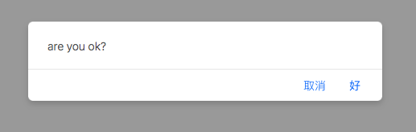
```js
// prompt打开一个对话框，里面包含一个文本输入框，第一个参数为提示内容，第二个参数为输入框的默认值
// 当点击取消返回null，更改内容后返回对应输入框的内容，如果填写为空，返回""
alert(prompt('请输入你的姓名?', '张三'));
```
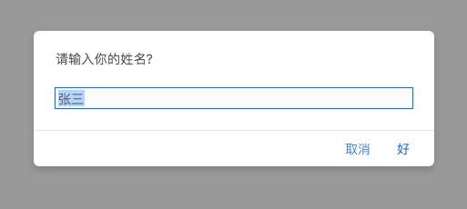

```js
// 另外两个非同步，异步执行的方法
// 调用打印功能，相当于anle ctrl+p
window.print();

// 查找网页里面是否有某个字符串, 如果有打印true，没有打印false
// <p>sdfsdfdfd打发时间乐山大佛技术对接分类数据砥砺奋进是登录</p>
alert(window.find("sdf"));
```
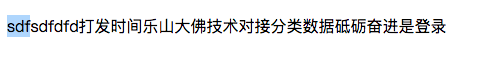

### location对象
可以用来获取和改变页面url，重新加载页面，
location是最有用的BOM对象之一，提供了当前窗口中加载文档相关信息，如URL，域名，页面路径，查询字段、协议等，location是一个很特殊的对象，它既是window对象的属性，也是document对象的属性。window.location和document.location引用的是同一个对象
 ```js
// window.location === document.location  // true
// location.href 完整的url
// location.origin  网站的开头部分带host 可以用来做api接口前置
// location.pathname // 路径，不带host
// location.searh // ?a=1&b=2  查询字符串
// location.hash // #1   hash值
// location.protocol 协议
// 以访问这个url为例子，查看window.location 内容
// https://mbd.baidu.com/newspage/data/landingsuper?context=%7B%22nid%22%3A%22news_9011978904606190454%22%7D&n_type=0&p_from=1#1
```
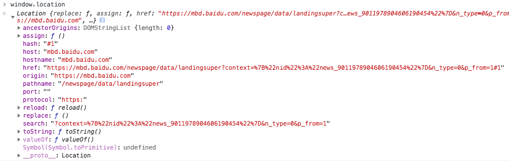
#### 主要属性对应的解释
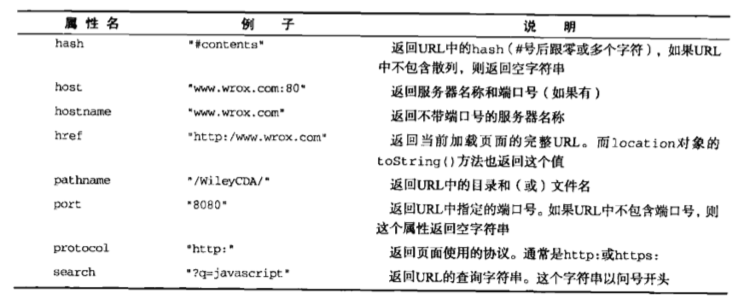
```js

// 前端获取url里面的查询字符串
console.log(getQueryStringArgs());

/**
 * 获取url里面的查询信息(window.location.search)
 * 如果查询为空 ""，如果有查询  "?a=kk"
 * @returns 如果有查询语句返回{},如果没有返回 ""
 */
function getQueryStringArgs() {
    var searchStr = location.search;
    if (!searchStr) {
        return "";
    }

    // 去掉开头的?
    var argsArr;
    searchStr = searchStr.substring(1);

    // 切分后将 xxx=xxx 字符串格式转为 {xxxx:xxxx,....}
    argsArr = searchStr.split('&');
    var args = {};
    for (var i = 0; i < argsArr.length; i++) {
        var itemArr = argsArr[i].split('=');
        var tempKey = decodeURIComponent(itemArr[0]);
        var tempValue = decodeURIComponent(itemArr[1]);
        args[tempKey] = tempValue;
    }
    return args;
}

// 可以通过改变search的值刷新网页


```
#### 改变当前页面url
使用location对象可以通过很多方式来改变当前页面url，每次修改location属性(hash除外)，页面都会以新的URL重新加载
```js
location.assign("http://zuo11.com"); // 切换url
// 如果将location.href与window.location 设置为一个url，与location.assign效果完全一样

// 假设初始化URL为 http://www.zuo11.com/test/

// 将URL修改为 http://www.zuo11.com/test/#section1
location.hash ="#section1";

// 将URL修改为 http://www.zuo11.com/test/?k=2
location.search = '?k=2';

// 将URL修改为 http://www.baidu.com/test/
location.hostname = "www.baidu.com";

// 将URL修改为 http://www.zuo11.com/mydir/
location.pathname = "mydir";

// 将URL修改为 http://www.zuo11.com:8080/test/
location.port = 8080;
```
location改变URL后，浏览器会产生一条新的记录，可以通过后退，返回到前一个页面，使用location.replace(),可以无法返回上一页
```js
location.reload();     // 重新加载 (可能是从缓存中加载)
location.reload(true); // 重新加载 (从服务器重新加载)
```

### navigator对象
可以用来获取浏览器厂商、UA、平台、语言、是否有网、是否启用了cookie、安装的插件、
navigator对象可以用来识别客户端浏览器信息，UA等。更多信息，参考 [Navigator - Web APIs | MDN](https://developer.mozilla.org/en-US/docs/Web/API/Navigator)
#### 基本属性
```js
// appCodeName: "Mozilla",  // 浏览器名称      Safari、Firefox、Chrome、IE 均是这个值
// appName: "Netscape",     // 完整的浏览器名称 Safari、Firefox、Chrome、IE 均是这个值
// product: "Gecko",        // 产品名称       Safari、Firefox、Chrome、IE 均是这个值

// appVersion: "",          // 浏览器的版本，一般不与实际的浏览器版本对应
// userAgent: "",           // 浏览器的用户代理字符串,HTTP规范明确规定，浏览器应该发送简短的用户代理字符串指明浏览器的版本和版本号

// cookieEnabled: true,     // 是否启用的cookie
// onLine: true,            // 是否有网络

// language: "zh-CN",       // 浏览器主语言
// platform: "MacIntel",    // 浏览器所在的系统平台， windows为win32
// vendor: "Apple Computer, Inc." // 浏览器的品牌，IE、Edge、Firefox均为"", Safari和Chrome(Google Inc.)有值，


/*
IE11
appVersion:  "5.0 (Windows NT 10.0; WOW64; Trident/7.0; .NET4.0C; .NET4.0E; rv:11.0) like Gecko"
userAgent:    "Mozilla/5.0 (Windows NT 10.0; WOW64; Trident/7.0; .NET4.0C; .NET4.0E; rv:11.0) like Gecko"

Edge
appVersion:  "5.0 (Windows NT 10.0; Win64; x64; ServiceUI 9) AppleWebKit/537.36 (KHTML, like Gecko) Chrome/52.0.2743.116 Safari/537.36 Edge/15.15063"
userAgent:   "Mozilla/5.0 (Windows NT 10.0; Win64; x64; ServiceUI 9) AppleWebKit/537.36 (KHTML, like Gecko) Chrome/52.0.2743.116 Safari/537.36 Edge/15.15063"

QQ
appVersion:  "5.0 (Windows NT 10.0; WOW64) AppleWebKit/537.36 (KHTML, like Gecko) Chrome/63.0.3239.26 Safari/537.36 Core/1.63.5702.400 QQBrowser/10.2.1893.400"
userAgent:    "Mozilla/5.0 (Windows NT 10.0; WOW64) AppleWebKit/537.36 (KHTML, like Gecko) Chrome/63.0.3239.26 Safari/537.36 Core/1.63.5702.400 QQBrowser/10.2.1893.400"

Chrome 
appVersion: "5.0 (Macintosh; Intel Mac OS X 10_13_5) AppleWebKit/537.36 (KHTML, like Gecko) Chrome/67.0.3396.99 Safari/537.36"
userAgent:   "Mozilla/5.0 (Macintosh; Intel Mac OS X 10_13_5) AppleWebKit/537.36 (KHTML, like Gecko) Chrome/67.0.3396.99 Safari/537.36"

Firefox
appVersion: "5.0 (Macintosh)"
userAgent:   "Mozilla/5.0 (Macintosh; Intel Mac OS X 10.13; rv:61.0) Gecko/20100101 Firefox/61.0"

Safari
appVersion: "5.0 (Macintosh; Intel Mac OS X 10_13_5) AppleWebKit/605.1.15 (KHTML, like Gecko) Version/11.1.1 Safari/605.1.15"
userAgent:   "Mozilla/5.0 (Macintosh; Intel Mac OS X 10_13_5) AppleWebKit/605.1.15 (KHTML, like Gecko) Version/11.1.1 Safari/605.1.15"
*/
```
#### 检测插件
navigator.plugins 数组记录了当前浏览器上安装的插件
```js
// 相关属性
// name : 插件的名字
// description: 插件的描述
// filename: 插件的文件名
// length: 插件所处理的MIME类型数量

// 检测插件 (非IE环境)
function hasPlugin(name) {
    name = name.toLowerCase();
    for (var i = 0; i < navigator.plugins.lenght; i++) {
        if (navigator.plugins[i].name.toLowerCase().indexOf(name) > -1) {
            return true;
        }
    }
    return false;
}

// 检测Flash
alert(hasPlugin("flash"));


// IE中检测插件方法
function hasIEPlugin(name) {
    try {
        new ActiveXObject(name);
        return true;
    } catch (ex) {
        return false;
    }
}
// 检测Falsh
alert(hasIEPlugin("ShockwaveFlash.ShockwaveFlash"));
```
#### 待后续研究
- Navigator.registerContentHandler()
- Navigator.registerProtocolHandler()
- Navigator.serviceWorker
- Navigator.getUserMedia()


### screen对象
可以查看屏幕分辩率，
在编程中用处不大，screen对象基本上只用来表明客户端能力，记录了屏幕相关信息
 ```js
// height：900  屏幕像素高的
// width：1400   屏幕像素宽度
// availHeight: 841   有效高度
// availLeft: 0
// availTop: 23
// availWidth: 1440
// colorDepth: 24   色彩位数
// pixelDepth: 24   像素深度
```

### history对象
可以用来前进、后退，
history对象保存着用户的上网记录，出入安全方面的考虑，开发人员无法获取具体访问的URL，但可以前进或后退
```js
history.go(-1); // 后退一页  相当于 histroy.back();

history.go(1); // 前进一页 相当于  history.forward();
```


## 八.客户端检测
可以根据location、navigator、获取设备信息，
主要是浏览器兼容性方面处理，根据UA识别对应的浏览器版本，是否为PC/移动端，待完善

## 九.DOM
DOM（文档对象模型），是针对HTML和XML文档的一个API，DOM描绘了一个层次化的结点树，允许开发人员添加、移除和修改页面的某一部分。1998年10月，DOM1级规范成为W3C的推荐标准，为基本的文档结构及查询提供了接口
### 节点层次
DOM可以将HTML或XML文档描绘成一个由多层结点构成的结构，节点分为不同的类型，每种类型分别表示文档中不同的信息或标记，每个节点都拥有各自的特点、数据和方法，与其他节点存在某种关系。节点之间的关系，构成了层次，形成树形结构。

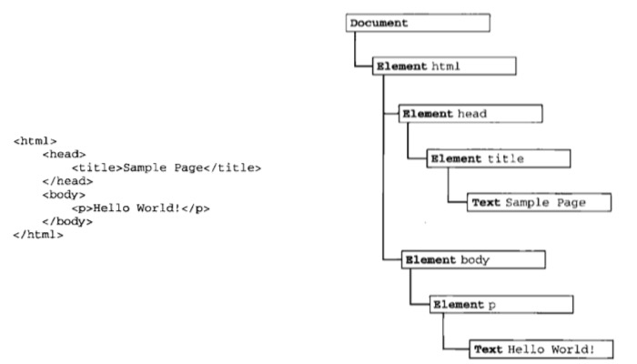

document节点是每个文档的根节点，上图中document节点只有一个子节点，即<html>元素，称之为文档元素，它是文档的最外层元素。文档中的其他所有元素都包含在其中。每个文档只能有一个文档元素，在HTML页面中文档元素始终是<html>元素，XML中，没有预定义的元素，任何元素都可能存在文档元素
#### Node类型
每一段标记都可以通过树中的一个节点来表示：
- html元素通过**元素节点**表示
- 特性(attribute)通过**特性节点**表示
- 文档类型通过**文档类型节点**表示
- 注释通过**注释节点**表示

DOM1级定义了一个Node接口，该接口由DOM中的所有结点类型实现，javascript中的所有结点类型都继承自Node类型，因此所有的结点类型都共享相同的属性和方法。
**每个节点都有一个nodeType属性，用于表明节点的类型**，节点类型总共有12种，分别对应一个常量
-  1 Node.ELEMENT_NODE   元素节点，最常见的一种
-  2 Node.ATTRIBUTE_NODE  特性节点，element.attributes[0]
-  3 Node.TEXT_NODE    文本节点，文字基本都是文本节点
-  4 Node.CDATA_SECTION_NODE (只针对XML文档)
-  5 Node.ENTITY_REFERENCE_NODE 
-  6 Node.ENTITY_NODE
-  7 Node.PROCESSING_INSTRUCTION_NODE
-  8 Node.COMMENT_NODE   注释节点，注释
-  9 Node.DOCUMENT_NODE   document，文档节点。一个html只有一个, .title, .URL, .referrer
- 10 Node.DOCUMENT_TYPE_NODE doctype节点，HTML5最顶部
- 11 Node.DOCUMENT_FRAGMENT_NODE 文档片段节点，属于中间节点，过度用
- 12 Node.NOTATION_NODE 
```js
document.title = 'test' // 可以测试标题 
document.nodeName // "#document"
document.nodeType // 9    Node.DOCUMENT_NODE

document.head.nodeName   // "HEAD"
document.head.nodeType  // 1 ELEMENT_NODE
document.node.nodeValue // null

// 判断节点类型
if (someNode.nodeType === Node.ELEMENT_NODE) { // 在IE中无效
    alert("Node is an element.");
}

// IE没有公开Node类型的构造函数，所以上面的方法在IE中不支持
if (someNode.nodeType === 1) { // 适用于所有浏览器
    alert("Node is an element.");
}
```
Web浏览器并不支持所有结点类型，最常用的是元素和文本节点
##### nodeName 和 nodeValue属性
```js
if (someNode.nodeType === 1) {
    value = someNode.nodeName;  //对于元素节点，nodeName始终为元素的标签名，nodeValue始终为null
}
```
##### 节点关系
节点的查询、获取
```js
// 子节点 childNodes
var firstChild =someNode.childNodes[0];
var secondChild = someNode.childNodes.item(1);
var count = someNode.childNodes.length;

// 父节点 parentNode

// 兄弟节点 sibling、前一个兄弟节点previousSibling、后一个兄弟节点 nextSibling
// 第一个子节点的previousSibling和最后一个节点的nextSibling都为null
someNode.childNodes[0] === someNode.firstChild
someNode.childNodes[someNode.childNodes.length - 1] === someNode.lastChild

// 如果没有子节点，lastChild和firstChild均为null

// 查询某个节点是否有子节点
someNode.hasChildNodes()  // true or false

// 每个节点都有一个shux  ownerDocument，指向整个文档的文档节点
```
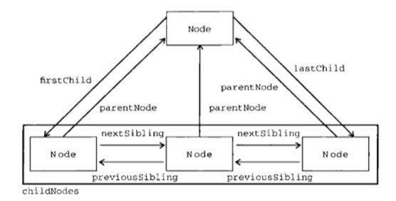
##### 操作节点
节点的新增（appendChild(新节点/旧节点)、insertBefore(newNode, oldNode)）、修改(replaceChild())、删除(removeChild())
上面关系指针都是只读的，DOM还提供了一些操作节点的方法
```js
// 在末尾新增一个子节点  appendChild() 用于向childNodes列表的末尾添加一个节点
var returnedNode = someNode.appendChild(newNode);
alert(returnedNode === newNode); // true
alert(someNode.lastChild === newNode); // true

// 如果appendChild()操作的节点已经是文档的一部分了，会将原来的节点转移到新的位置
var returnedNode = someNode.appendChild(someNode.firstChild);
alert(returnedNode === someNode.firstChild); // false
alert(returnedNode === someNode.lastChild); // true

// 在指定位置插入节点 insertBefore()
// 插入后成为最后一个子节点
someNode.insertBefore(newNode,null);
// 插入后成为第一个子节点
someNode.insertBefore(newNode,someNode.firstChild);
// 插入到最后一个子节点前面
someNode.insertBefore(newNode,someNode.lastChild);

// 替换节点 replaceChild(要插入的节点，要替换的节点), 返回被替换的节点
someNode.replaceChild(newNode, someNode.firstChild); // 替换第一个子节点
someNode.replaceChild(newNode, someNode.lastChild);  // 替换最后一个子节点 

// 移除节点
someNode.removeChild(someNode.firstChild); // 移除第一个子节点
someNode.removeChild(someNode.lastChild);  // 移除最后一个子节点

// 所有节点都有的方法 cloneNode()、normalize()
// 1.cloneNode() 复制一个相同的副本，这个副本属于文档所有，但类似于孤儿，没有指定父节点
// 参数为true时执行深复制，复制节点及整个节点树，false时只复制节点本身
// 如果一个ul有三个子li节点，ul对应myList对象
//<ul> 
//  <li>item 1</li>
//  <li>item 2</li>
//  <li>item 3</li>
//</ul>
var deepList = myList.cloneNode(true);
deepList.chilidNodes.length // 3，如果是cloneNode(false)则为0，不包含子节点
var shallowList = myList.cloneNode(false) // 浅复制，只是复制节点本身，不会复制子节点
shallowList.childNodes.length // 0

```
#### Document类型（Node.DOCUMENT_NODE 9）
JS通过Document类型表示文档，在浏览器中 document对象是 HTMLDocument(继承自Document类型)的一个实例，表示整个html页面，document对象是window的一个属性，可以全局使用。Document节点具有以下特征
- nodeType 的值为 9 Node.DOCUMENT_NODE
- nodeName 为 "#document", nodeValue === null , parentNode === null ownerDocument === null
- 在浏览器中，其子节点一般是一个DocumentType(最多一个)，Document类型可以表示HTML页面或其他基于xml的文档
##### 文档子节点
```js
// 如下页面
// <html>
//     <body>
//     </body>
// </html>
var html = document.documentElement;
alert(html === document.childNodes[0]); //true 如果HTML5，false,<!docytype html>
alert(html === document.firstChild); // true 如果HTML5，false,<!docytype html>


var body = document.body;
var doctype = document.doctype; // 如果有就是<!docytype html>，如果头部没写，就是null
```
##### 文档信息
```js
console.log(document.title); // 获取标题
document.title = "JS高程"; // 设置标题

// 获取完整URL
var url = document.URL;
// 取得域名
var domain = document.domain;
// 来源的URL，如果是直接进入，则为"", 
// 如果从https://github.com/zuoxiaobai?tab=repositories进入到当前页面
var referrer = document.referrer; // 如果是上面的场景，则值未"https://github.com/zuoxiaobai?tab=repositories"
```
##### 查找元素
- document.getElementById('kk') // 获取id为kk的元素，类型为 HTMLElement
- document.getElementsByTagName('div')  // 获取页面所有的div元素 HTMLCollection
- document.getElementsByName('kk')  // 获取name='kk' 的所有元素
- document.getElementsByClassName('kk') // 获取class='kk'的所有元素
```js
// <div id="myDiv">Some text</div>
var div = document.getElementById("myDiv");  // 如果没有该id的元素，值为null
div instanceof  HTMLElement // true

var div2 = document.getElementsByTagName('div');
div2 instanceof HTMLCollection // true HTMLElement数组
div2[0] instanceof HTMLElement // true

//  
// 
var images = document.getElementsByTagName('img');
alert(images.length); // 2
alert(images[0].src);
alert(images.item(0).src); // src内容


imgs.namedItem('myImg') === imgs["myImg"] // 2.png那张图片

// <text id='t' name="color">textkkkk</text>
document.getElementsByName('color') // 获取name属性为color的元素
```
##### 特殊集合
```js
// document.anchors 获取文档中所有带name特性的a元素，必须要有name属性

// document.forms   相当于  document.getElementsByTagName('form')

// document.images 相当于 document.getElementsByTageName('img')

// document.links 获取所有a元素，相当于 documet.getElmentsByTagName('a')
```

##### DOM一致性
检测浏览器是否支持某些DOM功能及版本，待完善

##### 文档写入
document.write() document.writeln() 向文档中输入内容
```html
<!-- 使用document.write()在页面呈现的过程中直接向其中输入了内容-->
<!DOCTYPE html>
<html lang="en">
<head>
    <meta charset="UTF-8">
    <title>document.write() Title</title>
</head>
<body>
    <p>The current date and time is:
    <script>
        document.write("<strong>"+(new Date()).toLocaleString()+"</strong>");
    </script></p>
</body>
</html>
```
在文档加载结束后，再调用document.write()会覆盖、重写整个页面的内容
```html
<!DOCTYPE html>
<html lang="en">
<head>
    <meta charset="UTF-8">
    <title>document.write() Title</title>
</head>
<body>
    <p>The current date and time is</p>
    <script>
        window.onload = function() {
            document.write("hello world");
        }
    </script>
</body>
</html>
```

#### Element类型（1 Node.ELEMENT_NODE）
除Document类型外，Element类型算是Web编程中最常用的类型了，它用于表现XML或HTML元素，提供了对元素标签名、子节点及特性的访问
- nodeType 的值为 1
- nodeName 的值为元素的标签名, nodeValue === null , parentNode 可能是Document或Element
- 访问元素的标签名可以使用nodeName属性，也可以使用tagName属性，两个属性会返回相同的值
```html
<!DOCTYPE html>
<html lang="en">
<head>
    <meta charset="UTF-8">
    <title>Title</title>
</head>
<body>
    <div id="myDiv"></div>
    <script>
        var div = document.getElementById("myDiv");

        // 在HTML中，标签名始终都以全部大写表示
        alert(div.tagName); // DIV
        alert(div.tagName === div.nodeName); // true
    </script>
</body>
</html>
```

##### HTML元素
所有的HTML元素都由HTMLElement类型或其子类型表示，HTMLElement类型继承自Element，并添加了一些属性
- id，元素在文档中的唯一标识符
- className 与元素的class属性对应，及元素指定的css类
- title 有关元素的附加说明
- lang 元素内容的语言，很少使用
- dir 语言方向, 值为 "ltr"（left to right，从左至右）或 "rtl"(right to left，从右至左)，很少使用
```html
<!DOCTYPE html>
<html lang="en">
<head>
    <meta charset="UTF-8">
    <title>Title</title>
</head>
<body>
    <div id="myDiv" class="bg" title="body text" lang="en" dir="rtl">abcdefg</div>
    <script>
        var div = document.getElementById("myDiv");

        // 在HTML中，标签名始终都以全部大写表示
        alert(div.id); // myDiv
        alert(div.className); // bg
        alert(div.title); // body text
        alert(div.lang); // en
        alert(div.dir); // rtl   这里注意，文字会在屏幕右边显示，类似于右对齐。从右边开始显示

        // 也可以直接修改属性, 立即生效
        div.id = "someOther";
        div.className = "ft";
        div.title = "Some other text";
        div.lang = "ch";
        div.dir = "ltr";
    </script>
</body>
</html>
```
HTML元素以及与之关联的类型
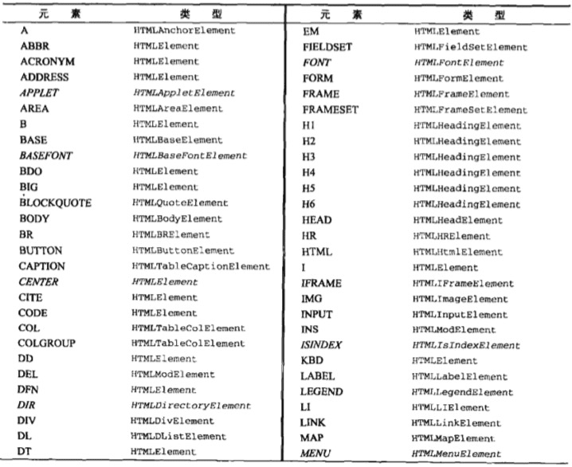
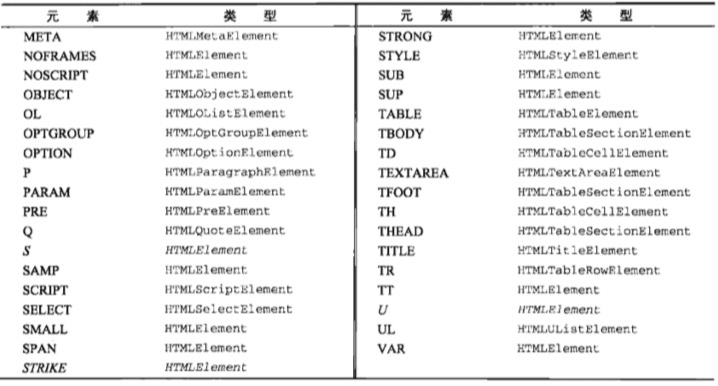
##### 获取、设置、移除特性 getAttribute()  setAttribute()  removeAttribute()
```js
var div = document.getElementById("myDiv");
div.id // myDiv
div.getAttribute('id') // myDiv

// 设置特性值
div.setAttribute('id', 'test') // 等价于 div.id = 'test'

div.removeAttribute('class') // 删除class特性
```
##### attributes属性
可以用来增删查改特性，主要用来遍历某个元素的特性。
```js
// 获取某个节点的属性列表, 类型为 NamedNodeMap
// <div id="myDiv" class="bg" title="body text" lang="en" dir="rtl">abcdefg</div>
let myDiv = document.getElementById('myDiv')
let s = myDiv.attributes 
// NamedNodeMap {0: id, 1: class, 2: lang, 3: dir, id: id, class: class, lang: lang, dir: dir, length: 4}

s.getNamedItem('id').nodeName // id  
s.getNamedItem('id').nodeValue // myDiv

s['title'].nodeValue = 'xxx'  // 设置title特性值为xxx
s[0].nodeValue // id 

s.removeNamedItem('id') // 移除id的特性，相当于 s.removeAttribute('id')
```
##### 创建元素
document.createElement()
```js
// 创建一个div元素
// <div class=​"ft">footer</div>​
k = document.createElement('div')
k.id = 'id2'
k.innerText = '1212'
document.getElementsByClassName('ft')[0].appendChild(k)
// <div class=​"ft">footer<div id='id2'>1212</div></div>​
```

#### Text 类型（4 Node.TEXT_NODE）
文本节点有Text类型表示，不能包含HTML代码，不支持子节点
- nodeType的值为3  Node.TEXT_NODE
- nodeName 的值为 '#text'
- nodeValue 的值为节点所包含的文本
- document.createTextNode() 创建文本节点
- element.normalize() 规范化文本节点，合并多个子文本节点
- element.splitText() 按照指定位置分割文本节点
```js
//  <div id='someOther' class='ft' title='Some other text'>abcdefg</div>
var oth = document.getElementById('someOther')
var textNode = oth.childNodes[0] // Text()  
textNode.nodeType // 3
textNode.nodeName // "#text"
textNode.nodeValue // "abcdeft"
textNode.nodeValue = 'ddd'   // 修改text的值

// 代码创建一个文本节点，挂载到元素节点div上，再放到body里面
var e = document.createElement('div')
e.className = 'message'

var tNode = document.createTextNode('hello world')
e.appendChild(tNode)

// 一个div可以多增加几个textNode，中间不会有空格，会连着显示。
var tNode2 = document.createTextNode('---hello world---')
e.appendChild(tNode2)

document.body.appendChild(e)

e.childNodes.length // 2
e.normalize() // 规范化文本节点
e.childNodes.length // 1


// 再分割文本节点 
var newNode = e.firstChild.splitText(5)
e.firstChild.nodeValue // 'hello'
newNode.nodeValue // " world---hello world---"
e.childNodes.length // 2
```

#### Comment 类型（8 Node.COMMENT_NODE）
注释类型
- nodeType的值为8  Node.COMMENT_NODE
- nodeName 的值为 '#comment'
- nodeValue 的值为 注释类型    等价于 .data 

```js
let divEle = document.createElement('div');
let comNode = document.createComment('测试注释类型');
divEle.id = "comDiv";
divEle.appendChild(comNode);

comNode.nodeType // 8
comNode.nodeName // "#comment"
comNode.nodeValue // 测试注释类型  
comNode.data // 测试注释类型，以上两种都可以修改注释内容

```

#### DocumentType类型（10 Node.DOCUMENT_TYPE_NODE）
DocumentType 包含着与文档的doctype有关的所有信息 document.firstChild => <!DOCTYPE html>
- nodeType的值为10  Node.DOCUMENT_TYPE_NODE
- nodeName 的值为doctype类型 'html'
- nodeValue 的值为 null 
- 父节点 document， 不支持子节点
```js
var e = document.firstChild  // <!DOCTYPE html>
e.nodeType // 10
e.nodeName // html
e.nodeValue  // null
```

#### DocumentFragment（11 Node.DOCUMENT_FRAGMENT_NODE）
文档片段类型，不会真正的再文档里形成节点，类似与一个中转节点。
- nodeType的值为11
- nodeNmae 的值为 "#document-fragment"
- nodeValue 的值为 null
- parentNode 的值为 null
```js
var fragment = document.createDocumentFragment();

var ul = document.createElement('ul');
for (let i = 0; i < 3; i++) {
  let li = document.createElement('li');
  li.appendChild(document.createTextNode(`text ${i}`));
  fragment.appendChild(li)
}
ul.appendChild(fragment);
document.body.appendChild(ul);

ul.childNodes // 只有3个 li 子节点

```

#### Attr类型 (2 Node.ATTRIBUTE_NODE)
特性节点类型，element.attributes就是特性节点数组，子元素就是特性节点
- nodeType的值为2
- nodeNmae 的值为特性的名称，比如 id
- nodeValue 的值为特性的值，比如 xx
- parentNode 的值为 null
- 不支持子节点

```js
var attr = document.createAttribute('align');
attr.value = 'left';

attr.nodeType // 2
attr.nodeName // align
attr.nodeValue // left

var element = document.createElement('div');
element.setAttribute(attr);
element.attributes['align'].value // left
element.getAttributeNode('align').value // left
element.getAttribute('align') // left
```

### DOM操作技术
DOM操作往往是JS程序中开销最大的部分，NodeList对象是动态的，每次访问NodeList对象，都会运行一次查询，尽量少DOM操作
#### 动态添加脚本script
```js
// <script type='text/javascript' src='text.js'></script>
// test.js 里面 alert('test dynamic script')
// 添加一个script脚本元素节点
var scriptNode = document.createElement('script');
scriptNode.src = 'test.js';
scriptNode.type = 'text/javascript';
document.body.appendChild(scriptNode);

// 上面是载入一个js文件，加载行内方式js代码
var sNode = document.createElement('script');
sNode.type = 'text/javascript';
// sNode.appendChild(document.createTextNode('function sayHi() { alert("Hi"); }'));
sNode.text = 'function sayHi() {alert("Hi");} sayHi()';  // 兼容IE写法

document.body.appendChild(sNode);

// 封装成函数
function loadScriptString(scriptStr) {
  var script = document.createElement('script');
  script.type = 'text/javascript';
  try {
    script.appendChild(document.createTextNode(scriptStr));
  } catch (e) {
    // IE下可能会失效，走这里的逻辑
    script.text = scriptStr;
  }
  document.body.append(script);
}
loadScriptString('function sayHi() { alert("Hi"); } sayHi()');

// 等效于
eval('function sayHi() { alert("Hi"); } sayHi()');
```

#### 动态添加样式style
```js
//  <link rel="stylesheet" type="text/css" href="test.css">
var linkNode = document.createElement('link');
linkNode.rel = 'stylesheet';
linkNode.setAttribute('type', 'text/css'); // 熟悉下语法
linkNode.href = 'test.css';
document.head.appendChild(linkNode);
// document.head 等价于 document.getElementsByTagName('head')[0]

// text node
// <style>
//   body { color: red }
// </style>
function loadStyleString(cssStr) {
  var styleNode = document.createElement('style');
  try {
    styleNode.appendChild(document.createTextNode(cssStr));
  } catch (e) {
    // IE 不允许动态添加 script、style标签子节点，会报异常，需要特殊处理
    styleNode.styleSheet.cssText = cssStr;
  }
  document.body.appendChild(styleNode);
}
loadStyleString('body {color: red;}');

```

#### 操作表格HTML-DOM
动态创建一个表格，html代码如下，先利用DOM API来动态创建。再利用HTML-DOM提供的table、tbody、tr方法来重构
```html
<!DOCTYPE html>
<html>
  <head>
    <meta charset="UTF-8">
    <title>表格</title>
  </head>
  <body>
    <table border="1" width="100%">
      <tbody>
        <tr>
          <td>Cell 1,1</td>
          <td>Cell 1,2</td>
        </tr>
        <tr>
          <td>Cell 2,1</td>
          <td>Cell 2,2</td>
        </tr>
      </tbody>
    </table>
  </body>
</html>

```
js实现
```js
let tableNode = document.createElement('table');
tableNode.border = '1';
tableNode.width = '100%';

let tbodyNode = document.createElement('tbody');

// 添加第一行
let tr1 = document.createElement('tr');
let td11 = document.createElement('td');
td11.appendChild(document.createTextNode('Cell 1,1'));
let td12 = document.createElement('td');
td12.appendChild(document.createTextNode('Cell 1,2'));
tr1.appendChild(td11);
tr1.appendChild(td12);

// 添加第二行
let tr2 = document.createElement('tr');
let td21 = document.createElement('td');
td21.appendChild(document.createTextNode('Cell 2,1'));
let td22 = document.createElement('td');
td22.appendChild(document.createTextNode('Cell 2,2'));
tr2.appendChild(td21);
tr2.appendChild(td22);

tbodyNode.appendChild(tr1);
tbodyNode.appendChild(tr2);

tableNode.appendChild(tbodyNode);
document.body.appendChild(tableNode);

```
HTML DOM为方便创建表格提供的 table、tbody、tr 属性及方法
```html
<table border="1" width="100%">
  <caption>表格的标题</caption>
  <thead>
    <tr>
      <th>列1</th>
      <th>列2</th>
    </tr>
  </thead>
  
  <tbody>
    <tr>
      <td>Cell 1,1</td>
      <td>Cell 2,1</td>
    </tr>
    <tr>
      <td>Cell 1,1</td>
      <td>Cell 2,1</td>
    </tr>
  </tbody>
  
  <tfoot>
    <tr>
      <td colspan='2'>table foot</td>
    </tr>
  </tfoot>
</table>
```
```js
// 先获取table元素
var tableEle = document.getElementsByTagName('table')[0];

// table元素节点 相关属性
tableEle.caption // 获取caption元素节点，如果没有，则返回null
tableEle.tBodies // <tbody>元素的数组， HTMLCollection   tableEle.tBodies[0] 一个tbody元素
tableEle.tFoot // 获取tFoot元素节点
tableEle.tHead // 获取tHead元素节点
tableEle.rows // 获取表格里的tr数组，包含thead、tfoot，4个  tableEle.rows[0] tr节点

// table元素节点 相关方法insert
tableEle.createTHead() // 如果table内已有<thead>，返回对应的thead元素节点，如果没有，创建<thead></thead>并添加到表格，返回其引用
tableEle.createTFoot() // 如果table内已有<tfoot>，返回对应的tfoot元素节点，如果没有，创建<tfoot></tfoot>并添加到表格，返回其引用
tableEle.createCaption() // 如果table内已有<caption>，返回对应的节点，如果没有，创建<caption></caption>并添加到表格，返回其引用

tableEle.deleteTHead() // 删除<thead>元素节点
tableEle.deleteTFoot() // 删除<tfoot>元素节点
tableEle.deleteCaption() // 删除<caption>元素节点
tableEle.deleteRow(pos) // 删除rows里面的某一行，从0开始，tableEle.deleteRow(0)，删除第一个tr节点
tableEle.insertRow(pos) // 创建一个<tr>添加到table里，并返回其引用，如果pos不传值，添加到末尾，(tfoot里面)，tableEle.insertRow(0) 在首部添加tr

// tbody 元素的属性及方法
var tbodyNode = tableEle.tBodies[0];
tbodyNode.rows // <tbody> 里的元素数组 HTMLColletion, length = 2
tbodyNode.deleteRow(pos) // 删除指定位置tr节点
tbodyNode.insertRow(pos) // 在指定位置插入节点

// tr 元素属性及方法
var trNode = tbodyNode.firstElementChild; // 第一个元素节点
trNode.cells // 保存着tr里面的单元格列表元素，HTMLCollection   <td> List
trNode.deleteCell(pos) // 删除指定位置的单元格
trNode.insertCell(pos) // 指定位置添加<td></td>

```

用table相关的HTML-DOM API重写之前创建table的例子

```js
let tableNode = document.createElement('table');
tableNode.border = '1';
tableNode.width = '100%';

let tbodyNode = document.createElement('tbody');

// 添加第一行
let tr1 = tbodyNode.insertRow(0);
let td1 = tr1.insertCell(0);
let td2 = tr1.insertCell(1);
td1.appendChild(document.createTextNode('Cell 1,1'));
td2.appendChild(document.createTextNode('Cell 1,2'));

// 添加第二行
let tr2 = tbodyNode.insertRow(1);
let td3 = tr2.insertCell(0);
let td4 = tr2.insertCell(1);
td3.appendChild(document.createTextNode('Cell 2,1'));
td4.appendChild(document.createTextNode('Cell 2,2'));

tableNode.appendChild(tbodyNode);
document.body.appendChild(tableNode);
```

#### NodeList
节点是动态的，下面的例子中，如果获取了某个节点元素，每次访问其length时，元素都有动态更新，length也会动态增加是个死循环，为了提高性能，尽量少操作dom
```js
// <div>123</div>
var divs = document.getElementsByTagName('div'), i, div;

for (let i = 0; i < divs.length; i++) {
  div = document.createElement('div');
  document.body.appendChild(div);
}

// 改写上面的死循环，这样就只执行有限的个数了。
var divs = document.getElementsByTagName('div'), i, div;
var length = 0;
for (i = 0, length= divs.length; i < length; i++) {
  div = document.createElement('div');
  document.body.appendChild(div);
}
```


## 第11章：DOM扩展
