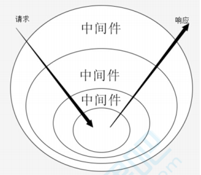

# Koa

## node基础复习
### node api 三种调用方式
```js
// 1.一般 node调用api使用的是callback方式
fun('./index1.js', (err, data) => {
  console.log(err ? 'read err' : data)
})
// 模拟实现
function fun(arg, callback) {
  try {
    aaa() // 执行一些内部操作
    callback(null, 'result') // 如果执行成功，err设置为null, 结果通过第二参数返回
  } catch(e) {
    callback(e)
  }
}

// 通过 promisify 改造后的fun函数
const { promisify } = require('util')
const promisefun = promisify(fun)

// 2.promise方式调用
promisefun('./index1.js').then((data) => {
  console.log(data)
}, (err) => {
  // 如果后面有.catch 这里的优先级会高一点
  console.log(err)
})
// 或者
promisefun('./index1.js').then((data) => {
  console.log(data)
}).catch(err => {
  console.log('read err')
})

// 3.通过async/await 调用promise函数
// await 需要用 async 函数包裹
setTimeout(async () => {
  try {
    let data = await promisefun('./index1.js')
    console.log(data)
  } catch(e) {
    console.log('read err')
  }
}, 0)

```

### util模块内置 promisify 实现
promisify 可以把老的callback方式，转换为promise函数，怎么实现的呢？
```js
// 普通callback方式
function fun(arg, callback) {
  try {
    aaa() // 执行一些内部操作
    callback(null, 'result', 'result2') // 如果执行成功，err设置为null, 结果通过第二参数返回
  } catch(e) {
    callback(e)
  }
}

// promisify模拟实现
function promisify(fun) {
  // 生成的函数，会接收一个参数arg，数据和错误，需要我们在promise内部用reject或resolve传出结果
  return function(...args) {
    // 将传入的参数保存到args数组
    return new Promise((resolve, reject) => {
      // 将callback函数push到参数数组里，再间接调用fun
      args.push((err, result) => {
        // 如果fun函数执行成功会执行该函数并传入 (null, result)
        // 如果fun函数执行错误会执行该函数并传入 (err)
        // resolve() 只能接受并处理一个参数，多余的参数会被忽略掉。 spec上就是这样规定。
        // 如果回调函数，传出了多个参数，可以将该函数result换为 ...result
        // 然后resove时判断下，如果 result数组长度为0 直接resolve(result[0])，否则resove(result数组)，接收参数时需要注意
        err ? reject(err) : resolve(result)
      })
      fun.apply(null, args)
    })
  }
}

// 测试
let promisefun = promisify(fun)
promisefun('./index1.js').then((data) => {
  console.log(data)
}, (err) => {
  // 如果后面有.catch 这里的优先级会高一点
  console.log('read err')
})
```

## Koa
Koa是由 Express 原班人马打造的致力于成为一个更小、更富有表现力、更健壮的 web 开发框架。

官方解释：Expressive middleware for node.js using ES2017 async functions 

github: [koajs/koa](https://github.com/koajs/koa)

### 特点
中间件机制、请求、响应处理
- 轻量、无捆绑
- 中间件构架
- 优雅的API设计
- 增强的错误处理
### Koa1与Koa2的区别
Koa1使用generate，yield next方式执行promise异步操作，而Koa开始，使用aysnc/await来处理异步

### node的不足
- 令人困惑的req和res
  - res.end()
  - res.writeHeader、res.setHeader
- 描述复杂业务逻辑时不够优雅
  - 流程描述：比如a账号扣钱、b账号加钱
  - 切面描述(AOP)  比如鉴权、日志、加判断在某个时间开始打折促销，axios里的拦截。AOP实现分为语言级、框架级
```js
// 利用fs，渲染静态html、JSON字符串返回
const http = require('http')
const fs = require('fs')

const server = http.createServer((req, res)=> {
  const { url, method } = req
  console.log('url, method: ', url, method)

  if (url === '/' && method === 'GET') {
    fs.readFile('index.html', (err, data) => {
      if (err) throw err
      res.statusCode = 200
      res.setHeader('Content-Type', 'text/html')
      res.end(data)
    })
  } else if (url === '/users' && method === 'GET') {
    res.writeHead(200, {
      'Content-Type': 'application/json'
    })
    res.end(JSON.stringify({
      name: 'guoqzuo'
    }))
  }
})

server.listen(3003)
```
### koa优雅处理http
运行下面的代码，访问http://127.0.0.1 就可以看到 {name: 'Tom'} 内容
```js
// 需要先 npm install koa --save
const Koa = require('koa')
const app = new Koa()

app.use((ctx, next) => {
  ctx.body = {
    name: 'Tom'
  }
})

app.listen(3000)
```
#### ctx与next
下面的例子访问 http://127.0.0.1 为 {name: 'Tom'}，访问 http://127.0.0.1/html 内容为 '你的名字是Tom'
```js
const Koa = require('koa')
const app = new Koa()

app.use((ctx, next) => {
  ctx.body = {
    name: 'Tom'
  }
  next() // 执行下一个中间件
})

app.use((ctx, next) => {
  console.log(ctx.url)
  if (ctx.url === '/html') {
    ctx.body = `你的名字是${ctx.body.name}`
  }
})

app.listen(3000)
```
#### await next()
```js
const Koa = require('koa')
const app = new Koa()

// 也会被请求 /favicon.ico

app.use(async (ctx, next) => {
  // log日志
  let dateS = +(new Date())

  await next() // 先去处理后面的中间件，都处理完后再向下执行

  let dateE = +(new Date())
  console.log(`请求耗时${dateE - dateS}ms`)
})

app.use((ctx, next) => {
  ctx.body = {
    name: 'Tom'
  }
  next()
})

app.use((ctx, next) => {
  console.log(ctx.url)
  if (ctx.url === '/html') {
    ctx.body = `你的名字是${ctx.body.name}`
  }
})

app.listen(3000)
```

## Koa原理
### node与koa开启http服务方法
```js
// node http服务
const http = require('http')
const server = http.createServer(() => {
  res.writeHead(200)
  res.end('hello')
})
server.llsten(3000, () => {
  console.log('监听端口3000')
})

// koa http服务
const Koa = require('koa')
const app = new Koa()
app.use((ctx, next) => {
  ctx.body = {
    name: 'Tom'
  }
})
app.listen(3000)
```
### 创建mykoa.js来模拟实现koa
先写好使用demo
```js
const MyKoa = require('./myKoa')
const app = new MyKoa()

// koa调用
// app.use((ctx, next) => {
//   ctx.body = {
//     name: 'Tom'
//   }
// })

// 先暂时简单点
app.use((req, res) => {
  console.log('执行了app.use')
  res.end('hello')
})

app.listen(3000, (err, data) => {
  console.log('监听端口3000')
})
```
myKoa.js实现
```js
// myKoa.js
const http = require('http')

class MyKoa {
  // app.use 调用 app.use(callback)
  use(callback) {
    this.callback = callback
  }

  listen(...args) {
    console.log(args)
    const server = http.createServer((req, res) => {
      this.callback(req, res)
    })
    server.listen(...args)
  }
}

module.exports = MyKoa
```
### 简化API：ctx参数(context)
一般app.use回调函数参数为 ctx和next，这里的ctx是context上下文的简写，主要是为了简化API而引入的。将原始请求对象req和响应对象res封装并挂载到context上，并在context上设置getter和setter属性，从而简化操作

#### getter和setter作用
1. echarts中对于对象层级很深的属性，options.a.b.c，可以直接创建一个getter，这样写-法更优雅
2. vue2.0双向绑定

```js
// 更近一步 将app.use((req, res) => {}) => app.use(ctx => {})
app.use(ctx => {
  ctx.body = 'hello'
})
```
先看看koa源码 [koa -response源码](https://github.com/koajs/koa/blob/master/lib/response.js?1578238148633)

response最核心的一个方法是 set body方法，ctx.body 默认接收是json数据，如果传入了buffer、string、流都会有相应的处理

#### 封装request、response、context

```js
// demo app.js
const MyKoa = require('./myKoa')
const app = new MyKoa()

app.use((ctx) => {
  // console.log(ctx)
  ctx.body = 'hello'
})

app.listen(3000, (err, data) => {
  console.log('监听端口3000')
})

// myKoa.js
const http = require('http')
const context = require('./context')
const request = require('./request')
const response = require('./response')

class MyKoa {
  // app.use 调用 app.use(callback)
  use(callback) {
    this.callback = callback
  }

  listen(...args) {
    console.log(args)
    const server = http.createServer((req, res) => {
      //this.callback(req, res)
      // 需要先创建上下文
      let ctx = this.createContext(req, res)
      this.callback(ctx)
      res.end(ctx.body)
    })
    server.listen(...args)
  }

  // 将res和req封装到contxt
  createContext(req, res) {
    // 先继承一些我们写的对象
    const ctx = Object.create(context)
    ctx.request = Object.create(request)
    ctx.response = Object.create(response)

    ctx.req = ctx.request.req = req
    ctx.res = ctx.response.res = res

    return ctx
  }
}

module.exports = MyKoa
```
request.js
```js
module.exports = {
  get url() {
    return this.req.url
  },
  get method() {
    return this.req.method.toLowerCase()
  }
}
```
response.js
```js
module.exports = {
  get body() {
    return this._body
  },
  set body(val) {
    this._body = val
  }
}
```
context.js
```js
module.exports = {
  get rul() {
    return this.request.url
  },
  get body() {
    return this.response.body
  },
  set body(val) {
    this.response.body = val
  },
  get method() {
    return this.request.method  
  }
}
```

### 优雅的流程描述与切面描述(中间件机制)
koa中间件机制是：**利用compose函数组合，将一组需要顺序执行的函数复合为一个函数，外层函数的参数是内层函数的返回值**。洋葱圈模型可以形象的表示这种机制机制，是koa源码的精髓和难点。



compose是函数式编程里的一个概念，是多个函数的组合。

#### compose函数合成
```js
const add = (x, y) => x + y
const square = z => z * z
const fn = (x, y) => square(add(x, y)) // 将两个函数合成一个函数
console.log(fn(1, 2)) // 9

// 更好的写法 => 封装成一个通用方法
const compose = (fn1, fn2) => (...args) => fn2(fn1(...args))
const fn = compose(add, square)
console.log(fn(1, 2)) // 9

// 再次扩展，不固定个数的函数封装
const compose = (...fns) => (...args) => {
  let ret
  // 依次执行每个函数
  fns.forEach((fn, index) => {
    ret = index === 0 ? fn(...args) : fn(ret)
  })
  return ret
}
const fn =  compose(add, square)
console.log(fn(1, 2)) // 9
```

#### compose异步洋葱圈 
先来看测试demo，怎么实现下面的compose函数呢?
```js
async function fn1(next) {
  console.log('start fn1')
  await next()
  console.log('end fn1')
}
async function fn2(next) {
  console.log('start fn2')
  await next()
  console.log('end fn2')
}
function fn3(next) {
  console.log('start fn3')
}

const finalFn = compose([fn1, fn2, fn3]) // [fn1, fn2, fn3] middlewares
finalFn()
// 打印结果
// start fn1
// start fn2
// start fn3
// end fn2
// end fn1
```
compose函数实现
```js
async function fn1(next) {
  console.log('start fn1')
  await delay()
  await next()
  console.log('end fn1')
}

async function fn2(next) {
  console.log('start fn2')
  await delay()
  await next()
  console.log('end fn2')
}

async function fn3(next) {
  console.log('start fn3')
  await delay()
  await next()
  console.log('end fn3')
}

function delay() {
  return new Promise((resolve, reject) => {
    setTimeout(() => {
      resolve()
    }, 2000)
  })
}

function compose(fns) {
  return function() {
    return dispatch(0)
    function dispatch(i) {
      let fn = fns[i]
      if (!fn) {
        return Promise.resolve()
      }
      return Promise.resolve(
        fn(() => {
          // dispatch(i + 1)
          return dispatch(i + 1)
        })
      )
    }
  }
}
const finalFn = compose([fn1, fn2, fn3]) // [fn1, fn2, fn3] middlewares
finalFn()

// 执行结果
// start fn1   
// 2s
// start fn2   
// 2s
// start fn3
// 2s
// end fn3
// end fn2
// end fn1

// 思考：将next的函数里面 return dispatch(i + 1) 改为 dispatch(i + 1)
// await next() 时，dispatch(i + 1) 一开始执行，await就向下执行了，并没有等到dispatch(i + 1)完全执行完
// 执行结果
// start fn1
// 2s
// start fn2
// end fn1
// 2s
// start fn3
// end fn2
// 2s
// end fn3
```
#### await/async 执行顺序问题
在上面的例子中，我们发现将next的函数里面 return dispatch(i + 1) 改为 dispatch(i + 1)，会导致await没有按预期等待。这里用一个demo来理解async/await的执行顺序问题，**await 后面的内容如果函数返回值为promise，则等待promise执行完再向下执行，如果返回值非promise，await不会等待(await下面的代码和await等待的函数会同步执行)**
```js
(async () => {
  await test() // await fn()
  console.log('异步执行完成')
})()

async function test() {
  fn() // return fn() 或 await fn()
}

async function fn(next) {
  console.log('start fn')
  await delay()
  console.log('end fn')
}

function delay() {
  return new Promise((resolve, reject) => {
    setTimeout(() => {
      resolve()
    }, 2000)
  })
}

// return fn()  或 await fn() 结果
// start fn
// end fn
// 异步执行完成

// fn() 结果
// start fn
// 异步执行完成
// end fn
```

参考：[async/await函数的执行顺序的理解 - csdn](https://blog.csdn.net/guzhao593/article/details/84191401)

#### 将compose应用到myKoa中
```js
const http = require('http')
const context = require('./context')
const request = require('./request')
const response = require('./response')

class MyKoa {
  // app.use 调用 app.use(callback)
  constructor() {
    this.middlewares = []
  }
  use(middleware) {
    this.middlewares.push(middleware)
    return this // 支持链式调用 app.use().use()
  }

  listen(...args) {
    console.log(args)
    const server = http.createServer(async (req, res) => {
      // 需要先创建上下文
      let ctx = this.createContext(req, res)
      // 组合函数
      let fn = this.compose(this.middlewares)
      await fn(ctx)
      // 这里简单的处理了下ctx.body 但实际要有很多处理
      let bodyType = typeof ctx.body
      let result = bodyType === 'object' ? JSON.stringify(ctx.body) : ctx.body
      // 解决中文乱码的问题
      res.writeHead(200, {'Content-Type': 'text/html; charset=utf-8'});
      res.end(result)
    })
    server.listen(...args)
  }

  createContext(req, res) {
    // 先继承一些我们写的对象
    const ctx = Object.create(context)
    ctx.request = Object.create(request)
    ctx.response = Object.create(response)

    ctx.req = ctx.request.req = req
    ctx.res = ctx.response.res = res

    return ctx
  }

  compose(fns) {
    return function(ctx) {
      return dispatch(0)
      function dispatch(i) {
        let fn = fns[i]
        if (!fn) {
          return Promise.resolve()
        }
        return Promise.resolve(
          fn(ctx, () => {
            // dispatch(i + 1)
            return dispatch(i + 1)
          })
        )
      }
    }
  }
}

module.exports = MyKoa
```
用一个demo来测试下，也可以使用上面的 koa优雅处理http - await next() 里面的例子来测试
```js
const delay = () => Promise.resolve(resolve => setTimeout(() => resolve(), 2000))

const Koa = require('./myKoa2')
const app = new Koa()

app.use(async (ctx, next) => {
  ctx.body = '1'
  await next()
  ctx.body += '5'
})

app.use(async (ctx, next) => {
  ctx.body += '2'
  await next()
  ctx.body += '4'
})

app.use((ctx, next) => {
  ctx.body += '3'
  next()
}).use((ctx, next) => {
  // 试试链式调用
  ctx.body += 'end'
})

app.listen(3000)

// 访问网页内容为 123end45
```

#### koa compose源码
源码地址： [koa compose - github](https://github.com/koajs/compose/blob/master/index.js)

## 常见koa中间件的实现
我们可以自己来实现一个中间件，koa中间件规范:
- 一个async函数
- 接收ctx和next两个参数
- 任务结束需要执行next
```js
const mid = async (ctx, next) => {
  // 来到中间件，洋葱圈左边
  next() // 进入其他中间件
  // 再次来到中间件，洋葱圈右边
}
```
中间件常见任务
- 请求拦截
- 路由
- 日志
- 静态文件服务

### 请求拦截中间件
现在动手实现一个请求拦截的中间件
```js
const Koa = require('koa')
cosnt app = new Koa()
cosnt intercept = require('./intercept')

// 请求拦截中间件
app.use(intercept)

app.use((ctx, next) => {
  ctx.body = 'hello'
})
app.listen(3000)
```
来看看intercept.js的实现
```js
async function intercept(ctx, next) {
  let { res, req } = ctx
  const blacklist = [
    '127.0.0.1',
    '192.168.1.2'
  ]
  const ip = getClientIp(req)

  if (blacklist.includes(ip)) {
    ctx.body = '您无权限访问'
    // 如果不执行next，就无法进入到下一个中间件
  } else {
    await next()
  }
}

// 获取当前IP
function getClientIp(req) {
  let curIp = (
    req.headers['x-forwarded-for'] ||  // 是否有反向代理 IP
    req.connection.remoteAddress || // 判断 connection 的远程 IP
    req.socket.remoteAddress || // 判断后端的 socket 的 IP
    req.connection.socket.remoteAddress 
  )
  curIp.startsWith('::ffff:') && (curIp = curIp.split('::ffff:')[1])
  console.log('当前ip是', curIp)
  return curIp
}

module.exports = intercept
```
### 路由中间件 router
来实现一个路由中间件，先来看一个测试demo
```js
const Koa = require('koa')
cosnt app = new Koa()
cosnt Router = require('./router')
const router = new Router()

router.get('/', aysnc ctx => { ctx.body = 'home page'} )
router.get('/index', aysnc ctx => { ctx.body = 'index page'} )
router.get('/post', aysnc ctx => { ctx.body = 'post page'} )
router.get('/list', aysnc ctx => { ctx.body = 'list page'} )
router.post('/config', aysnc ctx => {
  ctx.body = { 
    code: 200,
    msg: 'ok',
    data: { a: 1 }
  }
)

// 请求拦截中间件
app.use(router.routes())

app.use((ctx, next) => {
  ctx.body = '404'
})

app.listen(3000)
```
router.js 实现 router.routes()函数返回一个中间件函数
```js
class Router {
  constructor() {
    this.stack = []
  }

  register(path, methods, middleware) {
    let route = { path, methods, middleware }
    this.stack.push(route)
  }

  get(path, middleware) {
    // 注册路由
    this.register(path, 'get', middleware)
  }

  post(path, middleware) {
    // 注册路由
    this.register(path, 'post', middleware)
  }

  routes() {
    // 返回一个中间件回调函数 (ctx, next) => { 进行路由处理 }
    let stock = this.stack
    return async (ctx, next) => {
      if (ctx.url === '/favicon.ico') {
        await next()
        return
      }
      const len = stock.length
      let route
      for(let i = 0; i < len; i++) {
        let item = stock[i]
        console.log(ctx.url, item, ctx.method)
        if (ctx.url === item.path && item.methods.includes(ctx.method.toLowerCase())) {
          route = item.middleware
          break
        }
      }
      console.log('route', route)
      if (typeof route === 'function') {
        // 如果匹配到了路由
        route(ctx, next)
      } else {
        await next()
      }
    }
  }
}

module.exports = Router
```
### 静态文件服务中间件
koa-staic，配置静态文件目录，默认为static获取文件或目录信息，静态文件读取，先来看看使用demo
```js
const Koa = require('koa')
const app = new Koa()
const static = require('./static')

app.use(static(__dirname + '/public'))

app.listen(3000, () => {
  console.log('服务已开启，端口号3000')
})
```
static.js 实现
```js
const fs = require('fs')
const path = require('path')

// console.log(path, '*' + path.resolve)

function static(dirPath = './pbulic') {
  return async (ctx, next) => {
    // 校验是否是static目录
    if (ctx.url.startsWith('/public')) {
      // 将当前路径和用户指定的路径合并为一个绝对路径
      let url = path.resolve(__dirname, dirPath)
      console.log(url)
      // /Users/kevin/Desktop/feclone/fedemo/src/node/node视频教程笔记/1_koa/静态文件服务中间件/public
      console.log(ctx.url) // /public/2sdf/323
      let filePath = url + ctx.url.replace('/public', '')
      try {
        let stat = fs.statSync(filePath) // https://nodejs.org/docs/latest/api/fs.html#fs_fs_statsync_path_options
        if (stat.isDirectory()) {
          // 如果是目录，列出文件
          let dir = fs.readdirSync(filePath)
          console.log(dir)
          if (dir.length === 0) {
            ctx.body = '目录为空'
            return
          }
          let htmlArr = ['<div style="margin:30px;">']
          dir.forEach(filename => {
            htmlArr.push(
              filename.includes('.') ? 
              `<p><a style="color:black" href="${ctx.url}/${filename}">${filename}</a></p>` : 
              `<p><a href="${ctx.url}/${filename}">${filename}</a></p>`
            )
          })
          htmlArr.push('</di>')
          ctx.body = htmlArr.join('')
        } else {
          // 如果是文件 
          let content = fs.readFileSync(filePath)
          console.log(content)
          ctx.body = content.toString()
        }
      } catch(e) {
        console.error(e)
        // ctx.body = ctx.url + '文件或目录不存在'
        ctx.body = 'Not Found'
      }
    } else {
      // 非静态资源，执行下一个中间件
      await next()
    }
  }
}

module.exports = static
```

### 日志服务中间件
基于上面的例子，我们增加一个日志服务中间件，用于记录访问记录
```js
const Koa = require('koa')
const app = new Koa()
const static = require('./static')
const Logger = require('./log')
const logger = new Logger()

// 日志中间件
app.use(logger.log())

app.use(static(__dirname + '/public'))

app.listen(3000, () => {
  console.log('服务已开启，端口号3000')
})
```
log.js 实现demo
```js
class Logger {
  constructor() {
    this.logs = []
  }

  log() {
    return async (ctx, next) => {
      // 记录进入时间
      let temp = {}
      let startTime = +(new Date()) 
      let endTime
      await next()
      endTime = +(new Date())  // 结束时间
      Object.assign(temp, {
        startTime,
        endTime,
        url: ctx.url,
        resTime: (endTime - startTime) + 'ms'
      })
      this.logs.push(temp)
      console.log(this.showLogs())
    }
  }

  showLogs() {
    console.log(this.logs)
  }

}

module.exports = Logger
```
