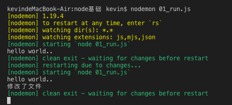
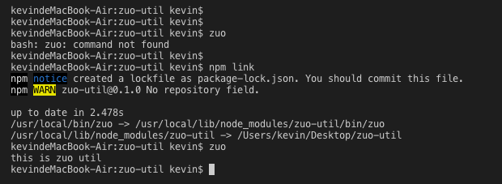
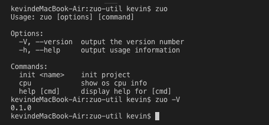
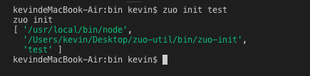

# Node.js基础
> 官网：https://nodejs.org/en/

> 官方文档：https://nodejs.org/en/docs/guides/

## Node.js 是什么
- Node.js is a JS runtime built on Chrome's V8 JS engine (Node.js是一个基于Chrome V8引擎的JS运行时)
- Node.js是一个异步的事件驱动的JS运行时

什么叫运行时，用类比的方法学习这个概念，一般语言都会提供一个运行时环境，**Node.js其实就是提供js运行时的环境**。
- JRE java运行时环境
- C Runtime
- .NET Common Language Runtime

runtime(运行时)指的是程序运行的时候，即指令加载到内存并由CPU执行的时候。运行时库就是程序运行的时候所依赖的库。

JS是解释型语言，还有一些语言执行之前是要编译的，比如C，Java等

C代码编译成可执行文件的时候，指令没有被CPU执行，这个时候算是编译时，也就是编译的时候。

## Node.js历史 - 为性能而生
Ryan Dahl /'raiən da:l/ 是nodejs的作者，他的工作是用C/C++写高性能web服务，对于高性能，异步IO、事件驱动是基本原则，但用C/C++写就太痛苦了。于是他设想使用另一种高级语言开发Web服务，评估了很多语言，发现很多语言虽然同是提供了异步IO和同步IO，但开发人员一旦使用了同步IO，他们就再也懒得写异步IO了，所以最终Ryan选择了JS。

**因为JS是单线程执行，根本不能进行同步IO操作，所以JS的这一"缺陷"导致了它只能使用异步IO。**

选定开发语言后，还要有运行时引擎。Ryan曾考虑自己写一个，不过明智的放弃了，因为V8就是开源的JS引擎，让Google投资去优化V8，而他只拿来用，还不用付钱。于是2009年，Ryan正式推出了基于JS和V8引擎的开源Web服务项目，命名为Node。Node第一次把JS带入到后端服务器开发，加上JS开发人员众多，Node一下子就火了起来。

## Node.js依赖(Dependencied)
> https://nodejs.org/en/docs/meta/topics/dependencies/

Node.js功能依赖一些库和工具:
### Libraries
- [V8](https://v8docs.nodesource.com/) 由google维护的JS运行时引擎。V8为Node.js提供了JS引擎，Node.js通过V8 C++ API对其进行控制。
- [libuv](https://libuv.org/) 另一个重要的依赖是libuv, 它一个C语言库，用于将非阻塞(异步)IO操作封装为受支持平台之间一致的接口。他提供了处理file system、DNS、netwrok、child process(子进程)，pipes(管道)，信号处理(signal handling)，polling(轮询) and streaming(流传输)的机制. 它还包括了一个线程池(thread pool)，用于分担某些无法在操作系统级别异步完成的工作。
> libuv is a multi-platform support library with a focus on asynchronous I/O. It was primarily developed for use by Node.js
- [llhttp](https://github.com/nodejs/llhttp) Node.js HTTP parsing(解析)是通过llhttp来处理，一个轻量级的TypeScript和C库。他的设计宗旨是不进行任何系统调用(syscalls)或分配(allocations)，因此每个请求的内存占用非常小。
  - 参考：https://github.com/nodejs/http-parser
- [c-ares](https://c-ares.haxx.se/docs.html) 对于某些异步DNS请求，Node.js使用了c-ares来处理。它是一个C库，It is exposed through the DNS module in JavaScript as the resolve() family of functions. 
- [OpenSSL](https://www.openssl.org/docs/) **tls**和**crypto**模块中都广泛使用了OpenSSL，它提供了许多经过考验的加密功能实现，web依赖这些功能来保证安全性
- [zlib](https://www.zlib.net/manual.html) 为了进行快速压缩何解压缩，Node.js依赖于行业标准的zlib库，该库因在gzip何libpng中的使用而闻名。Node.js使用zlib创建同步、异步及流式压缩何解压缩接口。

### Tools 
- npm node package manager, 是Node.js的模块管理器，Node.js is all about modularity，and with that comes the need for a quality package manager; for this purpose, npm was made. With npm comes the largest selection of community-created packages of any programming ecosystem, which makes building Node.js app quick and easy.
- gyp build系统由gyp处理，它是从V8复制的基于python的项目生成器。可以生成用于跨多个平台的构建系统的项目文件。Node.js需要构建系统，因为它的大部分(及其依赖项)使用需要编译的语言写的。
- gtest 可以使用来自Chromium的gtest测试native code，It allows testing C/C++ without needing an existing node executable to bootstrap from.

## Node.js特性(JS特性)
- [非阻塞I/O](https://nodejs.org/en/docs/guides/blocking-vs-non-blocking/)
- [事件驱动](https://nodejs.org/en/docs/guides/event-loop-timers-and-nexttick/)

## 并发处理
- 多进程 LinuxC、Apache
- 多线程 Java
- 异步I/O JS 事件回调方式
- 协程 - lua openresty、go、deno、TypeScript

ry(Ryan Dahl) 也就是node的作者, 2018年开启了一个新项目[deno](https://deno.land/), A secure JavaScript/TypeScript runtime built with V8, Rust, and Tokio , TypeScript还是非学不可的。

- justjavac对deno的分析介绍，参考 [Deno 并不是下一代 Node.js](https://studygolang.com/articles/13101) 
- [Ryan Dahl：Node 设计失误值得反思，Deno 将汲取经验](https://www.oschina.net/news/96767/design-mistakes-in-node?origin=wxdw)


## 与前端的不同
- JS核心语法不变
- 前端：BOM DOM
- 后端：fs、http、buffer(缓冲区，二进制内容)、event、os

## Node API
### 第一个node程序
新建一个0_run.js文件，打印hello world，然后在终端(Terminal)用node命令执行：node 0_run.js

```js
// 0_run.js, node 0_run.js终端会打印hello world
console.log('hello world');
```
#### nodemon 
上面的例子中，每次修改0_run.js后，想再次运行都需要再次执行node 0_run.js，调试时非常麻烦，这就需要用到nodemon了。
> [nodemon](https://github.com/remy/nodemon) 监听node.js应用的所有改动，当改动发生时，自动重启服务（Monitor for any changes in your node.js application and automatically restart the server - perfect for development）
```shell
# 全局安装 nodemon 命令
npm install -g nodemon 

# 执行，当0_run.js里的文件有更改时，会自动重启执行新的文件
nodemon 0_run.js
```


### 常用模块
#### 核心模块(require都不需要就能直接使用)
- global
- [buffer](http://nodejs.cn/api/buffer.html) 用于处理二进制数据流
  - alloc
  - from
  - write
  - concat
  - toString
- module 模块操作CommonJS规范，require与module.exports
#### 内置模块(不需要npm install安装,直接require就能使用)
- process  
- os
```js
// http://nodejs.cn/api/os.html#os_os_freemem
// os.freemem() 方法以整数的形式回空闲系统内存的字节数(B)。
// os.totalmem() 方法以整数的形式返回所有系统内存的字节数(B)。
const os = require('os')

console.log('闲置内存:', os.freemem() / (1000*1000) + 'M')
console.log('总内存:', os.totalmem() / (1000*1000) + 'M' )

console.log(os.type()) // Darwin 
console.log(os.release()) // 18.7.0  操作系统发行版本
console.log(os.hostname()) // kevindeMacBook-Air.local
console.log(os.homedir()) // /Users/kevin
console.log(os.cpus()) // 打印cpu内核信息，包括cpu具体型号
console.log(os.userInfo()) // 当前用户信息
```
- fs
- path
- http
- event

#### 第三方模块(需要npm install安装，需要require)
- [download-git-repo](https://www.npmjs.com/package/download-git-repo)，Download and extract a git repository (GitHub, GitLab, Bitbucket) from node.
```js
// 先安装 npm install download-git-repo --save
// 如果没有package.json 需要先npm init

/**
 * @description Download a git repository to a destination folder with options, and callback.
 * @params { String } repository 
 * - Github: github:owner/name  或者简写 owner/name
 * - GitLab: gitlab:owner/name
 * - Bitbucket : bitbucket:owner/name
 * - 默认为主分支(master)，指定分支 owner/name#my-branch
 * @params { String } distination 下载repository后，存放的路径
 * @options { Object } 可选的选项对象，download时的选项
 * - { clone: false } 如果clone为true，将用git clone 代替http download
 * = proxy, headers, filter 等
 * @params { Function } callback 执行完成后的回调函数 function(err)
 */
download(repository, destination, options, callback)

// 实例：将github用户zuoxiaobai的todo项目，下载到test目录(可以是不存在的，会自动创建)下, 如果成功，打印OK，否则打印错误
// 使用第三方模块 download-git-repo
const download = require('download-git-repo')
download('github:zuoxiaobai/todo', 'test', err => {
  console.log(err ? err : 'OK')
})

```
- [ora](https://www.npmjs.com/package/ora) Elegant terminal spinner 优雅的终端提示工具
```js
// 上面的例子中，下载过程没有提示，可以使用ora这个模块，来加入提示信息
// 先来看看ora的demo 03—_ora.js
const ora = require('ora');
const spinner = ora('Loading unicorns').start();
 
setTimeout(() => {
    spinner.color = 'yellow';
    spinner.text = 'Loading rainbows';
}, 1000);

setTimeout(()=> {
  spinner.warn('这是一个警告....')
}, 3000)

setTimeout(()=> {
  spinner.fail('这是一个错误....')
}, 4000)

setTimeout(()=> {
  spinner.succeed('加载成功!')
}, 5000)
```


优化后的下载代码
```js
// 优化，加入下载过程中的提示
const download = require('download-git-repo')
const repo = 'github:zuoxiaobai/todo'
const dest = 'test'
const ora = require('ora') 

const process = ora(`正在下载 ${repo} 到 ${dest} 目录...`).start()

download(repo, dest, err => {
  console.log(err ? err : 'OK')
  if (err) {
    process.fail(err)
  } else {
    process.succeed('下载成功')
  }
})
```


### 异步流程控制
- callback
```js
taskone('任务1', () => {
  // 任务1的回调
  tasktwo('任务2', () => {
    // 任务2的回调
    taskThree('任务3', () => {
      // 任务3的回调
      console.log('task 3 callback')
    })
  })
})
```
如何让异步任务串行化
- promise then 承诺执行
```js
function promise(name, delay = 1000) {
  return new Promise(resolve => {
    setTimeout(() => {
      resolve()
      console.log('异步任务' + name)
    }, delay)
  })
}
promise('异步任务1')
  .then(() => {
    promise('异步任务2')
  })
  .then(() => {
    promise('异步任务3')
  })
```
- ES6 generator
```js
// Generator 和 yield 、 iterator
const generator = function* (name) {
  yield promise(name);
  yield promise(name)
}
const gen = generator('Generator')
gen.next().value.then( ()=> {
  gen.next()
})
// 用next() 手动执行
```
- 自己实现一个co库
```js
// 使用co模块，自动执行generator
let co = function(gen, name) {
  var it = gen(name);
  var ret = it.next();
  ret.value.then((res) => {
    it.next(res)
  })
}
co(generator, 'CO')
```

- ES7 async/await
```js
async () => {
  await promise('异步任务1')
  await promise('异步任务2')
}
```

### 使用内置模块util的promisify
util.promisify是在node.js 8.x版本中新增的一个工具，用于将老式的Error first callback转换为Promise对象，让老项目改造变得更为轻松。
```js
// promisify 将函数转换为promise
// const { promisify } = require('util');

// 再次优化 内置util模块promisify
async function downloadRepo(repo, dest) {
  const { promisify } = require('util')
  const download = promisify(require('download-git-repo'))
  const ora = require('ora')
  const process = ora(`正在下载 ${repo} 到 ${dest} 目录...`).start()

  try {
    await download(repo, dest) // 下载
  } catch(e) {
    process.fail('失败')
  }

  process.succeed('下载成功!')
}

const repo = 'github:zuoxiaobai/todo'
const dest = 'test'
downloadRepo(repo, dest)
```
将download的代码封装为模块，再使用
```js
// 04_download.js
module.exports.downloadRepo = async function (repo, dest) {
  const { promisify } = require('util')
  const download = promisify(require('download-git-repo'))
  const ora = require('ora')
  const process = ora(`正在下载 ${repo} 到 ${dest} 目录...`).start()

  try {
    await download(repo, dest) // 下载
  } catch(e) {
    process.fail('失败')
  }

  process.succeed('下载成功!')
}

// 02_useModule.js
// 封装为模块后，再次调用
const repo = 'github:zuoxiaobai/todo'
const dest = 'test'
let { downloadRepo } = require('./04_download')

downloadRepo(repo, dest)
```

### fs模块
```js

const fs = require('fs')

// 1. 同步调用
const data = fs.readFileSync('./04_download.js')
console.log(data)

// data内容打印如下，为Buffer对象，读取的是二进制数据
// <Buffer 0a 6d 6f 64 75 6c 65 2e 65 78 70 6f 72 74 73 2e 64 6f 77 6e 6c 6f 
// 61 64 52 65 70 6f 20 3d 20 61 73 79 6e 63 20 66 75 
// 6e 63 74 69 6f 6e 20 28 72 65 70 ... >

console.log(data.toString()) // 将Buffer转换为字符串
// 打印内容如下:
// 
// module.exports.downloadRepo = async function (repo, dest) {
//   const { promisify } = require('util')
//   const download = promisify(require('download-git-repo'))
//   const ora = require('ora')
//   const process = ora(`正在下载 ${repo} 到 ${dest} 目录...`).start()

//   try {
//     await download(repo, dest) // 下载
//   } catch(e) {
//     process.fail('失败')
//   }

//   process.succeed('下载成功!')
// }


// 2. 异步调用
fs.readFile('./04_download.js', (err, data) => {
  if (err) throw err
  console.log(data)
})

// 3. promisify处理异步调用
async function consoleFileData(filePath) {
  let { promisify } = require('util')
  let readFile = promisify(fs.readFile)

  try {
    let data = await readFile(filePath)
    console.log(data)
  } catch(e) {
    throw err
  }
}
consoleFileData('./04_download.js')
```

### Buffer对象
操作二进制值，需要使用Buffer
```js
const buf1 = Buffer.alloc(10) // 分配一个10字节空间
console.log(buf1)
// 10个字节
// <Buffer 00 00 00 00 00 00 00 00 00 00>   // 用16进制，表示二进制数
// 00   16进制数，代表一个字节

const buf2 = Buffer.from('a') // 将字母a，转换为二进制数据
console.log(buf2, buf2.toString()) // <Buffer 61> 'a'

const buf3 = Buffer.from('中文')
console.log(buf3) // <Buffer e4 b8 ad e6 96 87>

// 拼接两个buffer
const buf4 = Buffer.concat([buf2, buf3])
console.log(buf4, buf4.toString())
// <Buffer 61 e4 b8 ad e6 96 87> 'a中文'
```

### http模块
#### 开启一个http服务
```js
// 07_http.js
const http = require('http')

const server = http.createServer((req, res)=> {
  res.end('hello....')
})

server.listen(3003)
// node 07_http.js 然后打开浏览器，访问127.0.0.1:3003 即可看到hello...
```


#### 渲染静态页面或json数据
```js
// 利用fs，渲染静态html、JSON字符串返回
const http = require('http')
const fs = require('fs')

const server = http.createServer((req, res)=> {
  const { url, method } = req
  console.log('url, method: ', url, method)

  if (url === '/' && method === 'GET') {
    fs.readFile('index.html', (err, data) => {
      if (err) throw err
      res.statusCode = 200
      res.setHeader('Content-Type', 'text/html')
      res.end(data)
    })
  } else if (url === '/users' && method === 'GET') {
    res.writeHead(200, {
      'Content-Type': 'application/json'
    })
    res.end(JSON.stringify({
      name: 'guoqzuo'
    }))
  }
})

server.listen(3003)
```

### stream 流
现有图片img.png，复制一份该图片，使用流
```js
// 复制一个图片，就需要使用stream 流了。
const fs = require('fs')
const rs = fs.createReadStream('./img.png')
const ws = fs.createWriteStream('./img2.png')
rs.pipe(ws)
```


使用流
```js
// 07_http.js代码片段
// ...
const { url, method,headers } = req
// ...
else if (method === 'GET' && headers.accept.includes('image/*')) {
  // 使用流
  // 如果index.html有img，或是请求 /favicon.ico 时，可以正常加载图片
  fs.createReadStream('./' + url).pipe(res)
}
// ...
```

### 工具链
写一个npm包zuo-util
#### 创建一个目录
```shell
mkdir zuo-util
cd zuo-util
npm init # 生成package.json
```

#### 创建可执行的命令
##### 什么是可执行的命令? 

以vue这个命令为例，对于新手来说会很困惑。vue命令并不是vue的命令。而是vue-cli这个node包全局安装时注入的。当运行 **npm install -g vue-cli** 时，会全局安装vue-cli，然后在terminal终端就可以直接运行vue命令。而是vue -V 显示vue-cli版本是3.5.5，而不是vue的版本，毕竟现在vue还没有3.0的版本

##### 为zuo-util 创建一个可执行命令zuo
```shell
mkdir bin; cd bin; 
touch zuo   // 在bin目录下创建文件zuo，注意不要加后缀
```
在zuo这个文件里，写入下面的内容, 最开始的一行是文件头，表示这是一个node程序，用node写的shell。
```shell
#!/usr/bin/env node
console.log('this is zuo util')
```
然后在package.json里加入下面的代码，指定命令的目录
```json
"bin": {
  "zuo": "./bin/zuo"
},
```
##### 运行命令 zuo 
如果想要命令全局运行，需要在zuo-util目录下执行npm link命令，这样就可以在终端运行zuo这个命令了



#### 使用commander模块显示帮助文档
commander模块是一个命令行工具，一般用于terminal提示，命令解析

修改 /bin/zuo内容如下：
```js
#!/usr/bin/env node

const program = require('commander')

program.version(require('../package.json').version)
    .command('init <name>', 'init project')
    .command('cpu','show os cpu info')
    
program.parse(process.argv);
```
上面使用commander模块，初始化了一个提示，当直接执行zuo命令，会显示帮助信息，version指定zuo -V后打印额值，command显示具体的命令及说明。zuo init 会执行/bin/zuo-init，zuo cpu 会执行 /bin/zuo-cpu



如果直接执行zuo cpu 会提示文件没有可执行权限
```shell
kevindeMacBook-Air:zuo-util kevin$ zuo cpu
error: /Users/kevin/Desktop/zuo-util/bin/zuo-cpu(1) not executable. try chmod or run with root

# 需要在terminal 里处理下权限，方法文档 man chmod
chmod +x bin/*   # 将bin文件下的所有文件添加可执行权限
```

上面说了zuo init会执行/bin/zuo-init方法，为什么？我们来看看progress.argv，下面是/bin/zuo-init的代码，跑起来看看process.argv到底是什么
```js
#!/usr/bin/env node

console.log('zuo init')
console.log(process.argv)
```



所有可以理解为zuo init test，实际执行的是 
```shell
/usr/local/bin/node  /Users/kevin/Desktop/zuo-util/bin/zuo-init  test
# 相当于 node  zuo-init test
```

#### 初步实现两个命令
这里实现zuo init 和 zuo cpu两个命令

/bin/zuo-cpu
```js
#!/usr/bin/env node

const os = require('os')
let cpuInfoArr = os.cpus()

console.log('CPU INFO: ')
console.log(' - Count: ' + cpuInfoArr.length)
console.log(' - Model: ' + cpuInfoArr[0].model)
console.log(' - Speed: ' + cpuInfoArr[0].speed)

```

/bin/zuo-init
```js
#!/usr/bin/env node

console.log('zuo init')
console.log(process.argv)

if (process.argv.length < 3) {
  console.log('Arguments error, Please use like: zuo init <name>')
} else {
  console.log('TODO Init project ' + process.argv[2])
}

```


#### 上传npm
在 zuo-util目录创建publish.sh脚本文件，执行即可上传，会提示登录npm账号
```shell
#!/usr/bin/env bash
npm config get registry # 检查仓库镜像库
npm config set registry=http://registry.npmjs.org
echo '请进行登录相关操作：'
npm login # 登陆
echo "-------publishing-------"
npm publish # 发布
npm config set registry=https://registry.npm.taobao.org # 设置为淘宝镜像
echo "发布完成"
exit
```