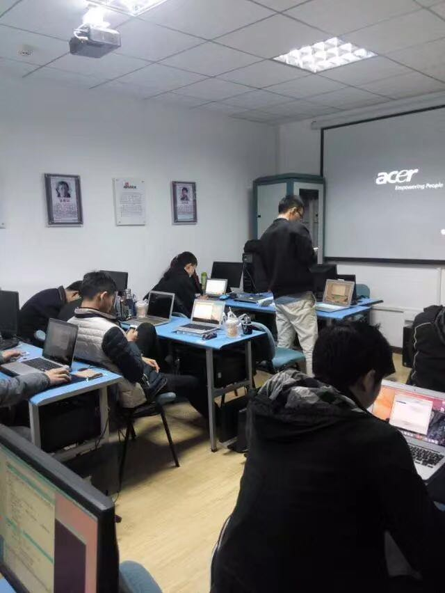
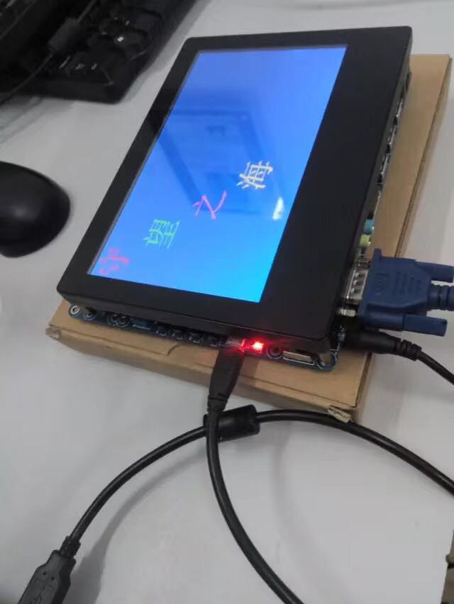
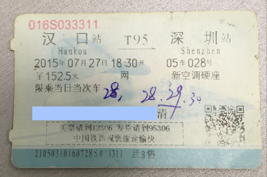
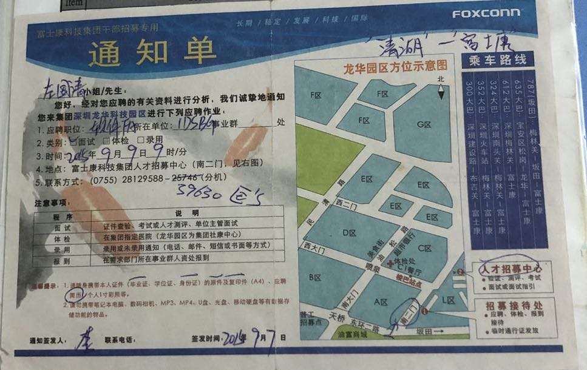
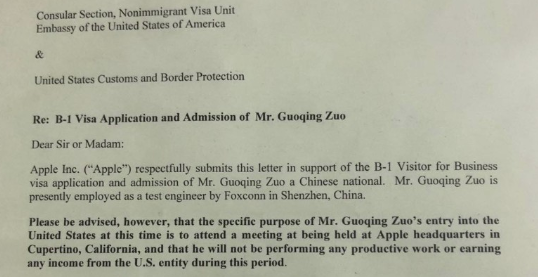
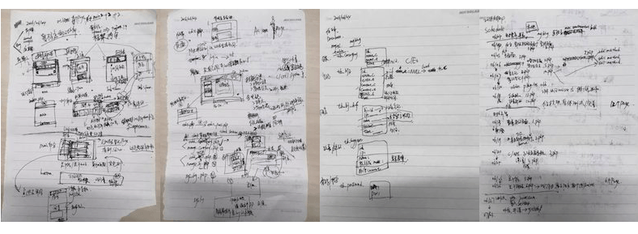

# 2015-2019 总结

## 15年初：嵌入式培训

### 两个选择
14年末，计划在下一年花半年左右的时间去学点东西。当时有两个选择：电脑芯片级维修、嵌入式开发。最终选择了嵌入式开发，原因是：
1. 想做软件开发：在学校的时候对汇编、微机接口原理、网络安全有点兴趣。
2. 退路问题：如果嵌入式学的不好，那以后就老老实实修电脑。如果选择了芯片级维修，万一学的不好，再去学嵌入式开发就太难了，没有退路。

所以打算博一下，于是在14年末就报了名，15年过完年后正式上课。

### 嵌入式与iOS
15年年初，那个时候正是移动端很火的时候，去了趟ml家，ml当时打算第二次培训，之前培训的java，没找到工作，这次是安卓开发。当时的我们都很迷茫。由于第一次培训的经历，ml算是了解点行情，事实是培训嵌入式的很难找到对应的工作，有些转iOS或其他了。我在报嵌入式开发时，也被安利过iOS。最后但还是坚持选了嵌入式，当时的想法是：
1. iOS学习成本太高，需要有macbook、iphone，买不起。
2. 另一方面想学底层一点的东西，不容易被替代，以后发展潜力更大。
3. 当时感觉iOS是应用层的，没什么技术含量。

### C语言
最开始的一门课程是c语言，iOS和嵌入式的同学一起上。讲c的老师很优秀，思路清晰，浅显易懂，还很有趣。
- 我之前看过部分小甲鱼的C视频教程，也看过一点严蔚敏的数据结构视频，结构体指针这块是个坎，一直觉得很难。这个老师讲完后，有种豁然开朗的感觉。
- 学C的时候，使用的是ubuntu系统。最开始的时候老师讲了基本的linux常识及命令。
- 编译器用的是vim，编写好后，用gcc编译为a.out的可执行文件再执行。刚开始很不习惯vim，后面慢慢练习就习惯了。可能是那段时间敲的太多，尽管现在基本不用vim了，但依旧还能熟练的使用vim。在后来登录到linux服务器，编辑ss配置文件就用到了vim。
- c学到for循环和递归时，老师给了五子棋和扫雷的思路，让我们尝试着去实现。控制台版的简单五子棋功能还算好实现，扫雷当时还做不出一扫一大片的功能，对递归的理解不是很好。

大概到链表学完后iOS和嵌入式就分班了，当时嵌入式只有5个人。
- 分班后新的老师也很厉害，把基本的排序算法、数据结构c语言实现都讲了一遍，然后又过了一下c++的内容。
- c学完后，做了一个控制台版的学生成绩管理系统，用链表加文件操作来代替数据库做增删查改操作。
- 当时遇到不理解的，就新开一个窗口，按照记忆理解默写代码，链表(单向、双向、循环)的增删查改我至少敲了10遍+。

### UNIX环境高级编程(APUE)
之后的课程是UNIX环境高级编程，简称APUE。
- 最开始的内容是用c调用system call来模拟实现unix下的一些常用命令，比如ls，mv，pwd，mkdir，cp等。
- 相关文档可以直接使用man命令来查看。
- 在实现ls -R功能时，遇到过目录层级太深时，栈溢出的情况，后面一直没解决。
- 之后的内容还有信号，进程，进程间通信，线程，线程的同步和互斥等。

APUE实体书看到线程的位置就没继续看了，这门课程后面有个作业好像是写一个ftp服务，后面带我们的老师去教新开的iOS班了，这门课就草草结束。

### 嵌入式与Linux内核
后面的课程就是嵌入式的核心了，好久没碰了，基本全忘。后面的内容难度系数比较大，听的不怎么懂，比如bsp驱动，linux内核等，这些都不是短时间可以学好的。

### 就业指导课
后面是就业指导课程，教你包装假简历，写假经验，一般格局比较小的培训机构就是这种套路。当然我也不会傻到真的听就业指导老师的，是什么就是什么，简历没必要做假，自己什么水平自己最清除，不要把别人当傻子。

### 生活方面
那段时间住在6人间的宿舍里，其他5个人有4个学iOS的、1个云计算。现在依稀记得一些琐碎的片段：
- yz经常在宿舍看吴晓波频道，我这才知道吴晓波，后来又看了他写的大败局1、2，激荡三十年，腾讯传等。
- 隔壁云计算班有个有意思的哥们，经常说要造量子炮。
- tt买了个低配版的kinder，没有背光的那种，卖家送了个夜间用的led床头灯。
- 第一次去电影院看电影是和nhl去看大鹏的屌丝男士，之后几个人一起去看了大圣归来。
- 那时商场门口偶尔会有app推广人员，下载app，新用户注册会送几罐加多宝。
- 可能是受iOS室友的影响，我大概看了两遍乔布斯传，每次看完都像打鸡血似的，想要做一些能够改变世界的事情，但现实和理想差太多。

### 总结
大概到7月份左右就算学完了，当时培训学费大概是14500，加上近半年的线下实地学习，没有工作，算是比较难的一段日子。现在来看我当时貌似有点傻，花这么多钱和时间才学了这么点东西。但当时感觉是不亏的，至少算入门了，让我有信心可以去找一份开发相关的工作。现在的基础，就是在学嵌入式的这段时间打下的，也是在这个时候开始自己整理笔记，自学新的东西，对后来的影响还是很大的。

## 15年09月 ~ 16年10月：FSK
### 深圳工作
嵌入式学完后，就打算找工作了。当时老师的建议是去北上广深，我最终选择的是深圳，其他的小伙伴有的去了上海，有的去了杭州。现在已经忘了当时为什么会选择深圳，来深圳的车票我一直有保存。

当时过来后就投简历面试，面试等待的时间又把之前的笔记又反复敲了下，期间用递归把扫雷一扫一大片的功能做出来了，当时真的很开心。
- 由于是专科，且没有实际工作经验，也没有写假简历，面试机会比较少，里面还掺杂着不少培训机构的，好不容易碰到一个面试可以的，但工作地点在广州，当时不想换城市就没去。
- 之前偶尔听ml说过FSK有很多学习的时间，就打算投FSK试试。然后就遇到了当时正在招软体FA的Tom，这个职位不是纯开发，偏测试，失效分析。但当时真的找不到纯嵌入式开发的，基本都要经验，门槛比较高，就打算先在FSK做着，学点东西。

### 初入FSK
那时运气算比较好，进了一个很好的team，部门主要做ipad npi，和我之前想像中的FSK完全不一样:
- 生活方面有4人间的宿舍，有空调、热水，还有帮忙洗衣服的。园区有很多食堂，每月初厂牌里面会有400的初始额度，消费的金额会在工资里面扣除。
- 工作内容看起来很高大上，办公基本都是mac mini，每人都要取个英文名，实习期需要写英语周报。
- FA日常提的issue、问题跟进、与apple那边客户的邮件沟通都是用的英语，算是有很好的英语氛围，这一块和同事比起来，我弱爆了。
- 身边有优秀的同事，再加上很好的氛围，我虽然比较弱，但耳濡目染，或多或少还是有提高的。

FSK也有一些不方便的地方：
- 大部分时间需要待在产线，穿防静电的上衣和帽子。
- 身上的衣服不能带铁，手机方面只能带诺基亚那种功能机进去，不然门口的安检都过不去。
- 外部网络的访问限制很多，访问外网需要专门的账号，很多网页打不开，需要看百度快照。

在FSK最开始学的语言是AppleScript，好久不用，现在基本忘了。

### 在线考试系统
入职后的第三个月左右，也就是大概4年前的现在，部门leader Tom想弄一个web版的在线考试系统，在网上找了个免费的tomexam让我和另外同事ys看看能不能基于这份源码，做一些针对我们部门的定制化修改。

就这样入坑web，当时没有分前端和后端，只是把功能做出来就可以。
- tomexam是基于jsp的，本地安装tomcat后，将代码部署到webapps目录，再执行初始化的mysql程序，项目就可以直接在本地跑起来了。
- 前端代码和数据库表结构是可以直接看到的，但后台的代码都是编译后的class文件，当时得出的结论就是无法修改后端逻辑，如果想要定制化，除非自己实现所有的后台逻辑，于是就开始尝试去写一个tomexam。

当时没想过需要花多长时间才能完成以及会不会做不出来，就直接开始研究了。可能是因为兴趣，也可能是因为这是工作中第一次写代码的任务，是个难得的学习机会。

- 通过对tomexam的功能模仿实现，慢慢的就对html、js、jquery、css、jsp、mysql有了一些了解，至少可以做出功能来了。前端 "入门" 就是这么简单，就算你不去系统的学习，在网上谁便看看教程，遇到问题就百度，给你足够的时间，也可以做出功能来。但可维护性、代码质量就不好说了。

- 当时是用纯jsp完成了对tomexam的模仿，并加入了一些新的功能。大概有50-60个jsp文件，基本没有模块化、复用的思想、大量重复代码，但功能确实是实现了，而且基于java环境还算稳定。
- 最开始是我和ys一起做，后面dd和st也加入进来，做了部分功能。当时每隔一段时间需要发一份项目进度给leader，发现ys的总结文案能力是真的强，比如我感觉某一周没做什么事情，不好总结，但ys的描述可以让人感觉做了很多事情。st的美感比较好，当时UI的美化是st自学了bootstrap来优化的，后面这个项目样式就都使用bootstrap了。
- 当时大家都不是专业的，有兴趣就加入进来做，不会的就自学，想办法把功能实现，是一段难忘的经历。

### FSK转正
当时把在线考试系统做的差不多后，就差不多要转正了。FSK当时的转正时间是6个月，但当时感觉时间过的很快。转正的时候需要写一份PPT，然后当着leader和同事的面讲。算是第一次讲PPT吧，很紧张，感觉讲的不怎么好。

### 备品室管理系统(AMS)
做完在线考试系统后项目后，下一个项目是优化备品室管理系统，现有的系统有些小问题，后台是php写的，这次也是用jsp将php全部改写，优化细节逻辑。

- 这次有dd的同学tyy大神带，他之前做java后台的，比我们业余自学的要强很多。
- 我们上个项目是纯jsp，所有后台逻辑都在jsp里写。这次的项目由tyy负责搭构架，改用servlet，这才有封装，模块化的概念。
- 之前的项目数据都是测试数据，而这次项目是从真实数据copy的一份，做起来感觉还是不一样的。

### 技术方面
除了写网页外，中间也学了点OC，PHP，Java。
- 那时swift出来没多久，大部分还是用OC，当时tomcat经常出现端口会被占用的情况。于是做了个简单的macos app，可以停止或开启tomcat服务。
- 从这个时候起，基本可以在命令行熟练的敲一些mysql命令了，基本没怎么用图形化工具。

### 生活方面
- 偶尔和同事去附近的网吧组队打lol，吃完晚饭，偶尔去园区走走逛逛，到富连网看看最近新出的apple产品。
- 由于FSK宿舍的网络限制很多，和zsx在附近都找了个单间，搬出来住。吃过几次zsx做的菜，还不错，比我做的好吃。
- 和zsx一起买了尤克里里，学了一两节课，后面因为比较忙就没去了，现在还是五音不全。
- 在FSK社保满一年后，和zsx一起去办了港澳通行证。
- 部门同事一起在网上买了自行车，一起骑行，去了趟大屏嶂森林公园，累个半死。

从FSK宿舍搬出来住没过多久就买了macbook air和iphone SE，主要目的是想以后从事iOS开发，当时没有想过要把写网页当作以后从事的工作，只想当做一个爱好发展。
1. 一方面iOS工资高，当时ml培训完安卓在北京有10k左右，ml同学ax在北京做iOS有15k，之前隔壁班培训iOS的小伙伴都8k，10k+了。
2. 二是备品室的项目要兼容IE8，我有点阴影了，觉得web在兼容性方面处理太麻烦了，还是iOS开发的事少点，就苹果那些设备兼容就好了。

### 离开
在做完这两个项目的过程中，有很多其他的事情，因为实际职位还是FA，虽然后面新增了CoreOS组，但实际的主要工作还是以ipad测试FA为主。有很多繁琐的工作需要做， 但以后又不想在这个方向发展，这样耗下去技术成长会非常缓慢，就有离职的想法了。

后面tom让我去把护照签证办了，有出差的机会，美签的费用可以报销。那时一方面是因为不怎么自信，怕自己做不好；二是当时在技术方面有点自我膨胀了，以后还是想找一份纯开发的工作，不想再花太多的时间在ipad测试FA相关、需要和多部门沟通的工作上，想着办了签证出了差可能就不好离职了，于是就选择了离职。

当时的leader tom是真的很好，给了我很多学习成长的机会，算是FSK这段经历里我最应该去感谢的一个人。离职的那段时间，tom正好在成都出差，这一点我还是比较愧疚的。我算是话比较少、不怎么合群的，喜欢安静的待在角落做自己的事情。印象中我们组的氛围真的非常好，同事都很nice，相处很融洽，像一家人一样，在这样一个团队里感觉很好。从FSK出来到现在再也没有遇到这么好的氛围了。

## 16年末 ~ 17年初：iOS与个人网站
### 规划个人网站
那时由于FSK做的两个系统都是内网应用，外部访问不了，于是就想写一个外网可以访问的项目。想了很久，最后还是决定做一个个人网站，用来记录笔记。

当时还是小白，对外部网站的发布，域名什么的一无所知，搜了搜百度、知乎，才算了解一点。然后在阿里云买了zuo11.com域名和一个ECS实例，列了一个Schedule，打算实现它，整体架构还是延用备品室系统：后台servlet加mysql，前端jquery+bootstrap。

### 网站实现
个人网站在FSK时就写了一小部分，后面离职后，就开始全身心投入了。当时的规划是两个部分：
1. 前端展示系统：主要是显示博文内容、评论。主要页面有：主页、分类页、详情页、404/500页
2. 后台系统：主要是新增或修改文章内容，管理文章分类、文章的实时隐藏或发布、SEO参数设置等

### iOS

## 17年初 ~ 17年末：lt(zmkc rd)

## 18 ~ 19年04月：yd

## 19年05月 ~ 09月: 前端基础

## 19年09月底 ~ 现在：ws

