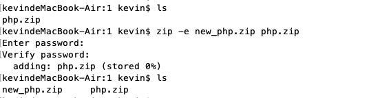
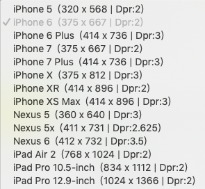

# 技术日常记录

### 2020/02/27 周四
#### el-form-item里非elment输入组件时，校验回调函数不触发的问题
今天写表单校验规则，有个 el-form-item 里使用了富文本编辑器，发现校验规则校验这个值会有异常：
1. 当 change 或 blur 时，根本没有触发校验(提示错误)
2. 提交表单时，当该字段校验失败会提示错误，但该字段符合要求时，validate的回调一直没触发，导致无法进行校验成功之后的下一步操作

将富文本编辑器换成 el-input 正常，换成普通的 input 也会异常，感觉一头雾水。

使用 this.$refs.ruleForm.validateField('xxx') 单读校验也不行，这个应该是element表单输入组件特有的

于是粗略看了下源码，发现错误信息在form-item(也就是el-form-item)组件里处理，当el-select或el-input值改变时会将事件传递给form-item

两个不同的组件，一个组件里怎么捕获到另一个组件的事件呢，在element内部使用了发布订阅设计模式来处理：
1. 在form-item里订阅事件
2. 当el-input或el-select等elemnt表单输入组件的值改变时，发布事件

来看源码

```js
// 在 form-item 里订阅事件
// https://github.com/ElemeFE/element/blob/1.x/packages/form/src/form-item.vue
if (rules.length || this._props.hasOwnProperty('required')) {
  this.$on('el.form.blur', this.onFieldBlur);
  // 订阅了el.form.change事件
  this.$on('el.form.change', this.onFieldChange);
}

// 当 el-input 值改变时，发布事件
// https://github.com/ElemeFE/element/blob/1.x/packages/input/src/input.vue
// el-input
setCurrentValue(value) {
  if (value === this.currentValue) return;
  this.$nextTick(_ => {
    this.resizeTextarea();
  });
  this.currentValue = value;
  if (this.validateEvent) {
    // 发布el.form.change事件
    this.dispatch('ElFormItem', 'el.form.change', [value]);
  }
}

// el-select
// https://github.com/ElemeFE/element/blob/1.x/packages/select/src/select.vue
value(val) {
  if (this.multiple) {
    this.resetInputHeight();
    if (val.length > 0 || (this.$refs.input && this.query !== '')) {
      this.currentPlaceholder = '';
    } else {
      this.currentPlaceholder = this.cachedPlaceHolder;
    }
  }
  this.setSelected();
  if (this.filterable && !this.multiple) {
    this.inputLength = 20;
  }
  this.$emit('change', val);
  this.dispatch('ElFormItem', 'el.form.change', val);
}
```

所以，如果表单里使用了非element输入组件，比如普通的input，当值改变或输入框失去焦点时，没有发布对应的事件，那么form-item组件就不会触发校验

怎么来处理呢？这里暂时采用自定义方法来处理：
1. 从rules移除对应的字段 required，至于label前面的红星，直接在el-form-item__label类上加一个before属性来设置
2. 对于行内显示错误信息，可以在el-form-item__label的after里显示错误信息，通过一个父类的error-class来控制隐藏显示
3. 单独写校验逻辑，如果校验失败加上一个error-class，如果想做的更逼真一点，在错误时给输入组件加一个红色的border

#### element怎么动态改变校验rules且实时生效
需要动态改变rules场景，有两个功能点：
1. 某个checkbox的值改变，有部分字段需要在必须和可选间切换
2. 某个cascader组件值改变时，需要动态切换部分字段（有删有减）

需要注意的地方
1. 可选和必选切换，只需要改变rules里的require属性，true和false之间切换（我之前直接暴力删rule里的fields，这种方法不能关闭原来必选时触发的错误提示）
2. 对于动态修改rules后，必选的小红星以及之前的错误信息还在的问题，需要完全改变rules的值，才能重新触发校验，使前端页面更新

```js
// 强制触发表单校验更新
this.rules = JSON.parse(JSON.stringify(this.rules))
```
### 2020/02/26 周三
#### 一条命令安装多个npm包
```bash
# 安装多个包koa、koa-router、koa-static 
npm install koa koa-router koa-static --save
# npm notice created a lockfile as package-lock.json. You should commit this file.
# npm WARN upload@1.0.0 No description
# npm WARN upload@1.0.0 No repository field.

# + koa-router@8.0.8
# + koa@2.11.0
# + koa-static@5.0.0
# added 61 packages from 29 contributors in 22.996s
# kevindeMacBook-Air:upload上传进度 kevin$
```
如果需要卸载已经写入package.json里的npm包
```js
npm uninstall 对应的包 --save
```

#### axios文件上传进度及后台接收demo
axios的config参数里，可以传入onUploadProgress参数来接收upload进度事件，在koa处理时使用 post-bodyparser 可以很好的解析 multipart/form-data 数据


来看源码： 

```html
<!-- 前端HTML -->
<body>
  <div>
    <input type="file" name="file" id="test">
    <div id="progressDiv"></div>
  </div>
  <script src="https://unpkg.com/axios/dist/axios.min.js"></script>
  <script>
    let fileInput = document.getElementById('test')
    let progressDiv = document.getElementById('progressDiv')

    // 当input文件输入框值改变时
    fileInput.onchange = () => {
      let file = fileInput.files[0]
      this.uploadFile(file)
    } 

    // 上传文件到后台
    async function uploadFile(file) {
      let fd = new FormData()
      fd.append('file', file)
      fd.append('type', 'mask')
      try {
        let payload = fd
        let res = await axios.post('/upload', payload, {
          // axios 接收进度事件文档
          // https://github.com/axios/axios#request-config
          onUploadProgress: function (progressEvent) {
            // {loaded: 1687552, total: 35353356, ...}
            console.log('接收到进度事件', progressEvent)
            progressDiv.innerHTML = `
              <div>上传中，当前进度：${((progressEvent.loaded / progressEvent.total) * 100).toFixed(2) }% </div> 
              <div>文件大小: ${progressEvent.loaded}/${progressEvent.total}
            `
          },
        })
        console.log(res)
      } catch(e) {
        cosnoel.error(e)
      }
    }
  </script>
</body>
```
koa后端接收处理 upload.js
```js
const Koa = require('koa')
const Router = require('koa-router')
const static = require('koa-static')
const BodyParser = require('post-bodyparser')

const router = new Router()
const app = new Koa()

app.use(static(__dirname + '/'))

router.post('/upload', async (ctx, next) => {
  console.log('upload', ctx.url)
  let { req } = ctx.request
  const parser =  new BodyParser(req);
  let body = await parser.formData()
  console.log(body)
  ctx.body = body
})

app.use(router.routes())

app.listen(3000)

// 打印内容
// upload
// /upload
// { file:
//    { value:
//       '/var/folders/mw/hbp6ytc9753gcm3zhqbmfkp40000gn/T/RAzvcR/9cd892b3-3243-4469-8cfa-ecbe2190a6ee.mongodb-macos-x86_64-4.2.2.tar',
//      name: 'file',
//      filename: 'mongodb-macos-x86_64-4.2.2.tar',
//      contentType: 'application/x-tar' },
//   type: 'mask' }
```

完整demo，参见: [upload文件上传demo - github](https://github.com/zuoxiaobai/fedemo/tree/master/src/DebugDemo/upload%E4%B8%8A%E4%BC%A0%E8%BF%9B%E5%BA%A6)


#### koa ctx.body 写在异步里接口会返回404
今天mock上传的接口时，发现总是404，刚开始以为是代理的问题，后来单独写了个demo，发现如果ctx.body放在异步的回调，后端接收到请求了，但还是会返回404
```js
// 最简单的验证方法
setTimeout(() => {
  ctx.body = {} // 只要是异步，前端就会返回404
}, 0)
```
怎么解决呢？只要 await 对应的异步就好了
```js
// 将文件数据接收，放到Promise里然后await，这样前端就不会404了
let data = await getUploadData(req)
ctx.body = {}

// 用 promise 封装一层
function getUploadData(req) {
  return new Promise((resolve, reject) => {
    let chunk = []
    let size = 0
    req.on('data', (data) => {
      console.log('data', data)
      chunk.push(data)
      size += data.length
    })

    req.on('end', () => {
      console.log('end')
      const data = Buffer.concat(chunk, size)
      resolve(data)
    })
  })
}
```

### 2020/02/24 周一
#### element cascader高度过长问题
当cascader里选项比较多时，组件高度会异常，主要是 `.el-cascader-menu__wrap` 这个样式高度为100%，将cascader里其任意一父元素手动指定高度即可，但el-cascader-menu__wrap设置的效果最好
```css
.el-cascader-menu__wrap {
  max-height: 300px;
  overflow: scroll;
}
```
但这样设置后，可能会影响全局，这个是直接挂载在body元素下的，对其他模块会有影响，怎么解决这个影响呢？

发现组件提供了一个 popper-class 属性，可以自定义浮层类名
```less
// 用 popper-class指定一个class，比如my-container，防止污染全局样式
.my-container {
  .el-cascader-menu__wrap {
    max-height: 300px;
    overflow: scroll;
  }
}
```

总结：当写类似的组件时，如果需要在body里插入，需要有入口可以指定对应的自定义class，这样当多个页面需要时，不会产生样式干扰

参考：

- [cascader 组件popper-class属性](https://element.eleme.cn/#/zh-CN/component/cascader#cascader-attributes)
- [vue element Cascader 高度过长问题？](https://segmentfault.com/q/1010000021033440)

#### element required 提示语修改
在element组件中，想要label文字前面加红色*，需要当在el-form-item元素加上 required 属性，但使用 rules 添加blur校验规则后，两者会有冲突

required 默认的提示是英文，怎么自定义提示呢? 需要将el-form-item元素上的 required属性去掉，放到rules规则里

```js
rules: [
  name: [
    // 必填项
    { required: true, message: '姓名不能为空', trigger: 'blur' },
    { validator: validatorName, trigger: 'blur'}
  ]
]
```

参考：[vue element-ui 使用required进行表单校验时自定义提示语](https://blog.csdn.net/princek123/article/details/85267544)

#### element 表单校验函数没生效
根据element官网的dmeo，加入表单校验，发现校验的rules根本没执行。

注意：**el-form-item 标签也需要设置 prop 属性，并且名称需要和对应model的名称一致**

我这次漏写了，所以一直没生效

参考：
- [表单 自定义校验规则 - element](https://element.eleme.cn/#/zh-CN/component/form#zi-ding-yi-xiao-yan-gui-ze)
- [关于el-form中的rules未生效问题的解决方法](https://blog.csdn.net/qq_36070288/article/details/88683747)

### 2020/02/20 周四
#### 使用js调用vue单文件组件
在封装组件时，如果是dialog组件，一般封装好后，通过component引入，然后把标签放到html里，通过true或false来隐藏和显示，每次都要写一些重复代码。

怎么能够像ElementUI的message函数一样直接调用呢，首先需要搞懂怎么用js来调用vue单文件组件，下面来看方法
```js
// 假设写好了 showInfo.vue 组件，执行clickShow函数直接显示dialog
// 组件中 dialog :visible.sync="dialogTableVisible"初始值设置为true

// demo.vue 在需要调用的vue文件中引入该组件
import ShowInfo from 'showInfo.vue'
// ...
clickShow() {
  const Component = Vue.extend(ShowInfo)

  // 挂载后返回对应组件的vm
  let showInfoVue = new Component().$mount() 

  // 将组件vm的dom，append到当前页面
  this.$el.appendChild(showInfoVue.$el) 
}
// ...
```

参考: 

- [vm.$mount()](https://cn.vuejs.org/v2/api/#vm-mount)
- [JS 操作vue单文件组件](https://blog.csdn.net/u014445339/article/details/79596201)

### 2020/02/18 周二
#### ERROR 1396 (HY000): Operation DROP USER failed for 'zhangsan'@'localhost'
在看mysql账号相关内容时，发现在root用户下，更新、删除用户均报错。后面发现居然是localhost的字母拼错了，但新建user时居然没报错。下面来复盘整个记录：
```bash
# 1. 先创建一个账号，用来测试修改用户名
CREATE USER zhangsan@localost IDENTIFIED BY '123';

# 2. 在使用 RENAME USER ... TO ... 时，发现更改不了名字，一直报错
# mysql> RENAME USER 'zhangsan'@'localhost' TO 'wangwu'@'localhost';
ERROR 1396 (HY000): Operation RENAME USER failed for 'zhangsan'@'localhost'

# 3. 于是我试了下删除，发现还是错误
# mysql> DROP USER zhangsan@localhost;
ERROR 1396 (HY000): Operation DROP USER failed for 'zhangsan'@'localhost'

# 4. 于是搜索了下，偶然看到一个测试的命令，仔细看发现host拼写错误，而我之前修改删除时host的localhost都是拼写正确的，所以没匹配到
select user,host from mysql.user where user = 'zhangsan';
+----------+----------+
| user     | host     |
+----------+----------+
| zhangsan | localost |
+----------+----------+
1 row in set (0.00 sec)

# 5. 于是我将host改了下，再删除，就成功了。
mysql> DROP USER zhangsan@localost;
Query OK, 0 rows affected (0.01 sec)
```

### 2020/02/12 周三
#### 为什么书上SQL语句一般都是大写
一般我比较喜欢小写的sql语句，比如：
```bash
select * from tb_user; # 一般习惯用法
SELECT * FROM tb_user; # 教材或书上的写法
```
为什么小写更直观，而不使用小写呢？今天在看语法时，有了一个答案，来看一个例子
```bash
# select ... from 内连接语法
# 先来看全小写的写法
select some_colums from tb1 inner join tb2 on some_conditions;
# 教科书上的写法
SELECT some_colums FROM tb1 INNER JOIN tb2 ON some_confitions;
```
你会发现可变动的内容一般是小写（比如：列名，表名，一些条件），而SQL语法相关的单词都是大写，这样更好理解。全小写描述语法时，对于初学者来看分不清哪些是SQL语句中必须的，哪些是可变动的。以后还是要习惯大写，更规范。

#### char与varchar的区别
在创建表，指定字段数据类型时，如果是字符串数据类型可以是varchar(50)，也可以是char(50)。这两种有什么区别呢？

1. 它们都是用来储存字符数值小于255的字符, mysql5.0之前是varchar支持最大255。
2. varchar(40)存入"Bill Gates"，取出数据时字符串长度为10；char(40)存入"Bill Gates"，取出数据时字符串长度为40, 后面会被加多余的空格。
3. varchar使用可能会更方便、所占用内存空间更小，特别是当数据库比较大时，内存和磁盘空间的节省会非常重要。
4. 从系统性能讲，char处理速度更快，有时可以超出varchar处理速度的50%。
5. 在设计数据库时应综合考虑各方面因素，来达到一个平衡。

### 2020/02/08 周六
#### nginx 访问不带www的域名，自动切到www
在seo时，搜索引擎可能会将xx.com和www.xx.com一起收录。这里需要进行处理，当使用一级域名直接访问时(xx.com)，自动切到www.xx.com
```bash
# 修改nginx配置，加入如下转换
if ($host = 'zuo11.com') {
  rewrite ^/(.*)$ http://www.zuo11.com/$1 permanent;
}
```
如下图


测试是否生效
```bash
# 打开浏览器的console，测试是否有转换成功
location.host # zuo11.com 或 www.zuo11.com
```


参考：

[nginx 域名跳转 Nginx跳转自动到带www域名规则配置、nginx多域名向主域名跳转](https://www.cnblogs.com/yiwd/p/3230371.html)

[Converting rewrite rules - nginx](http://nginx.org/en/docs/http/converting_rewrite_rules.html)

### 2020/02/04 周二
#### Node.js、js、v8三者之间的关系
1. Node.js 提供了JS运行时（运行js的环境，类似的概念有JRE提供了运行java的环境）。Node.js通过内部集成Chrome V8引擎来解析执行js
2. 浏览器里js无法操作文件、无法开启http服务器、而Node.js里可以，主要是因为Node.js里面扩展加入了很多功能。比如使用libuv，提供了文件系统、网络、子进程、管道、信号处理、轮询、流等功能；使用llhttp提供了HTTP解析功能；使用OpenSSL提供tls、crypto加密相关功能等等。

参考之前的笔记：https://www.yuque.com/guoqzuo/rdrqd5/ms0w14#Libraries

#### node中4种模块类型
Node.js的模块化使用CommonJS规范，在node中你会发现使用某个模块时，是否需要require，是否需要npm install会有区别。
- 核心模块 **require都不需要直接使用**，比如global、buffer、module、process等
- 内置模块 **需要require才能使用，不需要npm install**，比如：os、fs、path、http、util等
- 第三方模块 **不仅需要require，还需要npm install才能使用**，比如: download-git-repo、ora、commander等
- 本地自己写的模块，自己写的模块一般require就行，但如果里面包含了需要npm install的包，也需要安装


### 2020/02/02 周日
#### for...in遍历顺序问题
Object.entries()遍历顺序和for...in的遍历顺序一致。for...in **以任意顺序遍历一个对象除Symbol以外的可枚举属性**

来看一个示例:
```js
var a = {
    1:"a",
    7:"b",
    4:"c",
    5:"d",
    "-3":"e",
    f:"f",
    "2.2":"g",
    6:"h",
    0:"i",
    "2" : "j"
};
for (key in a) {
  console.log(key)  
}
// 在chrome、safari、火狐浏览器中结果一致
// 0 1 2 4 5 6 7 -3 f 2.2 
```
再来个例子，都是字符串的情况
```js
var category = {
  'web': 1,
  '微信小程序': 2, 
  '数据库': 3,
  '观点': 4,
  'iOS': 5,
  'UNIX环境高级编程': 5,
  'C语言': 6
}
// 调整上面的属性顺序，均按照定时时的顺序来，以属性定义的先后顺序来
for (var key in category) {
  console.log(key)  
}
```
再来个例子，属性都可以转换为数字的情况，这样就会按数字属性的大小来排序了
```js
var nums = {
  3: 1,
  1: 2, 
  4: 3,
}
// 调整上面的属性顺序，均按照定时时的顺序来，以属性定义的先后顺序来
for (var key in nums) { 
  console.log(key)  // 1 3 4
}
```

总结：总之，for...in遍历属性是无序的。确定顺序，还是用数组来

参考：

[for...in - JavaScript | MDN](https://developer.mozilla.org/zh-CN/docs/Web/JavaScript/Reference/Statements/for...in)

[for...in遍历的顺序](https://blog.csdn.net/SailingLee/article/details/84598921)

#### 提取markdown文件的大纲结构数据
知道将md转换为html文件的方法后，需要生成对应的大纲数据。方法如下：
```js
// 截取至 zuo-blog 源码
// 读取文件内容，通过maked转换为html字符串
const fileStr = fs.readFileSync(articlePath).toString() 
// let htmlStr = marked(fileStr)
let headers = marked.lexer(fileStr).filter(item => item.type === 'heading')
let outline = _generateOutline(headers) // 根据文件内容生成大纲数据

/**
 * @description 将md文件heading列表，转换为层级结构，用于生成大纲
 * @param {*} headers 原数据格式
 * [ { type: 'heading', depth: 1, text: '站点优化 页面打开较慢处理' },
 *  { type: 'heading', depth: 2, text: '代码托管' },
 *  { type: 'heading', depth: 2, text: '速度慢的原因分析' },
 *  { type: 'heading', depth: 3, text: '代码分析' },
 *  { type: 'heading', depth: 2, text: '速度测试' } ]
 * @returns  [ { text: 'xx', children: [ { text:'xxx', children:[...] } ] } ]
 */
function _generateOutline(headers) {
  let tree = []
  // 加try catch是为了如果中间出现跨越的层级问题，直接返回错误
  try {
    for (let i = 0, len = headers.length; i < len; i++) {
      let item = headers[i]
      // 如果是一级目录，直接挂载到tree下
      if (item.depth === 1) {
        tree.push(item)
      } else {
        let target
        // 如果是二级目录，挂载到当前tree最后一个元素的children上
        if (item.depth === 2) {
          target = tree.slice(-1)[0]
        } else {
          // 如果是3级+，遍历到最近一个层级的list
          let count = item.depth - 2
          target = tree.slice(-1)[0]
          while(count--) {
            target = target.children.slice(-1)[0]
          }
        }
        !target.children && (target.children = [])
        target.children.push(item)
      }
    }
  } catch(e) {
    console.log(e)
    let text = '目录生成异常，请确保目录层级从H1到H6是正常顺序，对于没有H1或目录中间断层的情况需要修正'
    return [ { text } ]
  }
  return tree
}

// 最开始比较low的写法
//  let tree = []
//   for (let i = 0, len = headers.length; i < len; i++) {
//     let item = headers[i]
//     if (item.depth === 1) {
//       tree.push(item)
//     } else if (item.depth === 2) {
//       // 找最近的一个1级目录，加入到其list里面
//       let level1 = tree[tree.length - 1]
//       !level1.list && (level1.list = [])
//       level1.list.push(item)
//     } else if (item.depth === 3) {
//       // 找最近的一个二级目录
//       let level1 =  tree[tree.length - 1]
//       let level2 = level1.list[level1.list.length - 1]
//       !level2.list && (level2.list = [])
//       level2.list.push(item)
//     } else if (item.depth === 4) {
//        // 找最近的一个三级目录
//        let level1 =  tree[tree.length - 1]
//        let level2 = level1.list[level1.list.length - 1]
//        let level3 = level2.list[level2.list.length - 1]
//        !level3.list && (level3.list = [])
//        level3.list.push(item)
//     } else if (item.depth === 5) {
//        // 找最近的一个4级目录
//        let level1 =  tree[tree.length - 1]
//        let level2 = level1.list[level1.list.length - 1]
//        let level3 = level2.list[level2.list.length - 1]
//        let level4 = level3.list[level3.list.length - 1]
//        !level4.list && (level4.list = [])
//        level4.list.push(item)
//     } else if (item.depth === 6) {
//       // 找最近的一个5级目录
//       let level1 =  tree[tree.length - 1]
//       let level2 = level1.list[level1.list.length - 1]
//       let level3 = level2.list[level2.list.length - 1]
//       let level4 = level3.list[level3.list.length - 1]
//       let level5 = level4.list[level4.list.length - 1]
//       !level5.list && (level5.list = [])
//       level5.list.push(item)
//     } else if (item.depth === 7) {
//       // 找最近的一个6级目录
//       let level1 =  tree[tree.length - 1]
//       let level2 = level1.list[level1.list.length - 1]
//       let level3 = level2.list[level2.list.length - 1]
//       let level4 = level3.list[level3.list.length - 1]
//       let level5 = level4.list[level4.list.length - 1]
//       let level6 = level5.list[level5.list.length - 1]
//       !level6.list && (level6.list = [])
//       level6.list.push(item)
//     } 
//   }
```

#### node 文件操作路径path问题
在写 zuoblog init 命令执行的操作时，需要操作当前命令执行时所在的目录，而__dirname是程序文件的路径。这就需要用到 process.cwd()了，可以获取到当前命令执行时所在的目录
```js
const path = require('path')
// delPath = path.join(__dirname, delPath) // 这个是当前文件的路径
// process.cwd()  当前命令执行时所在的目录
delPath = path.join(process.cwd(), delPath)
```

#### 根据大纲数据生成html
在md文件显示的右侧，显示大纲html，将大纲JSON数据，生成html。注意：

1. ul 的padding-left要修改为0，而不是1em，因为发现语雀、gaylab对应的大纲实现里，focus时都有左侧border，菜单的padding-left根据其depth来生成，padding-left: (depth * 1)em

2. 这里大纲的每一个标题都没有使用a标签，不是走hash，而是直接通过点击js来滚动到对应id的位置。

```js
/**
  * @description 根据大纲数据(JSON)生成侧边栏html
  * @param {*} outline 
  */
_getAsideHtml(outline) {
  function handlerId(id) {
    let newId = id.toLowerCase().replace(/\s/g, '-')
    newId = newId.replace(/[\(\)\/\,\=\>\.\:\+]/g, '')
    return newId
  }
  let asideHtml = ''
  let backupOutline = JSON.parse(JSON.stringify(outline))
  for (let i = 0, len = outline.length; i < len; i++) {
    asideHtml += '<ul>'
    asideHtml += `<li><span class="ul-span" data-id="${handlerId(outline[i].text)}" style="padding-left:${outline[i].depth + 'em'}">${outline[i].text}<span></li>`
    if (outline[i].children) {
      asideHtml += getChildrenAsideHtml(outline[i].children)
    } 
    asideHtml += '</ul>'
  }

  function getChildrenAsideHtml(outline) {
    if (!outline || outline.length === 0) {
      return ''
    }
    let asideHtml = ''
    for (let i = 0, len = outline.length; i < len; i++) {
      asideHtml += '<ul>'
      asideHtml += `<li><span class="ul-span" data-id="${handlerId(outline[i].text)}" style="padding-left:${outline[i].depth + 'em'}">${outline[i].text}<span></li>`
      if (outline[i].children) {
        asideHtml += getChildrenAsideHtml(outline[i].children)
      } 
      asideHtml += '</ul>'
    }
    return asideHtml
  }
  return asideHtml
}
```

#### 页面滚动时，自动切换大纲focus
直接上代码，里面包含大纲点击事件、滚动页面后自动改变大纲focus，这里的核心问题是: **怎么获取页面滚动到了哪个标题区域？**

**每次一进入页面，将每个标题(h1,h2,..)的id，offsetTop(距离页面顶部距离)按顺序存到数组，监听页面滚动事件，根据document.documentElement.scrollTop的高度，来匹配之前的数组，就可以找到滚动到哪个标题了** 

```js
// 监听大纲的点击事件
let asideDiv = document.getElementsByTagName('aside')[0]
asideDiv.onclick = (e) => {
  let id = e.target.dataset.id
  if (!id) return
  // 移除所有的active
  let nodes = document.getElementsByClassName('ul-span')
  for (let i = 0, len = nodes.length; i < len; i++) {
    nodes[i].classList.remove('active')
  }
  e.target.classList.add('active')
  document.getElementById(id).scrollIntoView(true)
  document.documentElement.scrollBy(0, -70)
}

let headersArr = []

window.onload = () => {
  // 如果是category，且有hash值，向上滚动 -70
  // 通过category.html#web进入页面时, 由于顶部fixed会有遮挡，fix方案
  let { pathname, hash } = location
  pathname.includes('category.html') && hash && document.documentElement.scrollBy(0, -70)

  // 将每个标题的高度，存到数组里，当滚动时，自动focus右侧大纲
  let nodes = document.getElementsByClassName('ul-span')
  for (let i = 0, len = nodes.length; i < len; i++) {
    // console.log(nodes.dataset)
    let id = nodes[i].dataset.id
    headersArr.push({id: id, offsetTop: document.getElementById(id).offsetTop})
  }
  // console.log(headersArr)

  window.onscroll = () => {
    focusAsideSpan()
    // debounce(focusAsideSpan)
  }
}

// 效果不好，没有实时滚动的感觉，关闭防抖
// function debounce(method, context) {
//   clearTimeout(method.tId)
//   method.tId = setTimeout(function() {
//     method.call(context)
//   }, 100)
// }

function focusAsideSpan() {
  let scrollTop = document.documentElement.scrollTop
  let curNode
  for (let i = 0, len = headersArr.length; i < len; i++) {
    if (headersArr[i].offsetTop - scrollTop >= 0) {
      // 移除所有的active
      let nodes = document.getElementsByClassName('ul-span')
      for (let j = 0, len = nodes.length; j < len; j++) {
        if (headersArr[i].id === nodes[j].dataset.id) {
          nodes[j].classList.remove('active')
          nodes[j].classList.add('active')
        } else {
          nodes[j].classList.remove('active')
        }
      }
      return
    }
  }
  // 如果走到这里，说明滚到底部了
  // 移除所有的active
  let nodes = document.getElementsByClassName('ul-span')
  for (let i = 0, len = nodes.length; i < len; i++) {
    nodes[i].classList.remove('active')
  }
  nodes[nodes.length - 1].classList.add('active')
}
```

#### node复制或删除文件夹
node只提供了复制文件、删除空文件夹的方法，如果需要复制文件夹或删除文件夹，就需要自己写方法了，参考：
https://github.com/zuoxiaobai/zuo-blog/blob/master/vendor/utils/FSExtend.js

### 2020/01/30 周四
#### 百度统计网站测速
登录到百度统计，在优化分析 - 网站速度诊断位置，输入链接，测速速度。现在静态化后的博客比之前的jsp打开速度有了明显的提高。可以达到99分

#### seo链接提交到搜索引擎
最近对zuo11.com进行了改版，完成了博客的静态化并完成了上线，nginx + 静态文件代替了原来的 tomcat + jsp + mysql的模式。针对百度收录与索引，google收录，做了一些处理。
##### 登录到百度站长平台
由于url除了zuo11.com其他原来文章的url全部失效，需要让百度重新收录，添加索引。入口：[百度站长平台，现在叫资源搜索平台](https://ziyuan.baidu.com/)

1. 提交网站改版的规则URL对，百度搜索 site:zuo11.com，将收录的网页链接，以及改版后的url以规定的格式提交

```bash
# 旧URL，对应的改版后的url，以空格隔开，一行是一条数据
http://zuo11.com/Notes.woe?action=detail&note_id=24 http://www.zuo11.com/blog/2016/10/c_vim.html
http://zuo11.com/Notes.woe?action=APUE http://www.zuo11.com/blog/category.html
```

2. 提交死链，对于改版后404的页面，可以提交死链，防止搜索引擎认为网站不稳定或服务异常，导致权重评分降级

```bash
# 死链规则
http://zuo11.com/Notes.woe?
```

3. 新链接的提交，这里推荐使用sitemap的方式提交链接，怎么生成sitemap呢？使用 https://www.xml-sitemaps.com/ 输入你的站点，就可以自动生成sitemap.xml信息了，默认只有sitemap.xml，可以找更多文件的下载入口，可以下到一个sitemaps.zip的一个文件，里面还包含了txt、html等非xml格式的数据。**将生成后的sitemap.xml文件放到域名根目录下，提交对应的链接到百度站长平台**

##### 登录到Google search console
入口：[Google search console](https://search.google.com/search-console)，登录后左侧菜单index - Sitemaps提交sitemap链接

#### 开源协议MIT等具体含义
一般新建一个开源仓库时，需要确定开源协议。之前习惯是MIT，就是别人拿去干什么都可以。对于一些需要控制他人使用的就需要其他协议了。阮一峰博客里有一张图来解释很清晰明了


- 他人修改源码后是否可以闭源?
  - 可以闭源，没一个修改过的文件是否都必须放置版权说明?
    - 需要放置版权说明 **Apache许可证**
    - 不需要放版权说明，衍生软件的广告是否可以使用你的名字促销?
      - 可以用你的名字促销  **MIT许可证**
      - 不可以用你的名字促销 **BSD许可证**
  - 只能开源，那新增代码后是否采用同样的许可证(不能闭源)?
    - 新增代码后也只能开源 **GPL许可证**
    - 新增代码后可以闭源，需要对源码的修改之处提供说明文档吗？
      - 需要对源码的修改之处提供说明文档 **LGPL许可证**
      - 不需要提供说明文档 **Mozilla许可证**

结合实际情况，zuo11.com个人站点blog部分的开源可以使用 Apache许可证，如果是后面开源生成静态页面的程序，可以使用MIT协议

### 2020/01/29 周三
#### 将markdown文件转html
其实早在18年12月，我就已经写好了最简的demo，使用的是marked这个工具。本来准备将博客静态化的，但后来就没继续了，这里来说下方法
```js
// github: https://github.com/markedjs/marked
// marked.js 是下载好的
let marked = require('./lib/marked') // import marked.js
let fs = require('fs')
// 读取md文件
fs.readFile('./notes/2016/10/iOS程序启动过程，从main函数开始UIApplication与AppDelegate.md', (err, data) => {
  if (err) {
    console.log(err);
    return;
  }

  // 这里加入了基本的html框架，加入了代码高亮prismjs
  let htmlStr = `<!DOCTYPE html>
  <html lang="en">
    <head>
      <meta charset="UTF-8">
      <title>Title</title>
      <link href="../lib/prismjs/prism_default.css" rel="stylesheet" />
    </head>
    <body>
      ${marked(data.toString())}
      <script src="../lib/prismjs/prism_default.js"></script>
    </body>
  </html>
  `
  // 生成新的文件
  fs.writeFile('./dist/test.html', htmlStr, (err) => {
    console.log(err)
    console.log('写入文件成功');
  })
})
```

**注意：marked将md文件转html时，如果在ol或ul后面加了代码块，必须换行，如果不换行就会准换异常**
```js
// - 这是一个ul
// ul后面这里不能直接用```写代码，需要换行，如果不换行在Typora可以正常渲染，但marked转换时会出问题
```

#### nginx开启gzip
首先复习下windows下，nginx怎么使用：
1. 在[nginx官网](https://nginx.org/en/download.html)下载nginx，稳定版，现在是nginx/Windows-1.16.1，下载后是一个zip文件
2. 解压后放到桌面，进入解压后的目录 nginx-1.16.1，先修改nginx的root文件夹，也就是80端口指向的目录。修改 conf 目录下的 nginx.conf文件，如下图，将静态项目路径设置到root后


3. 运行nginx

```bash
# 进入到nginx目录，shift + 鼠标右键，在此处打开命令窗口，将nginx.exe拖到窗口，再打一个空格 -c 配置文件，类似下面的命令
nginx.exe -c conf/nginx.conf
# 关闭nginx服务，注意 nginx.exe 是将nginx.exe文件拖到terminal时产生的
nginx.exe -s stop
```

在上面的图中，已经有开启gzip的代码了。默认情况下 gzip on 是注释掉的，我们打开这个注释再添加几个属性即可。对于额外增加的几个属性这里说明下:
- gzip_types是指定需要开启gzip压缩的文件类型
- gzip_comp_level 指定压缩等级
- gzip_min_length 当超过多少字节时就压缩，我上面设置的是1K
- gzip_vary 增加响应头”Vary: Accept-Encoding”

#### 怎么判断nginx是否成功开启gzip
打开chrome访问对应的站点，F12，点击network. 在Name，Priority 那一栏的最右侧空白位置，右键，勾选 Content-Encoding，如下图，设置好后刷新页面就可以看到Content-Encoding那一列了，如果有gzip就说明开启了gzip，需要结合Size这个属性看，如果没有超过设定大小的文件，是不会开启gzip压缩的。


### 2020/01/21 周二
#### 使用set去重时的问题
如果add的值是数组，那么是无法自动去重的。下面来看一个例子：
```js
var mySet = new Set()
mySet.add([-1,0,1])
mySet.add([-1,0,1])
mySet.size // 2
console.log(Array.from(mySet)) // [[-1, 0, 1], [-1, 0, 1]]

// 这种情况想去重，可以将值[-1, 0, 1].join('|') 处理下，添加进去，到时统一再split出来

```

#### 数组排序sort值有负数时排序异常
正常情况使用 sort 是好用的，但如果有负数时，会有问题
```js
// 
var arr = [5, -11, -10] 
arr.sort() // [-10, -11, 5]

// 明显上面的结果是有问题的，默认的排序遇到负数就不正确了
// 这就需要自定义排序了
arr.sort((a, b) => a - b) // [-11, -10, 5]
```
再来个复杂的例子 [[-15, -10, 3], [-14, -9, 5]] 对于这种数组，怎么写自定义排序？
```js
arr.sort((a, b) => {
  if (a[0] === b[0] && a[1] === b[1]) {
    return a[2] - b[2]
  }
  if (a[0] === b[0]) {
    return a[1] - b[1]
  }
  return a[0] - b[0] 
}) 
```

### 2020/01/19 周日
#### 零编码或少编码生成通用封装的axios函数
现在项目中，每个模块都会单独弄一个对应service.js，把所有接口请求放到里面，其实就是将axios请求封装为一个个函数。每个函数的函数名、url、请求方法会有所差别。重复代码比较多。最近在看mongodb教程时，了解到零编码编程的思想，于是想把这里优化下，最好以后写新模块时，只要写简单的配置文件就可以自动生成函数，不用再单独手写函数。先来看看原来的方式：
```js
// someService.js
// 这里的service是对axios的封装，增加了一些请求拦截，用响应拦截等
import { service, downloadService } from '../service.js'
let someService = {
  urls: {
    funcA: '/api/url1',
    funcB: '/api/url2',
    funcC: '/api/url3',
  },
  funcA() {
    return service.post(someService.urls.funcA, payload)
  },
  funcB() {
    return service.get(someService.urls.funcB, {params: payload})
  },
  funcC() {
    return downloadService.post(someService.urls.funcC, payload)
  }
}
export default someService

// 在vue组件里，使用方法
import someService from 'someService.js'
someService.funcA(payload).then(() => {
  // 接收结果
})
```
当接口比较多时，比如20+，那就需要写20个类似的函数，冗余性太高，这里使用零编码编程的思想来优化一下，先来看看优化后的代码
```js
// 优化后的 someService.js 和旧的写法实现的功能一样，且更加强大
import generateCommonApi from './utils/generateCommonApi'
import { downloadService } from '../service.js'

// 之前使用对象结构，发现还是有大量重复的属性字段，不是很方便，用数组的方式，写法更精简，更高效
// 但同时牺牲了扩展性，类似于大的框架总会遇到的问题：各种实现都各有优缺点，关键是要去找一种平衡，做一些取舍。
const someApiList = [
  ['funcA', '/api/url1', 'post'],
  ['funcB', '/api/url2'],
  ['funcC', '/api/url3', 'post', downloadService]
]
export default generateCommonApi(someApiList)
```
这里通过写一个generateCommonApi.js来实现自动生成通用api对象，以后就不用再写大量重复的代码了。来看看具体实现:
```js
// generateCommonApi.js
// 参考文档：https://github.com/axios/axios
import { services } from './service.js'

function generateCommonApi(apiList, isAddTimestamp2Url) {
  let obj = {}
  let methodsList = ['request', 'get', 'delete', 'head', 'options', 'post', 'put' 'patch']

  // 遍历JSON配置，生成对应的请求函数并挂载到obj对象
  apiList.forEach(item => {
    let [apiName, url, method = 'get', servicesFunc = services] = item
    let isMethodOk = typeof method === 'string' && methodsList.includes(method.toLowerCase())
    method = isMethodOk ? method : 'get'

    // 如果需要加时间戳
    url += isAddTimestamp2Url ? '' : `${url.includes('?') ? '&' : '?'}t=${+new Date()}`

    obj[apiName] = async (payload = {}, config = {}) => {
      let paramsMap = {
        '1': [payload],
        '2': [url, {params: payload, ...config}],
        '3': [url, payload, config]
      }
      let is3Args = ['post', 'put', 'patch'].includes(method)
      let methodType = method === 'request' ? '1' : is3Args ? '3' : '2'

      return servicesFunc[method](...paramsMap[methodType])
    }
  })
  return obj
}

export default generateCommonApi 
```

#### 测试loading时写的等待函数最简代码
一般想模拟延时，测试loading效果时，会写一个等待函数，怎么最简单方便呢？
```js
// 一般写法
const delay = function (msec){
  return new Promise(resolve => {
    setTimeout(() => {
      resolve()
    }, msec)
  }) 
}
await delay(2000)
console.log('test')

// 使用箭头函数简写
const delay = (msec) => new Promise(resolve => setTimeout(() => resolve(), msec))
await delay(2000)
console.log('test')

// 舍弃函数封装与自定义时长，最精简写法
(async () => {
  await new Promise(r => setTimeout(() => r(), 2000)) // 一行代码
  console.log('test')
})()

```
在vue中的实际应用
```js
vue.prototype.$mydelay = (t) => new Promise(r => setTimeout(() => r(), t))
// 在vue中间中调用
await this.$mydelay(2000)
```

### 2020/01/16 周四
#### node遍历文件夹下的文件名再require对应的文件出错
在使用koa mock接口时，一个模块有很多接口，就写了十几个js，每个js对应一个接口数据。如果每增加一个接口，再添加一个require就很麻烦，于是写了个index.js来遍历文件夹，进行动态引入。以后写好js，就不用再手动require了。之前都运行正常的，最近再运行时发现一直报错，require异常。后来打印遍历的fileName，发现居然有 .DS_Store 文件，require这个文件时错误。这个文件属于mac系统自动生成的文件，之前都没有的。在程序中过滤调这个文件即可。

mock目录结构如下:
```sh
# 目录结构
mock
├── pm
│   ├── index.js # 入口
│   ├── 接口1.js
│   ├── 接口2.js
│   └── 接口n.js
├── user 
├── product
└── sever.js # 入口文件，require('./pm/index.js')(router) 将接口添加到路由
```
pm/index.js 代码如下：
```js
const fs = require('fs')

module.exports = router => {
  fs.readdirSync(__dirname).forEach(fileName => {
    if (fileName === 'index.js' || fileName.startsWith('.')) return
    require('./' + item)(router)
  })
}
```


### 2020/01/14 周二
#### export PATH 后关闭termial就失效了
mac 修改环境变量，以便能在任何地方使用 mongod 命令
```sh
# 运行该命令后，当前terminal生效了，但关闭后，打开其他terminal就无效
export PATH=/usr/local/mongodb/bin:$PATH
```
这种情况需要在 .bash_profile 文件里，加入 export PATH=/usr/local/mongodb/bin:$PATH 才行
```sh
vi ~/.bash_profile
```
修改后的 .bash_profile 文件，之前还修改过mysql的环境变量
```js
export PATH=${PATH}:/usr/local/mysql/bin
export PATH="$HOME/.rbenv/bin:$PATH"
export PATH=/usr/local/mongodb/bin:$PATH
if which rbenv > /dev/null; then eval "$(rbenv init -)"; fi
```
修改好后，关闭该终端，再打开，运行 mongod 命令即可

#### npm简写与项目名称注意事项
最近在安装 npm install 时喜欢简写 `npm i mysql2 -s` 但发现执行后，并没有安装成功，在package.json里也没有任何记录。还没有报任何错误。
```sh
# 把简写的命令换成 非简写 再执行
npm install mysql --save

# kevindeMacBook-Air:mysql2 kevin$ npm i mysql2 -s    # 简写执行后，没有任何信息
# kevindeMacBook-Air:mysql2 kevin$ npm install mysql2 -save # 这次就报错了，提示项目名称与包名称相同
# npm ERR! code ENOSELF
# npm ERR! Refusing to install package with name "mysql2" under a package
# npm ERR! also called "mysql2". Did you name your project the same
# npm ERR! as the dependency you're installing?
# npm ERR! 
# npm ERR! For more information, see:
# npm ERR!     <https://docs.npmjs.com/cli/install#limitations-of-npms-install-algorithm>

# 由于在初始化生成package.json时为了方便，直接使用了下面的命令
npm init -y  # 所有默认yes，生成的package.json里面，项目名称字段为当前文件夹名。

# 由于文件夹名就是 mysql2，与安装的包名重复了。将package.json里的name属性改一个名字即可
```
总结: 项目名称不要与依赖的包名相同，当npm安装简写执行异常时，使用非简写方法再试试。

### 2020/01/11 周六
#### markdown里怎么为文字添加颜色，怎么画复杂表格
之前看markdown语法时，并没有添加颜色和复杂表格的方法，但最近了解到markdown里面可以直接使用html，那就方便了。复杂表格直接使用table标签画，如果想给文字加颜色
```html
<span style="color: red">这是一段有颜色的字体</span>

<!-- 下划线 -->
<u>这是一段有下划线的文字</u>
```
注意：markdown解析器很多。在Typora嵌入html的复杂表格没什么问题，但在github上显示时，table被放到了文档的最下面。语雀里导入时，也会有一点问题。所以为了保证最大程度的兼容，写md时，尽量避免使用内嵌html，对于复杂表格可以使用图片代替

### 2020/01/10 周五
#### css var() 与变量 --
```html
<style>
  /* 最大高度为三行，将line-height定义为变量lh */
  .module {
    --lh: 1.2rem;
    line-height: var(--lh);
    max-height: calc(var(--lh) * 3);
    overflow: hidden;
  } 
</style>
```
#### 多行文本截断
> 参考：[Line Clampin' (Truncating Multiple Line Text) | CSS-Tricks](https://css-tricks.com/line-clampin/)


```css
/* 方法1：使用 ::after 伪元素选择器，覆盖*/
 .method-a {
  line-height: 1.2rem;
  max-height: 3.6rem;
  overflow: hidden;
  position: relative;
}
.method-a::after {
  position: absolute;
  bottom: 0;
  right: 0;
  width: 30%;
  max-width: 100px;
  content: '';
  height: 1.2rem;
  background: linear-gradient(to right, rgba(255,255,255,0), rgba(255,255,255,1) 90%);
}

/* 方法2：使用 -webkit-line-clamp 不过不支持IE */
.method-b {
  overflow: hidden;
  display: -webkit-box;
  -webkit-line-clamp: 3;
  -webkit-box-orient: vertical;
}
```

#### position:relative
之前想把内容区域的title，有一半放到顶部背景，当时只想着使用position:absolute来做，现在发现将title的position设置为relative，top为负数就可以了，且不影响标题下面元素显示的布局。position默认为static，不能使用top,right,left,bottom属性。
```css
.title {
  position: relative;
  top: -10px;
} 
```

#### node path.resolve()
koa静态文件服务中间件的实现里，需要将当前路径 __dirname 与用户传入的路径合并为一个绝对路径，就可以使用path.resolve函数

> The path.resolve() method resolves a sequence of paths or path segments into an absolute path.

```js
const path = require('path')

path.resolve('/foo/bar', './baz');
// Returns: '/foo/bar/baz'

path.resolve('/foo/bar', '/tmp/file/');
// Returns: '/tmp/file'

let dirPath = './public'
path.resolve(__dirname, dirPath)
```
参考：[node path.resolve](https://nodejs.org/docs/latest/api/path.html#path_path_resolve_paths)

### 2020/01/09 周四
#### asycn/await 执行顺序问题
注意：await 后面的内容如果值为promise，则等待promise执行完再向下执行，如果非promise，await不会等待(await下面的代码和await等待的函数会同步执行)
```js
(async () => {
  await test() // await fn()
  console.log('异步执行完成')
})()

async function test() {
  fn() // return fn() 或 await fn()
}

async function fn(next) {
  console.log('start fn')
  await delay()
  console.log('end fn')
}

function delay() {
  return new Promise((resolve, reject) => {
    setTimeout(() => {
      resolve()
    }, 2000)
  })
}

// return fn()  或 await fn() 结果
// start fn
// end fn
// 异步执行完成

// fn() 结果
// start fn
// 异步执行完成
// end fn
```

参考：[async/await函数的执行顺序的理解 - csdn](https://blog.csdn.net/guzhao593/article/details/84191401)

#### forEach的缺点
```js
// 真实场景: 匹配路由数组里的路径，匹配到就结束遍历，发现无法结束遍历
// 遍历路由进行匹配，如果匹配到了则执行，停止往下执行下一个中间件，否则向下执行
stock.forEach((item) => {
  if (ctx.url === item.path && item.methods.includes(ctx.method)) {
    return
  }
  await next()
})
```
总结：**forEach遍历开始后，无法停止后面的遍历，无法终止执行函数。for里面可以通过break来结束循环，return结束函数。对于需要遍历到匹配的数据就退出的情况，就需要使用for了**

很清奇的操作：使用抛异常的方式，来结束forEach循环
```js
// 参考：https://www.cnblogs.com/Marydon20170307/p/8920775.html
try {
  var array = ["first","second","third","fourth"];

  // 执行到第3次，结束循环
  array.forEach(function(item,index){
      if (item == "third") {
          throw new Error("EndIterative");
      }
      alert(item);// first,sencond
  });
} catch(e) {
    if(e.message!="EndIterative") throw e;
};
```

### 2020/01/08 周三
#### IE下dialog弹窗全屏后列表横向滚动卡顿的问题
全屏后添加了一个名为 `is-fullscreen` 的class，发现把对应的overflow:auto去掉后，就不会卡顿。去掉其实就是将overflow设置为默认值visible，如果子组件高度超出范围，将is-fullscreen设置的height 100% 改为 auto。另一种方法是将table的z-index改为3000(相对dialog比较高的一个层级)，这样IE下就不会卡顿了。

overflow相关值描述

值 | 描述
--- | ---
visible	| 默认值。内容不会被修剪，会呈现在元素框之外。
hidden	| 内容会被修剪，并且其余内容是不可见的。
scroll	| 内容会被修剪，但是浏览器会显示滚动条以便查看其余的内容。
auto	| 如果内容被修剪，则浏览器会显示滚动条以便查看其余的内容。
inherit	| 规定应该从父元素继承 overflow 属性的值。

参考：[CSS overflow 属性](https://www.w3school.com.cn/cssref/pr_pos_overflow.asp)

#### if else较多时可使用策略模式
```js
// if else 
if () {
  a
} else if () {
  b
} else if () {
  c
}

// 更优雅的写法，策略模式
// 更多策略模式，策略模式表单验证可参考：JS设计模式与开发实战 第五章p82
let rules = [
  'a': () => { a },
  'b': () => { b },
  'c': () => { c },
]
rules[name]()
```
### 2020/01/07 周二
#### 判断当前鼠标是否在某个div内部
```js
let eventType = document.mozHidden ? 'DOMMouseScroll' : 'mousewheel'
let ele = '某个dom'
ele.addEventListener(eventType, (e) => {
  if ('容器范围内dom'.contains(e.target)) {
    // 当前鼠标在容器内
  }
})
```
参考： [Node.contains - Web API 接口参考 | MDN](https://developer.mozilla.org/zh-CN/docs/Web/API/Node/contains)

#### IE下dialog弹窗的滚动条滚动到底部时，触发了浏览器滚动条
同样都是有遮罩层，chrome都是OK的，但IE下会有问题。经过定位后发现，对于dialog使用了append-to-body属性的，都没问题。发现dialog显示时body上添加了一个 el-popup-parent--hidden的class, 设置了overflow为hidden，关了滚动条。对于没有append-to-body属性的dialog如果想修复有两种办法：

1. 添加append-to-body，将dialog插入到body上  
2. 不插入到body，根据el-popup-parent--hidden将有滚动条的子div设置overflow:hidden。

对于不是dialog，普通的弹窗，可以使用另一种思路：
监听鼠标滚动事件，使用Node.contains函数，判断鼠标是否在dialog范围内滚动，如果是，且到了底部，禁止其默认行为


append-to-body属性： Dialog 自身是否插入至 body 元素上。嵌套的 Dialog 必须指定该属性并赋值为 true

参考：[element dialog](https://element.eleme.cn/#/zh-CN/component/dialog)
#### Element表格IE下由于滚动条原因导致错位问题
Element 表头固定，表内容可滑动，在IE下滚动条会显示，有一定的宽度占位，导致表头与表内容由点错位，解决方法是：由于表单内容是从接口加载的，从接口加载完数据后，对el-talbe进行从新布局dolayout
```js
// Table Methods: doLayout
// 对 Table 进行重新布局。当 Table 或其祖先元素由隐藏切换为显示时，可能需要调用此方法
// <el-table ref="table"></el-table>

// 从接口获取数据成功后
this.$nextTick(() => {
  this.$refs['table'].doLayout()
})
```
参考：[Table 表格组件 | Element](https://element.eleme.cn/#/zh-CN/component/table#table-methods)

#### 如果组件的隐藏显示切换导致布局异常，可以将透明度设置为0来隐藏
注意：将元素的透明度设置为0，如果元素内部可点击或者遮挡了下面层级的点击按钮，可以根据布局进行调整，比如调整z-index或使用margin等将元素移动到其他位置。
```css
element {
  opacity: 0; /* 设置透明度为0 */
}
```
### 2020/01/03 周五
#### 初始化一个ts项目
```sh
# 初始化一个yarn
yarn init

# 新增 ts-node 与 typescript模块
yarn add ts-node --dev
yarn add typescript --dev

# 运行index.ts
yarn ts-node index.ts  # 控制台打印 hello ts-weather

# index.ts 内容 console.log('hello ts-weather')

```

### 2020/01/02 周四
#### TypeScript基础
最近把TypeScript基础初略的过了一遍，笔记：https://www.yuque.com/guoqzuo/tepur0/zb0x9b
### 2019/12/30 周一
#### 滚动条自动滚动到最右侧
给scrollLeft设置一个超大的值即可
```js
this.$nextTick(() => {
  element.scrollLeft = 10000
})

```
### 2019/12/27 周五
#### 怎么清除app内嵌H5的localStorage
测试手机: iPhone8, 红米6，内嵌H5使用localStorage存储了一些数据，尝试清除
- 完全退出app 安卓、iOS都无法清除
- 退出登录 安卓、iOS都无法清除
- 使用app内置缓存清理功能 安卓、iOS都无法清除
- 使用系统的清除app数据方法：安卓清除app所有数据可以，iOS不可以(长按关机键，出现滑动关机，长按home键，直至滑动关机关闭)
- 使用H5内置的 localStorage.clear() 都可以清除，注意域名
- 删除app肯定可以清除

**总结，在不删除app以及使用H5内置的清除函数的情况下，安卓可以使用系统的清除app所有数据来清除，但iOS暂未发现清除的方法。**

#### Symbol、BigInt不能new，而Stirng、number可以new，为什么？
```js
BigInt('1') // 1n
new BigInt(1)
// Uncaught TypeError: BigInt is not a constructor
//     at new BigInt (<anonymous>)
//     at <anonymous>:1:1
```
String、BigInt都是函数，为什么一个可以new，一个不能new？函数怎么区分是new调用，还是直接调用?

复习JS高程3中 [作用域安全的构造函数](https://www.yuque.com/guoqzuo/js_es6/aquxsq#482800ea) 里，在构造函数中，通过 this instanseof Person 来判断是new 调用的，还是直接调用的构造函数，这里应该也是这种情况

```js
// 模拟实现
function A() {
  console.log(this)
  if (this instanceof A) {
    throw new Error('Uncaught TypeError: A is not a constructor')
  }
  return ''
}
// 测试
A() // window   ''
new A() // A {}  Uncaught TypeError: A is not a constructor
```

再复习一下class，class 创建的类型也是function，且只能通过new调用，应该函数内部也是加了类似上面的校验，当this instanceof 不等于当前class时，就直接抛异常

总结：核心问题是 this 的指向问题，一般直接调用A()时this指向window

#### why do we use .html instead of .html?
> 参考：[Why do we use .html instead of .htm? | CSS-Tricks](https://css-tricks.com/why-do-we-use-html-instead-of-htm/)

DOS was a massive operating system for PCs for a long time and it had a three-character limit on file extensions.

All HTML documents should have filenames that end with the extension .html unless the files reside on a DOS system, in which case they should have the extension .htm

DOS操作系统上文件后缀限制为3个字符，所以才会使用.htm的后缀，排除系统限制，所有的HTML文件应该使用.html的后缀名

### 2019/12/26 周四
#### ES2019 bigint 数据类型
ES5之前，基本数据类型有五个 boolean, string, number, null, undefined, ES6(ES2015)新增了一个symbol，ES2019 新增了 bigint
用于表示大于 2 ** 53 的数据，2 ** 53 = 9007199254740992
```js
const x = Number.MAX_SAFE_INTEGER; // 最大的安全integer
// ↪ 9007199254740991, this is 1 less than 2^53

const y = x + 1;  
// ↪ 9007199254740992, ok, checks out

const z = x + 2
// ↪ 9007199254740992, wait, that’s the same as above!

// 不安全的integer，结果不符合预期
num = Number.MAX_SAFE_INTEGER // 9007199254740991
num + 1 // 9007199254740992
num + 2 // 9007199254740992
num + 3 // 9007199254740994
num + 4 // 9007199254740996
num + 5 // 9007199254740996
num + 6 // 9007199254740996
num + 7 // 9007199254740998
num + 8 // 9007199254741000
num + 9 // 9007199254741000
num + 10 // 9007199254741000
```

怎么解决上面的问题呢？ES2019使用bigint来解决这个问题，
```js
const previousMaxSafe = BigInt(Number.MAX_SAFE_INTEGER);
// ↪ 9007199254740991n

const maxPlusOne = previousMaxSafe + 1n;
// ↪ 9007199254740992n
 
const theFuture = previousMaxSafe + 2n;
// ↪ 9007199254740993n, this works now!

BigInt(1) // 1n
let theBiggestInt = BigInt(2 ** 53) // 9007199254740992n
theBiggestInt + 2 // Uncaught TypeError: Cannot mix BigInt and other types, use explicit conversions
9007199254740994n.toString()  // "9007199254740994"
```

参考：
1. [tc39/proposal-bigint: Arbitrary precision integers in JavaScript](https://github.com/tc39/proposal-bigint)
2. [BigInts in JavaScript_ A case study in TC39.pptx](https://www.yuque.com/guoqzuo/csm14e/mig1pq)
3. [JS最新基本数据类型:BigInt](https://segmentfault.com/a/1190000019912017?utm_source=tag-newest)


### 2019/12/25 周三
#### transform 两个动作，scale缩小后，依旧占用空间的问题
transform对某个元素使用两个及以上变换时，用空格分隔，scale缩小0.5倍后，dom占用依旧，可以用translate移动下，矫正位置。
```css
/* 两个transform */
div {
  transform: scale(0.5) translate(-50%, -50%)
}
```
#### charles 抓包时手机不能开vpn
charles抓包，设置了网络代理，但是电脑上还是接收不到请求，发现vpn开启了，关掉后，就可以接收到请求的数据了。

#### html2canvas 移动端生成图片文字重叠的问题
text-align:center 可能会导移动端，生成图片的文字重叠的问题，改为text-align:left 或 text-align: justify 即可。

#### vue性能优化 - webpack包体积优化
1. 安装 **webpack-bundle-analyzer** npm包
```sh
# 安装包
npm install webpack-bundle-analyzer --save-dev
```
2. 在package.json的scripts加入对应的命令，运行npm run report 即可build，并在dist目录生成report.html，打开就可以各个模块包对应的大小，这样就可以开始优化了
```js
scripts: {
  "report": "vue-cli-service build --report"
}
```
3. 路由都弄成懒加载，js懒加载可以使用import()，如果使用import xx from 'xx'，会直接打包到主包，就需要弄成懒加载的逻辑。但如果使用该js，怎么判断js已懒加载完？setTimeout 1s后再调用，弱网呢？怎么监听？这就需要了解懒加载的逻辑了，示例如下：
```html
<!-- 监听是否加载完成 -->
<!-- 在浏览器中，import 语句只能在声明了 type="module" 的 script 的标签中使用。-->
<script type="module">
  let myModule = () => import('./testModule.js')
  
  // testModule.js   内容 export default { a: 1, b: "test" }

  // 类似于路由组件component懒加载逻辑。myModule仅是一个函数，返回promise，需要调用时 myModule().then() 即可
  window.onload = () => {
    console.log('onload')

    // dom已加载，3秒后加载模块
    setTimeout(() => {
      console.log(myModule, typeof myModule) // () => import('./testModule.js') "function"
      // myModule() 函数执行后，返回promise
      myModule().then((res) => {
        console.log('模块加载成功', res) // 加载成功 Module {Symbol(Symbol.toStringTag): "Module"}
        let data = res.default // {a: 1, b: "test"}
        console.log(data.a) // 1
      },(e) => {
        console.log('import 加载异常')
      })
    }, 3000)
  }
</script>
```
参考: [import - JavaScript | MDN](https://developer.mozilla.org/zh-CN/docs/Web/JavaScript/Reference/Statements/import)

### 2019/12/24 周二
#### vuex设置后立即调用this.$router.back()按钮无法点击的问题
今天测试机iPhone 7 plus，系统大概是iOS 11.3，vuex mutation操作后，立即调用 this.$router.back() 会导致页面里的下一步无法点击。
```js
// 解决方法
// vuex mutation操作 =>  this.$nextTick(() => { 将 this.$router.back() 放到这里即可 })
```
### 2019/12/23 周一
#### html2canvas 生成图片时，background-image模糊的问题
PC端一般不会出现这个问题，主要是移动端，有两种解决方法：

1. 使用固定宽度，不要使用百分比单位(比如 1500px)
2. 用 img 标签使用 absolute 定位做背景，不使用background-image

#### postcss-pxtorem px自动转rem怎么保持使用px
如果vue-cli3中配置了postcass-pxtorem，css中写的px单位都会自动转为rem，如果需要固定px，而不是转为rem，有两种方法
```css
 /* 使用Px 或 PX */
 .ignore {
   border: 1Px solid;
   border-width: 2PX;
 }
```
### 2019/12/20 周五
#### v-model为什么不能监听中文输入法实时输入
> 待研究：https://cn.vuejs.org/v2/guide/forms.html#%E5%9F%BA%E7%A1%80%E7%94%A8%E6%B3%95

#### 长英文单词不换行的问题
word-break: break-all; 或者 word-wrap: break-word;
```html
<head>
  <style>
    .sec {
      width: 200px;
      margin: 20px;
      border: 1px solid #ccc;
    }
    .fix1 {
      word-break: break-all;
    }
    .fix2 {
      word-wrap: break-word;
    }
  </style>
</head>
<body>
  <div class='sec'>
    我是汉字 aaaaaaaaaaaaaaaaaaaaaaaaaaaaaaaaaaaaaaaaaaaaaaaaaaaaaaa我是汉字
  </div>
  <div class='sec fix1'>
    我是汉字 aaaaaaaaaaaaaaaaaaaaaaaaaaaaaaaaaaaaaaaaaaaaaaaaaaaaaaa我是汉字
  </div>
  <div class='sec fix2'>
    我是汉字 aaaaaaaaaaaaaaaaaaaaaaaaaaaaaaaaaaaaaaaaaaaaaaaaaaaaaaa我是汉字
  </div>
</body>
```
### 2019/12/19 周四
#### iOS环境下点击输入框页面被顶起不能自动回弹底部的问题
> 参考：https://blog.csdn.net/YY110621/article/details/87919966

解决方法：在对应的input元素加 @blur 事件，input失去焦点时，手动滚动页面 window.scroll(0,0)

#### 实时调试app内嵌H5的样式、DOM
使用web调试代理工具Whistle, 可查看dom样式，待测试

#### 遍历localStorage
```js
let len = localStorage.length
for (let i = 0; i < len; i++) {
  let keyName = localStorage.key(i)
  console.log(keyName, localStorage.getItem(keyName))
}
```
#### npm install --save 与 --save-dev的区别
> 参考：https://www.cnblogs.com/limitcode/p/7906447.html

##### npm install moduleName
1. 安装模块到项目node_modules目录下。
2. 不会将模块依赖写入devDependencies或dependencies 节点。
3. 运行 npm install 初始化项目时不会下载模块。

##### npm install -g moduleName
1. 安装模块到全局，不会在项目node_modules目录中保存模块包。
2. 不会将模块依赖写入devDependencies或dependencies 节点。
3. 运行 npm install 初始化项目时不会下载模块。

##### npm install -save moduleName
1. 安装模块到项目node_modules目录下。
2. 会将模块依赖写入dependencies 节点。
3. 运行 npm install 初始化项目时，会将模块下载到项目目录下。
4. 运行npm install --production或者注明NODE_ENV变量值为production时，会自动下载模块到node_modules目录中。

##### npm install -save-dev moduleName
1. 安装模块到项目node_modules目录下。
2. 会将模块依赖写入devDependencies 节点。
3. 运行 npm install 初始化项目时，会将模块下载到项目目录下。
4. 运行npm install --production或者注明NODE_ENV变量值为production时，不会自动下载模块到node_modules目录中。

对于只有在开发中使用的，比如node中间件、gulp、压缩css、js的模块，可以使用 --save-dev形式安装，如果线上代码必须依赖的模块，需要使用--save

### 2019/12/18 周三
#### 将本地的H5代理到app内嵌H5运行
使用charles 顶部菜单 Tools - Map remote，配置将访问的内嵌H5地址，代理到局域网内本地网页路径即可
#### 安卓 input键盘弹起导致底部按钮也被抬起
监听onresize，如果之前的视窗高度不为
```js
let oriH = document.documentElement.clientHeight;
window.onresize = () => {
  if (document.documentElement.clientHeight < oriH) {
    document.getElementById('bttombtn').style.display = 'none';
  }else{
    document.getElementById('bttombtn').style.display = '原来的显示方式';
  }
})
```
### 2019/12/17 周二
#### npm查询包信息、安装指定版本
```sh
# npm 查询某个包版本
npm view 某个包名
# 安装指定版本
npm install 某个包名@版本号
```
### 2019/12/16 周一
#### 使用charles查看app内嵌H5请求的接口信息
- charles官网：https://www.charlesproxy.com/
- mac下charles使用简介(包含破解方法)：https://www.jianshu.com/p/82f63277d50f
问题
##### 问题1：Connection established
不同的电脑，对同一台手机抓包，需要安装不同的证书
- 证书安装: help - SSL Proxying - install Charles Root Certificate，然后信任
- 手机证书安装 help - SSL Proxying - install Charles Root Certificate on a Mobile Device …, 代理到本地后，访问chls.pro/ssl 下载安装，然后再Settings > General > About > Certificate Trust Testings 信任证书

##### 问题2：SSL handshake with client failed - Remote host terminated the handshake
一般是证书信任问题: Settings > General > About > Certificate Trust Testings

#### macos 查看ip
按住option，再点击右上角wifi图标即可看到本机局域网ip、路由ip
#### vscode 保存自动格式化代码突然失效
之前还好好的，后面突然失效了。重启了vscode后面就好了

### 2019/12/13 周五
#### vue组件里click事件监听问题
之前在看JS高程3里面有一个知识点，就是当多个子元素需要绑定click事件时，大量添加处理程序，会影响性能，尽量少添加处理事件。但写vue习惯后，突然忘了这一点，其实vue监听事件我们也可以遵循这个原则：把事件放到其父元素上监听，然后通过 data-key属性来指定每个子元素对应的值。e.target.getAttribute('data-key')有值就表示子元素点击了

参考：https://www.yuque.com/guoqzuo/js_es6/elgng1#0ea56e91

#### function和method区别
> 参考: https://www.zhihu.com/question/299219511

- function为函数，一般值外部定义的函数。
- method为方法，一般指类(class)内部的方法，类方法一般分为staic method，private method, instance method
#### Reflect.deleteProperty
删除对象的某个属性
```js
delete obj.name
Reflect.deleteProperty(obj, 'name')
```
参考: [deleteProperty - MDN](https://developer.mozilla.org/zh-CN/docs/Web/JavaScript/Reference/Global_Objects/Reflect/deleteProperty)

### 2019/12/12 周四
#### vuex状态更新后，一直没生效的问题
今天写一个功能时，push数据更新state变量可以刷新到页面，但用slice改变state变量时，页面报错，提示 'TypeError: Cannot rad property 'wrapper' of undefined'，百度了下可能是`@click`方法没定义报的错，但我这里只是改了vuex状态，而且push新增数据都可以，就是slice删除数据会报错，最后发现是有一个@click方法确实没有定义，但这种情况很奇怪。为什么push又不报错，可能涉及到了diff的一些检测、算法。**所以，页面有consloe.error的错误，一定要先解决，不要以为对功能没影响就不管，不然可能会遇到一些奇怪的问题。**

#### vue组件updated钩子使用场景
子组件的列表数据会根据接口请求的数据来刷新，当列表数据更新后，会调用子组件updated钩子函数，我们可以在这里里处理列表数据刷新后的一些操作。比如清除所有focus状态，滚动页面
#### 滚动到dom底端对齐
element.scrollIntoView(false) 底端对齐，true顶端对齐
#### element.classList.add或remove
js原生class的添加和移除
```js
document.getElementById("myDIV").classList.add("mystyle");
document.getElementById("myDIV").classList.remove(“mystyle");
```
#### vuex页面刷新后还原的问题
> 参考： https://blog.csdn.net/chen123789hkb/article/details/90175607

思路：存到storage, 再取出
```js
//刷新保存状态
if (sessionStorage.getItem("store")) {
  store.replaceState(
    Object.assign(
        {},
        store.state,
        JSON.parse(sessionStorage.getItem("store"))
    )
  );
  sessionStorage.removeItem("store")
}

//监听，在页面刷新时将vuex里的信息保存到sessionStorage里
window.addEventListener("beforeunload", () => {
  sessionStorage.setItem("store", JSON.stringify(store.state));
});
```

### 2019/12/11 周三
#### 懒加载时 import 里面不能是变量
当出现路由组件按需加载时，import里面开头不能是变量，webpack编译会无法加载对应的组件
```js
// `前面加写死的字符串+${变量字符串}` 是可行的，会加载path目录下的所有
{ 
  path: '/path',
  // components: () => import(`${myFile}`)  // 找不到组件路径
  components: () => import(`./path/${myFile}`)  // ok

}
```


### 2019/12/09 周一
#### :not 和 :nth 混用的问题
:not() 不支持在其参数中使用其他伪类。例如，h1:not(p:first-of-type) 不能匹配任何元素，所以不能混用，额外加个class吧

参考：[:not() - CSS（层叠样式表） | MDN](https://developer.mozilla.org/zh-CN/docs/Web/CSS/:not)

#### font-family问题
chrome 和 ios safari设置了font-family后为什么不生效？

参考demo: https://zuo11.com/fonttest.html

#### '?.' 与 '??' 操作符
Optional chaining operator(?.) 与 Nullish coalescing Operator(??) 目前正式进入 stg4，确定会成为ES2020标准
- Optional chaining operator(?.)

可选链操作符，阮一峰ES6入门里称之为"链判断运算符"，**作用：当对象的属性或方法不存在时，需要先判断是否有值再使用。对于比较多层级的子属性判断就更复杂了，可选链操作符用于简化该场景的写法**
```js
// 示例1：当obj.sayHi存在，则执行该函数
obj.sayHi && obj.sayHi()
// 简化写法:
obj.sayHi?.() 

// 示例2: 如果当user.address为undefined，再访问子集元素会报错
var street = user.address ? user.address.street : undefined
// 简化写法: 
var street = user.address?.street

// 示例3
var argName = 'name'
obj?.[argName] 

// 语法
obj?.prop       // optional static property access
obj?.[expr]     // optional dynamic property access
func?.(...args) // optional function or method call

```
- Nullish coalescing Operator(??)

Null判断运算符，可能会出现问题的场景:
```js
// 示例
const response = {
  settings: {
    nullValue: null,
    height: 400,
    animationDuration: 0,
    headerText: '',
    showSplashScreen: false
  }
};

// 一般需求是，如果某个值非null 或undefined 就使用默认值
const undefinedValue = response.settings.undefinedValue || 'some other default'; // result: 'some other default'
const nullValue = response.settings.nullValue || 'some other default'; // result: 'some other default'

// 但 || 这种写法，只要左侧为false(比如(''、0、false))，也会使用默认值 
const headerText = response.settings.headerText || 'Hello, world!'; // Potentially unintended. '' is falsy, result: 'Hello, world!'
const animationDuration = response.settings.animationDuration || 300; // Potentially unintended. 0 is falsy, result: 300
const showSplashScreen = response.settings.showSplashScreen || true; // Potentially unintended. false is falsy, result: true

```
**?? 就是为了解决这种问题需求的，只有当左侧值为null或undefined，才使用右侧的默认值**
```js
const undefinedValue = response.settings.undefinedValue ?? 'some other default'; // result: 'some other default'
const nullValue = response.settings.nullValue ?? 'some other default'; // result: 'some other default'
const headerText = response.settings.headerText ?? 'Hello, world!'; // result: ''
const animationDuration = response.settings.animationDuration ?? 300; // result: 0
const showSplashScreen = response.settings.showSplashScreen ?? true; // result: false
```

参考文档：

[可选链 - JavaScript | MDN](https://developer.mozilla.org/zh-CN/docs/Web/JavaScript/Reference/Operators/%E5%8F%AF%E9%80%89%E9%93%BE)

[对象的扩展 - ECMAScript 6入门](http://es6.ruanyifeng.com/#docs/object#%E9%93%BE%E5%88%A4%E6%96%AD%E8%BF%90%E7%AE%97%E7%AC%A6)

[tc39 - Finished Proposals](https://github.com/tc39/proposals/blob/master/finished-proposals.md)

[tc39 - proposal-optional-chaining](https://github.com/tc39/proposal-optional-chaining)

[proposal-nullish-coalescing](https://github.com/tc39/proposal-nullish-coalescing)

### 2019/12/06 周五
#### iconfont icon是如何加载的，字体图片？
> 参考: [Iconfont-阿里巴巴矢量图标库 Web端使用](https://www.iconfont.cn/help/detail?spm=a313x.7781069.1998910419.d8d11a391&helptype=code)

iconfont.cn 有两种icon下载方式:
1. 下载代码（将图标转换为字体，便于前端工程师自由调整与调用） download.zip 解压缩后目录如下，下面的文件很多，但不一定都会用到，下面详细介绍三种使用图片的方式：
```sh
├─demo.css        # 非必要，只是文档样式
├─demo_index.html # 非必要，只是文档
├─iconfont.css    # 重要重要重要重要重要重要文件
├─iconfont.eot    # 非必要，可以不引入
├─iconfont.js     # 重要重要重要重要重要重要文件
├─iconfont.json   # 非必要，可以不引入
├─iconfont.svg    # 非必要，可以不引入
├─iconfont.ttf    # 非必要，可以不引入
├─iconfont.woff   # 非必要，可以不引入
├─iconfont.woff2  # 非必要，可以不引入
```
  - Symbol 引用

  > 这是一种全新的使用方式，应该说这才是未来的主流，也是平台目前推荐的用法。相关介绍可以参考这篇文章 这种用法其实是做了一个 SVG 的集合，与另外两种相比具有如下特点：
  支持多色图标了，不再受单色限制.
  通过一些技巧，支持像字体那样，通过 font-size, color 来调整样式。
  兼容性较差，支持 IE9+，及现代浏览器。
  浏览器渲染 SVG 的性能一般，还不如 png。

  ```html
  <!-- 
    使用demo 
    只需要额外引入下载包里的 iconfont.js + copy 一小段css 即可使用
    iconfont.js里面是一段js代码，每个icon的svg path写死放到了字符串里，然后通过一定的方式供外部引用，不涉及网络请求
  -->
  <head>
    <style>
      /* 1.引入 默认icon样式，高宽、颜色 */
      .icon {
        width: 1em;
        height: 1em;
        vertical-align: -0.15em;
        fill: currentColor;
        overflow: hidden;
      }
    </style>
    <!-- 2.引入js -->
    <!-- <script src="iconfont.js"></script> -->
    <script src="iconfont_delete_fill.js"></script>
  </head>
  <body>
    <!-- 
      3.使用
      这里发现设置color无效，网上百度了，发现 iconfont.js里面写死了fill的颜色  批量替换 fill="#181818" 为空字符串即可 
      参考: [iconfont图标symbol引用方式，有的图标不能通过设置color样式来修改颜色的解决办法] https://www.cnblogs.com/jopny/p/9454785.html
    -->
    <svg class="icon" aria-hidden="true" style="font-size:10em;color:blue">
      <use xlink:href="#icon-icon-test"></use>
    </svg>
    <svg class="icon" aria-hidden="true" style="font-size:5em;color:red">
      <use xlink:href="#icon-icon-test7"></use>
    </svg>
  </body>
  ```

  - font-class 引用

  > font-class 是 Unicode 使用方式的一种变种，主要是解决 Unicode 书写不直观，语意不明确的问题。与 Unicode 使用方式相比，具有如下特点：
  兼容性良好，支持 IE8+，及所有现代浏览器。
  相比于 Unicode 语意明确，书写更直观。可以很容易分辨这个 icon 是什么。
  因为使用 class 来定义图标，所以当要替换图标时，只需要修改 class 里面的 Unicode 引用。
  不过因为本质上还是使用的字体，所以多色图标(这里指多种颜色的图标, 单一的颜色不算)还是不支持的。

  ```html
  <!-- 
    demo 直接引入 iconfont.css 即可使用，iconfont.css 文件里面有base64字体文件，所以不涉及网络请求
    - 也可以使用color、font-size来设置大小和颜色 
  -->
  <head>
    <link rel="stylesheet" href="./iconfont.css">
  </head>
  <body>
    <span class="iconfont icon-icon-test4" style="color:red;font-size:80px;"></span>

    <span class="iconfont icon-icon-test4"></span>
  </body>
  ```
  - Unicode 引用

  > Unicode 是字体在网页端最原始的应用方式，特点是：
    兼容性最好，支持 IE6+，及所有现代浏览器。
    支持按字体的方式去动态调整图标大小，颜色等等。  
    但是因为是字体，所以不支持多色。只能使用平台里单色的图标，就算项目里有多色图标也会自动去色。
    注意：新版 iconfont 支持多色图标，这些多色图标在 Unicode 模式下将不能使用，如果有需求建议使用symbol 的引用方式

  ```html
  <!-- 
    demo 将iconfont.css里面的font-face拷贝到这里，拷贝样式，就可以直接使用了，
    不涉及网络请求
  -->
  <head>
      <style>
      @font-face {font-family: "iconfont";
        src: url('iconfont.eot?t=1575623500554'); /* IE9 */
        src: url('iconfont.eot?t=1575623500554#iefix') format('embedded-opentype'), /* IE6-IE8 */
        url('data:application/x-font-woff2;charset=utf-8;base64,d09GMgABAAAAAAV4AAsAAAAADLQAAAUqAAEAAAAAAAAAAAAAAAAAAAAAAAAAAAAAHEIGVgCEAAqLFIkvATYCJAMoCxYABCAFhG0HgRsb8ArIDiUF98AAYKBBYDxQc4+9TTbhAjoAkkSg6gFTBAUofFm2Rt/4HBnxl3Kqbk7J1LqEHlER3Q7ZGQfPpQANMM6AOR3BKzRi+tHfHypnnecCMp99C8iP2lyzYwwKhXo+Jo2xrVrRVgu8BLnH8AovVCNv5sME1MZrB63r3HMghIqYIuCKi7XVGgh1GMUIalBq8oALo/AKMmXyuNEl4KX2+eF/WBxCSWQp9qhdFzrpQegL33Qjuv+yY2kHXX523C4jxVwgEu4FOm8ijORchPrzmmgP0ColYl/0puyN8Kbzm27//5OzssRB7CplxUFrqJH83zwQJFJRJlcoVYQcVraUcl1R9aRIQgT6IkRCX4JI6UsRkb4MkdELiJy+M6Kg74oo6bsZVZhUHz4amAfCF5BsR5Rt6nTMlJHvnWvLti3GKugqjqAxhSKLLbOlY8LkzeaFRYRxNBekwDe7RCZdzKAKcfCdO+Ldu8rbtwfdujVeyAfqfPv73Lmjk9BBZj8oD6wg6SfRA5eBLgYvnxtXvRKh2wYmtGfn7Nolu93UTr/Lp9vmkb1z8SmSGL5P6Wog2QOk5jhgiQ4wR0nQCaeoUDcjUIQSHRw0cJj4IqIGvXHFiivmROuBGlbLt9Br1Lo1sUiLXscu2wVJ545ZGYd06I15h8/ln+uVPVoZxec0NKC1jr81zLV791y3G9565vgwasOvu2lb7nQ+dYtffzsPaN9vJW++3ens3aYb7uQj5qoZk5NM+btizq1kGoZ8uj33bhqFjvnOEY/c/PXnO9oC+UWZqe0hNBIafkN5+BETyHxEyFi2GHaK0WrUB6XJnLJuMmGjwLOz/P7Hx46mzdtC3LtHbOE8hS9LaQ2ZU+pV/PkTscxL+VhKaw16VlScMRh2iB3O5L93OlcxAWaVusNs5hk7S6ValbiK3n0W+4ypMMiCDLducdeYJsw1blNOfk4zuAr4934zLPmdle2f+JTlWENjp02oXJT2RfAkqD70SEIJ6n1rA0IAOliVMrb06dMlSyTdpR+Krn9/XNdahNmJs/3+aq3LWbM/fwaN9Y2LTtvOb+Tcjt4h5yM4213jGA/DXZN1YM+gdzCoqNwuD8o55lqTawxH4tnyq9sJI2u3w/n3uVV0tqlr377StoPapVVrMGx3jxsAeMB5Musc1Uh3Ve5QEXVPF6Yblv8bw9ol+gIPAZndTt2PgwjfA+h0lSBDpyAU/X/VmPEEj1k2VsiLrlDZdwDnH8AgkPJmAWDwP5UJ0LhceoImQhD5M0ziCfLFCIH5RxvCVOHLfpfNCdrxV0RpT61pEIiQrgI4pFTAomNPBBwVvxJmquN7aJL4EFfv2rCViaOjxpHnHelJ3uoxYNFBrh5jQaIwDlKlqYRImQuZxlLIlVZCbY4ulzdGsSGEWGG26QiC4fZDYqjfkBruMiFSHkNmrM+QGx4IqB0Io27YmB5qybU2rHFgPa8dx9fqzCZJWBykXtkfV48yaGx2iUYXsc1eG+Gz0jPdmS7YhG15nGIfXZ3tcEi8ZDMb+c7ocdhgMPMWm7kO6xzpNQ6HpTgjQwp6RbrObATSWjaYhgOmx9Map3DW0jEzkdo7kJ6P7w+rNoqBhi2i3w+nCLOxq10+L0u6TAChi9IE6rcu9XajVcvmIHYJL3W1MTPidSZ2zMCTZjxL8H51MB2HdDUp4hbFMsh4ElSZXr7aOLUlp/cA7K51SEIaYshCHopQhirUoVGNQai9A9vHTWiMyrpi2VgOlovlYflYgaMQAAA=') format('woff2'),
        url('iconfont.woff?t=1575623500554') format('woff'),
        url('iconfont.ttf?t=1575623500554') format('truetype'), /* chrome, firefox, opera, Safari, Android, iOS 4.2+ */
        url('iconfont.svg?t=1575623500554#iconfont') format('svg'); /* iOS 4.1- */
      }
      .iconfont {
        font-family: "iconfont" !important;
        font-size: 16px;
        font-style: normal;
        -webkit-font-smoothing: antialiased;
        -moz-osx-font-smoothing: grayscale;
      }
    </style>
  </head>
  <body>
      <span class="iconfont" style="font-size:20px;color: red;">&#xe640;</span>

      <span class="iconfont">&#xe639;</span>
  </body>
  ```

2. 下载素材 （直接下载多种格式icon）
  - SVG 下载的是 .svg文件格式，矢量图形，放大缩小不会失真, 打开文件，将文件中的svg标签的内容拷贝到html中就可以使用，颜色用fill来指定，大小由height指定
    - 在Firefox、IE9+、Chrome和Safari中，可以直接在HTML嵌入SVG代码。
    - SVG 文件可通过以下标签嵌入 HTML 文档：embed、object 或者 iframe。参考: [SVG 在 HTML 页面](https://www.runoob.com/svg/svg-inhtml.html)
    
  ```html
  <?xml version="1.0" standalone="no"?><!DOCTYPE svg PUBLIC "-//W3C//DTD SVG 1.1//EN" "http://www.w3.org/Graphics/SVG/1.1/DTD/svg11.dtd"><svg class="icon" width="16px" height="16.00px" viewBox="0 0 1024 1024" version="1.1" xmlns="http://www.w3.org/2000/svg"><path fill="#333333" d="M176 130.752l-45.248 45.248 22.72 22.528L466.752 512l-336 336 45.248 45.248L512 557.248l313.28 313.472 22.72 22.528 45.248-45.248-22.528-22.72L557.248 512l336-336-45.248-45.248L512 466.752 198.528 153.472z"  /></svg>
  ```
  - AI 下载的是 .eps 文件，用AI（Adobe Illustrator CC）可以打开, 一般UI设计用，前端不会直接使用
  - PNG 下载的是.png文件，直接可以用img标签src引入，下载时需要指定大小，非矢量图形，放大缩小会失真、模糊。


### 2019/12/05 周四
#### 目录树自动生成
npm 包用来生成文件夹树形结构 https://github.com/derycktse/treer

这个样式不好看，且不支持js引用操作，有时间可以优化下，好的样式：https://vuex.vuejs.org/guide/structure.html


#### 将对象转换为查询字符串
```js
let obj = {a: 1, b: 2}
let queryParams = new URLSearchParams()
Object.entries(obj).forEach(([key, value]) => {
  queryParams.append(key, value)
})
console.log(queryParams.toString())
```
### 2019/12/04 周三
#### failed at the phantomjs-prebuilt@2.1.16 intsall script
使用 `npm install —ignore-scripts` 忽略package.json中设置的脚本，意思就是避免package.json中的脚本影响包的正常安装。
```js
The --ignore-scripts argument will cause npm to not execute any scripts defined in the package.json. See npm-scripts.
https://docs.npmjs.com/cli/install
```
#### can't find module './build/Release/node_sleep.node'
看了具体报错是sleep包引起了，到node_modules里面对应的目录查看，发现根本就没有build目录

解决方法：之前的版本是5.2.4，修改package.json将版本改为5.1.1，让后删除package-lock.json 再npm install就ok 了

#### npm设置下载源
- 查看当前npm配置项
```sh
npm config list # 查看当前npm配置项，包括源(registry)信息
```
- 修改源
```sh
# 设置源
npm config set registry http://registry.npm.taobao.org

kevindeMacBook-Air:svnclone kevin$ npm config -h
npm config set <key> <value>
npm config get [<key>]
npm config delete <key>
npm config list [--json]
npm config edit
npm set <key> <value>
npm get [<key>]

alias: c
```

#### git clone 大文件仓库超时问题
如果仓库太大，clone超时，可以使用depth参数
```sh
git clone --depth=1 git://someserver/somerepo

# depth用于指定克隆深度，为1即表示只克隆最近一次commit.

# 参考:
# https://segmentfault.com/q/1010000007700727
```

#### sessionStorage和localstorage的区别
sessionStorage关闭浏览器后会消失，localstorage不会
```
// MDN
sessionStorage maintains a separate storage area for each given origin that's available for the duration of the page session (as long as the browser is open, including page reloads and restores)
- Stores data only for a session, meaning that the data is stored until the browser (or tab) is closed.
- Data is never transferred to the server.
- Storage limit is larger than a cookie (at most 5MB).

localStorage does the same thing, but persists even when the browser is closed and reopened.
- Stores data with no expiration date, and gets cleared only through JavaScript, or clearing the Browser cache / Locally Stored Data.
- Storage limit is the maximum amongst the three.
```
参考: https://www.yuque.com/guoqzuo/js_es6/sp2k81#sessionStorage

### 2019/12/03 周二
#### 同一页面多个相同组件 Object.assgin问题
当一个页面引入多个相同的子组件，传入不同的对象值时，不要使用Object.assign，不然可能会出现首次赋值ok，后面的赋值都为 {} 的问题
当前页面有效，但子组件里面值都是{}。直接赋值就可以。

### 2019/12/02 周一
#### 响应头: ransfer-encoding: chunked
https://blog.csdn.net/kobejayandy/article/details/45442073

### 2019/11/28 周四
#### class的staic属性
由于目前class只支持static方法，static属性目前还处于试验性功能(stage-3)阶段，如果不装babel，无法兼容chrome
https://developer.mozilla.org/zh-CN/docs/Web/JavaScript/Reference/Classes/Class_elements
```js
Class A {
	static a = 1;
}
// 改为
A.a = 1;
```
兼容性相关 https://developer.mozilla.org/zh-CN/docs/Web/JavaScript/Reference/Classes


### 2019/11/27 周三
#### input输入监听
onchange事件只有失去焦点时才会触发，oninput值改变了会触发
#### vue watch深度监听
如果watch监听对象属性值的改变，需要用到deep: true, 这种情况对象内部的变化虽然可以监听到，但不能监听到具体改动，watch的newval 和val 一致，有些情况可以考虑使用computed属性

[vue watch监听数据，新老值一样?](https://blog.csdn.net/chenjing0823/article/details/96429867)

### 2019/11/26 周二
#### git 创建新分支提交到origin
在本地 pc-v2 分支基础上，新建一个分支 pc-v2-zuo，没有推送的远程。
```sh
git branch —set-upstream-to=origin/pc-v2-zuo pc-v2-zuo

# 提示如下
#if you are planning on basing your work on an upstream branch that already exists at the remote, you may need to run "git feach" to retrieve it
# 如果您打算基于远程已经存在的上游分支工作，则可能需要运行“ git feach”来检索它
# if you are planning to push out a new local branch that will track its remote counterpart, you may want to use "git push -u" to set the upstream config as you push
# 如果您打算推出一个新的本地分支来跟踪其远程副本，则可能需要在推送时使用“ git push -u”设置上游配置

# 先push
git push origin pc-v2-zuo:pc-v2-zuo
# 再将当前分支关联到远程分支
git branch —set-upstream-to=origin/pc-v2-zuo pc-v2-zuo
```
问题：如果我从 pc-v2 的基础上创建的新分支，并创建了远程分支。当 pc-v2 改动时，在新的分支 pc-v2-zuo 上 git pull 是否可以拉取到 pc-v2 的最新改动，是否只能在本地 pc-v2 上 git pull 然后在本地 pc-v2-zuo 上 git merge pc-v2  才行 ?  

### 2019/11/25 周一
#### package-lock.json问题
任何更新 node_modules 和 / 或 package.json 依赖的命令npm install，npm rm，npm update都会自动同步现有的package-lock.json文件。

- package-lock.json会锁定安装时包的版本号，且需要上传到git，以保证其他人在npm install时大家的依赖能保证一致。 

> 自npm 5.0版本发布以来，npm i的规则发生了三次变化。 

>1、npm 5.0.x 版本，不管package.json怎么变，npm i 时都会根据lock文件下载package-lock.json 
file not updated after package.json file is changed · Issue #16866 · npm/npm 这个 issue 控诉了这个问题，明明手动改了package.json，为啥不给我升级包！然后就导致了5.1.0的问题...

> 2、5.1.0版本后 npm install 会无视lock文件 去下载最新的npm
然后有人提了这个issue why is package-lock being ignored? · Issue #17979 · npm/npm 控诉这个问题，最后演变成5.4.2版本后的规则。

> 3、5.4.2版本后
如果改了package.json，且package.json和lock文件不同，那么执行`npm i`时npm会根据package中的版本号以及语义含义去下载最新的包，并更新至lock。如果两者是同一状态，那么执行`npm i `都会根据lock下载，不会理会package实际包的版本是否有新。

参考：

[npm install 生成的package-lock.json是什么文件？有什么用?](https://www.zhihu.com/question/62331583/answer/275248129)

[package-lock.json的作用](https://www.cnblogs.com/cangqinglang/p/8336754.html)

[NPM package-locks 中文](https://www.axihe.com/api/npm/config/package-locks.html)

[NPM package-locks 英文](https://docs.npmjs.com/cli-documentation/files)

### 2019/11/22 周五
#### v-if 里面不能使用filters
过滤器可以用在两个地方：双花括号插值和 v-bind 表达式 (后者从 2.1.0+ 开始支持)。过滤器应该被添加在 JavaScript 表达式的尾部，由“管道”符号指示。

### 2019/11/21 周四
#### 服务端渲染优点
- 利于SEO，搜索引擎无法渲染js
- 更安全，不暴露请求的接口到外部
- 首屏渲染速度快

#### 画比1px还细的线或border
一般使用transform缩小0.5倍来实现，如果是border先将元素放大2倍，再缩小0.5倍，放大缩小后还是以放大的空间来占位，使用positon:absolute脱离标准文档流，就不会有两倍的占位了。
```css
/* 比1px还细的线 */
.thinline {
  height: 1px;width:100%;
  -webkit-transform-origin: 0 0;
  transform-origin: 0 0;
  -webkit-transform: scaleY(0.5);
  transform: scaleY(0.5);
  background:#ccc;
}
```
#### 部分安卓机型scale后border显示不全的问题
解决方法是将样式用style写在内联样式里，刚开始不相信写成内联样式就可以解决这个问题，但实践后发现确实可以解决这个问题。

#### flex布局align-self使用场景
一般flex布局后，item子项某一个高度比较高，其他子项的高度也会是高度最高的子项高度。设置border时会特别明显。如果需要让item高度适应内容，就可以使用 align-self: flex-start。

https://www.yuque.com/guoqzuo/piylht/kg7660#45717a91

### 2019/11/19 周二
#### progressEvent.total为0的问题
AJAX 进度信息progressEvent.lengthComputable false
```js
let {loaded = 0, total = 0, lengthComputable } = this.progressEvent

// 对于 progressEvent.lengthComputable 为false的接口，total属性会无效
// 参考：https://developer.mozilla.org/en-US/docs/Web/API/ProgressEvent/lengthComputable
if (lengthComputable) {
  if (total === 0) return ''
  this.progressText = `下载中: ${this.formatFileSize(loaded)} / ${this.formatFileSize(total)}`

  // 数据百分比，进度 1 - pendingPercent
  this.percentage = this.pendingPercent * 100 + Math.ceil((loaded / total)*(1 - this.pendingPercent) * 100)
} else {
  // 资源无法计算size, total无效的情况
  this.progressText = '下载中: ${this.formatFileSize(loaded)}'

  // 进度无法精准计算，只能模拟，没触发一次onprogress时间，进度增加10%，加到90%就停止
  if (this.percentage <= 80) {
    this.percentage += 10
  }
}

formatFileSize(value) {
  let sizeArr = [
    { sizeStr: 'B', index: 10 },
    { sizeStr: 'KB', index: 20 },
    { sizeStr: 'MB', index: 30 },
    { sizeStr: 'GB', index: 40 },
    { sizeStr: 'TB', index: 50 },
  ]

  for (let i = 0, len = sizeArr.length; i < len; i++) {
    if (value < 2 ** sizeArr[i].index) {
      let newVal = value / 2 ** (sizeArr[i].index - 10)

      newVal = Number.isInteger(newVal) ? newVal : newVal.toFixed(2)
      return `${newVal}${sizeArr[i].sizeStr}`
    }
  }
  
  return 'too large > 1025 T'
}
```

#### leetcode 26题/88题
https://leetcode-cn.com/problems/remove-duplicates-from-sorted-array/submissions/

https://leetcode-cn.com/problems/merge-sorted-array/submissions/

解题demo

https://github.com/zuoxiaobai/fenote/tree/master/src/leetcode/task

### 2019/11/15 周五
#### space-between与 space-around
flex布局justify-content属性值区别
- space-between 最左、最右item贴合左侧或右侧边框，item与item之间间距相等。 
- space-around 每个item 左右方向的margin相等。两个item中间的间距会比较大

#### css及html代码风格规范
Bootstrap 编码规范：编写灵活、稳定、高质量的 HTML 和 CSS 代码的规范。https://codeguide.bootcss.com/

不管有多少人共同参与同一项目，一定要确保每一行代码都像是同一个人编写的。

#### jsdoc注释规范 
参考: https://www.jianshu.com/p/46519b0499c3
#### 什么是yarn
https://yarn.bootcss.com/

Yarn 是一个快速、可靠、安全的依赖管理工具。是 NPM 的替代品。

今天看看了ts实战指南这本书，里面是这样介绍Yarn的：
> Yarn [jɑːn] 是facebook，google等公司共同开发的一款新的js包管理工具，并没有试图完全取代npm，Yarn同样是从npm获取包。存在的目的是：解决团队使用npm面临的少数问题，如版本锁定，并行安装、文案输出等

macos安装Yarn方法
```sh
brew install yarn
```
Yarn基本用法
```sh
# 初始化一个新项目
yarn init

# 添加依赖包
yarn add [package]
yarn add [package]@[version]
yarn add [package]@[tag]

# 添加到不同依赖类别
yarn add [package] --dev
yarn add [package] --peer
yarn add [package] --optional

# 更新依赖包
yarn upgrade [package]
yarn upgrade [package]@[version]
yarn upgrade [package]@[tag]

# 移除依赖包
yarn remove [package]

# 安装项目的全部依赖
yarn 或者 yarn install
```

### 2019/11/14 周四
#### Number.prototype.toLocaleString()
返回千分位逗号分隔的字符串.
```js
// MDN文档: https://developer.mozilla.org/en-US/docs/Web/JavaScript/Reference/Global_Objects/Number/toLocaleString
var number = 12123
number.toLocaleString() // "12,123"
number.toLocaleString('en', {style:'currency', currency:'USD'}) // "$12,123.00"
number.toLocaleString('cn', {style:'currency', currency:'CNY'}) // "￥12,123.00"
```
#### 状态管理的使用场景
之前可能是很少写非常复杂的联动逻辑，发现如果多组件需要取很多公共数据做检验联动时，状态管理是非常有必要的。这是一个很好的使用场景。如果场景不是很复杂，那就没必要使用状态管理。想到之前看vuex官方文档时的一句话: Flux libraries are like glasses: you’ll know when you need them.(Flux 架构就像眼镜：您自会知道什么时候需要它。) https://vuex.vuejs.org/

### 2019/11/13 周三
#### Mac zip压缩加密
```shell
zip -e 目标文件名.zip 需要加密的zip文件
# 输入上面的命令后，会提示输入两次密码
```
更多zip命令相关用法，可以在控制台使用 **man zip** 查看文档



### 2019/11/12 周二
#### vscode git插件 GitLens 
vscode插件名称: "GitLens -- Git supercharged"，安装后点击某一行代码，都会显示最近的git提交记录，非常好的一个git插件
#### toFixed() 对number取整或保留指定小数位
```js
/**
 * Number.prototype.toFixed()
 * The toFixed() method formats a number using fixed-point notation.
 * https://developer.mozilla.org/zh-CN/docs/Web/JavaScript/Reference/Global_Objects/Number/toFixed
 * 
 * 使用方法：
 * numObj.toFixed(digits) 
 * @params { Integer } digits 可选 保留精度，为空时，默认为0，即取整
 * @returns { String } 返回转换后的字符串
 */
var a = 1.235
a.toFixed()  // "1"
typeof a.toFixed()  // "string"
a.toFixed(2) // "1.23"
```
**重点来了,tofixed()需要注意的地方:**
- 四舍五入不精确的问题，类似于 0.1 + 0.2 === 0.3 不成立

```js
var a = 0.15
var b = 0.25
a.toFixed(1) // "0.1"  注意这里四舍五入异常
b.toFixed(1) // "0.3"  这里四舍五入又是成功的

// 如果希望精准的保留1位小数可以   Math.round(a*10) / 10, 如果是两位 100，n位  Math.pow(10, n)
Number.prototype.myToFixed = function (num) {
  // 在原型方法注入 myToFixed函数，这里怎么获取当前的值呢？可以使用this
  // 注意 this 是一个Number对象
  // var a = Number(2)  // 2  typeof a 为 "number"
  // var b = new Number(2) // Number{2}  typeof b 为 "object"
  // 获取值需要使用 b.valueOf()  // 2

  // 如果没有传参数
  if (num === undefined) {
    return Math.round(this.valueOf())
  }

  // 如果有传参，且为整数
  if (Number.isInteger(num)) {
    var tempCount = Math.pow(10, num)
    var tempNum = Math.round(this.valueOf() * tempCount) / tempCount
    // 这一步其实已经就可以了。但对于保留整数后面两位小数来说，会有bug
    // var a = 2
    // a.myToFixed(2)  =>  2  而不是 2.00
    // 需要再转换下
    return tempNum.toFixed(num)
  } else {
    throw new Error('参数必须是number类型，且必须是整数')
  }
}
```
- 负数的运算符优先级问题
```js
-2.12.toFixed(1) // -2.1  注意返回的字符串，被 - 操作后就是number了
(-2.12).toFixed(1) // "-2.1" 
```

### 2019/11/11 周一
#### 移动端屏幕尺寸相关


#### 什么是devops
> 参考: https://www.zhihu.com/question/58702398/answer/235777073

DevOps 是 Development（开发）和 Operations（运维） 的组合词

- 目前学术界和从业人员还没有为 "DevOps" 建立唯一的定义
- DevOps可以改变 运营、开发、测试人员在开发和交付过程中协作的方式。
- 网易云认为：**DevOps 强调的是高效组织团队之间如何通过自动化的工具协作和沟通来完成软件的生命周期管理，从而更快、更频繁地交付更稳定的软件**
- DevOps 的出现是由于软件行业日益清晰地认识到，为了按时交付软件产品和服务，开发部门和运维部门必须紧密合作。
- 企业为什么需要DevOps，DevOps有什么依赖？网易云认为:
  - 为了抓住商业机会，业务需要快速迭代，不断试错，因此，企业需要依赖拥有持续交付的能力，这些不仅包括技术需求还包括产品的需求，如何能拥有持续交付的能力，大而全的架构因为效率低下，显然是不合适的。于是演变出微服务架构来满足需求，通过把系统划分出一个个独立的个体，每个个体服务的设计依赖需要通过12 要素的原则来规范完成。
  - 系统被分成了几十个甚至几百个服务组件，则需要借助DevOps 才能很好地满足业务协作和发布等流程。
  - DevOps 的有效实施需要依赖一定的土壤，即敏捷的基础设施服务，现实只有云计算的模式才能满足整体要求。

- DevOps 希望做到的是软件产品交付过程中IT工具链的打通，使得各个团队减少时间损耗，更加高效地协同工作。

#### 什么是 serverless
字面意思是无服务器，小程序云开发就是一种
- 发展过程: 物理设备 => 虚拟机 => 容器 => serverless（只需关注业务逻辑，不需要关心服务器资源等）
- 减少人力成本7-8人开发  => 2-3人
- 弹性伸缩，所需耗时: 虚拟机(小时级) => 容器(分钟级) => serverless(毫秒级)
- 故障恢复方面优势
- serverless 支持语言：nodejs，java，go，php，python
- 注意：强依赖某个平台及其开放的服务
- 云函数 Serverless Cloud Function  https://cloud.tencent.com/product/scf
#### CI/CD/CO
CI持续集成 => CD持续交付 => CO持续运营
#### Docker与K8S集群
> 参考: [干货满满！10分钟看懂Docker和K8S](https://my.oschina.net/jamesview/blog/2994112)
##### Docker容器
容器是虚拟机的一个发展，相对传统的虚拟机，容器的优点:

特性 | 虚拟机 | 容器
--- | --- | ---
隔离级别 | 操作系统级 | 进程级
隔离策略 | Hypervisor | CGroups
系统资源 | 5-15% | 0-5%
启动时间 | 分钟级 | 秒级
镜像存储 | GB-TB | KB-MB
集群规模 | 上百 | 上万
高可用策略 | 备份、容灾、迁移 | 弹性、负载、动态

##### K8S集群
K8S是基于容器的集群管理平台，它的全称，是kubernetes。
- Kubernetes这个单词来自于希腊语，含义是舵手或领航员。K8S是它的缩写，用“8”字替代了“ubernete”这8个字符。
- 和Docker不同，K8S的创造者，是众人皆知的行业巨头——Google。K8S是2014年6月由Google公司正式公布出来并宣布开源的。
- 一个K8S系统，通常称为一个K8S集群（Cluster）。这个集群主要包括两个部分：
  - 一个Master节点（主节点）主要负责管理和控制
    - API Server 是整个系统的对外借款，供客户端何其他组件调用，相当于营业厅
    - Scheduler 负责对集群内的资源进行调度，相当于调度室
    - Controller manager负责管理控制器，相当于大总管
  - 一群Node节点（计算节点）Node节点是工作负载节点，里面是具体的容器
    - Docker 用来创建容器 
    - kubelet 主要负责监视指派到它所在Node上的Pod，包括创建、修改、监控、删除等
    - kebu-proxy 主要负责为Pod对象提供代理
    - Fluentd 主要负责日志收集、存储与查询
    - kube-dns（可选）
    - Pod, Pod是Kubernetes最基本的操作单元。一个Pod代表着集群中运行的一个进程，它内部封装了一个或多个紧密相关的容器。除了Pod之外，K8S还有一个Service的概念，一个Service可以看作一组提供相同服务的Pod的对外访问接口。

### 2019/11/09 周六
#### 原生JS自定义prompt组件
旧的jsp项目，需要用到prompt功能，但需要优化下UI，整体导入elementUI不合适，就自己用原生JS写了个。样式、div结构，直接从elementUI message-box审查元素里面抽离，相关点击事件，校验，自己封装，具体代码位置: https://github.com/zuoxiaobai/fedemo/blob/master/src/DebugDemo/prompt/index.html
```js
/**
 * 向window挂载 elcustomPrompt 函数，代替系统的prompt
 * window.elCustomPrompt  IE9+
 * 从 element UI中抽出messagebox样式结构
 */
(function() {
  /**
   * @description elementUI风格自定义propmt封装
   * @param { String } title  标题propmt第一个参数
   * @param { String } placeholder input的placeholder
   * @param { Function } validateFunc 动态校验值函数
   *   - 点击确认后，执行的函数，参数为当前值， 
   *   - return格式:
   *     { result: true, msg: '成功'}
   *     { result: false, msg: '自定义错误信息' }
   * 考虑到阻塞程序向下执行，兼容性问题，不使用promise，使用回调函数。
   * @param { Function } callback 获取到值后的回调
   */
  function elCustomPrompt(title, placeholder, validateFunc, callback) {
    console.log('show elCustomPrompt')
    var deleteImgUrl = 'delete.png' // 16 * 16
    var errMsg = '' // 错误信息

    // 创建dom并挂载
    var domStr = '<!--遮罩--><div class="v-modal" tabindex="0" style="z-index:2054;"></div><!--弹窗_start--><div id="elCustomPromptMain" tabindex="-1" role="dialog" class="el-message-box__wrapper" style="z-index:2055;"><!--消息盒子_Start--><div class="el-message-box" id="elCustomPromptMessageBox"><!--顶部title以及关闭按钮--><div class="el-message-box__header"><div class="el-message-box__title"><span>'+title+'</span></div><button type="button" aria-label="Close" class="el-message-box__headerbtn" id="elCustomPromptCloseBtn"></button></div><!--内容--><div class="el-message-box__content"><div class="el-message-box__input"><div class="el-input"><input type="text" id="elCustomPromptInput" autocomplete="off" placeholder="'+placeholder+'" class="el-input__inner"></div><div class="el-message-box__errormsg" id="elCustomPromptErrMsgDiv" style="visibility:hidden;">'+errMsg+'</div></div></div><!--底部按钮--><div class="el-message-box__btns"><button type="button" class="el-button el-button--default el-button--small" id="elCustomPromptCancelBtn"><span>取消</span></button><button type="button" class="el-button el-button--default el-button--small el-button--primary" id="elCustomPromptOkBtn" disabled="disabled"><span>确定</span></button></div></div><!--消息盒子_end--></div><!--弹窗_end-->'

    var div = document.createElement('div')
    div.setAttribute('id', 'elCustomPromptDiv')
    div.innerHTML = domStr
    document.body.appendChild(div)

    // 移除弹窗框
    function removeDiv() {
      document.body.removeChild(div)
    }

    // 绑定事件
    var elCustomPromptErrMsgDiv = document.getElementById('elCustomPromptErrMsgDiv'), 
        elCustomPromptCloseBtn = document.getElementById('elCustomPromptCloseBtn'),
        elCustomPromptCancelBtn = document.getElementById('elCustomPromptCancelBtn'),
        elCustomPromptOkBtn = document.getElementById('elCustomPromptOkBtn'),
        elCustomPromptInput = document.getElementById('elCustomPromptInput'),
        elCustomPromptMain = document.getElementById('elCustomPromptMain')
        elCustomPromptMessageBox = document.getElementById('elCustomPromptMessageBox')

    // 关闭弹窗、取消事件
    elCustomPromptCloseBtn.onclick = function() {
      removeDiv()
    }
    elCustomPromptCancelBtn.onclick = function() {
      removeDiv()
    }

    // 点击确定后的操作
    elCustomPromptOkBtn.onclick = function() {
      console.log('点击了确定')

      // 再次校验
      let tempResult = validateFunc(elCustomPromptInput.value)
      if (!tempResult.result) {
        elCustomPromptErrMsgDiv.style.visibility = 'visible'
        elCustomPromptErrMsgDiv.innerHTML = tempResult.msg
        elCustomPromptOkBtn.setAttribute('disabled', 'disabled')
        return
      }

      // 关闭 弹窗，调用callback
      removeDiv()
      callback(elCustomPromptInput.value)
    }

    // 输入事件
    elCustomPromptInput.oninput = function(e) {
      console.log(elCustomPromptInput.value)

      // 校验并显示信息
      var tempResult = validateFunc(elCustomPromptInput.value)
      console.log(tempResult)
      if (tempResult.result) {
        console.log('成功')
        // 校验成功
        elCustomPromptErrMsgDiv.style.visibility = 'hidden'
        elCustomPromptErrMsgDiv.innerHTML = ''
        elCustomPromptOkBtn.removeAttribute('disabled')
      } else {
        // 校验失败
        console.log('失败')
        elCustomPromptErrMsgDiv.style.visibility = 'visible'
        elCustomPromptErrMsgDiv.innerHTML = tempResult.msg
        elCustomPromptOkBtn.setAttribute('disabled', 'disabled')
      }
    }

    // 空白位置点击关闭弹窗
    elCustomPromptMain.onclick = function() {
      removeDiv()
    }
    elCustomPromptMessageBox.onclick = function(e) {
      event.stopPropagation()
    }
  }

  window.elCustomPrompt = elCustomPrompt
})()
```

#### 点击外部关闭div
一句话总结：用一个父元素(铺满屏幕，绝对布局)包裹该div(绝对布局，水平垂直居中，固定宽高)，父元素监听点击事件后移除div，子元素div监听点击后阻止事件冒泡。这样就实现了，点击外部关闭div，点击内部区域不关不div。测试代码:
```html
<body>
  <button id="clickme">点击我弹窗对话框</button>
  <script>
    function showPopup(event) {
      let tempHtml = `
        <!-- 遮罩 -->
        <div class="mask" style="position:absolute;z-index:25555;top:0;bottom:0;width:100%;background:#888;opacity:0.5"></div>
        <!-- 内容区域-->
        <div id="popup-content-container" class="content-container" style="position:absolute;z-index:25556;top:0;bottom:0;width:100%">
          <div id="popup-content-main" class="content-main" style="position:absolute;top:50%;left:50%; transform: translate(-50%, -50%); width:300px;height:200px;background:#fff;border:1px solid #ddd;">
            我是弹窗盒子  
            <button id="closebtn">关闭</button>
          </div>
        </div>
      `

      // 创建div
      let div = document.createElement('div')
      div.setAttribute('id', 'popup-div')
      div.innerHTML = tempHtml

      // 挂载到dom
      document.body.appendChild(div)

      // 事件监听
      // 关闭弹窗
      document.getElementById('closebtn').onclick = function(e) {
        document.body.removeChild(div)  // 移除元素
      }

      // 点击外部关闭div 关键代码  
      document.getElementById('popup-content-container').onclick = function(e) {
        document.body.removeChild(div)  // 移除元素
      }
      document.getElementById('popup-content-main').onclick = function(e) {
        e.stopPropagation() 
      }
    }

    // 简单的弹窗框封装，只为测试点击外部关闭div
    document.getElementById('clickme').onclick = (event) => {
      showPopup(event)
    }
  </script>
</body>
```
#### 非箭头函数作为参数时this问题
复习下JS高程3里面将的函数做参数时this的问题，除了bind，也可以使用闭包
```js
var a = 5

function callback() {
  var a = 1
  console.log('-- callback this', this, this.a, '--')
}
function validate() {
  var a = 2
  console.log('-- validate this', this, this.a, '--')
}
function showPrompt(title, validate, callback) {
  validate() // 打印 5
  callback() // 打印 5
}
showPrompt('1', validate, callback) // 5 5 
showPrompt('1', validate.bind(validate), callback.bind(callback)) // 2 1
```
#### CSS优先级，防止外部样式污染组件
一句话总结：如果不想用!important，那最前面加id，来提高优先级

> 这复习下之前看HTML权威指南css部分及CSS权威指南里css优先级的问题 https://www.yuque.com/guoqzuo/piylht/dg9u82#4944cc9c

如果两条定义于同一层次的样式都能应用于同一个元素。且都包含同样的属性值，就需要根据特殊性来决定到底使用哪种。
a. 样式的选择器中id值的数目(#)
b. 选择器中其他属性和伪类的数目(.class等属性)
c. 选择器中元素名和伪元素数目（元素名等）

a的特殊性最高，b其次，c最低。按a-b-c来表示。比如如果a值相等，才会去比较b。1-0-0的特殊性比0-5-5高。在 **CSS权特威指南** 中，有4位，最高位为内嵌(Inline)样式设置的样式。关于特殊性，建议看CSS权威指南，个人认为比这里要好理解一点。如果层级一样，谁后定义的，优先级就越高。

#### 函数命名：validate和verify的区别
> 参考: https://zhidao.baidu.com/question/486470512.html

- validate 指要付出一段程序化的核实过程。从事物的多个方面来说的，具有充分证据，且已实施，从多个方面论证。
- verify 是一般的检验，检查，倾向于一个动作, 从事情或事物的一个方面来说的，具有证据，且已实施，但只从一个方面实施；
- confirm 则是确认，是从主观判断来说的，可能有一些证据，但未实施
- **其实区别只是在于证实的强度：confirm < verify < validate**


### 2019/11/08 周五
#### background-repeat与background-position冲突
当设置是background-repeat在y轴重复背景时，background-position设置的顶部开始具体会无效

#### position:absolute元素高度自适应
业务场景：
```html
<!--
页面布局：
顶部背景图 // 非透明   
中间主内容 // 中间内容也有背景，内容里的title需要有一部分放到top背景区域
底部背景图
-->
<div class="container">
  <!-- 顶部背景区域 -->
  <section class="top"></section>
  <!-- 中间主要内容-->
  <section class="main">
    <div class="main-title" id="autoHeightTitle">我是标题</div>
    <div id="autoMarginTop">产品信息</div>
  </section>
  <!-- 顶部背景区域-->
  <section class="bottom"></section>
</div>
```
最开始的思路：直接将main-title 设置margin-top: -20px，但这样会导致中间主内容整体上移，覆盖顶部部分内容，然后想到使用background-position属性将中间部分内容背景顶部开始位置设置20px左右，这样margin上去后，部分内容使用的就会是顶部的背景。但中间部分内容又设置了backgroud-repeat属性，导致background-position设置失效。

换个思路，将main-title再用一层div包裹，外层div position设置为relative, main-title设置为position:absolute，这样 top:-20px 即可实现需求，但问题来了。标题如果过长，会分行显示(可能是2行，3行，4行)，这样会覆盖下面的产品信息。所以需要知道标题的高度。但标题是position：absolute的，已经脱离的文档流，无法对现有文档布局造成影响。

貌似没有css的解决方法，只能通过dom，计算title高度，然后将产品信息设置对应的margin-top
```js
document.getElementById('autoMarginTop').style.marginTop = document.getElementById('autoHeightTitle').clientHeight - relatvie包裹元素高度 + 'px'
```

**刚了解到了一个解决方法：标题使用 position:relative; top:-10px 就可以了**


### 2019/11/07 周四
#### svn使用命令拉取更新
> svn update

git与svn常用命令对比: https://blog.csdn.net/scythe666/article/details/51941622
```
svnadmin create  ------------------------------> git init
svn co                 ------------------------------> git clone
svn update          ------------------------------> git pull
svn add              ------------------------------> git add
svn commit        ------------------------------>  git add, git commit
svn status          ------------------------------>  git status
svn switch <branch>  ------------------------>  git checkout <branch>
svn merge <branch>  ------------------------>  git merge <branch>
svn revert <file>  ------------------------------> git checkout <file>
```
#### 浏览器的断点调试功能使用场景
如果需要看别人的代码，运行异常，业务逻辑复杂的情况，可以加个console.log，打印的log位置，点击文件，进入，就可以在对应的文件下断点了。然后一步步执行，就可以确定问题所在。调试其他人写的复杂逻辑必备，这种情况靠console.log看太麻烦，特别是改动不方便实时更新调试的情况效果更好。

#### 使用idea build ant
之前用eclipse build ant ，将war deploy到tomcat的webapps会很慢，后面换成 idea后会很快。

### 2019/11/05 周二
#### html2canvas
测试demo地址: https://github.com/zuoxiaobai/fedemo/blob/master/src/DebugDemo/html2canvas/index.html
```html
<!-- 核心代码 -->
<head>
  <title>Document</title>
  <script src="html2canvas.js"></script>
</head>
<body>
  <div id="test" style="background-image: url('bg.jpg');height:707px;width:500px;color: #fff;">
    <div style="padding-top:250px;padding-left:100px;">
        <h1>邀请函</h1>
        <div style="width: 200px;
        word-break: break-word;">
          你好，邀请你xxxxxxxxxxxxxxxxxxxxxxxxxxxxxxxxxxxxxxxxxxxx
        </div>
        <p>
          --- guoqzuo
        </p>
    </div>
  </div>
  <script>
    let testElement = document.getElementById('test')
    html2canvas(testElement).then(function(canvas) {
      console.log(canvas)
      let img = new Image()
      img.src = canvas.toDataURL()
      img.onload = function() {
        document.body.appendChild(img);
      }
    });
  </script>
</body>
```
#### JSP注释与普通HTML注释区别
参考：https://www.cnblogs.com/qlqwjy/p/7681035.html
```jsp
<!-- 这里面的注释在查看页面源代码时，依旧可以看到，另外页面加载时这里面注释的内容仍旧会编译 -->
<%-- JSP中的注释，这里面的内容在查看页面源代码时，看不到这里面注释书写的内容 --%>
所以涉及业务的建议使用<%--  --%>注释，文字描述性的建议使用<!--   -->注释。
```
#### 编写可维护的JS
- 不要做太多骚操作, 尽量可维护，可迭代。不然乍一看写的很NB，再深入看，发现真的比较难维护, 这是不好的。
- 最怕一知半解，以为封装的很好，其实可能还弄复杂了。聪明很重要，如果不聪明，最好找个聪明的人商量、code review，感觉自己智商捉急。

#### 更改jsp项目后缓存问题
修改了某个js，重新编译到tomcat的webapps目录下，发现改动一直没有生效。以为改错了,进入编译后的文件目录，检查文件是有改动的，就想到应该是有缓存，浏览器加载过该js文件就缓存了。清下浏览器缓存，改动生效
#### 图片格式区别以及webp
> jpg、png、bmp、gif图片格式区别，什么是webp？

参考：https://baijiahao.baidu.com/s?id=1599728202992947939&wfr=spider&for=pc

##### webp
参考：https://baike.baidu.com/item/webp%E6%A0%BC%E5%BC%8F/4077671?fr=aladdin，https://www.jianshu.com/p/73ca9e8b986a
- 一种同时提供了有损压缩与无损压缩（可逆压缩）的图片文件格式
- 比png更小
- 2010年发布，目标减少文件大小，且达到JPEG格式相同的图片质量，希望可以减少图片在网络上的发送时间
- 由Google在购买On2 Technologies后发展出来，以BSD授权条款发布

##### jpeg/jpg (Joint Photographic Experts Group) 
- jpeg和jpg格式一样，没有区别。
- 兼容性高、传输速度快，内容小，大部分数码相机都能拍JPEG
- 有损压缩方案，压缩会降低细节和质量
##### tiff/tif (Tagged Image File Format)
- 位图，工业标准格式，印刷
##### png (Portable Network Graphics)
- 可移植网络图形格式
- 设计目的是试图代替gif何tiff文件格式。
- 支持压缩不失真，透明背景、渐变图像
- 非常适合在网络上使用。但不足以用作印刷
- 能够相容半透明、透明图像，文档比JPEG大
##### gif (Graphics Interchange Format)
- gif分为静态和动态两种
- 动态的gif图片是由多张图片保存为一个图片，形成动画效果
- 文档小、非常适合在网络上使用。包容颜色太少
##### bmp (Bitmap)
- 位图，文件较大，参考：https://zhidao.baidu.com/question/24130156.html

#### vscode插件live server
在html文件编辑区域，右键 => open With live server，可以开启http服务，不需要自己搭建node服务或nginx
#### 版本号中的rc是什么意思
参考：什么是 Alpha、Beta、RC、Release版 https://www.cnblogs.com/lanmiao/articles/2184282.html
- **Alpha版**: 此版本表示该软件在此阶段主要是以实现软件功能为主，通常只在软件开发者内部交流，一般而言，该版本软件的Bug较多，需要继续修改。
- **Beta版**: 该版本相对于α版已有了很大的改进，消除了严重的错误，但还是存在着一些缺陷，需要经过多次测试来进一步消除，此版本主要的修改对像是软件的UI。
- **RC版**: 该版本已经相当成熟了，基本上不存在导致错误的BUG，与即将发行的正式版相差无几。
- **Release版**: 该版本意味“最终版本”，在前面版本的一系列测试版之后，终归会有一个正式版本，是最终交付用户使用的一个版本。该版本有时也称为标准版。一般情况下，Release不会以单词形式出现在软件封面上，取而代之的是符号(R)。

```
// html2canvas Releases note
v1.0.0-rc.5
v1.0.0-rc.4
…
v1.0.0-rc.0
v1.0.0-alpha.12
…
v1.0.0-alpha.1

v0.5.0-beta4
v0.5.0-beta3
0.5.0-alpha1
v0.4.1 - 7.9.2013
v0.3.3 - 2.3.2012
v0.3.2 - 20.2.2012
0.3.1
v0.3.0 - 7.9.2011
```
### 2019/11/04 周一
#### 路由传参与keep-alive
```html
<keep-alive>
	<router-view v-if="$route.meta.iskeepAlive" :key="routeKey">
</keep-alive>
<router-view v-if="!$route.meta.iskeepAlive" :key="routeKey">
```
#### 仅开发环境能看到的路由
```js
let routes = []

// 路由信息仅开发环境可见
if (process.env.NODE_ENV === 'development') { 
	routes = [
		{
			path: ‘/xxxx’,
			component: () => import(‘xxx’)
		}
	]
}

export default routes
```
#### mac显示文件扩展名
点击屏幕下方第一个图标：访达(Finder) => 屏幕左上方苹果logo右侧 点击 访达(Finder) => 偏好设置 =>  高级 => 勾选显示所有文件扩展名

### 2019/11/01 周五
#### JSP相关
- comcat 不用安装，直接到tomcat官网下载core文件，zip 压缩后就直接可以用，bin目录下的文件默认没有可执行权限，需要使用chmod +x bin/* 来修改权限，使用./startup.sh启动tomcat服务，使用./shuntdown.sh来关闭tomcat服务，默认开启端口为8080，可以通过访问 127.0.0.1:8080 看是否有tomcat显示，来判断服务是否已开启。默认访问的是webapps里面的项目，拷贝war包到webapps目录，如果tomcat服务开启，会自动解压缩。config配置文件一般会放到class目录下。
- eclipse 可以配置ant build，debug选项。

#### 直接用get方法下载文件
```js
// 没有下载进度，页面不会跳转，没什么反应
var a = '<a display="none" id="download" href="下载链接?拼接参数"><a>'
$("html").append(a)
document.getElementById('download').click()
$('#download').remove()
```
#### 文件下载进度依赖
文件下载进度里会有一个total, loaded字段，total字段依赖于后端response响应头里的Content-length
#### README.md文档的重要性
写的逻辑或项目搭建情况，遇到的坑，思路，一定要有markdown，这样后面他人维护会很好维护。不至于耗费大量时间去整理业务逻辑(搬砖)，建议存到当前目录的readme.md或者统一存放到docs目录里

### 2019/10/31 周四
#### HTML注释的重要性
当看别人代码时会有大用，
```html
<!-- 每个功能模块前必须加注释 -->
...

<!-- 如果涉及隐藏的必须加end_其他可不加end_start -->
...
<!-- 如果涉及隐藏的必须加end_其他可不加end_end -->
```
### 2019/10/30 周三
#### svn拉取代码
```shell
# checkout svn，注意如果密码错误，会不提示重新输入，如果403forbidden，就是没权限
svn checkout http://仓库地址 --username=用户名
```
#### 如果mac没有装xcode，怎么安装svn
最简单的方法：安装idea或webstorm等工具，在里面chenckout svn项目，会提示安装，按照提示来即可。
### 2019/10/28 周一
#### nginx默认超时时间为60s
需要注意，前端就算超时设置为2分，但如果前端代码部署到了nginx上，也会导致1分钟超时
```sh
location / {
  root d:/test/;
  fastcgi_connect_timeout 600; # set timeout
  fastcgi_send_timeout 600; 
  fastcgi_read_timeout 600;
}
```

#### 常用的组件函数整理
- 发布订阅模式代码
- 文件大小默认为B，转为合适的函数
- 当前时间获取函数

#### JS到底是解释型语言还是编译型语言
Is JavaScript really interpreted or compiled language ? https://segmentfault.com/a/1190000013126460

Js是一种解释型语言，令人困惑的地方：
- —般解释型语言是逐行解释执行的，为什么JS会有変曩提升(hoisting)的能力？
- 执行JS时会用到JIT, JIT(just in time compilers 及时编译）会做代码优化(同时也会创建代码的编译版本),解释型语言无法做到这些

##### 变量提升问题
在函数作用域内的任何变量声明都会被提升到顶部，且值为undefined，JS处理声明语句的过程：
- 一旦v8引擎进入一个执行具体代码的执行上下文(函数)，会对代码进行词法分析或分词(lexing and tokenizing the code), 会将代码切分为原子性的令牌(atomic token) , 比 如foo = 10 
- 在分析完当前作用域后，它会将翻译后的版本解析为AST(抽象语法树)
- 每次遇到声明都会将其发送到作用域，并创建绑定，每次声明都会为变量分配内存，只是分配内存，并不会通过修改源代码来将变最声明语句提升，在JS中分配内存，意味着将变量默认设置为undefined
- 在这之后，引擎每次遇到赋值或者取值，都会通过作用域(scope)查找绑定。如果当前作用域中没有找到，就接着向上级作用域中查找，直到找到为止 
- 接着引擎生成CPU可执行的机器码 
- 最后，代码执行完毕

##### JIT是什么
JS start out slow, but then got faster thanks to something colled the JIT, but how does the JiT work ?
通俗一点说：浏览器在解释执行JS时，如果遇到某些语句多次执行，会将对应的语句编译，并存储。下次再执行相同的语句时，不用再重新编译，而是直接执行之前存储的该语句编译的版本。当然里面不止这么简单，还有很多优化， 详情參考: A crash course in just-in-time (JIT) compilers

##### 总结
- JS需要有JS引擎解析才能执行。这是解释型语需要的，编译型语言程序你能直接运行。
- 变量提升只是JS解释器处理事情的方式导致的，
- JIT 是唯一一点可以对JS是否是解释型语言提出疑问的理由。但JIT不是完整的编译器，它仅在执行前编译，且JIT只是Mozilla 和 Google开发人员为了提升浏览器性能才引入的，JS或TC39从没有强制要求使用JIT，
综上：JS是解释型语言或混合型语言(编译型型和解释型的混合)，而不是编译型语亩。

### 2019/10/26 周六
#### 原生JS实现遮罩动画
只需引入一个JS，即可载入该动画，demo地址:
https://github.com/zuoxiaobai/fedemo/tree/master/src/DebugDemo/%E9%81%AE%E7%BD%A9%E5%8A%A8%E7%94%BB%E6%95%88%E6%9E%9C

### 2019/10/24 周四
#### element percentage大于100
element UI报错 custom validator check failed for prop "percentage"，进度大于100或出错

### 2019/10/23 周三
#### node res大文件字符串时内存溢出
想把buffer数据转为stirng，设置为json格式传到前端，但如文件过大，直接就崩了。

### 2019/10/18 周五
#### 骨架屏研究
- 一种自动化生成骨架屏的方案 https://blog.csdn.net/sinat_17775997/article/details/83443744
- 教你实现超流行的骨架屏预加载动态效果 http://www.dxcu.com/news/show-531569.html
- repeating-linear-gradient 线性渐变研究TODO
```html
<head>
  <style>
    .fast-loading {
      height: 20px;
      margin: 10px 0;
      width: 200px;
      background-color: rgb(245, 245, 245);
      background-image: repeating-linear-gradient(90deg, #eee, #f5f5f5 100%);

      animation-name: fastLoading;
      animation-timing-function: linear;
      animation-duration: 1s;
      animation-iteration-count: infinite;
    }
    @keyframes fastLoading {
      from {
        background-position: 0 0;
      }
      to {
        background-position: 100px 0;
      }
    }
    .w100 { width: 100% }
    .w80 { width: 80% }
    .w60 { width: 60% }
    .w40 { width: 50% }
    .w30 { width: 30% }
  </style>
</head>
<body>
  <div style="width: 50%;margin: 50px auto;">
    <div class="fast-loading"></div>
    <div class="fast-loading w40"></div>
    <div class="fast-loading w80"></div>
    <div class="fast-loading w60"></div>
    <div class="fast-loading w30"></div>
    <div class="fast-loading w30"></div>
    <div class="fast-loading w50"></div>
    <div class="fast-loading w60"></div>
  </div>
</body>
```
#### 下载文件带进度显示
- 本地搭建node服务，模拟download接口
```js
// index.js   
// 运行：在控制台 node index.js
const http = require("http");
const fs = require("fs");

const app = http.createServer((req, res) => {
  const { method, url } = req;
  if (method === "GET" && url === "/api/download") {        
    fs.readFile("./file.pdf", (err, data) => {
        // 这里以pdf为例子
        res.setHeader("Content-Type", "application/pdf");
        const fileName = encodeURI('中文')
        res.setHeader('Content-Disposition' ,`attachment; filename="${fileName}.pdf"`)
        res.end(data);
    });
  }
})
app.listen(3000)
```
- 从后端接收文件数据时，进度显示
```html
<!-- 导出按钮 -->
<div class="title-right">
  <a href="javascript:void(0)" 
    :class="{ 'disabled-a': isShowProgress }" 
    @click="exportExecl">
    全部导出
  </a>
</div>

<!-- 显示下载进度组件封装 -->
<download-progress
  :progressEvent="progressEvent"
  :isShowProgress="isShowProgress"
  :cancelDownload="handleWhenPorgresss('end')"
></download-progress>

<script>
import DownloadProgress from './DownloadProgress'
import axios from 'axios'

export default {
  components: { DownloadProgress },
  data() {
    return {
      progressEvent: {}, // 下载进度
      isShowProgress: false, // 是否显示progress面板, disabled导出按钮
      axiosCancelTokenSource: '', // axios取消请求
    }
  },

  methods: {
    onDonloadProgress(progressEvent) {
      cosnole.log(progressEvent)
      this.progressEvent = progressEvent
    },

    async exportExecl() {
      if (this.isShowProgess) {
        console.log('导出中，点击无效')
        return
      }

      try {
        this.handleWhenProgress('start')

        let axiosConfig = {
          onDonloadProgress: this.onDownloadProgess.bind(this),
          cancelToken: this.axiosCancelTokenSource.token,
          timeout: 120000
        }
        let data = await xxx.getFileData(null, axiosConfig)
        console.log(data) 
        // blobdata，在axios配置中 responseType: 'blob' 就会返回Blob类型数据
        // 就是是json格式数据，也会被转Blob，TODO 当为JSON数据时特殊处理

        let fileType = "文件的MIME类型"

        if (data.type !=== fileType) {
          throw new Error("服务器返回数据类型异常")
        }

        this.handleWhenProgress('end')

        // 下载
        this.downloadFile(data, fileType, '文件名')
      } catch(e) {
        console.log('导出发生了异常', e)
        axios.isCancel(e) ? console.log('请求已取消') : this.$message.error(e.message)
        this.handleWhenProgress('end')
      }
    },

    hanldeWhenProgress(state) {
      if (state === 'start') {
        this.showProgress = true

        // 创建axios cancelToken
        this.axiosCanelTokenSource = axios.CancelToken.source() 
      } else {
        // 取消axios请求
        this.axiosCancelTokenSource.cancal('请求取消')

        // 初始化
        Object.assign(this, {
          isShowProgress: false,
          progress: {}
        })
      }
    }
  }
}
</script>

<style lang="less“>
  .title-right {
    a {
      color: rgb(36, 156, 211);
      text-decoration: none;
      &:hover {
        text-decoration: underline;
      }
    }
    .disabled-a {
      color: #888;
      &:hover {
        cursor: wait;
        text-decoration: none;
      }
    }
  }
</style>
```
- 文件数据接收完成后，使用axios配合Vue下载文件
```js
// data 后端返回的文件数据
function downloadFile(data, fileType, fileName) {
  // window.open(dataUrl)

  // fileType 文件的MIME类型
  // 参考: https://developer.mozilla.org/zh-CN/docs/Web/HTTP/Basics_of_HTTP/MIME_types/Complete_list_of_MIME_types
  const blobData = new Blob([data], {
    type: fileType 
  })
  console.log(blobData) // 检查数据是否正常

  //如果是IE，特殊处理，防止IE下提提示 "拒绝访问"
  if (window.navigator.msSaveBlob) {
    try {
      window.navigator.msSaveBlob(blobData, fileName, + '.xlsx')
    } catch(e) {
      console.log('msSaveBlob异常', e)
    }
    return
  }

  // 创建下载链接，并触发下载
  // https://developer.mozilla.org/zh-CN/docs/Web/HTML/Element/a#浏览器兼容性
  // <a> download attribute not support IE, iOS safari
  const dataUrl = window.URL.createObjectUrl(blobData)
  const downloadElement = document.createElement('a')
  downloadElement.href = dataUrl
  downloadElement.download = fileName // download文件名

  // 触发点击，下载
  document.body.appendChild(downloadElement)
  documentElement.click()

  // 移除辅助下载DOM及对象URL
  document.body.removeChild(downloadElement)
  window.URL.revokeObjectURL(dataUrl)
}
```
### 2019/10/17 周四
#### 纯前端实现execl文件导出
js-xlsx，github: https://github.com/SheetJS/js-xlsx

#### eslint禁止在return中使用赋值
为什么会有这个限制？
```js
function doSomething() {
  return foo = bar + 2
} 
```
官方的解释是：对于上面的代码，很难说明return的意图
- 该函数返回的结果是bar + 2 为什么要赋值给foo
- 目的还可能是比较运算符，如 == 

存在歧义，因此最好不要在return语句中使用赋值操作, 解决办法
- 鼠标移动到错误的位置，知道出现快速修复的按钮，Disabled no-return-assgin for this line，就会添加异常注释，// eslint-disabled-next-line on-return-assign
- 为了增强代码可读性有些自动修复去掉的括号可以加上，在配合上面的注释即可让eslint忽略


### 2019/10/16 周三
#### /deep/ 样式
深度选择器，Vue单文件组件中scope样式，对子组件会不生效。如果想让某些样式在子组件里面生效，可以使用/deep/
```html
<style lang="less" scoped>
/deep/ .el-checkbox {
  min-width: 180px;
  margin-bottom: 4px;
}  
</style>
```

### 2019/10/15 周二
#### 滚动条消失的问题
和高度设置有关，如果，注意用 min-height: calc(100vh - top高度)

#### 遍历对象优雅写法
```js
let obj = {
  a: 1,
  b: 2
}
Object.keys(obj).forEach(key => {
  cosnole.log(key, obj[key])
})
```


### 2019/10/12 周六 
#### #ffffff 与 #fff 的区别
3位是6位的缩写，比如#ccc就是#cccccc的缩写。并不是所有的都可以缩写，必须符合一定的格式。注意：与移动端原生交互时，颜色不要使用缩写，安卓可能会显示异常。
```js
// 缩写都是以每两位为缩写的单位
// #abc  => #aabbcc
// #1D2  => #11DD22 
```
#### eslint保存时自动fix
vscode默认的autofix只能fix  .js的文件，无法fix .vue的文件，加入下面的配置即可
```js
// config
{
  "edit.formatOnSave": false,   // 取消自带fix，使用eslint自动保存fix
  "eslint.autoFixOnSave": true, // 每次保存的时候将代码按eslint格式进行修复
  "eslint.validate": [
    "javascript",
    "javascriptreact",
    {
      "language": "vue",
      "autoFix": true
    },
    "html"
  ]
}
```
#### 全局修改el菜单样式不影响其他
.vue单文件组件style元素加上scope后，当前页面修改el-tree的默认样式无效需要去掉scope，将样式暴露到全局，但对全局可能有影响，解决方法是最外层使用特殊的class包裹
```html
<style lang="less">
  .root-menu-left {
    /* el样式修改 */  
  }
</style>
```
#### axios请求拦截
- 请求拦截 axios.interceptors.request.use(resolve func, reject func)
- 响应拦截 axios.interceptors.response.use(resolve func, reject func)
- 执行顺序
  - 1. 先执行请求拦截（特意在拦截中加了一个阻塞5s的await）
  - 2. 向后端发送请求
  - 3. 触发响应拦截(这里也可能存在等待时间)
  - 4. 最后才会执行axios请求then后面的内容
```html
<!-- demo -->
<body>
  <script src="https://unpkg.com/axios/dist/axios.min.js"></script>
  <script>
    // Add a request interceptor
    axios.interceptors.request.use(async function (config) {
      // Do something before request is sent
      console.log('request 拦截: ', config)

      // 打印内容格式如下：
      // {
      //   "url": "https://zuo11.com/getList?num=5&start=5",
      //   "data": undefined
      //   "method": "get",
      //   "headers": {
      //     "common": {
      //       "Accept": "application/json, text/plain, */*"
      //     }
      //   },
      //   "timeout": 0,
      //   "xsrfCookieName": "XSRF-TOKEN",
      //   "xsrfHeaderName": "X-XSRF-TOKEN",
      //   "maxContentLength": -1
      // }
      
      // 为所有请求加一个时间戳参数
      config.url  += (config.url.includes('?') ? '&' : '?')  + 't=' + (+new Date())
      // Request URL: https://zuo11.com/getList?num=5&start=5&t=1575620590972

      await new Promise((resolve, reject) => {
        console.log('开始等待中...')
        setTimeout(()=> {
          resolve('结束等待')
        }, 5000)
      })

      return config; // 用来请求的参数
    }, function (error) {
      // Do something with request error
      return Promise.reject(error);
    });

    // Add a response interceptor
    axios.interceptors.response.use(function (response) {
      // Any status code that lie within the range of 2xx cause this function to trigger
      // Do something with response data
      console.log('响应拦截', response)

      // 如果身份校验失败，返回登录页
      response.data.code === 111  && (window.location.href = response.data)

      return response.data // 过滤掉除data参数外的其它参数，响应接收到的值。
      // return response;
    }, function (error) {
      // Any status codes that falls outside the range of 2xx cause this function to trigger
      // Do something with response error
      return Promise.reject(error);
    });

    axios.get('https://zuo11.com/getList?num=5&start=5').then((res) => {
      console.log('请求成功，', res)
    }, (err)=> {
      console.log('请求发生了错误,', err)
    })
  </script>
</body>
```
参考文档: https://github.com/axios/axios#interceptors

### 2019/10/11 周五 
#### eltree 懒加载问题
懒加载每次加载数据都是从后台搜索而来，对于复杂的逻辑，建议用文字来整理，按步骤分解，不管逻辑多复杂，条理都会很清晰。
#### eltree highlight 属性
加上后，当前选中的背景色会稍微深一点

#### v-clock 指令
防止由于网络原因vue.js未渲染时，页面显示 {{username}} 的问题
```js
// 当编译完成后，v-clock属性会被自动移除。
[v-clock] {
  display: none;
}
<div v-clock>
  {{message/}}
</div>
```

### 2019/10/10 周四
#### URLSearchParams() 查询字符串处理
https://developer.mozilla.org/zh-CN/docs/Web/API/URLSearchParams


```js
var searchParams = new URLSearchParams()
searchParams.append('a', 1212)
searchParams.append('b', 'xxx')
searchParams.toString()   // "a=1212&b=xxxx"

// 结合fromEntries函数，将查询字符串转对象
// https://www.yuque.com/guoqzuo/js_es6/rxu7ms#e6a375d4
Object.fromEntries(new URLSearchParams('foo=bar&baz=qux'))
```
#### 前端ajax请求时，设置Cookie请求头无效。
W3c规定，当请求的header匹配以下不安全的字符时，将被终止
```js
...
Cookie
Host
Referer
User-Agent
...
```
#### elementUI 全局触发消息
```js
// $message(), $alet()
import ElementUI from 'element-ui'
import 'element-ui/lib/theme-chalk/index.css'

Vue.use(ElementUI)

// 注意：引入方式不是 .use
Vue.prototype.$message = ElementUI.Message
Vue.prototype.$alert = ElementUI.MessageBox.alert

this.$message({
  type: 'error', // warning
  message: '这是一条消息' 
})

this.$message.error(e.message)
```

### 2019/10/09 周三
#### Vue中img的src是动态参数时不显示
解决方法：使用require来加载图片， 参考 [Vue中img的src是动态渲染时不显示](https://blog.csdn.net/laishaojiang/article/details/80950995)
#### 滚动相关问题
进入页面后，计算某个id的offsetTop，再通过设置documet.documentElement.scrollTop滚动到该位置。这里滚动不了是因为高度是异步加载数据后才计算出来，需要在加载数据成功后，再执行，并使用 this.$nextTick(()=> {})。这里有耦合，可以用到设计模式中的发布订阅模式，mounted钩子函数订阅数据请求成功的消息，当接收该消息时执行dom操作。在异步数据请求ok后，发布数据请求成功的消息。另外这里是否不用操作dom，直接使用hash来滚动？直接使用element.scrollIntoView()方法？
##### window.scroll(x-coord, y-coord) 
滚动到指定位置
##### window.scrollTo() 
```js
// https://developer.mozilla.org/zh-CN/docs/Web/API/Window/scrollTo
window.scrollTo(x-coord,y-coord )
window.scrollTo(options)
// * x-coord 是文档中的横轴坐标。
// * y-coord 是文档中的纵轴坐标。
// * options 是一个包含三个属性的对象:
//  1. top 等同于  y-coord
//  2. left 等同于  x-coord
//  3. behavior  类型String,表示滚动行为,支持参数 smooth(平滑滚动),instant(瞬间滚动),默认值auto,实测效果等同于instant

window.scrollTo( 0, 1000 );

// 设置滚动行为改为平滑的滚动
window.scrollTo({ 
    top: 1000, 
    behavior: "smooth" 
});
```
##### window.scrollBy() 相对于当前位置
```js
window.scrollBy(x-coord, y-coord);
window.scrollBy(options)
// * x是水平滚动的偏移量，单位：像素。
// * Y 是垂直滚动的偏移量，单位：像素。
// 正数坐标会朝页面的右下方滚动，负数坐标会滚向页面的左上方。

window.scrollBy(0, window.innerHeight);  // 向下滚动 一页(浏览器可视高度)
```
##### Element.scrollTop
Element.scrollTop 属性可以获取或设置一个元素的内容垂直滚动的像素数。返回文档在垂直方向已滚动的像素值。
```js
window.scrollY
document.documentElement.scrollTop = 100 页面滚动
```
##### Element.scrollIntoView()
参数是一个布尔值，默认为true，滚动到元素位置
```js
document.getElementById('注意').scrollIntoView(true)
// https://developer.mozilla.org/zh-CN/docs/Web/API/Element/scrollIntoView#%E7%A4%BA%E4%BE%8B
```
##### 使用hash
url设置hash，可以滚动到对应的id位置
##### vue vue-touer 滚动
创建Router实例时，可以提供scrollBehavior方法，来设置对应的滚动效果。参考: [vue-router滚动行为](https://www.yuque.com/guoqzuo/yyxr05/brzgg7#8bab95a6)


### 2019/10/08 周二
#### macOS 安装nginx
解决方法：brew install nginx, 需要注意xcode不要随意卸载，不然会出各种奇怪的问题: 包括svn问题、nginx安装问题等。
```sh
# brew install nginx 安装后部分log
==> nginx
Docroot is: /usr/local/var/www

The default port has been set in /usr/local/etc/nginx/nginx.conf to 8080 so that
nginx can run without sudo.

nginx will load all files in /usr/local/etc/nginx/servers/.

To have launchd start nginx now and restart at login:
  brew services start nginx
Or, if you do not want or need a background service you can just run: nginx
brew install nginx

# 运行nginx，出现端口占用的情况，可能已经启动过nginx了
kevindeMacBook-Air:~ kevin$ sudo nginx
Password:
nginx: [emerg] bind() to 0.0.0.0:8080 failed (48: Address already in use)
nginx: [emerg] bind() to 0.0.0.0:8080 failed (48: Address already in use)

# 如果出现上面端口被占用的情况，也可以查看端口占用情况
kevindeMacBook-Air:~ kevin$ lsof -i :8080
COMMAND   PID  USER   FD   TYPE            DEVICE SIZE/OFF NODE NAME
nginx   42869 kevin    6u  IPv4 0x97257f79dc0dbd3      0t0  TCP *:http-alt (LISTEN)
nginx   42870 kevin    6u  IPv4 0x97257f79dc0dbd3      0t0  TCP *:http-alt (LISTEN)

# 解除端口占用
kevindeMacBook-Air:~ kevin$ sudo kill -9 42869
kevindeMacBook-Air:~ kevin$ sudo kill -9 42870

# 修改端口为81
# 我本地的80端口之前调试过php，开启了apache服务占用了，127.0.0.1/1.php可以正常访问php项目
kevindeMacBook-Air:~ kevin$ vi /usr/local/etc/nginx/nginx.conf

# http://127.0.0.1:81/ 修改为81后，可正常访问
```


#### text-overflow: ellipsis 
文本溢出处理，在HTML5权威指南这本书里是没有讲到这个知识点
```css
div.test {
  text-overflow: ellipsis;
}

/* 需要结合下面的三个属使用 */
{
  white-space: nowrap;  /* 不换行 */
  overflow: hidden;     /* 溢出内容隐藏 */
  width: 20em;          /* 指定宽度 */
}
```

### 2019/09/30 周一
#### npm run 端口被占用
npm run dev退出后依旧占用端口，vscode的console，有时候可能没关闭就开了新的terminal，把vscode整体退出，在打开就可以了，可以不依赖vscode的终端，使用系统自带的terminal

```shell
# mac 查看端口占用情况:
lsof -i :7000
sudo kill -9 716
# -9后面加一个空格，然后加上占用端口的进程PID，就可以杀掉占用端口的进程。最后重启terminal就ok。
# Mac 查看端口占用情况及杀死进程 https://www.jianshu.com/p/9216b6127a82
```

相关问题：[vue-cli3运行本地项目后，端口不随设置的随便变化](https://www.cnblogs.com/fqh123/p/11379941.html)
