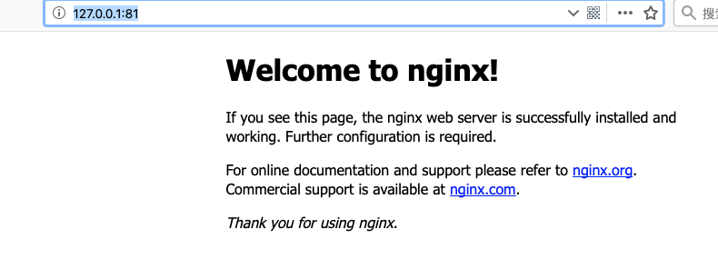

==> nginx
Docroot is: /usr/local/var/www

The default port has been set in /usr/local/etc/nginx/nginx.conf to 8080 so that
nginx can run without sudo.

nginx will load all files in /usr/local/etc/nginx/servers/.

To have launchd start nginx now and restart at login:
  brew services start nginx
Or, if you don't want/need a background service you can just run:
  nginx
kevindeMacBook-Air:~ kevin$

kevindeMacBook-Air:~ kevin$ sudo nginx
Password:
nginx: [emerg] bind() to 0.0.0.0:8080 failed (48: Address already in use)
nginx: [emerg] bind() to 0.0.0.0:8080 failed (48: Address already in use)
nginx: [emerg] bind() to 0.0.0.0:8080 failed (48: Address already in use)
nginx: [emerg] bind() to 0.0.0.0:8080 failed (48: Address already in use)
nginx: [emerg] bind() to 0.0.0.0:8080 failed (48: Address already in use)
nginx: [emerg] still could not bind()
kevindeMacBook-Air:~ kevin$ 

// 修改为80端口
kevindeMacBook-Air:~ kevin$ vi /usr/local/etc/nginx/nginx.conf

kevindeMacBook-Air:~ kevin$ sudo nginx
nginx: [emerg] bind() to 0.0.0.0:80 failed (48: Address already in use)
nginx: [emerg] bind() to 0.0.0.0:80 failed (48: Address already in use)
nginx: [emerg] bind() to 0.0.0.0:80 failed (48: Address already in use)
nginx: [emerg] bind() to 0.0.0.0:80 failed (48: Address already in use)
nginx: [emerg] bind() to 0.0.0.0:80 failed (48: Address already in use)
nginx: [emerg] still could not bind()
kevindeMacBook-Air:~ kevin

kevindeMacBook-Air:~ kevin$ lsof -i :80
kevindeMacBook-Air:~ kevin$ lsof -i :8080
COMMAND   PID  USER   FD   TYPE            DEVICE SIZE/OFF NODE NAME
nginx   42869 kevin    6u  IPv4 0x97257f79dc0dbd3      0t0  TCP *:http-alt (LISTEN)
nginx   42870 kevin    6u  IPv4 0x97257f79dc0dbd3      0t0  TCP *:http-alt (LISTEN)
kevindeMacBook-Air:~ kevin$ sudo kill -9 42869
kevindeMacBook-Air:~ kevin$ sudo kill -9 42870
kevindeMacBook-Air:~ kevin$ lsof -i :8080
kevindeMacBook-Air:~ kevin$ lsof -i :80
kevindeMacBook-Air:~ kevin$ 

排查了下，80端口应该是之前调试php，开启了apache服务占用了，127.0.0.1/1.php可以正常访问php项目

将nginx项目设置为81吧

http://127.0.0.1:81/
修改为81后，可正常访问



默认访问目录为 /usr/local/var/www
