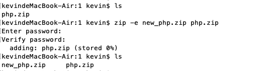
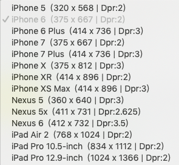

# 问题记录
### 2019/11/14 周四
#### Number.prototype.toLocaleString()
返回千分位逗号分隔的字符串.
```js
// MDN文档: https://developer.mozilla.org/en-US/docs/Web/JavaScript/Reference/Global_Objects/Number/toLocaleString
var number = 12123
number.toLocaleString() // "12,123"
number.toLocaleString('en', {style:'currency', currency:'USD'}) // "$12,123.00"
number.toLocaleString('cn', {style:'currency', currency:'CNY'}) // "￥12,123.00"
```
#### 状态管理的使用场景
之前可能是很少写非常复杂的联动逻辑，发现如果多组件需要取很多公共数据做检验联动时，状态管理是非常有必要的。这是一个很好的使用场景。如果场景不是很复杂，那就没必要使用状态管理。想到之前看vuex官方文档时的一句话: Flux libraries are like glasses: you’ll know when you need them.(Flux 架构就像眼镜：您自会知道什么时候需要它。) https://vuex.vuejs.org/

### 2019/11/13 周三
#### Mac zip压缩加密
```shell
zip -e 目标文件名.zip 需要加密的zip文件
# 输入上面的命令后，会提示输入两次密码
```
更多zip命令相关用法，可以在控制台使用 **man zip** 查看文档



### 2019/11/12 周二
#### vscode git插件 GitLens 
vscode插件名称: "GitLens -- Git supercharged"，安装后点击某一行代码，都会显示最近的git提交记录，非常好的一个git插件
#### toFixed() 对number取整或保留指定小数位
```js
/**
 * Number.prototype.toFixed()
 * The toFixed() method formats a number using fixed-point notation.
 * https://developer.mozilla.org/zh-CN/docs/Web/JavaScript/Reference/Global_Objects/Number/toFixed
 * 
 * 使用方法：
 * numObj.toFixed(digits) 
 * @params { Integer } digits 可选 保留精度，为空时，默认为0，即取整
 * @returns { String } 返回转换后的字符串
 */
var a = 1.235
a.toFixed()  // "1"
typeof a.toFixed()  // "string"
a.toFixed(2) // "1.23"
```
**重点来了,tofixed()需要注意的地方:**
- 四舍五入不精确的问题，类似于 0.1 + 0.2 === 0.3 不成立

```js
var a = 0.15
var b = 0.25
a.toFixed(1) // "0.1"  注意这里四舍五入异常
b.toFixed(1) // "0.3"  这里四舍五入又是成功的

// 如果希望精准的保留1位小数可以   Math.round(a*10) / 10, 如果是两位 100，n位  Math.pow(10, n)
Number.prototype.myToFixed = function (num) {
  // 在原型方法注入 myToFixed函数，这里怎么获取当前的值呢？可以使用this
  // 注意 this 是一个Number对象
  // var a = Number(2)  // 2  typeof a 为 "number"
  // var b = new Number(2) // Number{2}  typeof b 为 "object"
  // 获取值需要使用 b.valueOf()  // 2

  // 如果没有传参数
  if (num === undefined) {
    return Math.round(this.valueOf())
  }

  // 如果有传参，且为整数
  if (Number.isInteger(num)) {
    var tempCount = Math.pow(10, num)
    var tempNum = Math.round(this.valueOf() * tempCount) / tempCount
    // 这一步其实已经就可以了。但对于保留整数后面两位小数来说，会有bug
    // var a = 2
    // a.myToFixed(2)  =>  2  而不是 2.00
    // 需要再转换下
    return tempNum.toFixed(num)
  } else {
    throw new Error('参数必须是number类型，且必须是整数')
  }
}
```
- 负数的运算符优先级问题
```js
-2.12.toFixed(1) // -2.1  注意返回的字符串，被 - 操作后就是number了
(-2.12).toFixed(1) // "-2.1" 
```

### 2019/11/11 周一
#### 移动端屏幕尺寸相关


#### 什么是devops
> 参考: https://www.zhihu.com/question/58702398/answer/235777073

DevOps 是 Development（开发）和 Operations（运维） 的组合词

- 目前学术界和从业人员还没有为 "DevOps" 建立唯一的定义
- DevOps可以改变 运营、开发、测试人员在开发和交付过程中协作的方式。
- 网易云认为：**DevOps 强调的是高效组织团队之间如何通过自动化的工具协作和沟通来完成软件的生命周期管理，从而更快、更频繁地交付更稳定的软件**
- DevOps 的出现是由于软件行业日益清晰地认识到，为了按时交付软件产品和服务，开发部门和运维部门必须紧密合作。
- 企业为什么需要DevOps，DevOps有什么依赖？网易云认为:
  - 为了抓住商业机会，业务需要快速迭代，不断试错，因此，企业需要依赖拥有持续交付的能力，这些不仅包括技术需求还包括产品的需求，如何能拥有持续交付的能力，大而全的架构因为效率低下，显然是不合适的。于是演变出微服务架构来满足需求，通过把系统划分出一个个独立的个体，每个个体服务的设计依赖需要通过12 要素的原则来规范完成。
  - 系统被分成了几十个甚至几百个服务组件，则需要借助DevOps 才能很好地满足业务协作和发布等流程。
  - DevOps 的有效实施需要依赖一定的土壤，即敏捷的基础设施服务，现实只有云计算的模式才能满足整体要求。

- DevOps 希望做到的是软件产品交付过程中IT工具链的打通，使得各个团队减少时间损耗，更加高效地协同工作。

#### 什么是 serverless
字面意思是无服务器，小程序云开发就是一种
- 发展过程: 物理设备 => 虚拟机 => 容器 => serverless（只需关注业务逻辑，不需要关心服务器资源等）
- 减少人力成本7-8人开发  => 2-3人
- 弹性伸缩，所需耗时: 虚拟机(小时级) => 容器(分钟级) => serverless(毫秒级)
- 故障恢复方面优势
- serverless 支持语言：nodejs，java，go，php，python
- 注意：强依赖某个平台及其开放的服务
- 云函数 Serverless Cloud Function  https://cloud.tencent.com/product/scf
#### CI/CD/CO
CI持续集成 => CD持续交付 => CO持续运营
#### Docker与K8S集群
> 参考: [干货满满！10分钟看懂Docker和K8S](https://my.oschina.net/jamesview/blog/2994112)
##### Docker容器
容器是虚拟机的一个发展，相对传统的虚拟机，容器的优点:

特性 | 虚拟机 | 容器
--- | --- | ---
隔离级别 | 操作系统级 | 进程级
隔离策略 | Hypervisor | CGroups
系统资源 | 5-15% | 0-5%
启动时间 | 分钟级 | 秒级
镜像存储 | GB-TB | KB-MB
集群规模 | 上百 | 上万
高可用策略 | 备份、容灾、迁移 | 弹性、负载、动态

##### K8S集群
K8S是基于容器的集群管理平台，它的全称，是kubernetes。
- Kubernetes这个单词来自于希腊语，含义是舵手或领航员。K8S是它的缩写，用“8”字替代了“ubernete”这8个字符。
- 和Docker不同，K8S的创造者，是众人皆知的行业巨头——Google。K8S是2014年6月由Google公司正式公布出来并宣布开源的。
- 一个K8S系统，通常称为一个K8S集群（Cluster）。这个集群主要包括两个部分：
  - 一个Master节点（主节点）主要负责管理和控制
    - API Server 是整个系统的对外借款，供客户端何其他组件调用，相当于营业厅
    - Scheduler 负责对集群内的资源进行调度，相当于调度室
    - Controller manager负责管理控制器，相当于大总管
  - 一群Node节点（计算节点）Node节点是工作负载节点，里面是具体的容器
    - Docker 用来创建容器 
    - kubelet 主要负责监视指派到它所在Node上的Pod，包括创建、修改、监控、删除等
    - kebu-proxy 主要负责为Pod对象提供代理
    - Fluentd 主要负责日志收集、存储与查询
    - kube-dns（可选）
    - Pod, Pod是Kubernetes最基本的操作单元。一个Pod代表着集群中运行的一个进程，它内部封装了一个或多个紧密相关的容器。除了Pod之外，K8S还有一个Service的概念，一个Service可以看作一组提供相同服务的Pod的对外访问接口。

### 2019/11/09 周六
#### 原生JS自定义prompt组件
旧的jsp项目，需要用到prompt功能，但需要优化下UI，整体导入elementUI不合适，就自己用原生JS写了个。样式、div结构，直接从elementUI message-box审查元素里面抽离，相关点击事件，校验，自己封装，具体代码位置: https://github.com/zuoxiaobai/fedemo/blob/master/src/DebugDemo/prompt/index.html
```js
/**
 * 向window挂载 elcustomPrompt 函数，代替系统的prompt
 * window.elCustomPrompt  IE9+
 * 从 element UI中抽出messagebox样式结构
 */
(function() {
  /**
   * @description elementUI风格自定义propmt封装
   * @param { String } title  标题propmt第一个参数
   * @param { String } placeholder input的placeholder
   * @param { Function } validateFunc 动态校验值函数
   *   - 点击确认后，执行的函数，参数为当前值， 
   *   - return格式:
   *     { result: true, msg: '成功'}
   *     { result: false, msg: '自定义错误信息' }
   * 考虑到阻塞程序向下执行，兼容性问题，不使用promise，使用回调函数。
   * @param { Function } callback 获取到值后的回调
   */
  function elCustomPrompt(title, placeholder, validateFunc, callback) {
    console.log('show elCustomPrompt')
    var deleteImgUrl = 'delete.png' // 16 * 16
    var errMsg = '' // 错误信息

    // 创建dom并挂载
    var domStr = '<!--遮罩--><div class="v-modal" tabindex="0" style="z-index:2054;"></div><!--弹窗_start--><div id="elCustomPromptMain" tabindex="-1" role="dialog" class="el-message-box__wrapper" style="z-index:2055;"><!--消息盒子_Start--><div class="el-message-box" id="elCustomPromptMessageBox"><!--顶部title以及关闭按钮--><div class="el-message-box__header"><div class="el-message-box__title"><span>'+title+'</span></div><button type="button" aria-label="Close" class="el-message-box__headerbtn" id="elCustomPromptCloseBtn"></button></div><!--内容--><div class="el-message-box__content"><div class="el-message-box__input"><div class="el-input"><input type="text" id="elCustomPromptInput" autocomplete="off" placeholder="'+placeholder+'" class="el-input__inner"></div><div class="el-message-box__errormsg" id="elCustomPromptErrMsgDiv" style="visibility:hidden;">'+errMsg+'</div></div></div><!--底部按钮--><div class="el-message-box__btns"><button type="button" class="el-button el-button--default el-button--small" id="elCustomPromptCancelBtn"><span>取消</span></button><button type="button" class="el-button el-button--default el-button--small el-button--primary" id="elCustomPromptOkBtn" disabled="disabled"><span>确定</span></button></div></div><!--消息盒子_end--></div><!--弹窗_end-->'

    var div = document.createElement('div')
    div.setAttribute('id', 'elCustomPromptDiv')
    div.innerHTML = domStr
    document.body.appendChild(div)

    // 移除弹窗框
    function removeDiv() {
      document.body.removeChild(div)
    }

    // 绑定事件
    var elCustomPromptErrMsgDiv = document.getElementById('elCustomPromptErrMsgDiv'), 
        elCustomPromptCloseBtn = document.getElementById('elCustomPromptCloseBtn'),
        elCustomPromptCancelBtn = document.getElementById('elCustomPromptCancelBtn'),
        elCustomPromptOkBtn = document.getElementById('elCustomPromptOkBtn'),
        elCustomPromptInput = document.getElementById('elCustomPromptInput'),
        elCustomPromptMain = document.getElementById('elCustomPromptMain')
        elCustomPromptMessageBox = document.getElementById('elCustomPromptMessageBox')

    // 关闭弹窗、取消事件
    elCustomPromptCloseBtn.onclick = function() {
      removeDiv()
    }
    elCustomPromptCancelBtn.onclick = function() {
      removeDiv()
    }

    // 点击确定后的操作
    elCustomPromptOkBtn.onclick = function() {
      console.log('点击了确定')

      // 再次校验
      let tempResult = validateFunc(elCustomPromptInput.value)
      if (!tempResult.result) {
        elCustomPromptErrMsgDiv.style.visibility = 'visible'
        elCustomPromptErrMsgDiv.innerHTML = tempResult.msg
        elCustomPromptOkBtn.setAttribute('disabled', 'disabled')
        return
      }

      // 关闭 弹窗，调用callback
      removeDiv()
      callback(elCustomPromptInput.value)
    }

    // 输入事件
    elCustomPromptInput.oninput = function(e) {
      console.log(elCustomPromptInput.value)

      // 校验并显示信息
      var tempResult = validateFunc(elCustomPromptInput.value)
      console.log(tempResult)
      if (tempResult.result) {
        console.log('成功')
        // 校验成功
        elCustomPromptErrMsgDiv.style.visibility = 'hidden'
        elCustomPromptErrMsgDiv.innerHTML = ''
        elCustomPromptOkBtn.removeAttribute('disabled')
      } else {
        // 校验失败
        console.log('失败')
        elCustomPromptErrMsgDiv.style.visibility = 'visible'
        elCustomPromptErrMsgDiv.innerHTML = tempResult.msg
        elCustomPromptOkBtn.setAttribute('disabled', 'disabled')
      }
    }

    // 空白位置点击关闭弹窗
    elCustomPromptMain.onclick = function() {
      removeDiv()
    }
    elCustomPromptMessageBox.onclick = function(e) {
      event.stopPropagation()
    }
  }

  window.elCustomPrompt = elCustomPrompt
})()
```

#### 点击外部关闭div
一句话总结：用一个父元素(铺满屏幕，绝对布局)包裹该div(绝对布局，水平垂直居中，固定宽高)，父元素监听点击事件后移除div，子元素div监听点击后阻止事件冒泡。这样就实现了，点击外部关闭div，点击内部区域不关不div。测试代码:
```html
<body>
  <button id="clickme">点击我弹窗对话框</button>
  <script>
    function showPopup(event) {
      let tempHtml = `
        <!-- 遮罩 -->
        <div class="mask" style="position:absolute;z-index:25555;top:0;bottom:0;width:100%;background:#888;opacity:0.5"></div>
        <!-- 内容区域-->
        <div id="popup-content-container" class="content-container" style="position:absolute;z-index:25556;top:0;bottom:0;width:100%">
          <div id="popup-content-main" class="content-main" style="position:absolute;top:50%;left:50%; transform: translate(-50%, -50%); width:300px;height:200px;background:#fff;border:1px solid #ddd;">
            我是弹窗盒子  
            <button id="closebtn">关闭</button>
          </div>
        </div>
      `

      // 创建div
      let div = document.createElement('div')
      div.setAttribute('id', 'popup-div')
      div.innerHTML = tempHtml

      // 挂载到dom
      document.body.appendChild(div)

      // 事件监听
      // 关闭弹窗
      document.getElementById('closebtn').onclick = function(e) {
        document.body.removeChild(div)  // 移除元素
      }

      // 点击外部关闭div 关键代码  
      document.getElementById('popup-content-container').onclick = function(e) {
        document.body.removeChild(div)  // 移除元素
      }
      document.getElementById('popup-content-main').onclick = function(e) {
        e.stopPropagation() 
      }
    }

    // 简单的弹窗框封装，只为测试点击外部关闭div
    document.getElementById('clickme').onclick = (event) => {
      showPopup(event)
    }
  </script>
</body>
```
#### 非箭头函数作为参数时this问题
复习下JS高程3里面将的函数做参数时this的问题，除了bind，也可以使用闭包
```js
var a = 5

function callback() {
  var a = 1
  console.log('-- callback this', this, this.a, '--')
}
function validate() {
  var a = 2
  console.log('-- validate this', this, this.a, '--')
}
function showPrompt(title, validate, callback) {
  validate() // 打印 5
  callback() // 打印 5
}
showPrompt('1', validate, callback) // 5 5 
showPrompt('1', validate.bind(validate), callback.bind(callback)) // 2 1
```
#### CSS优先级，防止外部样式污染组件
一句话总结：如果不想用!important，那最前面加id，来提高优先级

> 这复习下之前看HTML权威指南css部分及CSS权威指南里css优先级的问题 https://www.yuque.com/guoqzuo/piylht/dg9u82#4944cc9c

如果两条定义于同一层次的样式都能应用于同一个元素。且都包含同样的属性值，就需要根据特殊性来决定到底使用哪种。
a. 样式的选择器中id值的数目(#)
b. 选择器中其他属性和伪类的数目(.class等属性)
c. 选择器中元素名和伪元素数目（元素名等）

a的特殊性最高，b其次，c最低。按a-b-c来表示。比如如果a值相等，才会去比较b。1-0-0的特殊性比0-5-5高。在 **CSS权特威指南** 中，有4位，最高位为内嵌(Inline)样式设置的样式。关于特殊性，建议看CSS权威指南，个人认为比这里要好理解一点。如果层级一样，谁后定义的，优先级就越高。

#### 函数命名：validate和verify的区别
> 参考: https://zhidao.baidu.com/question/486470512.html

- validate 指要付出一段程序化的核实过程。从事物的多个方面来说的，具有充分证据，且已实施，从多个方面论证。
- verify 是一般的检验，检查，倾向于一个动作, 从事情或事物的一个方面来说的，具有证据，且已实施，但只从一个方面实施；
- confirm 则是确认，是从主观判断来说的，可能有一些证据，但未实施
- **其实区别只是在于证实的强度：confirm < verify < validate**


### 2019/11/08 周五
#### background-repeat与background-position冲突
当设置是background-repeat在y轴重复背景时，background-position设置的顶部开始具体会无效

#### position:absolute元素高度自适应
业务场景：
```html
<!--
页面布局：
顶部背景图 // 非透明   
中间主内容 // 中间内容也有背景，内容里的title需要有一部分放到top背景区域
底部背景图
-->
<div class="container">
  <!-- 顶部背景区域 -->
  <section class="top"></section>
  <!-- 中间主要内容-->
  <section class="main">
    <div class="main-title" id="autoHeightTitle">我是标题</div>
    <div id="autoMarginTop">产品信息</div>
  </section>
  <!-- 顶部背景区域-->
  <section class="bottom"></section>
</div>
```
最开始的思路：直接将main-title 设置margin-top: -20px，但这样会导致中间主内容整体上移，覆盖顶部部分内容，然后想到使用background-position属性将中间部分内容背景顶部开始位置设置20px左右，这样margin上去后，部分内容使用的就会是顶部的背景。但中间部分内容又设置了backgroud-repeat属性，导致background-position设置失效。

换个思路，将main-title再用一层div包裹，外层div position设置为relative, main-title设置为position:absolute，这样 top:-20px 即可实现需求，但问题来了。标题如果过长，会分行显示(可能是2行，3行，4行)，这样会覆盖下面的产品信息。所以需要知道标题的高度。但标题是position：absolute的，已经脱离的文档流，无法对现有文档布局造成影响。

貌似没有css的解决方法，只能通过dom，计算title高度，然后将产品信息设置对应的margin-top
```js
document.getElementById('autoMarginTop').style.marginTop = document.getElementById('autoHeightTitle').clientHeight - relatvie包裹元素高度 + 'px'
```


### 2019/11/07 周四
#### svn使用命令拉取更新
> svn update

git与svn常用命令对比: https://blog.csdn.net/scythe666/article/details/51941622
```
svnadmin create  ------------------------------> git init
svn co                 ------------------------------> git clone
svn update          ------------------------------> git pull
svn add              ------------------------------> git add
svn commit        ------------------------------>  git add, git commit
svn status          ------------------------------>  git status
svn switch <branch>  ------------------------>  git checkout <branch>
svn merge <branch>  ------------------------>  git merge <branch>
svn revert <file>  ------------------------------> git checkout <file>
```
#### 浏览器的断点调试功能使用场景
如果需要看别人的代码，运行异常，业务逻辑复杂的情况，可以加个console.log，打印的log位置，点击文件，进入，就可以在对应的文件下断点了。然后一步步执行，就可以确定问题所在。调试其他人写的复杂逻辑必备，这种情况靠console.log看太麻烦，特别是改动不方便实时更新调试的情况效果更好。

#### 使用idea build ant
之前用eclipse build ant ，将war deploy到tomcat的webapps会很慢，后面换成 idea后会很快。

### 2019/11/05 周二
#### html2canvas
测试demo地址: https://github.com/zuoxiaobai/fedemo/blob/master/src/DebugDemo/html2canvas/index.html
```html
<!-- 核心代码 -->
<head>
  <title>Document</title>
  <script src="html2canvas.js"></script>
</head>
<body>
  <div id="test" style="background-image: url('bg.jpg');height:707px;width:500px;color: #fff;">
    <div style="padding-top:250px;padding-left:100px;">
        <h1>邀请函</h1>
        <div style="width: 200px;
        word-break: break-word;">
          你好，邀请你xxxxxxxxxxxxxxxxxxxxxxxxxxxxxxxxxxxxxxxxxxxx
        </div>
        <p>
          --- guoqzuo
        </p>
    </div>
  </div>
  <script>
    let testElement = document.getElementById('test')
    html2canvas(testElement).then(function(canvas) {
      console.log(canvas)
      let img = new Image()
      img.src = canvas.toDataURL()
      img.onload = function() {
        document.body.appendChild(img);
      }
    });
  </script>
</body>
```
#### JSP注释与普通HTML注释区别
参考：https://www.cnblogs.com/qlqwjy/p/7681035.html
```jsp
<!-- 这里面的注释在查看页面源代码时，依旧可以看到，另外页面加载时这里面注释的内容仍旧会编译 -->
<%-- JSP中的注释，这里面的内容在查看页面源代码时，看不到这里面注释书写的内容 --%>
所以涉及业务的建议使用<%--  --%>注释，文字描述性的建议使用<!--   -->注释。
```
#### 编写可维护的JS
- 不要做太多骚操作, 尽量可维护，可迭代。不然乍一看写的很NB，再深入看，发现真的比较难维护, 这是不好的。
- 最怕一知半解，以为封装的很好，其实可能还弄复杂了。聪明很重要，如果不聪明，最好找个聪明的人商量、code review，感觉自己智商捉急。

#### 更改jsp项目后缓存问题
修改了某个js，重新编译到tomcat的webapps目录下，发现改动一直没有生效。以为改错了,进入编译后的文件目录，检查文件是有改动的，就想到应该是有缓存，浏览器加载过该js文件就缓存了。清下浏览器缓存，改动生效
#### 图片格式区别以及webp
> jpg、png、bmp、gif图片格式区别，什么是webp？

参考：https://baijiahao.baidu.com/s?id=1599728202992947939&wfr=spider&for=pc

##### webp
参考：https://baike.baidu.com/item/webp%E6%A0%BC%E5%BC%8F/4077671?fr=aladdin，https://www.jianshu.com/p/73ca9e8b986a
- 一种同时提供了有损压缩与无损压缩（可逆压缩）的图片文件格式
- 比png更小
- 2010年发布，目标减少文件大小，且达到JPEG格式相同的图片质量，希望可以减少图片在网络上的发送时间
- 由Google在购买On2 Technologies后发展出来，以BSD授权条款发布

##### jpeg/jpg (Joint Photographic Experts Group) 
- jpeg和jpg格式一样，没有区别。
- 兼容性高、传输速度快，内容小，大部分数码相机都能拍JPEG
- 有损压缩方案，压缩会降低细节和质量
##### tiff/tif (Tagged Image File Format)
- 位图，工业标准格式，印刷
##### png (Portable Network Graphics)
- 可移植网络图形格式
- 设计目的是试图代替gif何tiff文件格式。
- 支持压缩不失真，透明背景、渐变图像
- 非常适合在网络上使用。但不足以用作印刷
- 能够相容半透明、透明图像，文档比JPEG大
##### gif (Graphics Interchange Format)
- gif分为静态和动态两种
- 动态的gif图片是由多张图片保存为一个图片，形成动画效果
- 文档小、非常适合在网络上使用。包容颜色太少
##### bmp (Bitmap)
- 位图，文件较大，参考：https://zhidao.baidu.com/question/24130156.html

#### vscode插件live server
在html文件编辑区域，右键 => open With live server，可以开启http服务，不需要自己搭建node服务或nginx
#### 版本号中的rc是什么意思
参考：什么是 Alpha、Beta、RC、Release版 https://www.cnblogs.com/lanmiao/articles/2184282.html
- **Alpha版**: 此版本表示该软件在此阶段主要是以实现软件功能为主，通常只在软件开发者内部交流，一般而言，该版本软件的Bug较多，需要继续修改。
- **Beta版**: 该版本相对于α版已有了很大的改进，消除了严重的错误，但还是存在着一些缺陷，需要经过多次测试来进一步消除，此版本主要的修改对像是软件的UI。
- **RC版**: 该版本已经相当成熟了，基本上不存在导致错误的BUG，与即将发行的正式版相差无几。
- **Release版**: 该版本意味“最终版本”，在前面版本的一系列测试版之后，终归会有一个正式版本，是最终交付用户使用的一个版本。该版本有时也称为标准版。一般情况下，Release不会以单词形式出现在软件封面上，取而代之的是符号(R)。

```
// html2canvas Releases note
v1.0.0-rc.5
v1.0.0-rc.4
…
v1.0.0-rc.0
v1.0.0-alpha.12
…
v1.0.0-alpha.1

v0.5.0-beta4
v0.5.0-beta3
0.5.0-alpha1
v0.4.1 - 7.9.2013
v0.3.3 - 2.3.2012
v0.3.2 - 20.2.2012
0.3.1
v0.3.0 - 7.9.2011
```
### 2019/11/04 周一
#### 路由传参与keep-alive
```html
<keep-alive>
	<router-view v-if="$route.meta.iskeepAlive" :key="routeKey">
</keep-alive>
<router-view v-if="!$route.meta.iskeepAlive" :key="routeKey">
```
#### 仅开发环境能看到的路由
```js
let routes = []

// 路由信息仅开发环境可见
if (process.env.NODE_ENV === 'development') { 
	routes = [
		{
			path: ‘/xxxx’,
			component: () => import(‘xxx’)
		}
	]
}

export default routes
```
#### mac显示文件扩展名
点击屏幕下方第一个图标：访达(Finder) => 屏幕左上方苹果logo右侧 点击 访达(Finder) => 偏好设置 =>  高级 => 勾选显示所有文件扩展名

### 2019/11/01 周五
#### JSP相关
- comcat 不用安装，直接到tomcat官网下载core文件，zip 压缩后就直接可以用，bin目录下的文件默认没有可执行权限，需要使用chmod +x bin/* 来修改权限，使用./startup.sh启动tomcat服务，使用./shuntdown.sh来关闭tomcat服务，默认开启端口为8080，可以通过访问 127.0.0.1:8080 看是否有tomcat显示，来判断服务是否已开启。默认访问的是webapps里面的项目，拷贝war包到webapps目录，如果tomcat服务开启，会自动解压缩。config配置文件一般会放到class目录下。
- eclipse 可以配置ant build，debug选项。

#### 直接用get方法下载文件
```js
// 没有下载进度，页面不会跳转，没什么反应
var a = '<a display="none" id="download" href="下载链接?拼接参数"><a>'
$("html").append(a)
document.getElementById('download').click()
$('#download').remove()
```
#### 文件下载进度依赖
文件下载进度里会有一个total, loaded字段，total字段依赖于后端response响应头里的Content-length
#### README.md文档的重要性
写的逻辑或项目搭建情况，遇到的坑，思路，一定要有markdown，这样后面他人维护会很好维护。不至于耗费大量时间去整理业务逻辑(搬砖)，建议存到当前目录的readme.md或者同一存放到docs目录里

### 2019/10/31 周四
#### HTML注释的重要性
当看别人代码时会有大用，
```html
<!-- 每个功能模块前必须加注释 -->
...

<!-- 如果涉及隐藏的必须加end_其他可不加end_start -->
...
<!-- 如果涉及隐藏的必须加end_其他可不加end_end -->
```
### 2019/10/30 周三
#### svn拉取代码
```shell
# checkout svn，注意如果密码错误，会不提示重新输入，如果403forbidden，就是没权限
svn checkout http://仓库地址 --username=用户名
```
### 2019/10/28 周一
#### nginx默认超时时间为60s
需要注意，前端就算超时设置为2分，但如果前端代码部署到了nginx上，也会导致1分钟超时

#### 常用的组件函数整理
- 发布订阅模式代码
- 文件大小默认为B，转为合适的函数
- 当前时间获取函数

#### JS到底是解释型语言还是编译型语言
Is JavaScript really interpreted or compiled language ? https://segmentfault.com/a/1190000013126460

Js是一种解释型语言，令人困惑的地方：
- —般解释型语言是逐行解释执行的，为什么JS会有変曩提升(hoisting)的能力？
- 执行JS时会用到JIT, JIT(just in time compilers 及时编译）会做代码优化(同时也会创建代码的编译版本),解释型语言无法做到这些

##### 变量提升问题
在函数作用域内的任何变量声明都会被提升到顶部，且值为undefined，JS处理声明语句的过程：
- 一旦v8引擎进入一个执行具体代码的执行上下文(函数)，会对代码进行词法分析或分词(lexing and tokenizing the code), 会将代码切分为原子性的令牌(atomic token) , 比 如foo = 10 
- 在分析完当前作用域后，它会将翻译后的版本解析为AST(抽象语法树)
- 每次遇到声明都会将其发送到作用域，并创建绑定，每次声明都会为变量分配内存，只是分配内存，并不会通过修改源代码来将变最声明语句提升，在JS中分配内存，意味着将变量默认设置为undefined
- 在这之后，引擎每次遇到赋值或者取值，都会通过作用域(scope)查找绑定。如果当前作用域中没有找到，就接着向上级作用域中查找，直到找到为止 
- 接着引擎生成CPU可执行的机器码 
- 最后，代码执行完毕

##### JIT是什么
JS start out slow, but then got faster thanks to something colled the JIT, but how does the JiT work ?
通俗一点说：浏览器在解释执行JS时，如果遇到某些语句多次执行，会将对应的语句编译，并存储。下次再执行相同的语句时，不用再重新编译，而是直接执行之前存储的该语句编译的版本。当然里面不止这么简单，还有很多优化， 详情參考: A crash course in just-in-time (JIT) compilers

##### 总结
- JS需要有JS引擎解析才能执行。这是解释型语需要的，编译型语言程序你能直接运行。
- 变量提升只是JS解释器处理事情的方式导致的，
- JIT 是唯一一点可以对JS是否是解释型语言提出疑问的理由。但JIT不是完整的编译器，它仅在执行前编译，且JIT只是Mozilla 和 Google开发人员为了提升浏览器性能才引入的，JS或TC39从没有强制要求使用JIT，
综上：JS是解释型语言或混合型语言(编译型型和解释型的混合)，而不是编译型语亩。

### 2019/10/26 周六
#### 原生JS实现遮罩动画
只需引入一个JS，即可载入该动画，demo地址:
https://github.com/zuoxiaobai/fedemo/tree/master/src/DebugDemo/%E9%81%AE%E7%BD%A9%E5%8A%A8%E7%94%BB%E6%95%88%E6%9E%9C

### 2019/10/24 周四
#### element percentage大于100
element UI报错 custom validator check failed for prop "percentage"，进度大于100或出错

### 2019/10/23 周三
#### node res大文件字符串时内存溢出
想把buffer数据转为stirng，设置为json格式传到前端，但如文件过大，直接就崩了。

### 2019/10/18 周五
#### 骨架屏研究
- 一种自动化生成骨架屏的方案 https://blog.csdn.net/sinat_17775997/article/details/83443744
- 教你实现超流行的骨架屏预加载动态效果 http://www.dxcu.com/news/show-531569.html
- repeating-linear-gradient 线性渐变研究TODO

#### 下载文件带进度显示
- 本地搭建node服务，模拟download接口，参见node笔记
- 从后端接收文件数据时，进度显示
```html
<!-- 导出按钮 -->
<div class="title-right">
  <a href="javascript:void(0)" 
    :class="{ 'disabled-a': isShowProgress }" 
    @click="exportExecl">
    全部导出
  </a>
</div>

<!-- 显示下载进度组件封装 -->
<download-progress
  :progressEvent="progressEvent"
  :isShowProgress="isShowProgress"
  :cancelDownload="handleWhenPorgresss('end')"
></download-progress>

<script>
import DownloadProgress from './DownloadProgress'
import axios from 'axios'

export default {
  components: { DownloadProgress },
  data() {
    return {
      progressEvent: {}, // 下载进度
      isShowProgress: false, // 是否显示progress面板, disabled导出按钮
      axiosCancelTokenSource: '', // axios取消请求
    }
  },

  methods: {
    onDonloadProgress(progressEvent) {
      cosnole.log(progressEvent)
      this.progressEvent = progressEvent
    },

    async exportExecl() {
      if (this.isShowProgess) {
        console.log('导出中，点击无效')
        return
      }

      try {
        this.handleWhenProgress('start')

        let axiosConfig = {
          onDonloadProgress: this.onDownloadProgess.bind(this),
          cancelToken: this.axiosCancelTokenSource.token,
          timeout: 120000
        }
        let data = await xxx.getFileData(null, axiosConfig)
        console.log(data) 
        // blobdata，在axios配置中 responseType: 'blob' 就会返回Blob类型数据
        // 就是是json格式数据，也会被转Blob，TODO 当为JSON数据时特殊处理

        let fileType = "文件的MIME类型"

        if (data.type !=== fileType) {
          throw new Error("服务器返回数据类型异常")
        }

        this.handleWhenProgress('end')

        // 下载
        this.downloadFile(data, fileType, '文件名')
      } catch(e) {
        console.log('导出发生了异常', e)
        axios.isCancel(e) ? console.log('请求已取消') : this.$message.error(e.message)
        this.handleWhenProgress('end')
      }
    },

    hanldeWhenProgress(state) {
      if (state === 'start') {
        this.showProgress = true

        // 创建axios cancelToken
        this.axiosCanelTokenSource = axios.CancelToken.source() 
      } else {
        // 取消axios请求
        this.axiosCancelTokenSource.cancal('请求取消')

        // 初始化
        Object.assign(this, {
          isShowProgress: false,
          progress: {}
        })
      }
    }
  }
}
</script>

<style lang="less“>
  .title-right {
    a {
      color: rgb(36, 156, 211);
      text-decoration: none;
      &:hover {
        text-decoration: underline;
      }
    }
    .disabled-a {
      color: #888;
      &:hover {
        cursor: wait;
        text-decoration: none;
      }
    }
  }
</style>
```
- 文件数据接收完成后，使用axios配合Vue下载文件
```js
// data 后端返回的文件数据
function downloadFile(data, fileType, fileName) {
  // window.open(dataUrl)

  // fileType 文件的MIME类型
  // 参考: https://developer.mozilla.org/zh-CN/docs/Web/HTTP/Basics_of_HTTP/MIME_types/Complete_list_of_MIME_types
  const blobData = new Blob([data], {
    type: fileType 
  })
  console.log(blobData) // 检查数据是否正常

  //如果是IE，特殊处理，防止IE下提提示 "拒绝访问"
  if (window.navigator.msSaveBlob) {
    try {
      window.navigator.msSaveBlob(blobData, fileName, + '.xlsx')
    } catch(e) {
      console.log('msSaveBlob异常', e)
    }
    return
  }

  // 创建下载链接，并触发下载
  // https://developer.mozilla.org/zh-CN/docs/Web/HTML/Element/a#浏览器兼容性
  // <a> download attribute not support IE, iOS safari
  const dataUrl = window.URL.createObjectUrl(blobData)
  const downloadElement = document.createElement('a')
  downloadElement.href = dataUrl
  downloadElement.download = fileName // download文件名

  // 触发点击，下载
  document.body.appendChild(downloadElement)
  documentElement.click()

  // 移除辅助下载DOM及对象URL
  document.body.removeChild(downloadElement)
  window.URL.revokeObjectURL(dataUrl)
}
```
### 2019/10/17 周四
#### 纯前端实现execl文件导出
js-xlsx，github: https://github.com/SheetJS/js-xlsx

#### eslint禁止在return中使用赋值
为什么会有这个限制？
```js
function doSomething() {
  return foo = bar + 2
} 
```
官方的解释是：对于上面的代码，很难说明return的意图
- 该函数返回的结果是bar + 2 为什么要赋值给foo
- 目的还可能是比较运算符，如 == 

存在歧义，因此最好不要在return语句中使用赋值操作, 解决办法
- 鼠标移动到错误的位置，知道出现快速修复的按钮，Disabled no-return-assgin for this line，就会添加异常注释，// eslint-disabled-next-line on-return-assign
- 为了增强代码可读性有些自动修复去掉的括号可以加上，在配合上面的注释即可让eslint忽略


### 2019/10/16 周三
#### /deep/ 样式
深度选择器，Vue单文件组件中scope样式，对子组件会不生效。如果想让某些样式在子组件里面生效，可以使用/deep/
```html
<style lang="less" scoped>
/deep/ .el-checkbox {
  min-width: 180px;
  margin-bottom: 4px;
}  
</style>
```

### 2019/10/15 周二
#### 滚动条消失的问题
和高度设置有关，如果，注意用 min-height: calc(100vh - top高度)

#### 遍历对象优雅写法
```js
let obj = {
  a: 1,
  b: 2
}
Object.keys(obj).forEach(key => {
  cosnole.log(key, obj[key])
})
```


### 2019/10/12 周六 
#### #ffffff 与 #fff 的区别
3位是6位的缩写，比如#ccc就是#cccccc的缩写。并不是所有的都可以缩写，必须符合一定的格式。注意：与移动端原生交互时，颜色不要使用缩写，安卓可能会显示异常。
```js
// 缩写都是以每两位为缩写的单位
// #abc  => #aabbcc
// #1D2  => #11DD22 
```
#### eslint保存时自动fix
vscode默认的autofix只能fix  .js的文件，无法fix .vue的文件，加入下面的配置即可
```js
// config
{
  "edit.formatOnSave": false,   // 取消自带fix，使用eslint自动保存fix
  "eslint.autoFixOnSave": true, // 每次保存的时候将代码按eslint格式进行修复
  "eslint.validate": [
    "javascript",
    "javascriptreact",
    {
      "language": "vue",
      "autoFix": true
    },
    "html"
  ]
}
```
#### 全局修改el菜单样式不影响其他
.vue单文件组件style元素加上scope后，当前页面修改el-tree的默认样式无效需要去掉scope，将样式暴露到全局，但对全局可能有影响，解决方法是最外层使用特殊的class包裹
```html
<style lang="less">
  .root-menu-left {
    /* el样式修改 */  
  }
</style>
```
#### axios请求拦截
axios.interceptors TODO

### 2019/10/11 周五 
#### eltree 懒加载问题
懒加载每次加载数据都是从后台搜索而来，对于复杂的逻辑，建议用文字来整理，按步骤分解，不管逻辑多复杂，条理都会很清晰。
#### eltree highlight 属性
加上后，当前选中的背景色会稍微深一点

#### v-clock 指令
防止由于网络原因vue.js未渲染时，页面显示 {{username}} 的问题
```js
// 当编译完成后，v-clock属性会被自动移除。
[v-clock] {
  display: none;
}
<div v-clock>
  {{message/}}
</div>
```

### 2019/10/10 周四
#### URLSearchParams() 查询字符串处理
```js
var searchParams = new URLSearchParams()
searchParams.append('a', 1212)
searchParams.append('b', 'xxx')
searchParams.toString()   // "a=1212&b=xxxx"
```
#### 前端ajax请求时，设置Cookie请求头无效。
W3c规定，当请求的header匹配以下不安全的字符时，将被终止
```js
...
Cookie
Host
Referer
User-Agent
...
```
#### elementUI 全局触发消息
```js
// $message(), $alet()
import ElementUI from 'element-ui'
import 'element-ui/lib/theme-chalk/index.css'

Vue.use(ElementUI)

// 注意：引入方式不是 .use
Vue.prototype.$message = ElementUI.Message
Vue.prototype.$alert = ElementUI.MessageBox.alert

this.$message({
  type: 'error', // warning
  message: '这是一条消息' 
})

this.$message.error(e.message)
```

### 2019/10/09 周三
#### Vue中img的src是动态参数时不显示
  - 解决方法：使用require来加载图片， 参考 [Vue中img的src是动态渲染时不显示](https://blog.csdn.net/laishaojiang/article/details/80950995)
#### 滚动相关问题
  - 相关笔记 页面滚动相关(../笔记/页面滚动相关.md)
  - 进入页面后，计算某个id的offsetTop，再通过设置documet.documentElement.scrollTop滚动到该位置。这里滚动不了是因为高度是异步加载数据后才计算出来，需要在加载数据成功后，再执行，并使用 this.$nextTick(()=> { /* dom操作 */})。这里有耦合，可以用到设计模式中的发布订阅模式，mounted钩子函数订阅数据请求成功的消息，当接收该消息时执行dom操作。在异步数据请求ok后，发布数据请求成功的消息。另外这里是否不用操作dom，直接使用hash来滚动？直接使用element.scrollIntoView()方法？

### 2019/10/08 周二
#### macOS 安装ngin
解决方法：brew install nginx, 需要注意xcode不要随意卸载，不然会出各种奇怪的问题
#### text-overflow: ellipsis 
文本溢出处理，在HTML5权威指南这本书里是没有讲到这个知识点
```css
div.test {
  text-overflow: ellipsis;
}

/* 需要结合下面的三个属使用 */
{
  white-space: nowrap;  /* 不换行 */
  overflow: hidden;     /* 溢出内容隐藏 */
  width: 20em;          /* 指定宽度 */
}
```

### 2019/09/30 周一
#### npm run 端口被占用
- npm run dev退出后依旧占用端口
  - 解决方法，建议不要使用vscode的console，详情参见笔记， 可以关闭vscode再试试

