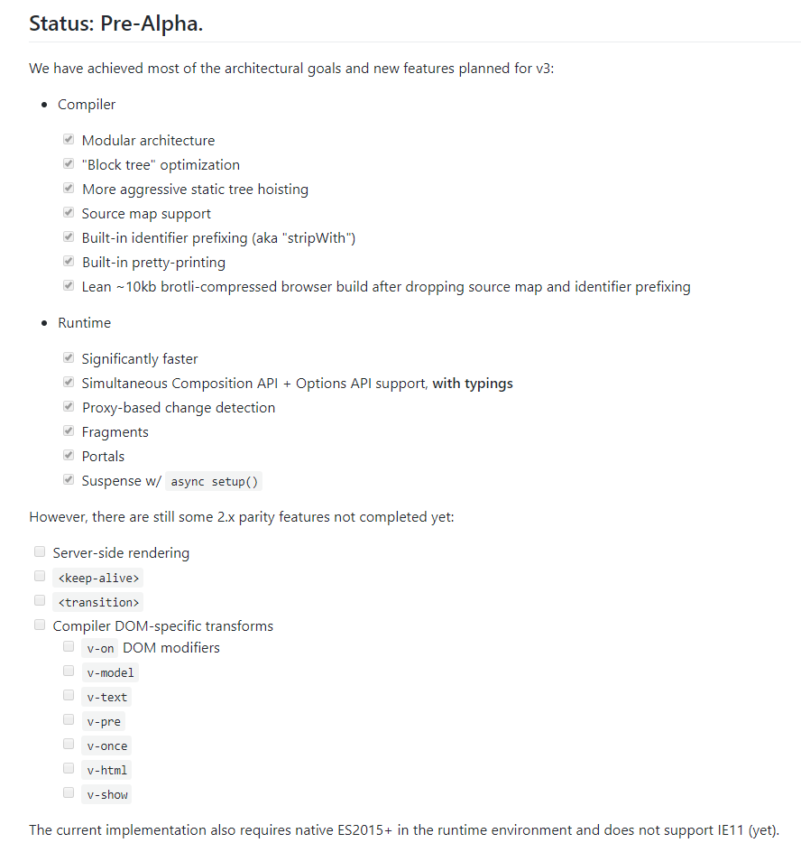
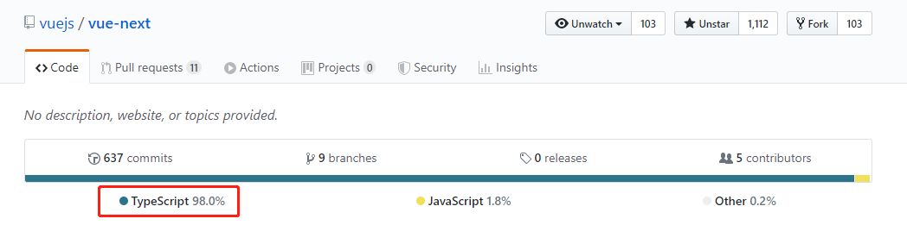
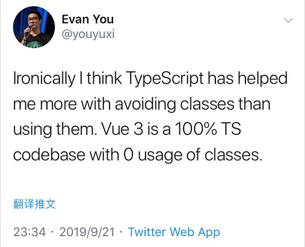
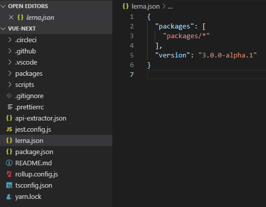
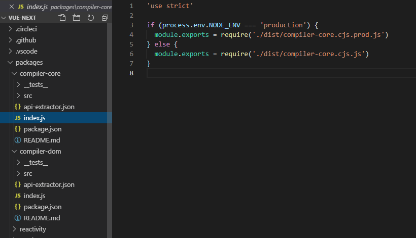
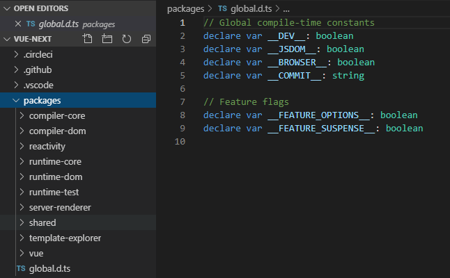

# vue3.0 pre-alpha源码导读
> 本文主要是通过学习整理下面的文章而成，将部分源码也大致的过了下。

[Vue 3.0 源码导读  ( 2019/10/05 方应杭)](https://juejin.im/post/5d977f47e51d4578453274b3) 

## 前言
2019/10/05日凌晨，尤雨溪在各个平台发送动态：Vue 3 源码开放，目前还是pre-alpha状态，主要的构架改进、优化和新功能都已经完成，剩下的主要是完成一些Vue2现有功能的移值，github仓库地址：[vuejs/vue-next](https://github.com/vuejs/vue-next)



## Vue3.0 TypeScript的使用


Vue 3.0  98%的代码均使用 TypeScript 编写，Vue源码里面完全没有使用class关键字，只在测试代码和示例代码里用到了class



## 阅读前的准备工作
建议先了解 
- [Composition API RFC](https://vue-composition-api-rfc.netlify.com/#summary)
- [TypeScript 入门教程](https://ts.xcatliu.com/basics) 

## 源码结构
lerna.json文件显示版本号为 3.0.0-alpha.1，主要功能实现放在packages目录下



### 模块化
每个功能模块都有一个目录，目录下都有__test__、src目录、index.js，package.json等



### packges目录


#### compiler-core 目录 (@vue/compiler-core)
编译器核心，暴露了 AST 和 baseCompile 相关的 API，它能把一个template变成一棵 AST(抽象语法树)
transforms包含 vBind.ts, vFor.tx, vIf.ts, vModel.ts, vOn.ts, vSlot.ts等
```ts
export function baseCompile(
  template: string | RootNode,
  options: CompilerOptions = {}
) : CodegenResult {
    // ...
    const ast = isString(template) ? parse(template, options) : template
    // ...
    transform(ast, {
        // ...
    })
    // ...
    return generate(ast, options)
}

// Also expose lower level APIs & types
export { parse, ParserOptions, TextModes } from './parse'
export {
  transform,
  createStructuralDirectiveTransform,
  TransformOptions,
  TransformContext,
  NodeTransform,
  StructuralDirectiveTransform
} from './transform'
export {
  generate,
  CodegenOptions,
  CodegenContext,
  CodegenResult
} from './codegen'
export { ErrorCodes, CompilerError, createCompilerError } from './errors'
export * from './ast'
```

#### compiler-dom 目录 (@vue/compiler-dom)
编译器-dom，针对浏览器而写的编译器。 基于compiler-core模块，针对浏览器做了适配，如对 textarea 和 style 标签做了特殊处理。
transforms包含 transformStyle.ts, vCloak.ts, vHtml.ts, vModel.ts, vOn.ts, vShow.ts, vText.ts等
```ts
export function compile(
  template: string,
  options: CompilerOptions = {}
): CodegenResult {
  return baseCompile(template, {
    ...options,
    ...(__BROWSER__ ? parserOptionsMinimal : parserOptionsStandard),
    nodeTransforms: [transformStyle, ...(options.nodeTransforms || [])],
    directiveTransforms: {
      // TODO include DOM-specific directiveTransforms
      ...(options.directiveTransforms || {})
    }
  })
}

export * from '@vue/compiler-core'
```

#### reactivity 目录 (@vue/reactivity)
数据响应式系统，这是一个单独的系统，可以与任何框架配合使用。
这是一个极其重要的模块,, 其暴露的主要 API 有 ref（数据容器）、reactive（基于 Proxy 实现的响应式数据，用到了WeakMap与WeekSet数据类型）、computed（计算数据）、effect（副作用） 等， 这个模块是 Composition API 的核心，其中的 ref 和 reactive 应该重点掌握。
```ts
export { ref, isRef, toRefs, Ref, UnwrapRef } from './ref'
export {
  reactive,
  isReactive,
  readonly,
  isReadonly,
  toRaw,
  markReadonly,
  markNonReactive
} from './reactive'
export {
  computed,
  ComputedRef,
  WritableComputedRef,
  WritableComputedOptions
} from './computed'
export {
  effect,
  stop,
  pauseTracking,
  resumeTracking,
  ITERATE_KEY,
  ReactiveEffect,
  ReactiveEffectOptions,
  DebuggerEvent
} from './effect'
export { lock, unlock } from './lock'
export { OperationTypes } from './operations'
```

#### runtime-core 目录（@vue/runtime-core）
运行时-核心，其实现的功能有虚拟 DOM 渲染器、Vue 组件和 Vue 的各种API，我们可以利用这个 runtime 实现针对某个具体平台的高阶 runtime，比如自定义渲染器。
This package is published only for typing and building custom renderers. It is NOT meant to be used in applications.
See '@vue/runtime-dom' for how a DOM-targeting renderer is implemented.
```ts
// 自定义渲染器
import { createRenderer, createAppAPI } from '@vue/runtime-core'

const { render, createApp } = createRenderer({
  pathcProp,
  insert,
  remove,
  createElement,
  // ...
})

// `render` is the low-level API
// `createApp` returns an app instance with configurable context shared
// by the entire app tree.
export { render, createApp }

export * from '@vue/runtime-core'


// runtime-core提供的部分功能
// For raw render function users
export { h } from './h'
export {
  createVNode,
  cloneVNode,
  mergeProps,
  openBlock,
  createBlock
} from './vnode'
// VNode type symbols
export { Text, Comment, Fragment, Portal, Suspense } from './vnode'
// VNode flags
export { PublicShapeFlags as ShapeFlags } from './shapeFlags'
export { PublicPatchFlags as PatchFlags } from '@vue/shared'

// For advanced plugins
export { getCurrentInstance } from './component'

// For custom renderers
export { createRenderer } from './createRenderer'
export {
  handleError,
  callWithErrorHandling,
  callWithAsyncErrorHandling
} from './errorHandling'
```

#### runtime-dom 目录（@vue/runtime-dom）
针对浏览器的 runtime。其功能包括处理原生 DOM API、DOM 事件和 DOM 属性等。 基于@vue/runtime-core模块而写的浏览器上的 runtime，主要功能是适配了浏览器环境下节点和节点属性的增删改查(包括transition.ts, attrs.ts, class.ts, event.ts, props.ts, style.ts等)。它暴露了两个重要 API：render 和 createApp，并声明了一个 ComponentPublicInstance 接口。
```ts
// runtime-dom/src/index.ts
import { createRenderer } from '@vue/runtime-core'
import { nodeOps } from './nodeOps'
import { patchProp } from './patchProp'

const { render, createApp } = createRenderer<Node, Element>({
  patchProp,
  ...nodeOps
})

export { render, createApp }

// re-export everything from core
// h, Component, reactivity API, nextTick, flags & types
export * from '@vue/runtime-core'

export interface ComponentPublicInstance {
  $el: Element
}

// 应用
import { h, createApp } from '@vue/runtime-dom'

const RootComponent = {
  render() {
    return h('div', 'hello world')
  }
}

createApp().mount(RootComponent, '#app')
```

#### runtime-test 目录 (@vue/runtime-test)
 一个专门为了测试而写的轻量级 runtime。由于这个 rumtime 「渲染」出的 DOM 树其实是一个 JS 对象，所以这个 runtime 可以用在所有 JS 环境里。你可以用它来测试渲染是否正确。它还可以用于序列化 DOM、触发 DOM 事件，以及记录某次更新中的 DOM 操作。主要功能是用对象来表示 DOM 树，方便测试。并且提供了很多有用的 API 方便测试
 ```ts
import { createRenderer, VNode } from '@vue/runtime-core'
import { nodeOps, TestNode, TestElement } from './nodeOps'
import { patchProp } from './patchProp'
import { serializeInner } from './serialize'

const { render, createApp } = createRenderer<TestNode, TestElement>({
  patchProp,
  ...nodeOps
})

export { render, createApp }

// convenience for one-off render validations
export function renderToString(vnode: VNode) {
  const root = nodeOps.createElement('div')
  render(vnode, root)
  return serializeInner(root)
}

export * from './triggerEvent'
export * from './serialize'
export * from './nodeOps'
export * from './jestUtils'
export * from '@vue/runtime-core'


// 应用示例
import {
  h,
  render,
  Component,
  nodeOps,
  startRecordingOps,
  dumpOps
} from '@vue/runtime-test'

class App extends Component {
  data () {
    return {
      msg: 'Hello World!'
    }
  }
  render () {
    return h('div', this.msg)
  }
}

// root is of type `TestElement` as defined in src/nodeOps.ts
const root = nodeOps.createElement('div')

startRecordingOps()

render(h(App), root)

const ops = dumpOps()

console.log(ops)
 ```

#### server-renderer 目录（@vue/server-renderer）
用于服务端渲染，TODO 状态

#### shared 目录 (@vue/shared)
内部使用的一些私有方法
Utility functions and constants shared across packages. This package itself is private and never published. It is inlined into other packages during build - rollup's tree-shaking ensures that only functions used by the importing package are included.
```ts
//compiler-core模块 import { isString } from '@vue/shared'
// 实现
export const isString = (val: any): val is string => typeof val === 'string'

// reactive.ts 引入 import { isObject, toTypeString } from '@vue/shared'
//实现
export const isObject = (val: any): val is Record<any, any> =>
  val !== null && typeof val === 'object'

export const objectToString = Object.prototype.toString
export const toTypeString = (value: unknown): string =>
  objectToString.call(value)

// 部分内部函数
export const isOn = (key: string) => key[0] === 'o' && key[1] === 'n'

export const extend = <T extends object, U extends object>(
  a: T,
  b: U
): T & U => {
  for (const key in b) {
    ;(a as any)[key] = b[key]
  }
  return a as any
}

const hasOwnProperty = Object.prototype.hasOwnProperty
export const hasOwn = (
  val: object,
  key: string | symbol
): key is keyof typeof val => hasOwnProperty.call(val, key)

export const isArray = Array.isArray
export const isFunction = (val: any): val is Function =>
  typeof val === 'function'
```

#### template-explorer目录
Vue 3 Template Explorer

#### vue 目录
这个包是“完整的构建”，它包含了两个运行时和编译器，并支持动态编译的模板选项。
```ts
// This package is the "full-build" that includes both the runtime
// and the compiler, and supports on-the-fly compilation of the template option.
import { compile, CompilerOptions } from '@vue/compiler-dom'
import { registerRuntimeCompiler, RenderFunction } from '@vue/runtime-dom'

function compileToFunction(
  template: string,
  options?: CompilerOptions
): RenderFunction {
  const { code } = compile(template, {
    hoistStatic: true,
    ...options
  })
  return new Function(code)() as RenderFunction
}

registerRuntimeCompiler(compileToFunction)

export { compileToFunction as compile }
export * from '@vue/runtime-dom'

if (__BROWSER__ && __DEV__) {
  console[console.info ? 'info' : 'log'](
    `You are running a development build of Vue.\n` +
      `Make sure to use the production build (*.prod.js) when deploying for production.`
  )
}
```

## 方应杭给出的阅读建议
建议把 Vue 3 的源码通看一遍，因为目前的代码结构清晰，而且代码量相对较少。下载代码后，使用 yarn dev 命令就可以对其进行调试。关于阅读顺序，建议是
- 1.先读 reactivity，能最快了解 Vue 3 的新特性； 
- 2.再读 rumtime，理解组件和生命周期的实现；
- 3.如果还有时间再读 compiler，理解编译优化过程。

如果想省时间，可以直接看所有 \__tests__ 目录里的测试用例来了解 Vue 3 的所有功能。目前有不到 700 个测试用例。

## 扩展
[AST抽象语法树](https://segmentfault.com/a/1190000016231512?utm_source=tag-newest)