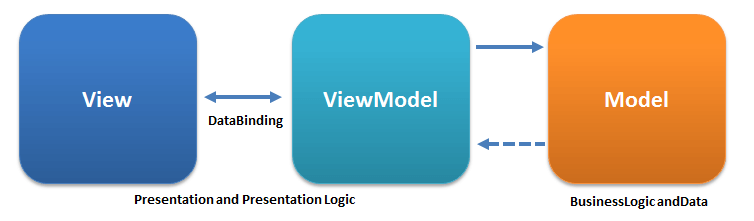

# Vue实例

## MVVM
**MVVM（Model-view-viewmodel）是一种软件构架模式。** 有助于将图像用户界面的开发与业务逻辑或后端逻辑(数据模型)开发分离开来。视图模型可以实现中介者模式。参考：[MVVM](images/https://zh.wikipedia.org/wiki/MVVM)




## 创建一个Vue实例
每个Vue应用都是通过Vue函数创建一个新的Vue实例开始。 Vue 的设计受到了MVVM模型的启发。所以文档中经常会使用 vm (ViewModel 的缩写) 这个变量名表示 Vue 实例。
```js
var vm = new Vue({
  // 选项
})
```

创建Vue时可以传入一个选项对象，前面用到了部分选项，如 el, data, methods等。

## 数据与方法
当一个Vue实例被创建时，它将data中的所有属性加入到Vue的响应式系统中，这些属性的值发生改变时，视图里引用的该值也会发生改变。

```js
// 数据对象
var data = { a: 1 };

// 将对象加入到一个Vue实例中
var vm = new Vue({
  data: data
})

vm.a === data.a // true
// 当vm.a的值改变，data.a的值也会改变，反之data.a的值改变vm.a的值也会改变
```

**注意: 只有当实例被创建时就已经存在于 data 中的属性才是响应式的。** 新增加一个属性： vm.b = 'hi'，对b的改动将不会触发任何视图的更新。之后需要用到的属性可以先设置一些初始值如''或0，null等。

### 唯一例外 Objecct.freeze()
如果Object.freeze()冻结了一个对象，他会阻止修改现有的属性，响应系统将无法追踪变化。
```html
<div id="app">
  <p>{{ foo }}</p>
  <button v-on:click="foo = '修改的值'">修改</button>
</div>
<script>
  var obj = {
    foo: 'bar'
  }

  /**
   * 加入这句后，点击修改按钮，视图的值不会改变。
   * app.foo = "sdf" 也会出错 Uncaught TypeError: 
   * Cannot assign to read only property 'foo' of object '#<Object>'
   */
  Object.freeze(obj)

  var app = new Vue({
    el: '#app',
    data: obj
  })
</script>
```
### $实列属性
除了数据属性，Vue实例还暴露了一些实例属性，以$开头，以便与用户自定义属性区分开来
- $el 实例属性，等价于document.getElmentId('实例el属性的值')
- $data 实例属性，等价于数据对象
- $watch 
- ...
```html
<div id="app">s
  <p>{{ a }}</p>
</div>
<script>
  var data = { a: 1 };
  var vm = new Vue({
    el: '#app',
    data: data,
    // watch: {
    //   a: function(newVal, oldVal) {
    //     // vm.a改变，该回调函数会被调用
    //     console.log(`watch a 改变：newVal: ${newVal}, oldVal: ${oldVal}`);
    //   }
    // }
  })

  alert(vm.$el === document.getElementById('app')); // true
  alert(vm.$data === data); // true

  // 实例方法，等价于上面注释的代码 
  vm.$watch('a', function(newVal, oldVal) {

    // vm.a改变，该回调函数会被调用
    console.log(`watch a 改变：newVal: ${newVal}, oldVal: ${oldVal}`);
  })
</script>
```

## 实列生命周期钩子函数
每个Vue实例在被创建时都要经过一系列的初始化过程。如：设置数据监听，编译模板，将实例挂载到DOM，并在数据变化时更新DOM等。在各个过程中会运行一些叫做声明周期钩子的函数，这样用户可以在不同阶段添加自己的代码。
- 先create，再mount，如果有数据更新，执行update，如果实列被销毁，执行destroy
- created后，再查询el元素，绑定完成后，执行mounted方法

**注意：**

由于钩子函数绑定了this，**不要在选项属性或回调上使用箭头函数**，比如 created: () => console.log(this.a) 或 vm.$watch('a', newValue => this.myMethod())。因为箭头函数并没有 this，this 会作为变量一直向上级词法作用域查找，直至找到为止，经常导致 Uncaught TypeError: Cannot read property of undefined 或 Uncaught TypeError: this.myMethod is not a function 之类的错误。

```html
<div id="app">
  <p>{{ a }}</p>
</div>
<script>
  var vm = new Vue({
    el: "#app",
    data: {
      a: 1
    },
    beforeCreate: function () {
      console.log('beforeCreate');
    },
    created: function () {
      // this指向vm实例
      console.log('created, a is :' + this.a);
    },
    beforeMount: function () {
      console.log('beforeMount');
    },
    mounted: function () {
      console.log('mounted');
    },
    beforeDestroy: function () {
      console.log('beforeDestroy');
    },
    destroyed: function () {
      console.log('destroyed');
    },
    beforeUpdate: function () {
      console.log('beforeUpdate');
    },        
    updated: function () {
      console.log('updated');
    },
  })
  /**
   * 运行，依次打印：
   * beforeCreate
   * created, a is :1
   * beforeMount  
   * mounted
   *
   * 修改a的值， vm.a = "test" 值后打印
   * beforeUpdate
   * updated 
   */
</script>
```
