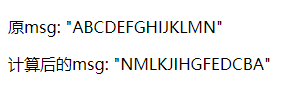

# 计算属性与侦听器

# computed计算属性
vue实例有一个computed选项对象属性，被称为计算属性。基本语法如下：
```js
/**
 * 基本语法
 * 1. 初始化实例时，如果计算属性值为函数，默认为get方法。"vm.计算属性" 不能赋值
 * 2. 如果值为对象则是写全的get和set方法, "vm.计算属性" 可以赋值
 */
var vm = new Vue({
  el: "#app",
  data: {},
  computed: {
   "计算属性": function() {
     return "通过计算后的值";
   }
 }
})
```
**计算属性主要是为了解决模板内的表达式放入太多逻辑会导致难以维护的问题**。对于模板内的任何复杂逻辑都应当使用计算属性。
```html
<div id="app">
  {{ msg.split('').reverse().join('') }}
</div>
```
使用计算属性改写上面的例子，vm.msg修改后，reverseMsg会自动重新计算，更新值。
```html
<div id="app">
  <p>原msg: "{{ msg }}"</p>
  <p>计算后的msg: "{{ reverseMsg }}"</p>
</div>
<script>
  var vm = new Vue({
    el: '#app',
    data: {
      msg: "ABCDEFGHIJKLMN"
    },
    computed: {
      // 计算属性的get方法 vm.reverseMsg只能读取值，无法写入值。
      reverseMsg: function() {
        return this.msg.split('').reverse().join('');
      }
    }
  })
</script>
```


### 计算属性 vs 插值方法
上面的例子中，也可以使用插值中使用方法，达到上面的效果，且vm.msg改变后，reverseMsg也会执行。**区别是：计算属性具有缓存功能，只有内部依赖的值改变，才会重新计算。而插值方法每当触发重新渲染时，调用方法将总会再次执行**
```html
<div id="app">
  <p>原msg: "{{ msg }}"</p>
  <p>计算后的msg: "{{ reverseMsg() }}"</p>
</div>
<script>
  var vm = new Vue({
    el: '#app',
    data: {
      msg: "ABCDEFGHIJKLMN"
    },
    methods: {
      reverseMsg: function() {
        return this.msg.split('').reverse().join('');
      }
    }
  })
```
> 我们为什么需要缓存？假设我们有一个性能开销比较大的计算属性 A，它需要遍历一个巨大的数组并做大量的计算。然后我们可能有其他的计算属性依赖于 A 。如果没有缓存，我们将不可避免的多次执行 A 的 getter！如果你不希望有缓存，请用方法来替代。

### 计算属性 vs watch侦听器
Vue提供了一种更通用的方式来观察和响应数据变动：侦听属性(watch)
```html
<div id="app">
  <p>{{ fullName }}</p>
  <p>{{ fullNameComputed }}</p>
</div>
<script>
  var vm = new Vue({
    el: '#app',
    data: {
      firstName: "Guoqing",
      lastName: "Zuo",
      fullName: "Guoqing Zuo"
    },
    watch: {
      firstName: function(newVal, oldVal) {
        this.fullName = newVal + ' '  + this.lastName;
      },
      lastName: function(newVal, oldVal) {
        this.fullName = this.firstName + ' ' + newVal;
      }
    },
    
    // 计算属性实现上面的功能更优雅
    computed: {
      fullNameComputed: function () {
        return this.firstName + ' ' + this.lastName;
      }
    }
  })
</script>
```

### 计算属性的set方法
vm.计算属性赋值时，set方法会被调用
```js
// 基本语法
var vm = new Vue({
  el: "#app",
  data: {},
  computed: {
   "计算属性": {
     get: function() {
       return "通过计算后的值";
     },
     set: function (newVal) {
       // 设置一些值
       // this.firstName = newVal.split(' ')[0]
       // this.lastName = newVal.split(' ')[newVal.length - 1]
     }
   }
 }
})
```

## watch侦听器
当需要在数据变化时执行异步或开销较大的操作时，使用watch会好点
```html
<!DOCTYPE html>
<html>
  <head>
    <meta charset="utf-8">
    <title>vue</title>
    <script src="https://cdn.jsdelivr.net/npm/vue/dist/vue.js"></script>
    <!-- 因为 AJAX 库和通用工具的生态已经相当丰富，Vue 核心代码没有重复 -->
    <!-- 提供这些功能以保持精简。这也可以让你自由选择自己更熟悉的工具。 -->
    <script src="https://cdn.jsdelivr.net/npm/axios@0.12.0/dist/axios.min.js"></script>
    <script src="https://cdn.jsdelivr.net/npm/lodash@4.13.1/lodash.min.js"></script>
  </head>
  <body>
    <div id="app">
      <p>
        输入查询内容: <input v-model="query">
      </p>
      <p>Result: {{ result }}</p>
    </div>
    <script>
      var vm = new Vue({
        el: '#app',
        data: {
          query: '',
          result: '无'
        },
        created: function() {
          this.debouncedGetResult = _.debounce(this.getResult, 500);
        },
        watch: {
          query: function(newVal, oldVal) {
            this.result = "等待您停止输入...";
            this.debouncedGetResult();
          }
        },
        methods: {
          getResult: function() {
            this.result = "查询中...";

            axios.get('http://yesno.wtf/api')
              .then((res)=> {
                this.result = response.data.answer;
              })
              .catch((err)=> {
                this.result = 'Error: ' + err;
              })
          }
        }
      })
    </script>
  </body>
</html>
```

在这个示例中，使用 watch 选项允许我们执行异步操作 (访问一个 API)，限制我们执行该操作的频率，并在我们得到最终结果前，设置中间状态。这些都是计算属性无法做到的。