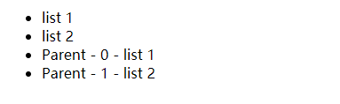

# 条件渲染与列表渲染

## 条件渲染
### v-if
```html
<div id="app">
  <h1 v-if="awesome">Vue is awesome!</h1>

  <h1 v-if="awesome">Vue is awesome!</h1>
  <h1 v-else>Oh no </h1>
</div>
<script>
  var vm = new Vue({
    el: '#app',
    data: {
      awesome: true
    }
  })
</script>
```

#### 在template元素上使用v-if条件渲染分组
v-if是一个指令，只能用在元素上。想切换多个元素，可以用template包裹元素再用v-if
```html
<template v-if="ok">
  <h1>Title</h1>
  <p>Paragraph 1</p>
  <p>Paragraph 2</p>
</template>
```

#### v-else
注意v-else 元素必须紧跟在带 v-if 或者 v-else-if 的元素的后面，否则将不会被识别。
```html
<h1 v-if="awesome">Vue is awesome!</h1>
<h1 v-else>Oh no </h1>
```

#### v-else-if
类似于 v-else，v-else-if 也必须紧跟在带 v-if 或者 v-else-if 的元素之后
```html
<div v-if="type === 'A'">A</div>
<div v-else-if="type === 'B'">B</div>
<div v-else-if="type === 'C'">C</div>
<div v-else>Not A/B/C</div>
```

#### 用key管理可复用的元素
Vue会尽可能高效地渲染元素，通常会复用元素，而不是从头开始渲染。
```html
<template v-if="loginType === 'username'">
  <label>Username</label>
  <input placeholder="Enter your username">
</template>
<template v-else>
  <label>Email</label>
  <input placeholder="Enter your email address">
</template>
```
上面的代码中切换loginType不会清除用户已输入的内容，因为模板使用了相同的元素，input元素不会被替换，仅仅替换了它的placeholder, 如果需要完全替换，在对应的元素上加上不同的key即可
```html
<template v-if="loginType === 'username'">
  <label>Username</label>
  <input placeholder="Enter your username" key="un-input">
</template>
<template v-else>
  <label>Email</label>
  <input placeholder="Enter your email address" key="email-input"> 
</template>
```
### v-show
v-show根据条件显示元素
- v-show会切换元素的display样式来显示或隐藏，而v-if是直接添加和移除元素
- v-show不支持template元素，也不支持v-else
```html
<!-- <p style="display: none;">显示文本</p> -->
<p v-show="ok">显示文本</p>
```

### v-if与v-show
v-if是真正的渲染，会确保在切换的过程中条件块内的事件监听和子组件适当的被销毁和重建。
v-if是惰性的，如果初始渲染条件为假，则什么也不做。——直到条件第一次变为真时，才会开始渲染条件块。

v-show 不管初始条件是什么，元素总是会被渲染，并且只是简单地基于 CSS 进行切换。

一般来说，v-if 有更高的切换开销，而 v-show 有更高的初始渲染开销。因此：
- 如果需要非常频繁地切换，则使用 v-show 较好；
- 如果在运行时条件很少改变，则使用 v-if 较好。

### v-if与v-for一起使用
不推荐同时使用 v-if 和 v-for。一起使用时，v-for 具有比 v-if 更高的优先级。

## 列表渲染
v-for指令用来渲染一个列表，v-for指令需要使用 item in items形式的特殊语法，其中items是源数组，item是迭代的数组元素。也可以用 item of items 来遍历。
```html
<div id="app">
  <ul>
    <li v-for="item in items">
      {{ item.msg }}
    </li>

    <li v-for="(item, index) in items">
      {{ parentMsg }} - {{ index }} - {{ item.msg }}
    </li>
  </ul>
</div>
<script>
  var vm = new Vue({
    el: '#app',
    data: {
      parentMsg: "Parent",
      items: [
        { msg: 'list 1' },
        { msg: 'list 2' }
      ]
    }
  })
</script>
```


### v-for遍历对象
v-for遍历对象 value in object 或者 (value, name) in object, 或者 (value, name, index) in object。**在遍历对象时，会按 Object.keys() 的结果遍历**，但是不能保证它的结果在不同的 JavaScript 引擎下都一致。
```html
<div id="app">
  <ul>
    <li v-for="value in myobject">
      {{ value }}
    </li>

    <li v-for="(value, name) in myobject">
      {{ parentMsg }} - {{ name }} : {{ value }}
    </li>
  </ul>
</div>
<script>
  var vm = new Vue({
    el: '#app',
    data: {
      parentMsg: "Parent",
      myobject: {
        title: 'This is a title',
        author: 'Guoqing Zuo',
        time: '2019-09-18'
      }
    }
  })
</script>
```


### 维护状态
如果数据的顺序改变，Vue将不会移动DOM元素，而是就地更新每个元素内容。**这个默认的模式是高效的，但是只适用于不依赖子组件状态或临时 DOM 状态 (例如：表单输入值) 的列表渲染输出。**为了给Vue一个提示，以便跟踪每个节点的身份，重用和重新排序现有元素。需要为每项提供一个唯一 key 属性v-bind:key="字符串或数值"
```html
<div v-for="item in items" v-bind:key="item.id">
  <!-- 内容 -->
</div>
```
key 的特殊属性主要用在 Vue 的虚拟 DOM 算法，在新旧 nodes 对比时辨识 VNodes。如果不使用 key，Vue 会使用一种最大限度减少动态元素并且尽可能的尝试修复/再利用相同类型元素的算法。使用 key，它会基于 key 的变化重新排列元素顺序，并且会移除 key 不存在的元素。

有相同父元素的子元素必须有独特的 key。重复的 key 会造成渲染错误。

它也**可以用于强制替换元素/组件而不是重复使用它**。
当你遇到如下场景时它可能会很有用：
- 完整地触发组件的生命周期钩子
- 触发过渡

### 数组更新检测

#### 数组变动（编译）方法
Vue将被侦听的数组的某些方法进行了包裹，执行下面的这些方法时，也会触发视图更新。这些方法都会改变原始数组。
- push(), pop()
- shift(), unshift()
- splice(), sort()
- reverse()

#### 替换数组
对于不会改变原始数组的方法，如 filter()、concat()、slice()，会返回一个新的数组。可以用重新赋值的方式，覆盖原来的数组, **重新赋值数组，Vue并不会丢弃现有DOM重新渲染整个列表，而是最大范围重用DOM元素**

#### 注意事项
由于JS的限制，Vue不能检测以下数组改动
- 利用索引直接设置一个值，vm.items[indexOfItem] = newValue
- 修改数组长度 vm.items.length = newLength
```js
var vm = new Vue({
  data: {
    items: ['a', 'b', 'c']
  }
})
vm.items[1] = 'x' // 不是响应性的, 不会更新视频  vm.items ['a', '1', 'c']
vm.items.length = 2 // 不是响应性的，不会更新视频  vm.items ['a', '1']

vm.push('d') // Vue这次才能监听到改动，渲染到页面
```
替代方法
```js
Vue.set(vm.items, indexOfItem, newValue)
// 或者
vm.items.splice(indexOfItem, 1, newValue)

// Vue实例的$set实例方法 $set() 等价于Vue.set()
vm.$set(vm.items, indexOfItem, newValu)

// 为了解决第二类问题，可以使用splice
vm.items.splice(newLength) // 从第newLength开始，二参每值，删除后面的所有元素
```

### 对象变更检测注意事项
还是由于 JavaScript 的限制，**Vue 不能检测对象属性的添加或删除：**
```js
var vm = new Vue({
  data: {
    a: 1,
    userObj: {
      name: 'guoqzuo'
    }
  }
})
// `vm.a` 现在是响应式的

vm.b = 2
// `vm.b` 不是响应式的
vm.userObj.name = "xxx" // 不会响应到页面
```
替代方法：Vue不允许动态添加根级别的响应，但可以为嵌套的对象添加响应式属性,如userObj
```js
Vue.set(userObj, 'age', 10) // 等价于 vm.$set(userObj, 'age', 10)
```

有时可能需要为已有的对象赋值多个新属性，比如使用Object.assign() 或 _.extend()
```js
// 如果age属性和favoriteColor之前没有初始化，不会响应视图
Object.assign(vm.userProfile, {
  age: 27,
  favoriteColor: 'Vue Green'
})

// 应该使用下面的写法，赋值
vm.userProfile = Object.assign({}, vm.userProfile, {
  age: 27,
  favoriteColor: 'Vue Green'
})
```

### 显示过滤/排序后的结果
如果需要显示一个数组过滤或排序后的版本，而不改变或重置原来的数组，可以创建一个计算属性，来返回过滤或排序后的数组。
```html
<div id="app">
  <ul>
    <!-- 只会显示偶数:2 4-->
    <li v-for="n in evenNumbers">{{ n }}</li>
  </ul>
</div>
<script>
  var vm = new Vue({
    el: '#app',
    data: {
      numbers: [ 1, 2, 3, 4, 5]
    },
    computed: {
      evenNumbers: function() {
        return this.numbers.filter(function(number) {
          return number % 2 === 0;
        })
      }
    }
  })
</script>
```
对于计算属性不适用的情况，可以使用一个方法
```html
<li v-for="n in even(numbers)">{{ n }}</li>
<script>
  ...
  data: {
    numbers: [ 1, 2, 3, 4, 5 ]
  },
  methods: {
    even: function(numbers) {
      return numbers.filter(function(number) {
        return number % 2 === 0;
      })
    }
  }
  ...
</script>
```
### v-for也可以接受整数
在这种情况下，会把模板重复对应次数。
<div>
  <span v-for="n in 10">{{ n }}</span>
</div>

### 在template上使用v-for
```html
<div>
  <template v-for="item in numbers">
    <li>{{ item }}</li>
    <li>多余的选项</li>
  </template>
</div>
```

### v-for与v-if用在同一元素(不推荐)
v-for的优先级比v-if高，详情参见：[风格指南：避免-v-if-和-v-for-用在一起-必要](https://cn.vuejs.org/v2/style-guide/#%E9%81%BF%E5%85%8D-v-if-%E5%92%8C-v-for-%E7%94%A8%E5%9C%A8%E4%B8%80%E8%B5%B7-%E5%BF%85%E8%A6%81)
```html
<!-- 只渲染未完成的 todo -->
<li v-for="todo in todos" v-if="!todo.isComplete">
  {{ todo }}
</li>
```

### 在组件上使用v-for
- 待完善