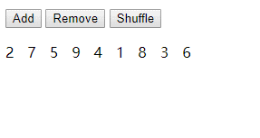

# 进入/离开 和 列表过渡

## 单元素/组件的过渡
Vue提供了transition的封装组件, 在下列情形中，可以给任何元素和组件添加进入/离开过渡
- 条件渲染(使用 v-if)
- 条件展示(使用 v-show)
- 动态组件
- 组件根节点

```html
<head>
  <meta charset="utf-8">
  <title>vue</title>
  <script src="https://cdn.jsdelivr.net/npm/vue/dist/vue.js"></script>
  <style>
    .fade-enter-active, .fade-leave-active {
      transition: opacity 1s;
    }
    .fade-enter, .fade-leave-to /* .fade-leave-active below version 2.1.8 */ {
      opacity: 0;
    }
  </style>
</head>
<body>
  <div id="app">
    <transition name="fade">
      <p v-if="show">Hello</p>
    </transition>

    <p v-if="show">Hello</p>

    <button @click="show = !show">Toggle</button>
  </div>
  <script>
    var app = new Vue({
      el: '#app',
      data: {
        show: true
      }
    })
  </script>
</body>
```
当插入或删除包含在transition组件中的元素时，Vue 将会做以下处理：
- 自动嗅探目标元素是否应用了 CSS 过渡或动画，如果是，在恰当的时机添加/删除 CSS 类名。
- 如果transition组件提供了 JavaScript 钩子函数，这些钩子函数将在恰当的时机被调用。
- 如果没有找到 JavaScript 钩子并且也没有检测到 CSS 过渡/动画，DOM 操作 (插入/删除) 在下一帧中立即执行。

## 过渡的类名
在进入/离开的过程中，会有6个class切换
- v-enter：定义进入过渡的开始状态，在元素插入之前生效，在元素插入之后的下一帧移除。
- v-enter-active: 定义进入过渡生效时的状态。在整个进入过渡的阶段中应用，在元素被插入之前生效，在过渡/动画完成之后移除。这个类可以被用来定义进入过渡的过程时间，延迟和曲线函数。
- v-enter-to：定义进入过渡的结束的状态。在元素被插入之后下一帧生效 (与此同时 v-enter 被移除)，在过渡/动画完成之后移除。
- v-leave: 定义离开过渡的开始状态。在离开过渡被触发时立刻生效，下一帧被移除。
- v-leave-active: 定义离开过渡生效时的状态。在整个离开过渡的阶段中应用，在离开过渡被触发时立刻生效，在过渡/动画完成之后移除。这个类可以被用来定义离开过渡的过程时间，延迟和曲线函数。
- v-leave-to  定义离开过渡的结束状态。在离开过渡被触发之后下一帧生效 (与此同时 v-leave 被删除)，在过渡/动画完成之后移除。


上面的例子中，transition的name属性替代上面的v，即为实际的class。\<transition name="my-transition"\>，那么 v-enter 会替换为 my-transition-enter。
```html
<transition name="fade">
  <p v-if="show">Hello</p>
</transition>
```

## CSS过渡
```html
<style>
  /* 可以设置不同的进入和离开动画 */
  /* 设置持续时间和动画函数 */
  .slide-fade-enter-active {
    transition: all .3s ease;
  }
  .slide-fade-leave-active {
    transition: all .8s linear;
  }
  .slide-fade-enter, .slide-fade-leave-to
  /* .slide-fade-leave-active for below version 2.1.8 */ {
    transform: translateX(10px);
    opacity: 0;
  }
</style>
<transition name="slide-fade">
  <p v-if="show">Hello</p>
</transition>
```

## CSS动画
在动画中 v-enter 类名在节点插入 DOM 后不会立即删除，而是在 animationend 事件触发时删除。
```html
<style>
  .bounce-enter-active {
    animation: bounce-in .5s;
  }
  .bounce-leave-active {
    animation: bounce-in .5s reverse;
  }
  @keyframes bounce-in {
    to {
      transform: scale(0)
    }
    50% {
      transform: scale(1.5)
    }
    100% {
      transform: scale(1.0)
    }
  }
</style>
<transition name="bounce">
  <p v-if="show">
    Hello Hello Hello Hello Hello Hello Hello
    Hello Hello Hello Hello Hello Hello Hello
  </p>
</transition>
```

## 自定义过渡的类名
可以通过下面的特性来自定义过渡类名：
- enter-class
- enter-active-class
- enter-to-class (2.1.8+)
- leave-class
- leave-active-class
- leave-to-class (2.1.8+)
他们的优先级高于普通的类名，这对于 Vue 的过渡系统和其他第三方 CSS 动画库，如 Animate.css 结合使用十分有用。
```html
<link href="https://cdn.jsdelivr.net/npm/animate.css@3.5.1" rel="stylesheet" type="text/css">

<transition
  name="custom-classes-transition"
  enter-active-class="animated tada"
  leave-active-class="animated bounceOutRight"
>
  <p v-if="show">Hello</p>
</transition>

```

## 同时使用过渡和动画

## 显性的过渡持续时间:duration
可以用transition组件上的 duration 属性定制一个显性的过渡持续时间 (以毫秒计)：
> 2.2.0新增
```html 
<!-- 单位为ms-->
<transition :duration="1000">...</transition>

<transition :duration="{ enter: 500, leave: 800 }">...</transition>
```

## JS钩子
可以用于JS动画
```html
<transition
  v-on:before-enter="beforeEnter"
  v-on:enter="enter"
  v-on:after-enter="afterEnter"
  v-on:enter-cancelled="enterCancelled"

  v-on:before-leave="beforeLeave"
  v-on:leave="leave"
  v-on:after-leave="afterLeave"
  v-on:leave-cancelled="leaveCancelled"
>
  <!-- ... -->
</transition>
```

## 初始渲染的过渡
默认情况，第一次进入时，是没有动画的。如果需要首次渲染就需要过渡，可使用 appear参数
```html
<transition appear>
  <!-- .. -->
</transition>
```

## 多个元素的过渡
> 当有相同标签名的元素切换时，需要通过 key 特性设置唯一的值来标记以让 Vue 区分它们，否则 Vue 为了效率只会替换相同标签内部的内容。即使在技术上没有必要，给在transition组件中的多个元素设置 key 是一个更好的实践。

```html
<transition>
  <button v-bind:key="docState">
    {{ buttonMessage }}
  </button>
</transition>
<script>
// ...
computed: {
  buttonMessage: function () {
    switch (this.docState) {
      case 'saved': return 'Edit'
      case 'edited': return 'Save'
      case 'editing': return 'Cancel'
    }
  }
}
</script>
```

### 过渡模式
同时生效的进入和离开的过渡不能满足所有要求，所以 Vue 提供了 过渡模式
- in-out：新元素先进行过渡，完成之后当前元素过渡离开。
- out-in：当前元素先进行过渡，完成之后新元素过渡进入。
```html
<transition name="fade" mode="out-in">
  <!-- ... the buttons ... -->
</transition>
```

## 多个组件的过渡
多个组件的过渡简单很多 - 我们不需要使用 key 特性。相反，我们只需要使用动态组件：
```html
<transition name="component-fade" mode="out-in">
  <component v-bind:is="view"></component>
</transition>
```

## 列表过渡
v-for渲染列表时，需要使用transition-group组件，注意transition生效需要是块级元素
- 不同于 transition，它会以一个真实元素呈现：默认为一个 span。可以通过 tag 特性更换为其他元素。
- 过渡模式不可用，因为我们不再相互切换特有的元素。
- 内部元素 总是需要 提供唯一的 key 属性值。
- CSS 过渡的类将会应用在内部的元素中，而不是这个组/容器本身。
```html
  <head>
    <meta charset="utf-8">
    <title>vue</title>
    <script src="https://cdn.jsdelivr.net/npm/vue/dist/vue.js"></script>
    <style>
      .list-item {
        display: inline-block;
        margin-right: 15px;
      }
      .list-enter-active, .list-leave-active {
        transition: all 1s;
      }
      .list-enter, .list-leave-to {
        transform: translateY(50px)
      }
    </style>
  </head>
  <body>
    <div id="app">
      <button @click="add">Add</button>
      <button @click="remove">Remove</button>
      <transition-group name="list" tag="p">
        <span v-for="item in items" :key="item" class="list-item">
          {{ item }}
        </span>
      </transition-group>
    </div>
    <script>
      var app = new Vue({
        el: '#app',
        data: {
          items: [1,2,3,4,5,6,7,8,9],
          nextNum: 10
        },
        methods: {
          add: function() {
            this.items.splice(this.randomIndex(), 0, this.nextNum++)
          },
          remove: function() {
            this.items.splice(this.randomIndex(), 1)
          },
          randomIndex: function() {
            return Math.floor(Math.random() * this.items.length)
          }
        }
      })
    </script>
  </body>
```

### 列表的排序过渡
加入一个动画样式即可， v-move，顺序改变时会自动移动
```html
  <head>
    <style>
      .list-item {
        display: inline-block;
        margin-right: 15px;
      }
      .list-enter-active, .list-leave-active {
        transition: all 1s;
      }
      .list-enter, .list-leave-to {
        transform: translateY(50px)
      }
      .list-move {
        transition: transform  1s; 
      }
    </style>
  </head>
  <body>
    <div id="app">
      <button @click="add">Add</button>
      <button @click="remove">Remove</button>
      <button @click="shuffle">Shuffle</button>
      <transition-group name="list" tag="p">
        <span v-for="item in items" :key="item" class="list-item">
          {{ item }}
        </span>
      </transition-group>
    </div>
    <script>
      var app = new Vue({
        el: '#app',
        data: {
          items: [1,2,3,4,5,6,7,8,9],
          nextNum: 10
        },
        methods: {
          add: function() {
            this.items.splice(this.randomIndex(), 0, this.nextNum++)
          },
          remove: function() {
            this.items.splice(this.randomIndex(), 1)
          },
          randomIndex: function() {
            return Math.floor(Math.random() * this.items.length)
          },
          shuffle: function() {
            // this.items = [3, 2, 4, 6, 9, 5, 1, 7, 8]
            // 打乱顺序, n次对调
            var tempArr = this.items.slice();
            for (let i = 0, len=this.items.length; i < len; i++) {
              this.swap(tempArr, this.randomIndex(), this.randomIndex())
            }
            this.items = tempArr
          },
          swap: function(arr, index1, index2) {
            [arr[index1], arr[index2]] = [arr[index2], arr[index1]]
          }
        }
      })
    </script>
  </body>
```



### 列表的交错过渡
使用自定义属性data-xx，通过js的datase.xx来获取对应的值，[详情](https://cn.vuejs.org/v2/guide/transitions.html#%E5%88%97%E8%A1%A8%E7%9A%84%E4%BA%A4%E9%94%99%E8%BF%87%E6%B8%A1)


## 可复用的过渡
```js
Vue.component('my-special-transition', {
  template: '\
    <transition\
      name="very-special-transition"\
      mode="out-in"\
      v-on:before-enter="beforeEnter"\
      v-on:after-enter="afterEnter"\
    >\
      <slot></slot>\
    </transition>\
  ',
  methods: {
    beforeEnter: function (el) {
      // ...
    },
    afterEnter: function (el) {
      // ...
    }
  }
})
```

## 动态过渡
过渡名称改为动态即可
```html
<transition v-bind:name="transitionName">
  <!-- ... -->
</transition>
```