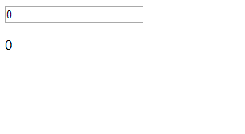

# 状态过渡
对于数据元素本身的动效，如
- 数字和运算
- 颜色的显示
- SVG 节点的位置
- 元素的大小和其他的属性
这些数据要么本身就以数值形式存储，要么可以转换为数值。有了这些数值后，我们就可以结合 Vue 的响应式和组件系统，使用第三方库来实现切换元素的过渡状态。

其实就是不断改变值。下面的例子，大于100000左右就比较卡了，待后续优化
```html
    <div id="app">
      <input v-model.number="number" type="number" step="20">
      <p>{{ animationNumber }}</p>

    </div>
    <script>
      var app = new Vue({
        el: '#app',
        data: {
          number: 0,
          animationNumber: 0
        },
        watch: {
          number: function(newVal, oldVal) {
            // 监听number的改变，得到绝对值
            var gap = newVal - oldVal;

            // 在多少秒之内完成   Math.abs(gap) 次，
            for (var i = 0, len = Math.abs(gap); i < len; i++) {
              setTimeout(()=> {
                gap > 0 ? this.animationNumber++ : this.animationNumber--
              }, i * 500 /Math.abs(gap))            
            }
          }
        }
      })
    </script>
```



## 动态状态过渡、过渡封装到组件等
待后续研究
