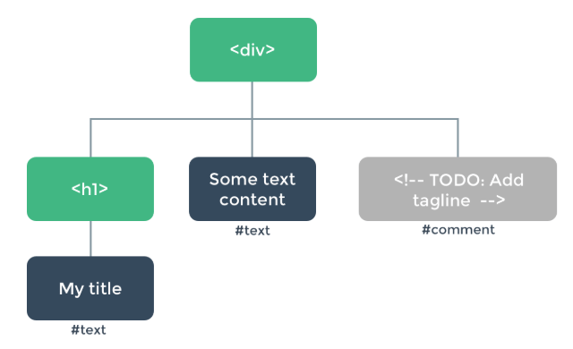

# 渲染函数和JSX

Vue推荐绝大多数情况下使用template来创建html，但某些情况使用渲染函数render更好，它比模板更接近编译器。

## 基础示例
通过level给出不同的h标签
```html
<div id="app">
  <!-- 
    参数传递时，默认为字符串，如果非变量，且不是字符串，
    可以加上v-bind，保留其自身类型
  -->
  <a-heading level="1">Hello world!</a-heading>
  <a-heading level="2">Hello world!</a-heading>
  <a-heading level="3">Hello world!</a-heading>
  <a-heading level="4">Hello world!</a-heading>
  <a-heading :level="5">Hello world!</a-heading>
  <a-heading :level="6">Hello world!</a-heading>
</div>

Vue.component('a-heading', {
  props: ['level'],
  template: `
    <h1 v-if="level === '1'">
      <slot></slot>
    </h1>
    <h2 v-else-if="level === '2'">
      <slot></slot>
    </h2>
    <h3 v-else-if="level === '3'">
      <slot></slot>
    </h3>
    <h4 v-else-if="level === '4'">
      <slot></slot>
    </h4>
    <h5 v-else-if="level === 5">
      <slot></slot>
    </h5>
    <h6 v-else="level === 6">
      <slot></slot>
    </h6>
  `
})
```

使用 render函数，重构

```js
var k = Vue.component('a-heading', {
  render: function(createElement) {
    return createElement(
      'h' + this.level, // 标签名字
      this.$slots.default // 子节点数组
      // a-heading元素的内容，会被存储在组件实例中的 $slots.default中
    )
  },
  props: ['level']
})
```

## 节点、树以及虚拟DOM
浏览器在读取HTML文档时，会创建一个DOM树，来追踪所有内容。
```html
<div>
  <h1>My title</h1>
  Some text content
  <!-- TODO: Add tagline -->
</div>
```
DOM树


vue template与render函数
```html
<!-- template -->
<h1>{{ blogTitle }}</h1>

<!-- 对应的render -->
<script>
render: function(createElement) {
  return createElement('h1', this.blogTitle)
}
</script>
```

### 虚拟DOM
Vue 通过建立一个虚拟 DOM 来追踪自己要如何改变真实 DOM。
```js
return createElement('h1', this.blogTitle)
```
createElement会返回什么？ 不是实际的DOM元素，而是 **createNodeDescription**.

- **VNode/虚拟节点(virtual node)**: render参数createElment(或其他)函数执行，会返回createNodeDescription，包含渲染的节点及其子节点的描述信息，这样的节点称为虚拟节点(VNode).
- **虚拟DOM**：由Vue组件树建立起来的整个VNode树的称呼

## createElement参数
createElement接收3个参数
- 第一个参数：必选，{String | Object | Function} 一个 HTML 标签名、组件选项对象，或者resolve 了上述任何一种的一个 async 函数。
```js
'div'
```
- 第二个参数：可选，Object, 一个与模板中属性对应的数据对象。
- 第三个参数：可选，{String | Array}，子级虚拟节点 (VNodes)，由 `createElement()` 构建而成，也可以使用字符串来生成“文本虚拟节点”
```js
[
  '先写一些文字',
  createElement('h1', '一则头条'),
  createElement(MyComponent, {
    props: {
      someProp: 'foobar'
    }
  })
]
```
### 深入数据对象
v-bidn:class和v-bind:style在模板语法中被特别对待，VNode数据对象中，也有对应的顶层字段。数据对象也允许绑定普通的 HTML 特性(属性)，也允许绑定如 innerHTML 这样的 DOM 属性 (这会覆盖 v-html 指令)。
```js
{
  // 与 `v-bind:class` 的 API 相同，
  // 接受一个字符串、对象或字符串和对象组成的数组
  'class': {
    foo: true,
    bar: false
  },
  // 与 `v-bind:style` 的 API 相同，
  // 接受一个字符串、对象，或对象组成的数组
  style: {
    color: 'red',
    fontSize: '14px'
  },
  // 普通的 HTML 特性
  attrs: {
    id: 'foo'
  },
  // 组件 prop
  props: {
    myProp: 'bar'
  },
  // DOM 属性
  domProps: {
    innerHTML: 'baz'
  },
  // 事件监听器在 `on` 属性内，
  // 但不再支持如 `v-on:keyup.enter` 这样的修饰器。
  // 需要在处理函数中手动检查 keyCode。
  on: {
    click: this.clickHandler
  },
  // 仅用于组件，用于监听原生事件，而不是组件内部使用
  // `vm.$emit` 触发的事件。
  nativeOn: {
    click: this.nativeClickHandler
  },
  // 自定义指令。注意，你无法对 `binding` 中的 `oldValue`
  // 赋值，因为 Vue 已经自动为你进行了同步。
  directives: [
    {
      name: 'my-custom-directive',
      value: '2',
      expression: '1 + 1',
      arg: 'foo',
      modifiers: {
        bar: true
      }
    }
  ],
  // 作用域插槽的格式为
  // { name: props => VNode | Array<VNode> }
  scopedSlots: {
    default: props => createElement('span', props.text)
  },
  // 如果组件是其它组件的子组件，需为插槽指定名称
  slot: 'name-of-slot',
  // 其它特殊顶层属性
  key: 'myKey',
  ref: 'myRef',
  // 如果你在渲染函数中给多个元素都应用了相同的 ref 名，
  // 那么 `$refs.myRef` 会变成一个数组。
  refInFor: true
}
```

### 完整示例

### VNode的唯一性约束

## 使用JS代替模板功能
### v-if和v-for
### v-model
### 事件和按键修饰符
### 插槽
## JSX
## 函数式组件
### 向子元素或子组件传递特性和事件
### slots()和children对比
## 模板编译