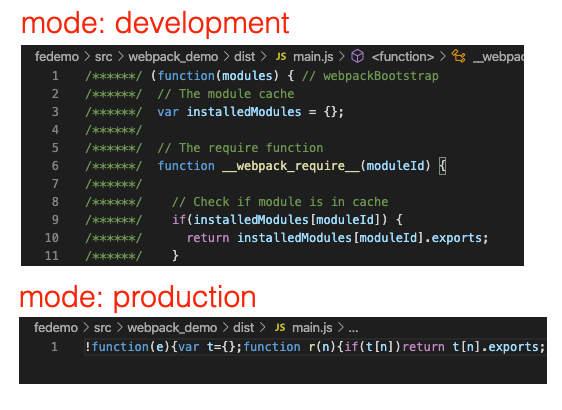
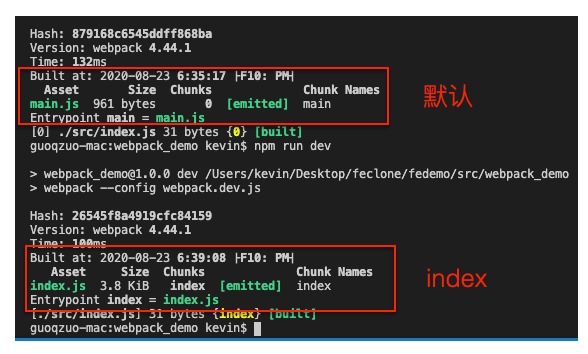
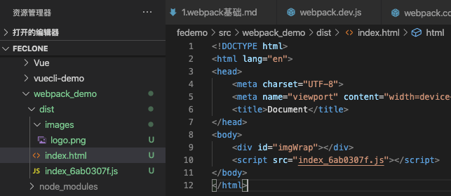
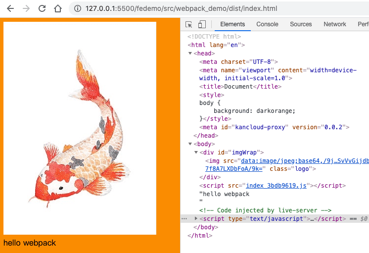
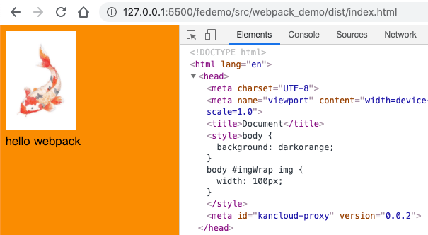
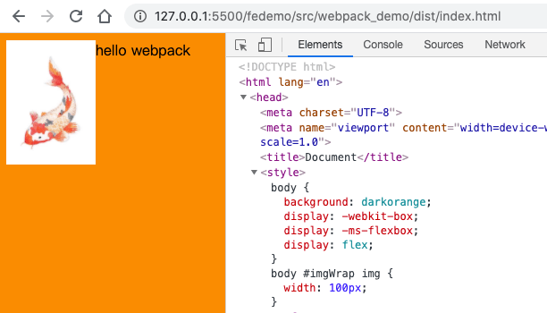
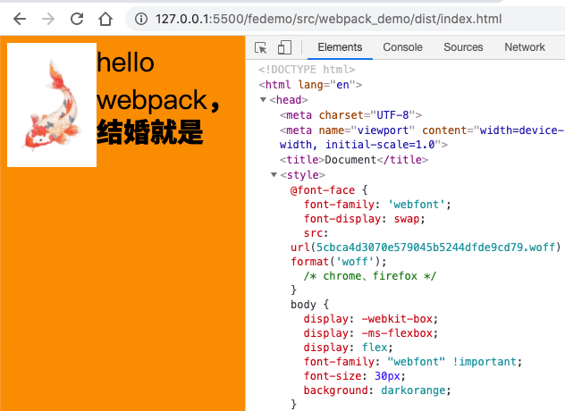
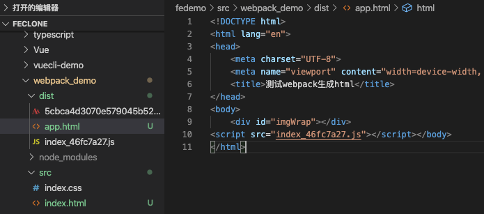

# webpack基础

> webpack官⽅网站: https://webpack.js.org/

## 什么是webpack
这里从三个方面来简单介绍什么是webpack：一句话解释、官方解释、结合实际开发来解释

### 一句话解释
webpack is a module bundler。webpack 是一个模块打包工具


### 官方解释

> At its core, webpack is a static module bundler for modern JavaScript applications. When webpack processes your application, it internally builds a dependency graph which maps every module your project needs and generates one or more bundles.

本质上，webpack 是一个用于现代 JavaScript 应用程序的静态模块打包工具(module bundler)。当 webpack 处理应用程序时，它会在内部构建一个包含应用程序所有模块的依赖关系图(dependency graph)，生成一个或多个包(bundles)。

> Since version 4.0.0, webpack does not require a configuration file to bundle your project. Nevertheless, it is incredibly configurable to better fit your needs.

从webpack 4.0.0 版本开始，可以不用引入配置文件就可以打包。但依旧可以根据你的需要进行高度自定义配置。

参考：[Concepts | webpack](https://webpack.js.org/concepts/)

### 结合实际开发来解释

webpack是一个模块打包工具：它会分析当前项目结构，找到JavaScript模块(ES modules)以及其它浏览器不能直接运行的拓展语言，比如.vue、.less, .ts等，将其打包为浏览器可以直接运行的代码。除此之外，它也可以打包.png、.jpg资源文件，对js、html进行混淆压缩等处理

## 安装
安装webpack需要用npm安装两个包：webpack、webpack-cli（安装后，可以在命令行里使用npx，webpack等命令）

### 全局安装(不建议)
因为webpack更新很快，不同的项目可能使用不同的webpack版本，为了避免多个项目冲突，建议在项目内局部安装webpack，如果有全局安装了的，建议卸载
```bash
# 全局安装
npm install webpack webpack-cli -g

# 检查是否安装成功，查看 webpack 版本
webpack -v  

# 卸载全局的 webpack
npm uninstall webpack webpack-cli -g
```
### 项目内安装(局部安装)
我们可以先创建一个文件夹，再 npm init 创建 package.json，然后通过 --save-dev 参数进行当前项目的局部安装
```bash
# 创建项目demo，并进入该目录
mkdir webpack_demo; cd webpack_demo;

# 创建package.json
npm init -y

# 开始安装webpack
npm install webpack webpack-cli --save-dev

# 检查是否安装成功，查看版本
npx webpack -v  # 
# npx会在当前项目中的node_modules里查找webpack 
# 相当于 ./node_modules/.bin/webpack -v
```

### 安装指定版本
```bash
# 查看webpack的历史版本
npm info webpack

# 安装指定版本
npm install webpack@版本号 webpack-cli@版本号 --save-dev

# latest 最新版本 latest: 4.44.1
npm install webpack@latest webpack-cli@latest --save-dev   

# next下一代版本,一般是开发、测试版本 next: 5.0.0-beta.28
npm install webpack@next webpack-cli@next --save-dev  
```

我项目内安装，默认的版本是 webpack-cli@3.3.12 / webpack@4.44.1

## 使用webpack打包（默认配置）
一般执行 npx webpack 会自动对项目进行打包，webpack默认的入口文件为当前目录下src文件的inex.js

```js
// src/index.js
document.write('hello webpack')
```

执行 npx webpack，如下图


webpack会自动在当前目录创建dist目录、main.js，main.js就是对src/index.js的打包处理，注意输入出的目录dist、main.js都是默认的配置


验证打包后的main.js是否可以运行，在 dist 目录创建 index.html，引入 main.js 执行页面，在页面看到 hello webpack 就是执行成功了

## 自定义webpack配置
默认配置会比较弱，如果需要自定义打包，就需要自己写配置了，默认的配置文件是 `webpack.config.js`，npx webpack执行时，如果当前目录下有webpack.config.js就使用这个配置，如果没有就使用默认配置

### webpack.config.js
```js
// webpack.config.js
const path = require('path')

module.exports = {
  entry: './src/index.js',
  output: {
    path: path.resolve(__dirname, './dist'),
    filename: 'main.js'
  }
}
```

如果在webpack.config.js里使用上面的代码，就是使用默认的webpack配置：入口为 src/index, 输出目录为./dist，文件名为 main.js

### mode属性 - 配置环境
使用上面的配置运行npx webpack会提示如下图的warning，说配置项里少了mode这个配置


mode用于配置当前环境:
- production（生产环境）默认值，如果不设置mode属性，默认就是这个值
- development (开发环境) 
- none 基本不使用

```js
// webpack.config.js
const path = require('path')

module.exports = {
  entry: './src/index.js',
  output: {
    // path.resolve和path.join是node中用来做路径拼接用
    path: path.resolve(__dirname, './dist'), 
    filename: 'main.js'
  },
  mode: 'development' // 配置环境
}
```

加上mode参数，再执行npx webpack就不会有warning了


开发环境(development)和生产环境(production)的区别：**生成的main.js一个有注释，可以大致看懂，一个没注释，代码进行了混淆压缩，难以理解** 如下面，生成的main.js对比



### 使用指定的配置文件
除了使用webpack.config.js外，我们也可以通过 npx webpack --config 来指定配置文件，比如我们创建一个webpack.dev.js, 将配置拷贝一份到里面，然后执行

```
npx webpack --config webpack.dev.js
```
这样做有什么好处呢？**不同的运行环境可以写多个配置文件，比如生产环境一个配置，开发环境一个配置**

我们可以把 webpack.config.js 里的mode配置为 production，webpack.dev.js里面的 mode配置为 development

```bash
# 生产环境打包，默认使用 webpack.config.js 配置文件
npx webpack
# 开发环境打包，使用 webpack.dev.js 配置文件
npx webpack --config webpack.dev.js
```

为了在项目中方便运行，我们可以在 package.json 配置 scripts，以方便以npm run 的方式运行

```js
  // 在 package.json 里加 build 和 dev 配置
  "scripts": {
    "test": "echo \"Error: no test specified\" && exit 1",
    "build": "webpack",
    "dev": "webpack --config webpack.dev.js"
  },
```
这样我们就可以不用 npx 运行了，直接使用 npm run build 和 npm run dev 来执行webpack打包

## webpack核心配置/概念
webpack主要由以下5个配置项

webpack配置项 | 说明
--- | ---
entry | 指定打包⼊口⽂件，执行webpack后从该文件开始执行
output | 指定输出结构，可以设置生成文件的目录、层级结构等
mode | 指定打包环境
module - rules | loader模块处理，用于解析webpack不能识别的模块
plugins | 插件配置

```js
// webpack.config.js
module.exports = {
    entry: "./src/index.js", // 指定打包⼊口⽂件 
    output: "./dist", // 指定输出结构
    mode: "production", // 指定打包环境
    module: {
        rules: [
            // loader模块处理，用于解析webpack不能识别的模块
            {
                test: /\.css$/, // 指定匹配规则
                use: "style-loader" // 指定使用的loader
            }
        ]
    },
    plugins: [new HtmlWebpackPlugin()] // 插件配置
}
```

### entry
指定webpack入口文件，webpack执行构建的第一步就是从entry开始，entry属性的值除了字符串外，还可以是对象，用于指定多个入口

```js
entry: './src/index.js'
// 等价于
entry: {
    main: './src/index.js'
}
```
这里entry对象里面默认的属性名为main，也可以指定为index，output里面可以根据[name]变量动态取这个属性名。设置打包后的Chunck Names(包名)

修改配置webpack.dev.js为下面的代码

```js
const path = require('path')

module.exports = {
  entry: {
    index: './src/index.js'
  },
  output: {
    path: path.resolve(__dirname, './dist'),
    filename: '[name].js'
  },
  mode: 'development'
}
```
再执行 npm run dev，就会生成 dist/index.js，Chunk Names就是 index，执行后的对比图如下



#### 多个entry
在src目录下，我们除了index.js外，再额外创建一个 login.js，使用多个页面，修改配置文件如下
```js
const path = require('path')

module.exports = {
  entry: {
    index: './src/index.js',
    login: './src/login.js'
  },
  output: {
    path: path.resolve(__dirname, './dist'),
    filename: '[name].js'
  },
  mode: 'development'
}
```
这样，运行npm run dev后，会在dist目录生成两个文件，一个index.js，一个login.js，执行效果如下图


#### output.filename中hash占位符
在上面的例子中，我们使用了 [name]占位符，会读取entry对象的属性名，除了name外，还有[hash]、[chunkhash]占位符，可以在文件名上加hash值。修改配置如下
```js
const path = require('path')

module.exports = {
  entry: {
    index: './src/index.js',
    login: './src/login.js'
  },
  output: {
    path: path.resolve(__dirname, './dist'),
    filename: '[name]_[hash].js'
  },
  mode: 'development'
}
```
npm run dev，运行效果如下图，生成的dist目录下不再是 index.js和login.js 而是 index_hash值.js, login_hash值.js 后面加了hash值。


默认hash值为20位，有点长，而且每次都不一样，在项目中，我们用的比较多的是[chunkhash]，他会计算文件的指纹。[chunckhash:需要的hash位数]可以指定hash长度，将filename设置为 `[name]_[chunkhash:8].js`，再运行npm run dev 效果如下


**使用chunkhash的好处是，版本迭代时，如果有多个入口文件，其中有一个入口文件发生变化，那这个入口生成的文件hash值就会变化，其他入口文件生成的文件hash值不会变。** 浏览器/IE会缓存资源文件，不同版本的hash不一样，客户端会刷新缓存，加载最新的代码，而未改变的文件hash值不会变，就还会使用缓存

js模块，一般用的就是chunkhash。chunk 可以理解为块

### output
打包生成的目录结构
```js
 // 单入口
output: {
    filename: "main.js", // 生成文件名称
    path: path.resolve(__dirname, "dist") // 生成的文件路径，必须是绝对路路径
},

// 多入口 
output: {
    filename: "[name]_[chunkhash:8].js", // 使用name/chunkhash等占位符，文件名不能重复
    path: path.resolve(__dirname, "dist") // 生成的文件路径，必须是绝对路路径
}
```

### mode
指定当前的构建环境，设置mode可以自动触发webpack内置的函数，起到优化的效果

mode属性值 | 说明
--- | ---
production| 将 DefinePlugin 中 process.env.NODE_ENV 设置为 production <br>启用FlagDependencyUsagePlugin、FlagIncludedChunksPlugin、ModuleConcatenationPlugin、NoEmitOnErrorsPlugin、OccurrenceOrderPlugin、SideEffectsFlagPlugin、TerserPlugin，这些模块主要用于混淆压缩、摇摆树(Tree Sharking，去除没有用到的模块)等 
development | 将 DefinePlugin 中 process.env.NODE_ENV设置为development<br>启用NamedChunksPlugin、NamedModulesPlugin，这两个插件用于开发时热更新处理，识别那个模块发生了变化
none | 不使用任何默认优化选项

注意：
1. 如果不设置mode，默认值为production，运行时webpack打包时，会有warnning
2. 设置 NODE_ENV 不会自动设置 mode 值

### loader
模块解析，webpack本身只能处理 js、json，但需要打包的文件除了js外，还有 css、图片、vue等其他格式文件。像这种其他文件的处理就需要使用loader了

常见的loader

```js
style-loader // css相关
css-loader
less-loader
sass-loader
ts-loader // 处理ts
babel-loader // ES6+兼容性处理
file-loader // 处理图片等静态资源文件
eslint-loader
```

### module
模块，webpack会从entry入口文件开始递归找出所有依赖的模块，当遇到webpack不能处理的文件/模块时，就需要要在module里进行配置，指定某个loader来处理某种格式的文件/模块。

```js
module: {
    rules: [
        // loader模块处理，用于解析webpack不能识别的模块
        {
            test: /\.css$/, // 指定匹配规则
            use: "style-loader" // 指定使用的loader
        }
    ]
}
```

#### 静态资源处理 file-loader
file-loader的作用与使用场景
1. **它会把entry入口文件里识别出的资源模块，移动到output指定的输出目录(dist)，并返回一个地址**
2. **用于处理源代码中引入的png、svg、txt、csv、execl等静态文件资源，将文件移动到打包目录**

来看个例子：之前的src/index.js里只写了document.write，下面我们来试试引入一张图片

```js
// src/index.js
import logo from './logo.png'

let img = new Image()
img.src = logo
img.classList.add('logo')

// 将图片挂载到id为imgWrap的元素上
let imgWrap = document.querySelector('#imgWrap')
imgWrap.append(img)

document.write('hello webpack')
```
npm run dev 执行webpack打包，发现报错


```bash
# 错误信息，大致意思是，无法处理 logo.png，可能需要使用loader来处理.png这种文件类型
ERROR in ./src/logo.png 1:0
Module parse failed: Unexpected character '�' (1:0)
You may need an appropriate loader to handle this file type, currently no loaders are configured to process this file. See https://webpack.js.org/concepts#loaders
(Source code omitted for this binary file
```
如果想要处理.png图片文件，就需要在module.rules里配置对应的loader了，这里使用 file-loader 来处理

```bash
# 先安装 file-loader
npm install file-loader --save-dev
```

再修改webpack.dev.js

```js
const path = require('path')
module.exports = {
  entry: {
    index: './src/index.js'
  },
  output: {
    path: path.resolve(__dirname, './dist'),
    filename: '[name]_[chunkhash:8].js'
  },
  mode: 'development',
  module: {
    rules: [
      // 当遇到.png文件时，使用file-loader来处理
      {
        test: /\.png$/,
        use:  'file-loader'
      }
    ]
  }
}
```
修改文件后 npm run dev 就没有报错了。默认情况下会在dist目录下生成一个hash命名的png文件， ef3eecd0bf07a2ac32ef435537980fd6.png，如下图


我们来测试下构建的js是否可以。修改dist/index.html，引入生成的js，加一个id为imgWrap的div，看图片是否显示正常。

```html
<!-- src/index.html -->
<body>
    <div id="imgWrap"></div>
    <script src="index_f824a855.js"></script>
</body>
```

运行html，显示如下图，可以正常运行js的内容，图片加载成功


#### 指定loader的use字段可以是对象
上面的例子中，module.rules里 use 字段是字符串，他的值还可以是对象，用于对某个loader进行配置
```js
module: {
    rules: [
        // 当遇到.png文件时，使用file-loader来处理
        {
        test: /\.png$/,
        use:  'file-loader'
        }
    ]
}
```
开看看file-loader的配置，使用use.loader指定loader名，use.options指定对应loader的配置，下面的代码中，我们设置了png图片打包的目录，打包后png的名称
```js
 module: {
    rules: [
      {
        test: /\.png$/,
        use:  {
          loader: 'file-loader',
          options: {
            // 文件名，[name]为资源的名称，[ext]为资源的后缀
            name: '[name].[ext]', 
            outputPath: 'images/', 
          }
        }
      }
    ]
  }
```
npm run dev 生成的dist目录如下



运行dist/index.html，效果如下


#### url-loader
url-loader内置了file-loader，并在其基础上进行了功能增强，把 file-loader 换成url-loader完全可以。

注意：使用url-loader时，如果遇到 jpg 格式的图片，会把图片转成base64的形式，打包到js里。对体积较小的图片比较好(减少一次网络请求)，大图片就不合适了，会增大js的体积。我们可以使用 limit 来限制，当 jpg 图片小于多少字节时，才转 base64。

```bash
# 安装
npm install url-loader --save-dev
```
找一个logo.jpg，替换src/index.js里的logo.png，修改 webpack.dev.js如下
```js
const path = require('path')

module.exports = {
  entry: {
      'index': './src/index.js'
  },
  output: {
    path: path.resolve(__dirname, './dist'),
    filename: '[name]_[chunkhash:8].js'
  },
  mode: 'development',
  module: {
    rules: [
      {
        test: /\.(png|jpe?g|gif)$/, // 当文件后缀为png、jpg、jpeg、gif时
        use: {
          loader: 'url-loader',
          options: {
            // 文件名，[name]为资源的名称，[ext]为资源的后缀
            name: '[name].[ext]', 
            outputPath: 'images/',
            limit: 2048 // 单位字节，小于2KB的jpg，图片自动转base64，可以减少一次http请求
          }
        }
      }
    ]
  }
}
```
运行 npm run dev，在dist目录不会生成images/logo.jpg，而是在index_xx.js里加入了对应的base64字符串，运行正常

#### css-loader与style-loader
webpack处理样式文件，需要借助样式相关loader 
1. css-loader 分析css模块之间的关系合并成一个css
2. style-loader 将css-loader生成的内容，通过style元素挂载到页面的header部分

```bash
# 安装 
npm install style-loader css-loader --save-dev
```
现在来测试下，先新建一个css文件 src/index.css
```css
/* src/index.css */
body {
    background: darkorange;
}
```
在 src/index.js 里直接import src/index.css
```js
// src/index.js
import logo from './logo.jpg'
// 直接引入css文件即可
import indexCss from './index.css'

let img = new Image()
img.src = logo
img.classList.add('logo')

// 将图片挂载到id为imgWrap的元素上
let imgWrap = document.querySelector('#imgWrap')
imgWrap.append(img)

document.write('hello webpack')
```
修改 webpack.dev.js 配置，加入对应的loader
```js
// webpack.dev.js
const path = require('path')
module.exports = {
  entry: {
      'index': './src/index.js'
  },
  output: {
    path: path.resolve(__dirname, './dist'),
    filename: '[name]_[chunkhash:8].js'
  },
  mode: 'development',
  module: {
    rules: [
      {
        test: /\.(png|jpe?g|gif)$/,
        use: {
          loader: 'url-loader',
          options: {
            // 文件名，[name]为资源的名称，[ext]为资源的后缀
            name: '[name].[ext]', 
            outputPath: 'images/',
            // 我这里图片为26k，就调到了限制，一般建议 2048, 2KB
            limit: 40960 // 单位字节，小于40KB的jpg，图片自动转base64，可以减少一次http请求
          }
        }
      },
      // 增加对css的处理
      {
          test: /\.css$/,
          // 注意css loader有执行顺序，从又向左执行
          use: ['style-loader', 'css-loader']
      }
    ]
  }
}
```
注意生成后的dist里面是没有css文件的，他会将 index.css 弄到js里，由js去执行，打包后的文件如下图


运行 dist/index.html
```html
<body>
    <div id="imgWrap"></div>
    <script src="index_3bdb9619.js"></script>
</body>
```
可以看到我们在index.css里写的样式已生效，会通过 index_xxx.js 将样式动态写入到header的style元素里



#### less-loader
上面成功加载了css，而一般我们会使用像less、sass这种css预处理器。如果使用less，就需要使用 less-lodaer 了

```bash
# 安装
npm install less-loader less --save-dev
```

新增 src/index.less

```less
/* src/index.less */
body {
    background: darkorange;
    #imgWrap {
        img {
            width: 100px;
        }
    }
}
```

将 src/index.js 里面的 index.css 改为 index.less，修改 webpack.dev.js
```js
    // 增加对less的处理
    {
        test: /\.less$/,
        // 注意css loader有执行顺序，从又向左执行，从下到上
        use: ['style-loader', 'css-loader', 'less-loader']
    }
```

运行后，less可以正常加载，效果如下图



#### postcss-loader
对于老版本的浏览器，有些css可能需要加前缀才能支持，postcss-loader 预处理器的 autoprefixer 可以为样式自动添加vender前缀，参考 [autoprefixer | github](https://github.com/postcss/autoprefixer)


```bash
# 安装
npm install postcss-loader autoprefixer --save-dev
```
我们在 index.less 里加入一个对于低版本需要加前缀的样式，比如: display: flex，再在 webpack.dev.js 里加入 postcss-loader 

```js
       // 增加对css的处理
      {
        test: /\.less$/,
        // 注意css loader有执行顺序，从又向左执行
        use: ['style-loader', 'css-loader', 'less-loader', {
            loader: 'postcss-loader',
            options: {
                plugins: () => [
                    require('autoprefixer')({
                        // 表示兼容 > 1% 的浏览器
                        overrideBrowserslist: ['last 2 versions', '>1%']
                    })
                ]
            }
        }]
      }
```

关于overrideBrowserslist设置兼容浏览器的处理配置，参考 [browserslist 配置说明](https://github.com/browserslist/browserslist#queries)


修改好配置后，运行 npm run dev，效果如下图，display: flex 有加入前缀



**关于 postcss.config.js**

由于 postcss-loader 的配置可能有点多，可以将他的配置单独提成一个文件 postcss.config.js

```js
// 和 webpack.dev.js 同层级创建 postcss.config.js
module.exports = {
    plugins: [
        require('autoprefixer')({
            overrideBrowserslist: ['last 2 versions', '>1%']
        })
    ]
}
```
修改webpack.dev.js
```js
// 这里 postcss-loader 默认先看当前目录是否有postcss.config.js，有就使用该配置
{
    test: /\.less$/,
    // 注意css loader有执行顺序，从又向左执行
    use: ['style-loader', 'css-loader', 'less-loader', 'postcss-loader',]
}
```

#### 引入iconfont字体
我们先在 [iconfont官网 - 在线字体](https://www.iconfont.cn/webfont) 下载一个字体文件，直接将 webfont.woff 文件拷贝到 src 目录


修改 index.less，引入下载好的字体

```less
@font-face {
    font-family: 'webfont';
    font-display: swap;
    src: url('webfont.woff') format('woff'); /* chrome、firefox */
}

body {
    display: flex;
    font-family: "webfont" !important;
    font-size: 30px;
    background: darkorange;

    #imgWrap {
        img {
            width: 100px;
        }
    }
}
```

修改 webpack.dev.js，加入对字体文件的处理 lodaer，使用 file-loader即可

```js
{
    test: /\.(eot|ttf|woff|woff2|svg)$/,
    use: "file-loader" 
},
```

为了看到字体效果，我们在index.js docuemnt.write里加入文字 "结婚就是", npm run dev 运行看效果，如下图，字体可以加载成功



#### 文件监听
在上面的例子中，每次修改 src/index.js 后，都需要手动执行 npm run dev，来运行webpack，比较麻烦。怎么能够每次修改后，自动npm run dev呢？可以使用 watch 属性，效果类似于 nodemon

webpack里面有一个文件监听机制，他可以轮询判断文件是否发生变化，webpack开启监听模式，有两种方法

1. 运行webpack命令时，加上 `--watch` 参数

```js
scripts: {
     "watch": "webpack --config webpack.dev.js --watch"
}
```
我们 npm run watch 后，每次修改 src/index.js 都会自动执行打包


2. 在配置文件里加 watch: true 属性

```js
// 在 webpack.dev.js 中加入如下配置
  watch: true, // 默认false, 不开启
  // 配合watch使用, 只有watch为true才会生效
  watchOptions: {
    // 设置当某些文件变更时，不触发打包，值为⽂件或者⽬录，⽀持正则
    ignored: /node_modules/, 
    // 监听到文件变化后延时多少秒再执行webpack，默认300ms, 
    aggregateTimeout: 300, 
    // 轮询间隔：通过不停的轮询系统，看⽂件是否有变化，默认每秒轮询1次
    poll: 1000 // ms
  }
```

注意开启watch后，terminal就一直处于运行的状态，`ctrl + c` 可以退出监听

## plugins
在上面的例子中，我们执行打包是从entry入口文件开始，一般都是生成的js，生成的css也是内联样式，而且是没有生成html静态文件的。那如果我们想生成html、单独的css等其他功能，就需要使用插件配置了。

plugin用于在webpack运行到某个阶段的时候，做一些处理，类似于生命周期钩子/中间件的概念，作用于整个构建过程

### HtmlWebpackPlugin
HtmlWebpackPlugin会在打包结束后，自动生成一个html文件，并把打包生成的js引入到该html中

```bash
# 安装
npm install html-webpack-plugin --save-dev
```

修改 webpack.dev.js
```js

const path = require('path')
const HtmlWebpackPlugin = require('html-webpack-plugin')
  
// ...

  plugins: [
    // 利用htmlWebpackPlugin，读取src/index.html模板，在输出文件夹下生成app.html
    new HtmlWebpackPlugin({
      title: '测试webpack生成html', // 生成html标题
      filename: 'app.html', // 导出html文件名
      template: './src/index.html' // 模板
      // inject: true 默认为true，指定打包js引入到生成的html的位置
      // true或'body'是放到body标签的底部script中，'header'会将js放到head标签里
    })
  ]
}
```
src/index.html模板，可以读取插件传的变量
```html
<!DOCTYPE html>
<html lang="en">
<head>
    <meta charset="UTF-8">
    <meta name="viewport" content="width=device-width, initial-scale=1.0">
    <title><%= HtmlWebpackPlugin.options.title %></title>
</head>
<body>
    <div id="imgWrap"></div>
</body>
</html>
```

npm run dev 生成的dist结构、app.html内容如下图




注意：

1. 不传参的情况下

```js
// 不带参数就默认是 dist/index.html，不指定模块会有默认的空html引入打包后的js
// plugins: [new HtmlWebpackPlugin()]
```

2. 由于plugins是数组，你可以同时输出多个html
```js
  plugins: [
    new HtmlWebpackPlugin(), // Generates default index.html
    new HtmlWebpackPlugin({  // Also generate a test.html
      filename: 'test.html',
      template: 'src/assets/test.html'
    })
  ]
```
更多细节，可以参考github：[html-webpack-plugin](https://github.com/jantimon/html-webpack-plugin#options)

关于html模板语法用法，可以参考这个dmeo [ html-webpack-template project ](https://github.com/jaketrent/html-webpack-template/blob/86f285d5c790a6c15263f5cc50fd666d51f974fd/index.html)


### clean-webpack-plugin
在之前所有的例子中，每次修改entry重新生成时，dist目录里的内容不会删除。那么，多次修改entry入口js文件，多次执行 npm run dev 会生成多个js文件，我们可以使用 clean-webpack-plugin 插件，用于每次清除之前的dist目录

```js
// 1. 安装
// npm install clean-webpack-plugin --save-dev

// 2.修改 webpack.config.js
const { CleanWebpackPlugin } = require('clean-webpack-plugin')

// ... 

  plugins: [
    new HtmlWebpackPlugin({
      title: '测试webpack生成htmllll',
      filename: 'app.html',
      template: './src/index.html'
    }),
    new CleanWebpackPlugin()
  ]
}
``` 
这样，每次修改 src/index.js 后，重新打包后都会删除原来的dist，生成新的dist

参考文档: [clean-webpack-plugin | github](https://github.com/johnagan/clean-webpack-plugin)

### mini-css-extract-plugin
上面的例子中，我们css文件都是直接用的 'style-loader'，写入到内联样式中，我们可以使用 mini-css-extract-plugin 插件，生成独立的css文件

```js
// 1.安装
// npm install mini-css-extract-plugin --save-dev

// 2.使用
const MiniCssExtractPlugin = require('mini-css-extract-plugin')

  module: {
    rules: [
      // ...
      // 增加对css的处理
      {
        test: /\.less$/,
        // 注意css loader有执行顺序，从又向左执行
        // use: ['style-loader', 'css-loader', 'less-loader', 'postcss-loader']
        use: [MiniCssExtractPlugin.loader, 'css-loader', 'less-loader', 'postcss-loader']

      }
      // ...
    ]
  },
  plugins: [
    new HtmlWebpackPlugin({
      title: '测试webpack生成htmllll',
      filename: 'app.html',
      template: './src/index.html'
    }),
    new CleanWebpackPlugin(),
    new MiniCssExtractPlugin({
      filename: "[name][contenthash:8].css"
    })
  ]
}
```
效果如下图，而且生成的html会自动引入该css


这里注意 filename 占位符的hash，一般js使用 chunkhash, css使用contenthash

参考文档：[mini-css-extract-plugin | github](https://github.com/webpack-contrib/mini-css-extract-plugin)

## 参考文档
- [webpack 文档](https://webpack.js.org/concepts/)
- [webpack中文文档](https://www.webpackjs.com/concepts/)