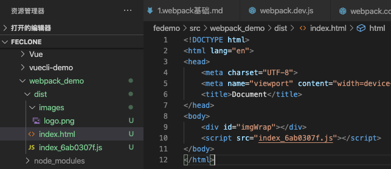
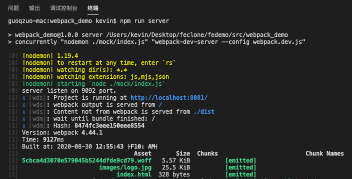
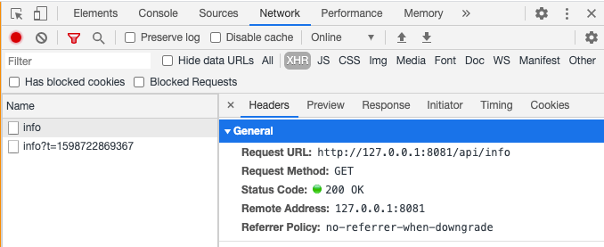

# webpack基础

> webpack官⽅网站: https://webpack.js.org/

## 什么是webpack
这里从三个方面来简单介绍什么是webpack：一句话解释、官方解释、结合实际开发来解释

**一句话解释**

webpack is a module bundler。webpack 是一个模块打包工具


**官方解释**

> At its core, webpack is a static module bundler for modern JavaScript applications. When webpack processes your application, it internally builds a dependency graph which maps every module your project needs and generates one or more bundles.

本质上，webpack 是一个用于现代 JavaScript 应用程序的静态模块打包工具(module bundler)。当 webpack 处理应用程序时，它会在内部构建一个包含应用程序所有模块的依赖关系图(dependency graph)，生成一个或多个包(bundles)。

> Since version 4.0.0, webpack does not require a configuration file to bundle your project. Nevertheless, it is incredibly configurable to better fit your needs.

从webpack 4.0.0 版本开始，可以不用引入配置文件就可以打包。但依旧可以根据你的需要进行高度自定义配置。

参考：[Concepts | webpack](https://webpack.js.org/concepts/)

**结合实际开发来解释**

webpack是一个模块打包工具：它会分析当前项目结构，找到JavaScript模块(ES modules)以及其它浏览器不能直接运行的拓展语言，比如.vue、.less, .ts等，将其打包为浏览器可以直接运行的代码。除此之外，它也可以打包.png、.jpg资源文件，对js、html进行混淆压缩等处理

## 安装
安装webpack需要用npm安装两个包：webpack、webpack-cli（安装后，可以在命令行里使用npx，webpack等命令）

**全局安装(不建议)**

因为webpack更新很快，不同的项目可能使用不同的webpack版本，为了避免多个项目冲突，建议在项目内局部安装webpack，如果有全局安装了的，建议卸载
```bash
# 全局安装
npm install webpack webpack-cli -g

# 检查是否安装成功，查看 webpack 版本
webpack -v  

# 卸载全局的 webpack
npm uninstall webpack webpack-cli -g
```

**项目内安装(局部安装)**

我们可以先创建一个文件夹，再 npm init 创建 package.json，然后通过 --save-dev 参数进行当前项目的局部安装
```bash
# 创建项目demo，并进入该目录
mkdir webpack_demo; cd webpack_demo;

# 创建package.json
npm init -y

# 开始安装webpack
npm install webpack webpack-cli --save-dev

# 检查是否安装成功，查看版本
npx webpack -v  # 
# npx会在当前项目中的node_modules里查找webpack 
# 相当于 ./node_modules/.bin/webpack -v
```

**安装指定版本**

```bash
# 查看webpack的历史版本
npm info webpack

# 安装指定版本
npm install webpack@版本号 webpack-cli@版本号 --save-dev

# latest 最新版本 latest: 4.44.1
npm install webpack@latest webpack-cli@latest --save-dev   

# next下一代版本,一般是开发、测试版本 next: 5.0.0-beta.28
npm install webpack@next webpack-cli@next --save-dev  
```

我项目内安装，默认的版本是 webpack-cli@3.3.12 / webpack@4.44.1

## 使用webpack打包（默认配置）
一般执行 npx webpack 会自动对项目进行打包，webpack默认的入口文件为当前目录下src文件的inex.js

```js
// src/index.js
document.write('hello webpack')
```

执行 npx webpack，如下图


webpack会自动在当前目录创建dist目录、main.js，main.js就是对src/index.js的打包处理，注意输入出的目录dist、main.js都是默认的配置


验证打包后的main.js是否可以运行，在 dist 目录创建 index.html，引入 main.js 执行页面，在页面看到 hello webpack 就是执行成功了

## 自定义webpack配置
默认配置会比较弱，如果需要自定义打包，就需要自己写配置了，默认的配置文件是 `webpack.config.js`，npx webpack执行时，如果当前目录下有webpack.config.js就使用这个配置，如果没有就使用默认配置

**webpack.config.js**

```js
// webpack.config.js
const path = require('path')

module.exports = {
  entry: './src/index.js',
  output: {
    path: path.resolve(__dirname, './dist'),
    filename: 'main.js'
  }
}
```

如果在webpack.config.js里使用上面的代码，就是使用默认的webpack配置：入口为 src/index, 输出目录为./dist，文件名为 main.js

**mode属性 - 配置环境**

使用上面的配置运行npx webpack会提示如下图的warning，说配置项里少了mode这个配置


mode用于配置当前环境:
- production（生产环境）默认值，如果不设置mode属性，默认就是这个值
- development (开发环境) 
- none 基本不使用

```js
// webpack.config.js
const path = require('path')

module.exports = {
  entry: './src/index.js',
  output: {
    // path.resolve和path.join是node中用来做路径拼接用
    path: path.resolve(__dirname, './dist'), 
    filename: 'main.js'
  },
  mode: 'development' // 配置环境
}
```

加上mode参数，再执行npx webpack就不会有warning了


开发环境(development)和生产环境(production)的区别：**生成的main.js一个有注释，可以大致看懂，一个没注释，代码进行了混淆压缩，难以理解** 如下面，生成的main.js对比


**使用指定的配置文件**

除了使用webpack.config.js外，我们也可以通过 npx webpack --config 来指定配置文件，比如我们创建一个webpack.dev.js, 将配置拷贝一份到里面，然后执行

```
npx webpack --config webpack.dev.js
```
这样做有什么好处呢？**不同的运行环境可以写多个配置文件，比如生产环境一个配置，开发环境一个配置**

我们可以把 webpack.config.js 里的mode配置为 production，webpack.dev.js里面的 mode配置为 development

```bash
# 生产环境打包，默认使用 webpack.config.js 配置文件
npx webpack
# 开发环境打包，使用 webpack.dev.js 配置文件
npx webpack --config webpack.dev.js
```

为了在项目中方便运行，我们可以在 package.json 配置 scripts，以方便以npm run 的方式运行

```js
  // 在 package.json 里加 build 和 dev 配置
  "scripts": {
    "test": "echo \"Error: no test specified\" && exit 1",
    "build": "webpack",
    "dev": "webpack --config webpack.dev.js"
  },
```
这样我们就可以不用 npx 运行了，直接使用 npm run build 和 npm run dev 来执行webpack打包

## webpack核心配置
webpack主要由以下5个配置项

webpack配置项 | 说明
--- | ---
entry | 指定打包⼊口⽂件，执行webpack后从该文件开始执行
output | 指定输出结构，可以设置生成文件的目录、层级结构等
mode | 指定打包环境
module - rules | loader模块处理，用于解析webpack不能识别的模块
plugins | 插件配置

```js
// webpack.config.js
module.exports = {
    entry: "./src/index.js", // 指定打包⼊口⽂件 
    output: "./dist", // 指定输出结构
    mode: "production", // 指定打包环境
    module: {
        rules: [
            // loader模块处理，用于解析webpack不能识别的模块
            {
                test: /\.css$/, // 指定匹配规则
                use: "style-loader" // 指定使用的loader
            }
        ]
    },
    plugins: [new HtmlWebpackPlugin()] // 插件配置
}
```

### entry - 打包入口
指定webpack入口文件，webpack执行构建的第一步就是从entry开始，entry属性的值除了字符串外，还可以是对象，用于指定多个入口

```js
// 单个入口 SPA 单页面应用
entry: './src/index.js'
// 等价于
entry: {
    main: './src/index.js'
}
```
这里entry对象里面默认的属性名为main，也可以指定为index，output里面可以根据[name]变量动态取这个属性名。设置打包后的Chunck Names(包名)

修改配置webpack.dev.js为下面的代码

```js
const path = require('path')

module.exports = {
  entry: {
    index: './src/index.js'
  },
  output: {
    path: path.resolve(__dirname, './dist'),
    filename: '[name].js'
  },
  mode: 'development'
}
```
再执行 npm run dev，就会生成 dist/index.js，Chunk Names就是 index，执行后的对比图如下


**多个entry，多页面应用MPA**

在src目录下，我们除了index.js外，再额外创建一个 login.js，使用多个页面，修改配置文件如下
```js
const path = require('path')

module.exports = {
  entry: {
    index: './src/index.js',
    login: './src/login.js'
  },
  output: {
    path: path.resolve(__dirname, './dist'),
    filename: '[name].js'
  },
  mode: 'development'
}
```
这样，运行npm run dev后，会在dist目录生成两个文件，一个index.js，一个login.js，执行效果如下图


**output.filename中hash占位符**

在上面的例子中，我们使用了 [name]占位符，会读取entry对象的属性名，除了name外，还有[hash]、[chunkhash]占位符，可以在文件名上加hash值。修改配置如下
```js
const path = require('path')

module.exports = {
  entry: {
    index: './src/index.js',
    login: './src/login.js'
  },
  output: {
    path: path.resolve(__dirname, './dist'),
    filename: '[name]_[hash].js'
  },
  mode: 'development'
}
```
npm run dev，运行效果如下图，生成的dist目录下不再是 index.js和login.js 而是 index_hash值.js, login_hash值.js 后面加了hash值。


默认hash值为20位，有点长，而且每次都不一样，在项目中，我们用的比较多的是[chunkhash]，他会计算文件的指纹。[chunckhash:需要的hash位数]可以指定hash长度，将filename设置为 `[name]_[chunkhash:8].js`，再运行npm run dev 效果如下


**使用chunkhash的好处是，版本迭代时，如果有多个入口文件，其中有一个入口文件发生变化，那这个入口生成的文件hash值就会变化，其他入口文件生成的文件hash值不会变。** 浏览器/IE会缓存资源文件，不同版本的hash不一样，客户端会刷新缓存，加载最新的代码，而未改变的文件hash值不会变，就还会使用缓存

js模块，一般用的就是chunkhash。chunk 可以理解为块

### output - 输出结构
打包生成的目录结构
```js
 // 单入口
output: {
    filename: "main.js", // 生成文件名称
    path: path.resolve(__dirname, "dist") // 生成的文件路径，必须是绝对路路径
},

// 多入口 
output: {
    filename: "[name]_[chunkhash:8].js", // 使用name/chunkhash等占位符，文件名不能重复
    path: path.resolve(__dirname, "dist") // 生成的文件路径，必须是绝对路路径
}
```

### mode - 打包环境
指定当前的构建环境，设置mode可以自动触发webpack内置的函数，起到优化的效果

mode属性值 | 说明
--- | ---
production| 将 DefinePlugin 中 process.env.NODE_ENV 设置为 production <br>启用FlagDependencyUsagePlugin、FlagIncludedChunksPlugin、ModuleConcatenationPlugin、NoEmitOnErrorsPlugin、OccurrenceOrderPlugin、SideEffectsFlagPlugin、TerserPlugin，这些模块主要用于混淆压缩、摇摆树(Tree Sharking，去除没有用到的模块)等 
development | 将 DefinePlugin 中 process.env.NODE_ENV设置为development<br>启用NamedChunksPlugin、NamedModulesPlugin，这两个插件用于开发时热更新处理，识别那个模块发生了变化
none | 不使用任何默认优化选项

注意：
1. 如果不设置mode，默认值为production，运行时webpack打包时，会有warnning
2. 设置 NODE_ENV 不会自动设置 mode 值

### module - loader模块处理
模块，webpack会从entry入口文件开始递归找出所有依赖的模块，当遇到webpack不能处理的文件/模块时，就需要要在module里进行配置，指定某个loader来处理某种格式的文件/模块。

```js
module: {
    rules: [
        // loader模块处理，用于解析webpack不能识别的模块
        {
            test: /\.css$/, // 指定匹配规则
            use: "style-loader" // 指定使用的loader
        }
    ]
}
```

#### loader
模块解析，webpack本身只能处理 js、json，但需要打包的文件除了js外，还有 css、图片、vue等其他格式文件。像这种其他文件的处理就需要使用loader了

常见的loader

```js
style-loader // css相关
css-loader
less-loader
sass-loader
ts-loader // 处理ts
babel-loader // ES6+兼容性处理
file-loader // 处理图片等静态资源文件
eslint-loader
vue-loader
vue-style-loader
```

#### 静态资源处理 file-loader
file-loader的作用与使用场景
1. **它会把entry入口文件里识别出的资源模块，移动到output指定的输出目录(dist)，并返回一个地址**
2. **用于处理源代码中引入的png、svg、txt、csv、execl等静态文件资源，将文件移动到打包目录**

来看个例子：之前的src/index.js里只写了document.write，下面我们来试试引入一张图片

```js
// src/index.js
import logo from './logo.png'

let img = new Image()
img.src = logo
img.classList.add('logo')

// 将图片挂载到id为imgWrap的元素上
let imgWrap = document.querySelector('#imgWrap')
imgWrap.append(img)

document.write('hello webpack')
```
npm run dev 执行webpack打包，发现报错


```bash
# 错误信息，大致意思是，无法处理 logo.png，可能需要使用loader来处理.png这种文件类型
ERROR in ./src/logo.png 1:0
Module parse failed: Unexpected character '�' (1:0)
You may need an appropriate loader to handle this file type, currently no loaders are configured to process this file. See https://webpack.js.org/concepts#loaders
(Source code omitted for this binary file
```
如果想要处理.png图片文件，就需要在module.rules里配置对应的loader了，这里使用 file-loader 来处理

```bash
# 先安装 file-loader
npm install file-loader --save-dev
```

再修改webpack.dev.js

```js
const path = require('path')
module.exports = {
  entry: {
    index: './src/index.js'
  },
  output: {
    path: path.resolve(__dirname, './dist'),
    filename: '[name]_[chunkhash:8].js'
  },
  mode: 'development',
  module: {
    rules: [
      // 当遇到.png文件时，使用file-loader来处理
      {
        test: /\.png$/,
        use:  'file-loader'
      }
    ]
  }
}
```
修改文件后 npm run dev 就没有报错了。默认情况下会在dist目录下生成一个hash命名的png文件， ef3eecd0bf07a2ac32ef435537980fd6.png，如下图


我们来测试下构建的js是否可以。修改dist/index.html，引入生成的js，加一个id为imgWrap的div，看图片是否显示正常。

```html
<!-- src/index.html -->
<body>
    <div id="imgWrap"></div>
    <script src="index_f824a855.js"></script>
</body>
```

运行html，显示如下图，可以正常运行js的内容，图片加载成功


#### 指定loader的use字段可以是对象
上面的例子中，module.rules里 use 字段是字符串，他的值还可以是对象，用于对某个loader进行配置
```js
module: {
    rules: [
        // 当遇到.png文件时，使用file-loader来处理
        {
        test: /\.png$/,
        use:  'file-loader'
        }
    ]
}
```
开看看file-loader的配置，使用use.loader指定loader名，use.options指定对应loader的配置，下面的代码中，我们设置了png图片打包的目录，打包后png的名称
```js
 module: {
    rules: [
      {
        test: /\.png$/,
        use:  {
          loader: 'file-loader',
          options: {
            // 文件名，[name]为资源的名称，[ext]为资源的后缀
            name: '[name].[ext]', 
            outputPath: 'images/', 
          }
        }
      }
    ]
  }
```
npm run dev 生成的dist目录如下



运行dist/index.html，效果如下


#### url-loader
url-loader内置了file-loader，并在其基础上进行了功能增强，把 file-loader 换成url-loader完全可以。

注意：使用url-loader时，如果遇到 jpg 格式的图片，会把图片转成base64的形式，打包到js里。对体积较小的图片比较好(减少一次网络请求)，大图片就不合适了，会增大js的体积。我们可以使用 limit 来限制，当 jpg 图片小于多少字节时，才转 base64。

```bash
# 安装
npm install url-loader --save-dev
```
找一个logo.jpg，替换src/index.js里的logo.png，修改 webpack.dev.js如下
```js
const path = require('path')

module.exports = {
  entry: {
      'index': './src/index.js'
  },
  output: {
    path: path.resolve(__dirname, './dist'),
    filename: '[name]_[chunkhash:8].js'
  },
  mode: 'development',
  module: {
    rules: [
      {
        test: /\.(png|jpe?g|gif)$/, // 当文件后缀为png、jpg、jpeg、gif时
        use: {
          loader: 'url-loader',
          options: {
            // 文件名，[name]为资源的名称，[ext]为资源的后缀
            name: '[name].[ext]', 
            outputPath: 'images/',
            limit: 2048 // 单位字节，小于2KB的jpg，图片自动转base64，可以减少一次http请求
          }
        }
      }
    ]
  }
}
```
运行 npm run dev，在dist目录不会生成images/logo.jpg，而是在index_xx.js里加入了对应的base64字符串，运行正常

#### css-loader与style-loader
webpack处理样式文件，需要借助样式相关loader 
1. css-loader 分析css模块之间的关系合并成一个css
2. style-loader 将css-loader生成的内容，通过style元素挂载到页面的header部分

```bash
# 安装 
npm install style-loader css-loader --save-dev
```
现在来测试下，先新建一个css文件 src/index.css
```css
/* src/index.css */
body {
    background: darkorange;
}
```
在 src/index.js 里直接import src/index.css
```js
// src/index.js
import logo from './logo.jpg'
// 直接引入css文件即可
import indexCss from './index.css'

let img = new Image()
img.src = logo
img.classList.add('logo')

// 将图片挂载到id为imgWrap的元素上
let imgWrap = document.querySelector('#imgWrap')
imgWrap.append(img)

document.write('hello webpack')
```
修改 webpack.dev.js 配置，加入对应的loader
```js
// webpack.dev.js
const path = require('path')
module.exports = {
  entry: {
      'index': './src/index.js'
  },
  output: {
    path: path.resolve(__dirname, './dist'),
    filename: '[name]_[chunkhash:8].js'
  },
  mode: 'development',
  module: {
    rules: [
      {
        test: /\.(png|jpe?g|gif)$/,
        use: {
          loader: 'url-loader',
          options: {
            // 文件名，[name]为资源的名称，[ext]为资源的后缀
            name: '[name].[ext]', 
            outputPath: 'images/',
            // 我这里图片为26k，就调到了限制，一般建议 2048, 2KB
            limit: 40960 // 单位字节，小于40KB的jpg，图片自动转base64，可以减少一次http请求
          }
        }
      },
      // 增加对css的处理
      {
          test: /\.css$/,
          // 注意css loader有执行顺序，从又向左执行
          use: ['style-loader', 'css-loader']
      }
    ]
  }
}
```
注意生成后的dist里面是没有css文件的，他会将 index.css 弄到js里，由js去执行，打包后的文件如下图


运行 dist/index.html
```html
<body>
    <div id="imgWrap"></div>
    <script src="index_3bdb9619.js"></script>
</body>
```
可以看到我们在index.css里写的样式已生效，会通过 index_xxx.js 将样式动态写入到header的style元素里


#### less-loader
上面成功加载了css，而一般我们会使用像less、sass这种css预处理器。如果使用less，就需要使用 less-lodaer 了

```bash
# 安装
npm install less-loader less --save-dev
```

新增 src/index.less

```less
/* src/index.less */
body {
    background: darkorange;
    #imgWrap {
        img {
            width: 100px;
        }
    }
}
```

将 src/index.js 里面的 index.css 改为 index.less，修改 webpack.dev.js
```js
    // 增加对less的处理
    {
        test: /\.less$/,
        // 注意css loader有执行顺序，从又向左执行，从下到上
        use: ['style-loader', 'css-loader', 'less-loader']
    }
```

运行后，less可以正常加载，效果如下图


#### postcss-loader
对于老版本的浏览器，有些css可能需要加前缀才能支持，postcss-loader 预处理器的 autoprefixer 可以为样式自动添加vender前缀，参考 [autoprefixer | github](https://github.com/postcss/autoprefixer)


```bash
# 安装
npm install postcss-loader autoprefixer --save-dev
```
我们在 index.less 里加入一个对于低版本需要加前缀的样式，比如: display: flex，再在 webpack.dev.js 里加入 postcss-loader 

```js
       // 增加对css的处理
      {
        test: /\.less$/,
        // 注意css loader有执行顺序，从又向左执行
        use: ['style-loader', 'css-loader', 'less-loader', {
            loader: 'postcss-loader',
            options: {
                plugins: () => [
                    require('autoprefixer')({
                        // 表示兼容 > 1% 的浏览器
                        overrideBrowserslist: ['last 2 versions', '>1%']
                    })
                ]
            }
        }]
      }
```

关于overrideBrowserslist设置兼容浏览器的处理配置，参考 [browserslist 配置说明](https://github.com/browserslist/browserslist#queries)


修改好配置后，运行 npm run dev，效果如下图，display: flex 有加入前缀


**关于 postcss.config.js**

由于 postcss-loader 的配置可能有点多，可以将他的配置单独提成一个文件 postcss.config.js

```js
// 和 webpack.dev.js 同层级创建 postcss.config.js
module.exports = {
    plugins: [
        require('autoprefixer')({
            overrideBrowserslist: ['last 2 versions', '>1%']
        })
    ]
}
```
修改webpack.dev.js
```js
// 这里 postcss-loader 默认先看当前目录是否有postcss.config.js，有就使用该配置
{
    test: /\.less$/,
    // 注意css loader有执行顺序，从又向左执行
    use: ['style-loader', 'css-loader', 'less-loader', 'postcss-loader',]
}
```

#### 引入iconfont字体
我们先在 [iconfont官网 - 在线字体](https://www.iconfont.cn/webfont) 下载一个字体文件，直接将 webfont.woff 文件拷贝到 src 目录


修改 index.less，引入下载好的字体

```less
@font-face {
    font-family: 'webfont';
    font-display: swap;
    src: url('webfont.woff') format('woff'); /* chrome、firefox */
}

body {
    display: flex;
    font-family: "webfont" !important;
    font-size: 30px;
    background: darkorange;

    #imgWrap {
        img {
            width: 100px;
        }
    }
}
```

修改 webpack.dev.js，加入对字体文件的处理 lodaer，使用 file-loader即可

```js
{
    test: /\.(eot|ttf|woff|woff2|svg)$/,
    use: "file-loader" 
},
```

为了看到字体效果，我们在index.js docuemnt.write里加入文字 "结婚就是", npm run dev 运行看效果，如下图，字体可以加载成功


#### 文件监听
在上面的例子中，每次修改 src/index.js 后，都需要手动执行 npm run dev，来运行webpack，比较麻烦。怎么能够每次修改后，自动npm run dev呢？可以使用 watch 属性，效果类似于 nodemon

webpack里面有一个文件监听机制，他可以轮询判断文件是否发生变化，webpack开启监听模式，有两种方法

1. 运行webpack命令时，加上 `--watch` 参数

```js
scripts: {
     "watch": "webpack --config webpack.dev.js --watch"
}
```
我们 npm run watch 后，每次修改 src/index.js 都会自动执行打包


2. 在配置文件里加 watch: true 属性

```js
// 在 webpack.dev.js 中加入如下配置
  watch: true, // 默认false, 不开启
  // 配合watch使用, 只有watch为true才会生效
  watchOptions: {
    // 设置当某些文件变更时，不触发打包，值为⽂件或者⽬录，⽀持正则
    ignored: /node_modules/, 
    // 监听到文件变化后延时多少秒再执行webpack，默认300ms, 
    aggregateTimeout: 300, 
    // 轮询间隔：通过不停的轮询系统，看⽂件是否有变化，默认每秒轮询1次
    poll: 1000 // ms
  }
```

注意开启watch后，terminal就一直处于运行的状态，`ctrl + c` 可以退出监听

### plugins - 插件
在上面的例子中，我们执行打包是从entry入口文件开始，一般都是生成的js，生成的css也是内联样式，而且是没有生成html静态文件的。那如果我们想生成html、单独的css等其他功能，就需要使用插件配置了。

plugin用于在webpack运行到某个阶段的时候，做一些处理，类似于生命周期钩子/中间件的概念，作用于整个构建过程

#### HtmlWebpackPlugin
HtmlWebpackPlugin会在打包结束后，自动生成一个html文件，并把打包生成的js引入到该html中

```bash
# 安装
npm install html-webpack-plugin --save-dev
```

修改 webpack.dev.js
```js

const path = require('path')
const HtmlWebpackPlugin = require('html-webpack-plugin')
  
// ...

  plugins: [
    // 利用htmlWebpackPlugin，读取src/index.html模板，在输出文件夹下生成app.html
    new HtmlWebpackPlugin({
      title: '测试webpack生成html', // 生成html标题
      filename: 'app.html', // 导出html文件名
      template: './src/index.html' // 模板
      // inject: true 默认为true，指定打包js引入到生成的html的位置
      // true或'body'是放到body标签的底部script中，'header'会将js放到head标签里
    })
  ]
}
```
src/index.html模板，可以读取插件传的变量
```html
<!DOCTYPE html>
<html lang="en">
<head>
    <meta charset="UTF-8">
    <meta name="viewport" content="width=device-width, initial-scale=1.0">
    <title><%= HtmlWebpackPlugin.options.title %></title>
</head>
<body>
    <div id="imgWrap"></div>
</body>
</html>
```

npm run dev 生成的dist结构、app.html内容如下图


注意：

1. 不传参的情况下

```js
// 不带参数就默认是 dist/index.html，不指定模块会有默认的空html引入打包后的js
// plugins: [new HtmlWebpackPlugin()]
```

2. 由于plugins是数组，你可以同时输出多个html
```js
  plugins: [
    new HtmlWebpackPlugin(), // Generates default index.html
    new HtmlWebpackPlugin({  // Also generate a test.html
      filename: 'test.html',
      template: 'src/assets/test.html'
    })
  ]
```
更多细节，可以参考github：[html-webpack-plugin](https://github.com/jantimon/html-webpack-plugin#options)

关于html模板语法用法，可以参考这个dmeo [ html-webpack-template project ](https://github.com/jaketrent/html-webpack-template/blob/86f285d5c790a6c15263f5cc50fd666d51f974fd/index.html)


#### clean-webpack-plugin
在之前所有的例子中，每次修改entry重新生成时，dist目录里的内容不会删除。那么，多次修改entry入口js文件，多次执行 npm run dev 会生成多个js文件，我们可以使用 clean-webpack-plugin 插件，用于每次清除之前的dist目录

```js
// 1. 安装
// npm install clean-webpack-plugin --save-dev

// 2.修改 webpack.config.js
const { CleanWebpackPlugin } = require('clean-webpack-plugin')

// ... 

  plugins: [
    new HtmlWebpackPlugin({
      title: '测试webpack生成htmllll',
      filename: 'app.html',
      template: './src/index.html'
    }),
    new CleanWebpackPlugin()
  ]
}
```
这样，每次修改 src/index.js 后，重新打包后都会删除原来的dist，生成新的dist

参考文档: [clean-webpack-plugin | github](https://github.com/johnagan/clean-webpack-plugin)

#### mini-css-extract-plugin
上面的例子中，我们css文件都是直接用的 'style-loader'，写入到内联样式中，我们可以使用 mini-css-extract-plugin 插件，生成独立的css文件

```js
// 1.安装
// npm install mini-css-extract-plugin --save-dev

// 2.使用
const MiniCssExtractPlugin = require('mini-css-extract-plugin')

  module: {
    rules: [
      // ...
      // 增加对css的处理
      {
        test: /\.less$/,
        // 注意css loader有执行顺序，从又向左执行
        // use: ['style-loader', 'css-loader', 'less-loader', 'postcss-loader']
        use: [MiniCssExtractPlugin.loader, 'css-loader', 'less-loader', 'postcss-loader']

      }
      // ...
    ]
  },
  plugins: [
    new HtmlWebpackPlugin({
      title: '测试webpack生成htmllll',
      filename: 'app.html',
      template: './src/index.html'
    }),
    new CleanWebpackPlugin(),
    new MiniCssExtractPlugin({
      filename: "[name][contenthash:8].css"
    })
  ]
}
```
效果如下图，而且生成的html会自动引入该css


这里注意 filename 占位符的hash，一般js使用 chunkhash, css使用contenthash

参考文档：[mini-css-extract-plugin | github](https://github.com/webpack-contrib/mini-css-extract-plugin)

## webpack其他配置
### devtool - 选择sourceMap方式

> 官方文档：[Devtool | webpack](https://webpack.docschina.org/configuration/devtool/#devtool)

Choose a style of source mapping to enhance the debugging process. These values can affect build and rebuild speed dramatically.（devtool参数用于选择一种 source map 方式来增强调试过程。不同的值会明显影响到构建和重新构建的速度。）

**什么是source map?**

一般发布代码时，都会把js、css、html代码进行混淆压缩，这样体积更小，加载速度更快，安全性更好。

但这样有个缺点，就是如果有js错误，使用chrome调试时，看不到具体是哪一行源代码出的问题，因为都是混淆压缩的代码。

A source map provides a way of mapping code within a compressed file back to it’s original position in a source file.（source map 提供了一种压缩代码映射到源代码具体位置的方式。）

参考：[An Introduction to Source Maps](https://blog.teamtreehouse.com/introduction-source-maps)

默认情况，devtool的值为 'none'，是打包后的代码。我们修改下 src/index.js 加入一个错误的js代码，然后看看chrome控制台的效果

```js
// 在 src/index.js 里加入 console.og('test soruce map') 这行错误代码

// 修改 webpack.dev.js 配置
mode: 'production', // 生成环境，生成的js会混淆压缩
devtool: 'none', // 默认值，不使用source map
```
npm run dev 打包构建后，运行效果


```js
// 我们修改下 devtool 的值，重新打包
mode: 'production',
devtool: 'source-map',
```

设置 devtool 为 'source-map' 后，打包时，会生成js、css对应的map文件，如下图


运行 dist/app.html 效果如下


**devtool配置值**


- eval: 速度最快, 使用eval包裹模块代码,
- source-map: 产⽣.map文件
- cheap: 较快，不用管列的信息,也不包含loader的source map
- Module: 第三⽅模块，包含loader的source map(⽐如jsx to js ，babel 的source map)
- inline: 将.map作为DataURI嵌入，不单独生成.map⽂件

上面的参数可以自由组合，开发环境推荐如下：
```js
devtool: "cheap-module-eval-source-map"
```
生产环境可以使用"cheap-module-source-map"，但建议不开启

### devServer - 开发服务器/代理/HMR
主要用于提升开发效率

一般我们打包构建到dist目录后，需要直接打开dist/app.html运行(默认使用file://，不推荐)，或者使用 vscode lives server插件开启http服务运行app.html，每次修改代码重新打包后，都要手动刷新网页，确保是最新的。

而devServer可以自己在打包的同时，自动开启静态服务，自动在浏览器打开页面

1. 先需要安装 webpack-dev-server

```bash
npm install webpack-dev-server --save-dev
```

2. 在 package.json 里加入 server 命令
```js
// 如果不加 --config，默认使用webpack.config.js配置
"scripts": {
  "server": "webpack-dev-server --config webpack.dev.js"
},
```

3. 修改webpack.dev.js

```js
devServer: {
  contentBase: './dist', // 指定服务器的静态资源目录
  open: true, // 自动再浏览器打开
  port: 8081 // 端口
}
```
配置好后，npm run server 后，就会执行打包，并将dist目录内容加载到内存中，打开浏览器访问 `http://localhost:8081/`，这里默认访问的是contentBase设置目录下的index.html，而我们上面有执行输出html为app.html，改为index.html，就可以直接打开了
```js
new HtmlWebpackPlugin({
    title: '测试webpack生成htmllll',
    filename: 'app.html',
    template: './src/index.html'
  }),
```
而且，我们修改 src/index.js 文件、或者src/index.html模板文件、index.js里引入的index.less文件等，可以自动重新rebuild，自动刷新整个页面。

#### proxy 代理服务器
解决mock接口连后端本地接口跨域的问题

先来模拟一个跨域的场景，我们在 webpack_demo 这个目录下面创建一个 mock 目录
```bash
# 进入mock目录
cd mock
# 初始化 package.json
npm init -y
# 安装mock接口需要的koa, koa-router
npm install koa koa-router --save
```
新建index.js文件，写一个get接口
```js
const Koa = require('koa')
const Router = require('koa-router')

const app = new Koa()
const router = new Router()

router.get('/api/info', ctx => {
  ctx.body = {
    code: 0,
    msg: 'success'
  }
})

app.use(router.routes()).use(router.allowedMethods())
app.listen('9002', () => { console.log('server listen on 9092 port.') })
```
在mock目录下运行 `nodemon index.js`，测试接口是否正常 `http://127.0.0.1:9002/api/info`


接口测试正常后，关闭服务

回到我们的 webpack-demo 目录下，修改 package.json，在 npm run server 的时候同时开启mock接口服务
```js
// npm run 同时执行下面的两条命令
// webpack-dev-server --config webpack.dev.js
// nodemon ./mock/index.js

// 先安装 concurrently
// npm install concurrently --save
// 修改 package.json 如下
"server": "concurrently \"nodemon ./mock/index.js\" \"webpack-dev-server --config webpack.dev.js\""
// 注意 && 同时执行两条命令存在兼容性问题，windows不兼容，concurrently跨平台兼容
// && 是按顺序执行 concurrently 是并列执行，跨平台的顺序执行，可以使用 npm-run-all
// 参考：npm并行&串行执行多个scripts命令
// https://blog.csdn.net/ligang2585116/article/details/105909789/
```
然后，我们前端使用axios来请求接口试试
```js
// 先安装 axios
// npm install axios --save
// 在 src/index.js 里加入请求接口的代码
import axios from 'axios'
axios.get('http://localhost:9092/api/info').then(res => {
  console.log(res)
})
```

npm run server 开启服务，然后打开浏览器控制台，会同时执行上面的两个命令



运行成功后，可以看到，接口提示跨域问题


然后我们来设置 devServer 的接口代理，先把请求改下，直接使用相对路径的接口
```js
import axios from 'axios'
axios.get('/api/info').then(res => {
  console.log(res)
})
```
再修改 webpack.dev.js，把 `/api` 下面的接口代理到 9002 端口下的mock接口服务
```js
devServer: {
  contentBase: './dist', // 指定服务器的静态资源目录
  open: true, // 自动再浏览器打开
  port: 8081, // 端口
  proxy: {
    "/api": {
      target: "http://127.0.0.1:9002"
    }
  }
}
```
这样页面请求的 `http://127.0.0.1:8081/api/info`，就会直接代理到 mock服务，就没有跨域的问题了



#### hot 热模块替换HMR
HMR(Hot Module Replacement，热模块替换)

在上面的例子中，我们按 F12 打开console，在控制台会看到 `[WDS] Live Reloading enabled.` 表示 [webpack dev server] 实时重新加载已启用，当检测到我们有修改时，会自动重新打包，**整个页面会重新刷新**。

**HMR(热模块替换)就是针对这种情况而做的一个优化，它允许在运行时热更新某个模块，而无需完全刷新。**

1. 保留在完全重新加载页面期间会丢失的应用程序状态
2. 只更新变更内容，以节省宝贵的开发时间
3. 在源码中 css、js 产生修改时，会立刻在浏览器中进行更新，几乎相当于在浏览器 devtools 直接修改样式

webpack-dev-server默认是 LiveReload（实时重新加载）。HMR可以作为 LiveReload 的替代，如果将devServer的 hot 属性设置为 true，那么在试图重新加载整个页面前，hot 模式会尝试使用 HMR 来更新。 参考: [HMR - how it works | webpack](https://webpack.docschina.org/concepts/hot-module-replacement/#how-it-works)


**注意：**

**1. HMR不支持chunkhash，contenthash，它不适用于生产环境，只能在开发环境使用，生成环境和开发环境需要两套配置**
**2. 社区提供了许多loader，都内置了HMR逻辑，比如 style-loader 支持 css 的 HMR、vue-loader 支持 vue 组件的 HMR、react hot loader支持react组件的HMR，等等** 

下面我们来看看HMR内部的一些细节。这里测试时webpack版本是4.44.1，我们直接在devServer的配置里加 hot 为 true，这样就开启了HMR

```js
// Version: webpack 4.44.1
devServer: {
  hot: true
}
```

开启后重新 npm run server 就可以在console里看到，多出了开启 HMR 相关的 log 了


**处理js模块HMR**

先来测试看看js的热更新，在 webpack.dev.js 中，将chunkhash、contenthash均去掉，然后再 src/index.js 里加入检测到某个js变更后的操作逻辑

在入口文件引入一个新的 js 模块 number.js

```js
// src/number.js

function number() {
  let  div = document.createElement("div");
  div.setAttribute("id", "number");
  div.innerHTML = 100; 
  document.body.appendChild(div);
}
  
export default number;
```
然后修改 src/index.js
```js
// src/index.js
import number from './number.js'

// 挂载dom
number()

// 当检测到 模块有热更新时，内部的 module.hot 会为true，并执行下面的逻辑
if (module.hot) {
  // 使用 module.hot.accept 监听
  // 当 number.js 这个模块改动时，移除number，重新执行number，达到热更新的效果
  module.hot.accept('./number.js', function() {
    console.log('Accepting the updated printMe module!');
    document.body.removeChild(document.getElementById("number"))
    number()
  })
}
```

当我们修改 `div.innerHTML = 100; `的值时，页面没有重新刷新，这个 number.js 重新执行，且执行对应的 module.hot.accept 逻辑，达到了 js 热模块替换的效果，保存更新后，console信息如下


另外，这个过程中，我们在src/index.js请求的接口并没有重新请求，而是内部请求了一个 hot-update.json 的接口


**处理css模块的HMR**

由于 style-loader 内置了 HMR 的逻辑，我们直接使用 style-loader，不要使用 MiniCssExtractPlugin 插件单独生成 css 文件即可像上面的js那样，达到HMR的效果

style-loader 在幕后使用了 module.hot.accept，在 CSS 依赖模块更新之后，会将其 patch(修补) 到 `<style>` 标签中。


参考webpack官方文档：[模块热替换 | webpack](https://webpack.docschina.org/guides/hot-module-replacement/)


## webpack-merge
上面我们提到过 webpack-dev-server 仅开发环境需要，开发环境和生产环境的配置是两种配置。我们可以写一份开发环境、生产环境都一致的公共配置 webpack.base.js，然后开发环境使用 webpack.dev.js，生产环境使用 webpack.prod.js，使用 webpack-merge 把特有的配置和公共配置合并。

下面来看看公用的配置:

1. 入口entry
2. 静态资源处理loader
3. 根据模板生成静态html的插件、每次构建清除dist目录的插件

开发环境特有的配置

1. output不能使用chunkhash、contenthash
2. mode: 'development' 开发环境
3. devtool: 'cheap-module-eval-source-map', 开始sourcemap
4. 不单独生成css文件，使用 style-loader
5. 打开devServer配置，配合 webpack-dev-server 进行开发环境调试

生产环境特有的配置
1. 使用chunkhash和contenthash
2. mode为 production 生成环境
3. devtool不设置，默认不开始 sourcemap
4. 使用css插件，生成单独的css文件
5. 不使用devServer

```js
// webpack.base.js
const HtmlWebpackPlugin = require('html-webpack-plugin')
const { CleanWebpackPlugin } = require('clean-webpack-plugin')

module.exports = {
  entry: {
    'index': './src/index.js'
  },
  module: {
    rules: [
      {
        test: /\.(png|jpe?g|gif)$/,
        use: {
          loader: 'url-loader',
          options: {
            // 文件名，[name]为资源的名称，[ext]为资源的后缀
            name: '[name].[ext]',
            outputPath: 'images/',
            // 我这里图片为26k，就调到了限制，一般建议 2048, 2KB
            // 图片太大会影响主包，还是设置为2048
            limit: 2048 // 单位字节，小于40KB的jpg，图片自动转base64，可以减少一次http请求
          }
        }
      },
      {
        test: /\.(eot|ttf|woff|woff2|svg)$/,
        use: "file-loader"
      }
    ]
  },
  plugins: [
    new HtmlWebpackPlugin({
      title: '测试webpack生成htmllll',
      filename: 'index.html',
      template: './src/index.html'
    }),
    new CleanWebpackPlugin()
  ]
}
```
开发环境特有配置
```js
// webpack.dev.js
const path = require('path')
const { merge } = require('webpack-merge')
const commonConfig = require('./webpack.base.js')

let devConfig = {
  output: {
    path: path.resolve(__dirname, './dist'),
    filename: '[name].js'
  },
  mode: 'development',
  devtool: 'cheap-module-eval-source-map',
  module: {
    rules: [
      // 增加对css的处理
      {
        test: /\.less$/,
        // 注意css loader有执行顺序，从又向左执行
        use: ['style-loader', 'css-loader', 'less-loader', 'postcss-loader']
      }
    ]
  },
  devServer: {
    contentBase: './dist', // 指定服务器的静态资源目录
    open: true, // 自动再浏览器打开
    port: 8081, // 端口
    hot: true,
    //即便便HMR不不⽣生效，浏览器器也不不⾃自动刷新，就开启hotOnly 
    // hotOnly: true,
    proxy: {
      "/api": {
        target: "http://127.0.0.1:9002"
      }
    }
  }
}

module.exports = merge(commonConfig, devConfig)
```
生产环境特有配置
```js
// webpack.prod.js

const path = require('path')
const MiniCssExtractPlugin = require('mini-css-extract-plugin')
const { merge } = require('webpack-merge')
const commonConfig = require('./webpack.base.js')

const prodConfig = {
  output: {
    path: path.resolve(__dirname, './dist'),
    filename: '[name]_[chunkhash:8].js'
  },
  mode: 'production',
  module: {
    rules: [
      // 增加对css的处理
      {
        test: /\.less$/,
        // 注意css loader有执行顺序，从又向左执行
        use: [MiniCssExtractPlugin.loader, 'css-loader', 'less-loader', 'postcss-loader']
      }
    ]
  },
  plugins: [
    new MiniCssExtractPlugin({
      filename: "[name]_[contenthash:8].css" 
    })
  ]
}

module.exports = merge(commonConfig, prodConfig)
```

修改 package.json 里面的 scripts，加入对应的命令
```js
"scripts": {
  // 开发环境打包、不使用devServer，主要看打包后的文件
  "dev": "webpack --config webpack.dev.js", 
  // 生产环境打包
  "build": "webpack --config webpack.prod.js",
  // 开发环境打包、调试，开启devServer 在内存中执行dist下的项目
  "dev:server": "webpack-dev-server --config webpack.dev.js"
},
```

### vue-cli相关
vue-cli中的 vue.config.js，其实就是对 webpack 配置的一层封装，我们也可以在 vue.config.js 里使用使用原生的webpack写法。configureWebpack 这个选项，这个对象会被 webpack-merge 合并到最终的 webpack 配置中。
```js
// vue.config.js
module.exports = {
  configureWebpack: {
    plugins: [
      new MyAwesomeWebpackPlugin()
    ]
  }
}
```
除了对象外，他还可以是一个函数，不同的环境使用不同的配置
```js
// vue.config.js
module.exports = {
  configureWebpack: config => {
    if (process.env.NODE_ENV === 'production') {
      // 为生产环境修改配置...
    } else {
      // 为开发环境修改配置...
    }
  }
}
```
参考: [webpack相关 | vue-cli](https://cli.vuejs.org/zh/guide/webpack.html)

## 处理ES6+ babel-loader
上面的例子中，我们并没有使用babel，假设src/index.js里面使用了 ?? 、?. 、箭头函数等，它在低版本的浏览器将不会运行，这里我们可以使用 babel-loader 对他进行处理

我们先把 src/index.js 的内容替换为如下内容，里面用到了 ??, ?. ES2020的内容
```js
const arr = [new Promise(() => {}), new Promise(() => {})];

let a = ''
let b = false

let obj = { sayHi: () => console.log('hi') }
console.log('a: ', a ?? 'a')
console.log('b: ', b ?? 'b')

arr.map(item => { console.log(item);});

obj.sayHi()
console.log('obj.sayHello?.()', obj.sayHello?.())
console.log('obj.sayHello()', obj.sayHello())
```
npm run dev:server 会直接报错


### @babel/polyfill
下面来使用 babel-loader，将 js 处理成 低版本浏览器也支持的代码，先安装必要的依赖
```bash
# webpack 4.x | babel-loader 8.x | babel 7.x
npm install -D babel-loader @babel/core @babel/preset-env
npm install -D @babel/polyfill core-js@3
```
在 src/index.js 顶部，加入
```js
import "@babel/polyfill";
```
然后加入 babel-loader 的处理：遇到js文件时，使用babel转换一次，修改 webpack.dev.js
```js
 module: {
  rules: [
    // ....
    {
      test: /\.js$/,
      exclude: /node_modules/,  // 忽略 node_modules 目录下的js文件，不转换
      loader: "babel-loader", 
      options: {
        presets: ["@babel/preset-env"]
      }
    }
  ]
}
```
这样，再运行 npm run dev 就可以正常运行了。这种情况会把 polyfill 全部载入，打包后的文件较大，也可以配置按需注入
```js
// presets: ["@babel/preset-env"] 修改为下面的代码
 presets: [
  [ 
    "@babel/preset-env", 
    {
      useBuiltIns: 'usage', // 按需注⼊
      corejs: 3
    }
  ]
]    
```
下面是默认情况，和使用按需载入后，dist/index.js 包的大小


参考: [@babel/preset-env | Babel](https://babeljs.io/docs/en/babel-preset-env#usebuiltins)

### @babel/plugin-transform-runtime
由于 polyfill 是注⼊到全局变量window下的，会污染全局环境。一般如果是开发组件库，⼯具库的场景，推荐使用闭包的方式: @babel/plugin-transform-runtime 插件

```bash
# 安装依赖
npm install --save-dev @babel/plugin-transform-runtime 
npm install --save @babel/runtim
```
使用plugins
```js
{
  test: /\.js$/,
  exclude: /node_modules/,
  loader: "babel-loader",
  options: {
    presets: ["@babel/preset-env"],
    plugins: ["@babel/plugin-transform-runtime"]
  }
}
```
去掉 src/index.js 里的 `import "@babel/polyfill";`，npm run dev 后，可正常运行，并进行了转换

关于 loader的配置还可以用下面的写法，下面是webpack官网对应的示例
```js
rules: [
  // the 'transform-runtime' plugin tells Babel to
  // require the runtime instead of inlining it.
  {
    test: /\.m?js$/,
    exclude: /(node_modules|bower_components)/,
    use: {
      loader: 'babel-loader',
      options: {
        presets: ['@babel/preset-env'],
        plugins: ['@babel/plugin-transform-runtime']
      }
    }
  }
]
```

参考： [@babel/plugin-transform-runtime | webpack](https://webpack.js.org/loaders/babel-loader/#install)

### .babelrc文件
新建.babelrc文件，把options部分移⼊到该⽂件中即可，如果没有在webpack配置中写options，就默认读取 .babelrc 文件里的配置

```js
//webpack.config.js
{
  test: /\.js$/,
  exclude: /node_modules/, 
  loader: "babel-loader"
}

// .babelrc
module.exports = {
  presets: ["@babel/preset-env"],
  plugins: ["@babel/plugin-transform-runtime"]
}
```
### 配置React打包环境
我们在 src/index.js 里面可以跑 react 代码，使用 babel 可以转换，修改 src/index.js 入口文件
```js
// 显示 hello world
import React, { Component } from "react";
import ReactDom from "react-dom";
class App extends Component {
  render() {
    return <div>hello world</div>;
  }
}
ReactDom.render(<App />, document.getElementById("app"));
```
为了可以执行，先安装依赖
```bash
# 安装依赖包
npm install react react-dom --save
# 安装babel与react转换的插件
npm install -D @babel/preset-react
```
修改 .babelrc 文件
```js
module.exports = {
  presets: ["@babel/preset-env", '@babel/preset-react'],
  plugins: ["@babel/plugin-transform-runtime"]
}
```
这样，npm run dev后，运行 dist/index.html 就可以看到 hello world 了

## tree shaking
## 代码分割 code splitting
## webpack打包原理分析
## 自己写一个 loader
## 自己写一个 plugins